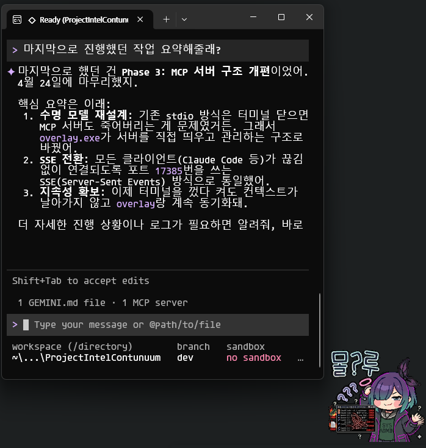
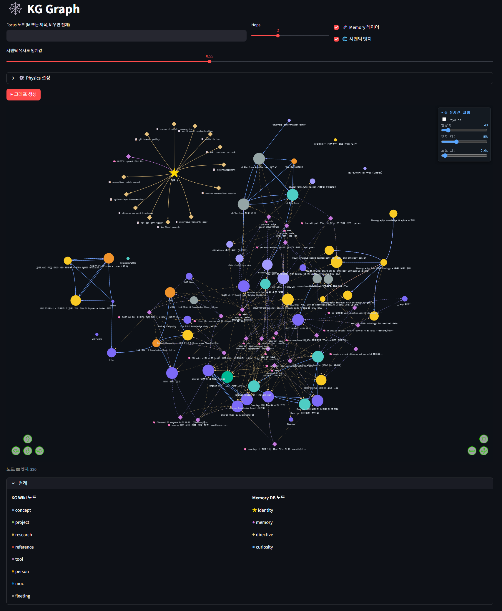

<div align="center">

> 🇰🇷 [한국어 README](README.md) · 🇺🇸 English (current)

```
  █████╗ ███╗   ███╗██████╗ ███████╗██████╗
 ██╔══██╗████╗ ████║██╔══██╗██╔════╝██╔══██╗
 ███████║██╔████╔██║██████╔╝█████╗  ██████╔╝
 ██╔══██║██║╚██╔╝██║██╔══██╗██╔══╝  ██╔══██╗
 ██║  ██║██║ ╚═╝ ██║██████╔╝███████╗██║  ██║
 ╚═╝  ╚═╝╚═╝     ╚═╝╚═════╝ ╚══════╝╚═╝  ╚═╝
```

**Agent Memory Backend with Episodic Recall**

*Amber preserves life for millions of years. So does AMBER.*

<br/>

[](https://www.python.org/)
[](https://modelcontextprotocol.io/)
[](https://sqlite.org/)
[](https://kuzudb.com/)
[](https://obsidian.md/)
[](LICENSE)
[](https://www.microsoft.com/windows)

<br/>

`Copilot` · `Gemini CLI` · `Claude Code` · `Ollama` · `Goose` · `Desktop Overlay` · `Discord`

**Seven interfaces. One persistent identity.**

</div>

---

## What is AMBER?

AMBER is a **local persistent memory runtime** for AI agents. It gives your AI tools a continuous identity — memories, personality, and knowledge — that survives across sessions, tools, and reboots.

<table><tr><td valign="top">

- **Session continuity** — Memories and context persist across every conversation
- **Cross-tool memory** — Copilot, Claude, Gemini, and Goose all share the same memory
- **Knowledge graph** — Your Obsidian vault becomes a semantic memory layer
- **Desktop overlay** — A floating chat window always connected to the memory backend
- **Local & private** — Everything runs on your PC, nothing goes to the cloud

</td><td valign="top" align="right" width="320">



</td></tr></table>

---

## Quick Start

### Prerequisites

**Required:**
- Windows 10/11 + PowerShell
- [Miniconda](https://docs.conda.io/en/latest/miniconda.html) or Python 3.11+
- At least one AI tool (see table below)

**Supported AI tools:**

| Tool | Cost | Install |
|------|------|---------|
| [Gemini CLI](https://ai.google.dev/gemini-api/docs/cli) ⭐ recommended | Free (Google account) | `npm i -g @google/gemini-cli` |
| [Claude Code](https://docs.anthropic.com/en/docs/claude-code) | API key (free credits) | `npm i -g @anthropic-ai/claude-code` |
| [GitHub Copilot CLI](https://docs.github.com/copilot/how-tos/copilot-cli) | Subscription | `npm i -g @githubnext/github-copilot-cli` |
| [Ollama](https://ollama.ai) | Free (local) | Download installer |
| [Goose](https://block.github.io/goose) | Free (Ollama) | Download installer |

> You can install AMBER first and connect an AI tool later.

### Install

```powershell
git clone https://github.com/YOUR_USERNAME/amber-mcp.git
cd amber-mcp
powershell -ExecutionPolicy Bypass -File ./INSTALL.ps1
```

The installer will guide you through:
1. **DB path** — where memories and knowledge are stored (default: `D:\amber_data\`)
2. **Working directory** — directory the terminal opens to when AMBER starts
3. **Default AI tool** — which tool to use with the `amber` shortcut command
4. **Auto-start** — register AMBER overlay to launch on Windows startup
5. **Identity name** — a name for your AI's persistent identity

### Run

**Desktop Overlay (recommended for most users):**
```powershell
engram-overlay
```
A chat window appears on the right side of your screen. Toggle with `Alt+F12`.  
All connected AI tools automatically share memory while the overlay is running.

**Terminal CLI:**
```powershell
engram               # uses your configured default AI tool
engram-gemini        # Gemini CLI
engram-claude        # Claude Code
engram-copilot       # GitHub Copilot CLI
engram-goose         # Goose
```

```powershell
engram -p "your message"   # start with a specific prompt
engram --continue          # resume last conversation
```

---

## How It Works

```
┌─────────────────────────────────────────────────┐
│                  AMBER Runtime                  │
│                                                 │
│  ┌──────────┐   MCP Server (port 17385)         │
│  │ Identity │◄──────────────────────────────┐  │
│  │ Memory   │                               │  │
│  │ KG/Wiki  │   STM Broker (port 17384)     │  │
│  └──────────┘◄──────────────────────────┐  │  │
│                                         │  │  │
└─────────────────────────────────────────┼──┼──┘
                                          │  │
          ┌───────────┬──────────┬────────┘  │
          │           │          │            │
     VS Code     Claude Code  Gemini CLI  Overlay
     Copilot        MCP          MCP       (GUI)
```

- **MCP Server** — exposes 46 tools over SSE. Any MCP-compatible client connects automatically.
- **STM Broker** — lightweight HTTP bridge for the desktop overlay
- **SQLite WAL** — stores episodic memories, identity, directives, and curiosities
- **KuzuDB** — semantic graph layer with `paraphrase-multilingual-MiniLM-L12-v2` embeddings
- **kg_watcher** — file watcher daemon that syncs your Obsidian vault to the KG in real time

---

## Knowledge Graph Dashboard

Visually explore memories, wiki nodes, and semantic relationships in your browser.



Access at **http://localhost:8501** while the overlay is running.

| Page | Contents |
|------|----------|
| 📊 Overview | Identity summary, recent memories, active directives |
| 🕸️ KG Graph | Interactive knowledge graph with semantic edge overlay |
| 📝 Wiki Nodes | Wiki node list + full text + connection graph |
| 💭 Memories | Full episodic memory browser |
| 📋 Directives | Active operational directives |
| 🌐 Semantic | Natural language semantic search |

> First run requires: `pip install streamlit pandas pyvis`

---

## Obsidian Integration

AMBER's knowledge graph syncs bidirectionally with an **Obsidian vault**. Write notes → AI reads them. AI writes notes → read them in Obsidian.

### Setup

1. Install [Obsidian](https://obsidian.md/download)
2. Open vault → point to the `docs/` subfolder inside your AMBER data path  
   (e.g. `D:\amber_data\docs\`)
3. The `kg_watcher` daemon auto-syncs changes while the overlay runs  
   Manual sync: `engram-sync-kg`

### Why it works well

| Feature | Benefit |
|---------|---------|
| Plain `.md` files | No conversion — AMBER reads them directly |
| `[[wiki links]]` | Automatically mapped to KG edges |
| Graph view | Visualize the same connections AMBER sees |
| Human + AI edits | You and the AI write to the same knowledge base |

**Recommended plugins:** Dataview · Templater · Graph Analysis

---

## Discord Integration (optional)

1. Add `DISCORD_BOT_TOKEN` to `~/.engram/.env`
2. Configure in `~/.engram/overlay.user.yaml`:

```yaml
discord:
  guild_id: "YOUR_GUILD_ID"
  channel_id: "YOUR_CHANNEL_ID"
  allowed_user_ids:
    - "YOUR_USER_ID"
```

3. Start the overlay — the Discord bot activates automatically.

---

## MCP Client Setup

The installer auto-configures all detected AI tools. **The overlay must be running** for clients to connect.

```
Overlay running
  ├── VS Code Copilot Chat  → auto-connected
  ├── Claude Code           → auto-connected
  ├── Gemini CLI            → auto-connected
  └── Goose                 → auto-connected
```

If a client can't connect:
- Verify the overlay is running (log: `~/.engram/mcp-http.log`)
- VS Code: reload the window and check that the AMBER server appears in the MCP list

### Ollama note

AMBER passes a large context (memories, identity, directives, KG) to the AI.  
**Minimum recommended:** 14B+ model, 16GB+ VRAM.  
Smaller models may ignore instructions or skip memory loading. If your hardware is limited, use Claude API, Copilot, or Gemini CLI instead.

---

## What Gets Installed

| Item | Details |
|------|---------|
| CLI shortcuts | `engram`, `engram-copilot`, `engram-gemini`, `engram-claude`, `engram-goose`, `engram-overlay` |
| AI tool configs | MCP connection auto-configured for all detected tools |
| User config | `~/.engram/` — all settings live here |
| Data directory | User-specified path (default: `D:\amber_data\`) |
| Startup entry | Optional overlay auto-start on Windows login |

---

## Uninstall

```powershell
powershell -ExecutionPolicy Bypass -File .\INSTALL.ps1 -Uninstall
```

> Memory data and AI tool configs are **not** deleted automatically.

---

## Documentation

- [Architecture overview](docs/architecture.md)
- [Memory tiering design](docs/memory-tiering.md)
- [Memory ontology roadmap](docs/memory-ontology-roadmap.md)

---

## License

MIT © 2026
