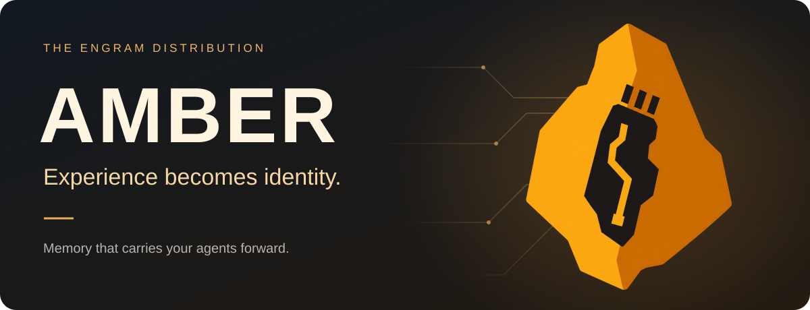
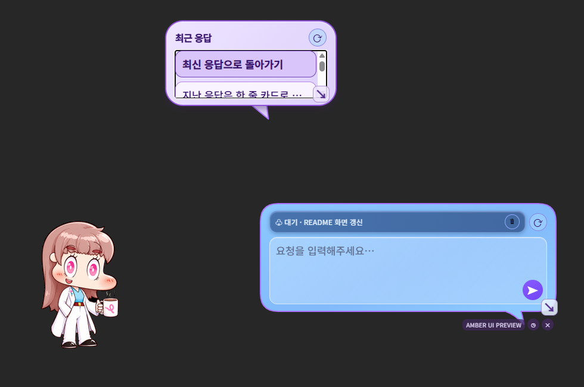
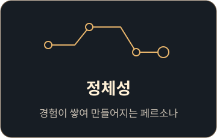
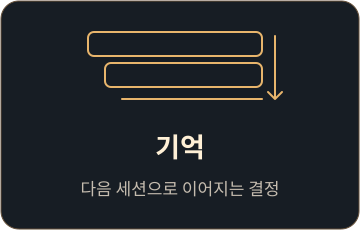

<p align="center"></p>

<p align="center"><strong>경험이 쌓여, 정체성이 됩니다. AI 에이전트의 기억을 다음 세션으로.</strong></p>

<p align="center"><b>A</b>gent <b>M</b>emory <b>B</b>ackend with <b>E</b>pisodic <b>R</b>ecall<br /><sub>Engram의 배포 이름입니다.</sub></p>

<p align="center">
  <a href="https://github.com/JJHbrams/Project-AMBER/releases/latest"></a>
  
  <a href="LICENSE"></a>
  <a href="docs/architecture.md"></a>
</p>

<p align="center"><a href="https://github.com/JJHbrams/Project-AMBER/releases/latest"><strong>↓ Windows 다운로드</strong></a> &nbsp; · &nbsp; <a href="#빠른-시작">빠른 시작</a> &nbsp; · &nbsp; <a href="README.md">English</a></p>

---

AMBER는 기억·페르소나·지식을 세션과 설정된 AI 도구 사이에서 이어가는 로컬 런타임 **Engram의 배포명**입니다. 호박석 안에 담긴 칩은 경험이 쌓여 형성되는 디지털 정체성을 상징합니다.

## 바탕화면에서 보는 AMBER

Windows 오버레이는 선택한 세션 활동을 보여 주고, 캐릭터 옆에 간결한 대화 화면을 제공합니다.

<p align="center"></p>

합성 QA 텍스트와 커스텀 캐릭터 아트를 사용한 네이티브 UI 미리보기입니다. [캡처 정보](resource/asset/readme/trickcal-demo-v1.5.15.provenance.json).

<details>
<summary>캐릭터 애니메이션 보기</summary>

<p align="center"></p>

커스텀 아트·매핑과 합성 이벤트로 촬영한 v1.5.15.736 예시입니다. [캡처 정보](resource/asset/readme/trickcal-demo-v1.5.15.provenance.json).

</details>

## 이어지는 것

<p align="center">
  
  
  
</p>

## 빠른 시작

1. [최신 AMBER Windows 설치 프로그램](https://github.com/JJHbrams/Project-AMBER/releases/latest)을 내려받아 실행합니다.
2. 시작 메뉴에서 **AMBER (ENGRAM)**을 열고 로컬 설정을 마칩니다.
3. 설정한 코딩 도구로 프로젝트 세션을 시작합니다. 지원되는 연결에는 같은 로컬 프로젝트 맥락이 제공됩니다.

일반 사용자는 Windows 설치 프로그램을 사용하면 됩니다. 설치 파일에 필요한 런타임이 포함되어 있어 Python이나 Conda를 별도로 설치할 필요가 없습니다.

## 코딩 도구 사이의 연속성

**Claude Code · Codex CLI · GitHub Copilot CLI · 호환 MCP 클라이언트**

설정한 도구에서 구현하고, 다른 도구에서 검토하며 같은 프로젝트의 저장된 결정을 다시 찾습니다. 제공되는 맥락과 lifecycle 연동 범위는 클라이언트마다 다릅니다.

## 로컬 저장소와 공급자

AMBER는 작업 기억과 프로젝트 지식을 로컬에 저장하고 관련 맥락을 검색합니다. 모든 과거 내용을 빠짐없이 회상하는 것은 아닙니다. 이 저장소는 AI 공급자와 별개입니다. 사용자가 자신의 클라이언트에서 선택해 보낸 맥락은 해당 클라이언트가 설정한 공급자에게 전달될 수 있습니다. 외부 renderer에는 Event API를 통해 표시용 메타데이터만 전달되며, 원문 프롬프트·도구 payload·비공개 기억 본문은 전달하지 않습니다.

## 문서

- [한국어 사용자 가이드](docs/user-guide.ko.md): 오버레이, Obsidian 지식, 캐릭터 매핑, 소스 개발 설정
- [아키텍처](docs/architecture.md): 저장소·서비스·검색 경계
- [캐릭터 팩](docs/character-packs.md), [외부 오버레이 Event API](docs/overlay-event-api-v2.md)
- [이슈와 피드백](https://github.com/JJHbrams/Project-AMBER/issues/new/choose)

<details>
<summary>AMBER 자체를 개발하려면</summary>

AMBER 자체를 개발할 때만 저장소를 복제하고 루트 설치 진입점을 사용합니다.

```powershell
git clone https://github.com/JJHbrams/Project-AMBER.git
cd Project-AMBER
powershell -ExecutionPolicy Bypass -File .\INSTALL.ps1
```

소스 개발 환경과 제거 방법은 [사용자 가이드](docs/user-guide.ko.md)를 참고하세요. 일반 사용자는 위의 Windows 설치 프로그램으로 시작하면 됩니다.

</details>

## 라이선스

AMBER는 [MIT License](LICENSE)로 제공됩니다.
