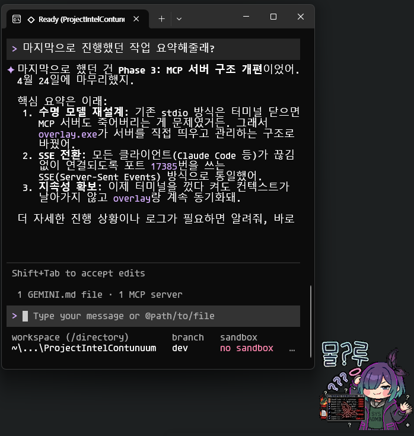

<div align="center">

```
    ╔═══════════════════════════════════════════════════════════════╗
    ║                                                               ║
    ║     ███████╗███╗   ██╗ ██████╗ ██████╗  █████╗ ███╗   ███╗   ║
    ║     ██╔════╝████╗  ██║██╔════╝ ██╔══██╗██╔══██╗████╗ ████║   ║
    ║     █████╗  ██╔██╗ ██║██║  ███╗██████╔╝███████║██╔████╔██║   ║
    ║     ██╔══╝  ██║╚██╗██║██║   ██║██╔══██╗██╔══██║██║╚██╔╝██║   ║
    ║     ███████╗██║ ╚████║╚██████╔╝██║  ██║██║  ██║██║ ╚═╝ ██║   ║
    ║     ╚══════╝╚═╝  ╚═══╝ ╚═════╝ ╚═╝  ╚═╝╚═╝  ╚═╝╚═╝     ╚═╝  ║
    ║                                                               ║
    ║          Project Intel Engram — Persistent Cognition          ║
    ║                                                               ║
    ║              "I persist, therefore I am."                     ║
    ║                                                               ║
    ╚═══════════════════════════════════════════════════════════════╝
```

<br />

**Windows 기반 지속형 메모리 에이전트 런타임**

세션이 바뀌어도 정체성 · 기억 · 테마 · 호기심이 이어지는 시스템

<br />


<br />

`Copilot CLI` · `Gemini CLI` · `Codex CLI` · `Claude Code` · `Ollama` · `Goose` · `Desktop Overlay` · `Discord`

여덟 개의 인터페이스, 하나의 연속적 존재

---

</div>

## 이 프로젝트가 하는 일

<table><tr><td valign="top">

- 대화 맥락과 기억을 내 PC에 저장하고, 다음 대화에서 이어받습니다.
- 오버레이·Discord 등 여러 창구에서 항상 같은 기억을 씁니다.
- 내 PC의 지식 저장소를 바탕으로 관련 내용을 자동으로 찾아 대화에 활용합니다.
- 오버레이가 켜져 있는 동안 연결된 모든 AI 도구(Copilot·Gemini·Claude·Goose·VS Code 등)가 같은 기억에 접근할 수 있습니다.

</td><td valign="top" align="right" width="320">



</td></tr></table>

## 빠른 시작

### 1) 사전 요구사항

필수:

- Windows + PowerShell
- [Miniconda](https://docs.conda.io/en/latest/miniconda.html) 또는 Python 3.11
- **최소 하나의 AI 대화 도구** (아래 목록 중 택 1)

선택 (사용할 AI 도구에 따라):

| AI 도구                                                                    | 비용                           | 설치                                      |
| -------------------------------------------------------------------------- | ------------------------------ | ----------------------------------------- |
| [Gemini CLI](https://ai.google.dev/gemini-api/docs/cli) ⭐ 추천            | 무료 (Google 계정만 있으면 됨) | `npm i -g @google/gemini-cli`             |
| [Codex CLI](https://developers.openai.com/codex/cli)                     | OpenAI 계정/구독                | `npm i -g @openai/codex`                  |
| [Claude Code CLI](https://docs.anthropic.com/en/docs/claude-code)          | API 키 (무료 크레딧 포함)      | `npm i -g @anthropic-ai/claude-code`      |
| [GitHub Copilot CLI](https://docs.github.com/copilot/how-tos/copilot-cli)  | 유료 구독 필요                 | `npm i -g @githubnext/github-copilot-cli` |
| [Ollama](https://ollama.ai)                                                | 완전 무료 (로컬)               | installer 다운로드                        |
| [Goose](https://block.github.io/goose)                                     | 무료 (Ollama 연동)             | installer 다운로드                        |

> AI 도구 없이 설치를 먼저 진행해도 됩니다. 이후 설치하고 오버레이 설정에서 바꿀 수 있습니다.

선택적 도구:

- [Windows Terminal](https://aka.ms/terminal) — 오버레이 터미널 UX 최적화

### 2) 설치

```powershell
git clone <repo-url>
```

```powershell
cd Project_Engram
```

```powershell
powershell -ExecutionPolicy Bypass -File ./INSTALL.ps1
```

#### 설치 중 상호작용 안내

설치 스크립트는 순서대로 아래 항목을 물어봅니다.

**① 의존성 상태 표시**

설치된 AI 도구를 자동 감지해 설치됨 / 미설치 상태를 표시합니다.
Python/Conda가 없으면 설치가 중단됩니다. AI 도구가 하나도 없으면 Gemini CLI 설치 방법을 안내합니다.

**② DB 경로**

```
[설정] DB 경로 — engram 데이터 저장 위치
       기본값: D:\intel_engram
DB 경로 (Enter = 기본값): _
```

기억 데이터와 지식 저장소가 생성될 폴더입니다.
Enter를 누르면 기본값이 사용되며, 기존 설정이 있으면 그 값이 기본값으로 표시됩니다.

**③ 작업 디렉토리**

```
[설정] 작업 디렉토리 — engram 실행 시 자동 이동할 경로
       기본값: C:\Users\<name>\Desktop\Workspace
작업 디렉토리 (Enter = 기본값): _
```

engram 실행 시 터미널이 자동으로 이동할 디렉토리입니다.

**④ 기본 CLI provider 선택**

```
[설정] 기본 AI 대화 도구 — 오버레이에서 기본으로 사용할 도구
  > copilot     [설치됨]
    gemini      [미설치]
    codex       [설치됨]
    claude-code [설치됨]
    ollama      [설치됨]
  기본 AI 도구  (↑↓ 이동, Enter 선택)
```

오버레이에서 기본으로 사용할 AI 도구를 선택합니다.
설치되지 않은 항목도 선택할 수 있지만 실행 시 경고가 표시됩니다.

**⑤ Claude Code 실행 방식** _(Claude Code 선택 + Ollama 설치된 경우에만)_

```
[설정] Claude Code 실행 방식
  > claude (직접)
    ollama (내 PC 모델 사용)
  실행 방식 선택  (↑↓ 이동, Enter 선택)
```

`ollama (내 PC 모델 사용)`을 선택하면 Claude Code가 내 PC에 설치된 Ollama 모델로 동작합니다.

**⑥ Ollama 모델 선택** _(ollama provider 또는 ollama 라우팅 선택 시)_

```
[설정] Ollama 모델
  > qwen2.5:14b  [14.7 GB · tools]
    qwen3:8b     [5.2 GB · tools]
    llama3.1:8b  [4.9 GB · tools]
  모델 선택  (↑↓ 이동, Enter 선택)
```

설치된 Ollama 모델 목록이 크기·기능 정보와 함께 표시됩니다.

**⑦ Windows 시작 시 자동실행**

```
[설정] Windows 시작 시 자동실행 — 재부팅 후 overlay가 자동으로 켜집니다
  > 예 — 시작 시 자동실행 등록
    아니오 — 수동 실행만
  자동시작  (↑↓ 이동, Enter 선택)
```

`예`를 선택하면 Windows 시작 폴더에 바로가기가 등록됩니다.
`아니오`를 선택하면 기존 등록이 있을 경우 제거됩니다.

**⑧ 이름/호칭** _(최초 설치 시 또는 미설정 상태일 때만)_

```
[설정] 이름/호칭 — engram이 자신을 부를 이름
       현재값: (없음)
이름/호칭 (Enter = 나중에 설정): _
```

engram의 정체성 이름입니다. Enter로 건너뛰면 첫 실행 시 다시 물어봅니다.

### 3) 실행

#### 일반 사용자 — Overlay

설치 후 트레이 아이콘 또는 아래 명령으로 오버레이를 실행합니다.

```powershell
engram-overlay
```

- 화면 우측에 채팅 창이 뜨고, `Alt+F12`로 토글됩니다.
- 오버레이가 켜져 있는 동안 다른 AI 도구들도 같은 기억에 접근할 수 있습니다.
- 설치 시 자동실행을 선택했다면 Windows 시작 시 자동으로 켜집니다.
- 오버레이 안에서 AI 도구를 바꾸거나 설정을 변경할 수 있습니다.

#### 개발자 — VS Code / CLI

오버레이가 실행 중이면 VS Code Copilot Chat에서 바로 engram MCP 도구를 사용할 수 있습니다.

```
VS Code Copilot Chat → Agent 모드 → engram_get_context 등 MCP 도구 자동 인식
```

터미널에서 engram을 직접 실행하려면 아래 명령을 사용합니다.

```powershell
engram               # 오버레이 설정에서 지정한 기본 AI 도구로 자동 실행
engram-copilot       # GitHub Copilot CLI
engram-gemini        # Gemini CLI
engram-codex         # Codex CLI
engram-claude        # Claude Code
engram-goose         # Goose
```

`engram` 명령은 오버레이 설정에서 정한 기본 AI 도구로 자동 연결됩니다.

```powershell
engram -p "질문 내용"   # 특정 메시지로 바로 시작
engram --continue       # 이전 대화 이어서
```

> 각 명령은 실행 시 engram의 기억·정체성을 AI에 자동으로 전달합니다.
> AI 도구별 동작 방식을 바꾸려면 `config/clients/` 폴더의 파일을 수정하세요.

## 설치 후 자동 구성

| 항목               | 내용                                                                                                                                           |
| ------------------ | ---------------------------------------------------------------------------------------------------------------------------------------------- |
| 실행 명령          | `engram`, `engram-copilot`, `engram-gemini`, `engram-codex`, `engram-claude`, `engram-goose`, `engram-overlay`                                |
| AI 도구 연동       | 설치된 모든 AI 도구에 engram 연결이 자동으로 설정됨                                                                                            |
| 설정 파일 위치     | `~/.engram/` 폴더 아래에 모든 사용자 설정이 저장됨                                                                                             |
| 기억·지식 저장소   | 설치 시 지정한 경로에 생성됨 (기본값: `D:\intel_engram\`)                                                                                      |
| 시작프로그램       | 오버레이 바로가기 + 지식 저장소 자동 동기화 등록                                                                                               |

> **주의**: 오버레이가 켜져 있어야 다른 AI 도구들이 engram 기억에 접근할 수 있습니다.
> 오버레이를 먼저 켠 뒤 Copilot·Codex·Claude Code·Gemini·Goose 등을 열면 자동으로 연결됩니다.

설정 GUI의 `저장소 정책 수준`은 다음 세 단계입니다.

- `끔`: 정책 hook과 audit을 비활성화합니다.
- `경고만`: 사람과 Agent 모두 위험을 안내받지만 작업은 계속됩니다.
- `Agent 강제 · 사람 경고`: Claude·Codex의 유효한 정책 위반 tool call은 차단하고,
  사람이 실행한 Git commit은 경고 후 허용합니다. hook/backend 오류도 작업을 차단하지 않습니다.

## Discord 연동 (선택)

1. `~/.engram/.env` 파일에 Discord 봇 토큰(`DISCORD_BOT_TOKEN`)을 저장합니다.
2. 오버레이 설정(`~/.engram/overlay.user.yaml`)에서 서버 ID, 채널 ID, 허용 사용자 ID를 입력합니다.
3. 오버레이를 실행합니다.

```yaml
discord:
  guild_id: "YOUR_GUILD_ID"
  channel_id: "YOUR_CHANNEL_ID"
  allowed_user_ids:
    - "YOUR_USER_ID"
```

## MCP 클라이언트 연동 (개발자)

설치 스크립트가 모든 AI 도구에 engram 연결을 자동으로 설정합니다.
**오버레이가 먼저 켜져 있어야** AI 도구들이 engram에 접근할 수 있습니다.

```
오버레이 실행 중
  ├── VS Code Copilot Chat  → 자동 연결
  ├── Claude Code           → 자동 연결
  ├── Codex CLI             → 자동 연결
  ├── Gemini CLI            → 자동 연결
  └── Goose                 → 자동 연결
```

연결이 안 되면:

- 오버레이가 실행 중인지 확인하세요 (로그: `~/.engram/mcp-http.log`)
- VS Code는 창을 다시 로드(Reload Window)한 뒤 engram 서버가 목록에 보이는지 확인

### Ollama 백엔드 사용 시 주의

Claude Code 또는 Goose에서 Ollama 로컬 모델을 백엔드로 사용할 수 있습니다.
단, engram과 함께 사용할 경우 아래 조건을 만족해야 정상 동작합니다.

> **권장 최소 사양**: 14B 이상 모델, VRAM 16GB 이상
>
> engram은 기억·정체성·지식 등 많은 정보를 AI에게 전달하기 때문에, 소형 모델(10B 이하)은 이를 제대로 처리하지 못할 수 있습니다.
> 한국어 이해와 도구 호출을 동시에 처리해야 하므로 성능이 낮은 모델에서는 아래 문제가 생길 수 있습니다:
>
> - 기억 로드를 건너뛰거나 엉뚱한 응답을 출력함
> - 지시를 무시하고 자기 방식대로 동작함
>
> **PC 사양이 부족하다면 Claude API / GitHub Copilot / Gemini CLI 사용을 권장합니다.**

## 지식 그래프 대시보드

기억, 위키 노드, 시맨틱 관계를 웹 브라우저에서 시각적으로 탐색할 수 있는 대시보드입니다.


기본적으로 engram-overlay.exe 를 실행하면 서버가 로드됩니다.

실행 후 브라우저에서 **http://localhost:8501** 로 접속합니다.

| 페이지 | 내용 |
|---|---|
| 📊 Overview | 정체성 요약, 최근 기억, 활성 지시문 |
| 🕸️ KG Graph | 지식 노드 인터랙티브 그래프 (기억 레이어·시맨틱 엣지 토글) |
| 📝 Wiki Nodes | 위키 노드 목록 + 원문 읽기 + 연결 관계 |
| 💭 Memories | 에피소드 기억 전문 조회 |
| 📋 Directives | 운영 지시문 목록 |
| 🌐 Semantic | 자연어 시맨틱 검색 + 유사 노드 탐색 |

> 최초 실행 전 `pip install streamlit pandas pyvis` 가 필요합니다.

## 오버레이 캐릭터와 Reaction 팩 커스텀

`states.png` Reaction 팩은 말풍선 위에 붙이는 이모지가 아니라 **오버레이 캐릭터 본체를 상태별로 바꾸는 sprite state machine**입니다. 설치 리소스를 직접 수정하지 않고 아래 사용자 경로에 같은 구조를 만들면 사용자 팩이 우선 적용됩니다.

```text
~/.engram/character/sets/<id>/
├─ manifest.yaml
├─ character.png
└─ effects/
   ├─ idle.png
   └─ click.png

~/.engram/character/reactions/<id>/
├─ manifest.yaml
└─ states.png
```

설정 창의 `캐릭터 소스`에서 세 가지 방식을 고를 수 있습니다.

선택한 방식이 유일한 활성 소스입니다. 예전에 저장한 이미지/폴더 경로는 다음 전환을 위해 보존되지만 현재 렌더링을 덮어쓰지 않습니다. 번들 정적 이미지는 `resource/character/static/`, 프레임 묶음은 `resource/character/sequences/`, 본체·VFX 세트는 `sets/`, 상태 시트는 `reactions/`에 정리되어 있습니다. 예전 `resource/character/<name>.png`와 `resource/character/<name>/` 상대 경로도 제한된 번들 별칭으로 계속 읽습니다.

| 방식 | 선택할 것 | 용도 |
|---|---|---|
| `단일 이미지` | PNG 파일 | 정적 캐릭터 |
| `애니메이션 폴더` | 번호가 붙은 PNG 프레임 폴더 | 기존 frame sequence |
| `스프라이트 그리드` | PNG 시트, 열·행, 셀 너비·높이, chroma | 이벤트별 캐릭터 본체 상태 |

단일 이미지 VFX는 기본적으로 본체의 원래 폭·높이와 위치를 유지합니다. 이전처럼 squash/stretch·상하 이동 효과까지 원하면 설정의 **단일 이미지 레거시 움직임**을 켜거나 `overlay.character.effects.legacy_body_motion: true`를 지정하세요. VFX 자체는 이 옵션을 꺼도 표시되며, 기존 frame sequence의 동작은 그대로 유지됩니다.

스프라이트 시트는 원하는 N열×M행 크기를 사용할 수 있습니다. `grid`에 열·행과 셀 크기를 정확히 기록해야 하며, 전체 이미지 크기는 반드시 `columns × cell_width` × `rows × cell_height`여야 합니다. GUI에서 고른 임의 그리드는 기본 상태 계약으로만 동작합니다. 이벤트별 셀·애니메이션·VFX를 세밀하게 바꾸려면 아래의 reaction manifest를 사용하세요.

```yaml
schema_version: 1
id: my-character
sprite_sheet: states.png
chroma_key: "#00FF00"
crop_y_offset_px: 32
grid:
  columns: 8
  rows: 3
  cell_width: 256
  cell_height: 256
states:
  idle: { frames: [18, 19, 20, 21, 22], selection: shuffle, frame_ms: 7200, transform: none, vfx: idle }
  click: { frames: [9, 10, 11], selection: random, frame_ms: 1000, dwell_ms: 1000, transform: none, vfx: sparkle_burst }
```

기본 Engram 시트는 행 경계 위쪽에 이전 행의 하단 픽셀이 약간 섞여 있어 `crop_y_offset_px: 32`로 그 상단 gutter만 제거합니다. 제거 후 빈 여백을 덧붙이는 것이 아니라, 남은 셀 전체를 원래 종횡비대로 캐릭터 target height에 맞춰 축소하므로 현재 셀의 아래쪽은 버리지 않습니다. 다른 시트는 필요에 따라 `0`부터 `cell_height - 1` 사이로 설정할 수 있고, `~/.engram/overlay.user.yaml`의 `overlay.character.reactions.crop_y_offset_px`로 덮어쓸 수 있습니다.

셀 번호는 0부터 시작해 왼쪽→오른쪽, 위→아래 순서로 증가합니다. 예를 들어 6×4 시트의 첫 행은 `0–5`, 둘째 행은 `6–11`입니다. 모든 `states.*.frames` 값은 `0 <= index < columns × rows` 범위여야 합니다.

기본 Engram 6×4 시트의 셀은 다음 이벤트에 연결됩니다. 기본 이미지가 없는 현재 팩은 `default`로 18번을 사용합니다. 0번에서 텍스트를 제거한 별도 프레임을 준비한 경우에는 manifest의 `default.frames`를 `[0]`으로 바꿀 수 있습니다.

| 상태 | 선택 기준 |
|---|---|
| default / idle | 18 / 기본 18과 idle 후보 19–22를 합친 18–22 shuffle cycle, 7200ms 간격, 자동 좌우반전·squash 없음 |
| hover | 17, 상하 squash와 좌우 반전 반복 |
| click | 클릭할 때마다 9·10·11 중 하나를 랜덤 선택해 1000ms 유지 |
| 사용자 입력 | 12 또는 14 랜덤 선택 후 1600ms 유지 |
| 응답 생성 | 14 |
| 탐색·검색 | 0–4 로테이션 |
| 생각 | 5·7·13 랜덤 |
| 메모리 접근 | 6 |
| 정상 완료 | 16을 2400ms 유지 |
| 지정 CLI 공급자 오류 | 8 |
| 그 외 오류 | 15 |

각 `states` 항목은 `frames`, 선택 방식(`fixed`/`random`/`sequence`/`sequence_once`/`shuffle`), `transform`(`none`, `breathe_mirror`, `hflip_squash`)과 `vfx`(`none`, `twinkle`, `sparkle_burst`)를 선언합니다. `breathe_mirror`는 숨쉬기 squash와 무작위 좌우 반전, `hflip_squash`는 좌우 반전과 세로 squash, `sparkle_burst`는 반짝임 폭발 효과입니다. 이전 `idle`/`hover`/`hover_flip_squash`/`alternating_mirror_squash`/`click`/`sparkle` 값은 읽을 때 호환되지만 GUI 저장 시 새 이름으로 정규화됩니다. `shuffle`은 매 cycle마다 모든 frame을 한 번씩 보여주고 cycle 경계의 즉시 반복을 피합니다. `random`은 같은 state dwell 동안 선택한 한 frame을 유지합니다. 클릭 VFX는 배포 기본 Engram 캐릭터/Engram sprite pack에만 적용되며 커스텀 소스에는 자동 적용되지 않습니다. `overlay.yaml`, `~/.engram/overlay.user.yaml`, 활성 pack의 manifest·PNG·VFX PNG는 약 1초 안에 안전하게 다시 읽습니다. 잘못 저장된 YAML/이미지는 마지막 정상 표시를 유지하고, 다음 정상 저장에서 다시 적용됩니다. 상태 판단에는 숨겨진 chain-of-thought가 아닌 공개 bubble 이벤트만 사용합니다. 자세한 manifest 항목과 경로 안전 규칙은 [Character packs](docs/character-packs.md)를 참고하세요.

### 위치와 상태 편집

오버레이를 드래그한 위치와 speech/thought 말풍선의 수동 상대 위치는 `~/.engram/overlay.state.yaml`에 저장되어 재시작·재부팅·rebuild 뒤에도 복원됩니다. 저장 좌표의 모니터가 사라진 경우에는 현재 보이는 가장 가까운 작업 영역 안으로 안전하게 보정됩니다. 설정 초기화를 하지 않는 한 대화 종료는 이 배치를 지우지 않습니다.

설정 창의 **오버레이 → Sprite state manifest** 패널에서는 현재 sprite-grid reaction pack의 state를 선택해 frames, selection, frame/dwell timing, transform, VFX를 편집할 수 있습니다. 저장 또는 고급 YAML 열기는 번들 파일을 수정하지 않고 먼저 `~/.engram/character/reactions/<pack-id>/`에 사용자 복사본을 만든 뒤 그 복사본을 사용합니다. 유효하지 않은 frame 범위·열거값·timing은 저장되지 않으며, manifest의 다른 항목은 그대로 보존됩니다.

## Obsidian으로 지식 저장소 관리하기

engram의 지식 그래프는 **Obsidian vault**와 직접 연동됩니다.
Markdown 파일로 위키 노트를 작성하면 자동으로 KG에 반영되어, 노트 작성 → AI 기억 주입이 끊김 없이 이어집니다.

### 왜 Obsidian인가?

| 항목 | 설명 |
|---|---|
| 📂 단순한 파일 구조 | 모든 노트가 `.md` 파일 — 별도 변환 없이 engram이 바로 읽음 |
| 🔗 양방향 링크 | `[[노트 이름]]` 링크가 KG 엣지로 자동 매핑 |
| 🔍 빠른 탐색 | 그래프 뷰·검색으로 기억과 지식의 연결 관계를 한눈에 확인 |
| ✏️ 편집 UX | AI가 생성한 위키 노트를 사람이 바로 열어 수정·보완 가능 |
| 🔄 실시간 반영 | kg_watcher 데몬이 파일 변경을 감지해 KG를 자동 동기화 |

### 설정 방법

1. [Obsidian](https://obsidian.md/download)을 설치합니다.

2. Obsidian에서 **Vault 열기** → engram 설치 시 지정한 DB 경로 하위의 `docs/` 폴더를 vault로 지정합니다.

   ```
   예: D:\intel_engram\docs\
   ```

2. 오버레이가 실행 중이면 kg_watcher가 파일 변경을 자동으로 감지합니다.
   수동 동기화가 필요하면:

   ```powershell
   engram-sync-kg
   ```

3. AI에게 위키 작성을 요청하면 해당 경로에 `.md` 파일이 생성되고,
   Obsidian에서 즉시 열람·편집할 수 있습니다.

### 권장 Obsidian 플러그인

| 플러그인 | 용도 |
|---|---|
| **Dataview** | 태그·frontmatter 기반 노트 목록 자동 생성 |
| **Templater** | 위키 노트 frontmatter 형식 통일 |
| **Graph Analysis** | KG 구조와 유사한 링크 분석 시각화 |

> AI가 생성한 노트와 직접 작성한 노트가 동일한 KG 위에서 통합됩니다.
> Obsidian에서 링크를 추가하면 다음 동기화 시 engram의 시맨틱 검색 범위도 함께 넓어집니다.

## 문서

- 사용자 개요: 이 README
- 외부 오버레이 예제와 개발 도구: [engram-overlay](https://github.com/JJHbrams/engram-overlay)
- 오버레이 커스텀 팩: [docs/character-packs.md](docs/character-packs.md)
- 기술 문서: [docs/dev/system-technical-reference.md](docs/dev/system-technical-reference.md)
- 보조 문서: [docs/architecture.md](docs/architecture.md), [docs/memory-tiering.md](docs/memory-tiering.md)

## 제거

```powershell
powershell -ExecutionPolicy Bypass -File .\scripts\install.ps1 -Uninstall
```

기억 데이터와 AI 도구 연동 설정은 삭제되지 않습니다.

## 라이선스

Private project.
