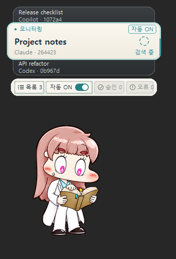
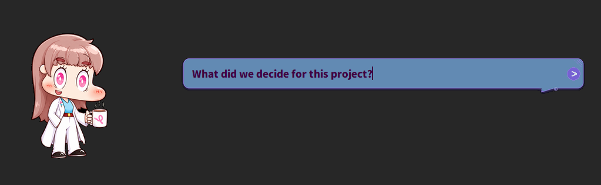

# AMBER

<p align="center"><a href="https://github.com/JJHbrams/Project-AMBER"></a></p>

<p align="center"><strong>Switch AI tools. Keep your project memory.</strong></p>

<p align="center">
  <a href="https://github.com/JJHbrams/Project-AMBER/releases/latest"></a>
  <a href="LICENSE"></a>
  
</p>

<p align="center"><a href="https://github.com/JJHbrams/Project-AMBER/releases/latest"><strong>Download for Windows</strong></a> · <a href="#quick-start-windows"><strong>Quick start</strong></a> · <a href="#cross-tool-continuity">How it works</a> · <a href="#local-knowledge-obsidian-and-the-graph">Obsidian</a> · <a href="#native-bolttagu-overlay-and-event-mapping">Overlay</a> · <a href="docs/architecture.md">Docs</a> · <a href="https://github.com/JJHbrams/Project-AMBER/issues/new/choose">Feedback</a> · <a href="README.ko.md">한국어</a></p>

AMBER gives configured **Claude Code**, **Codex CLI**, and **GitHub Copilot CLI**
a shared project-memory layer. Move between coding sessions with decisions and
project context ready to retrieve instead of rebuilding everything from scratch.

<p align="center"></p>

<p align="center"><sub>AMBER v1.5.15.736 · packaged Trickcal-style art with a custom event mapping, not the default mapping. <a href="resource/asset/readme/trickcal-demo-v1.5.15.provenance.json">Capture details</a> · <a href="resource/asset/readme/native-bolttagu-trickcal-v1.5.15.png">Poster</a></sub></p>

## Why AMBER

| When you need | AMBER provides |
| --- | --- |
| A new CLI session to understand yesterday's work | Persistent session memory and project context |
| Claude Code, Codex, and Copilot to share what matters | One local MCP-backed memory layer across supported tools |
| Project documents to be useful without pasting them repeatedly | Obsidian-backed knowledge graph and semantic retrieval |
| A visible, local companion while you work | Windows desktop overlay with native Bolttagu states |

AMBER stores its working memory and project knowledge locally. It does not turn
your prompts, tool payloads, or raw memory into a public overlay feed; the
external overlay contract is metadata-only.

## On your desktop

### Keep several sessions in view

The stacked monitor shows the selected session and neighboring sessions, with
provider labels and the current reported activity.

<p align="center"></p>

### Open a conversation from the character

Bubble mode provides an input beside your desktop companion. The example below
shows the real input UI with an unsent question, not a generated provider reply.

<p align="center"></p>

These captures use the installed Windows executable, synthetic session metadata,
and custom colors. Only the demo's own windows were captured and composed on a
neutral background; no private conversations are shown.

## Quick start (Windows)

1. Download and run the [latest AMBER Windows installer](https://github.com/JJHbrams/Project-AMBER/releases/latest).
2. Open **AMBER (ENGRAM)** from the Start menu, complete the local setup, then select the AI
   CLI you already use.
3. Start a project session from Claude Code, Codex CLI, or GitHub Copilot CLI.
   AMBER exposes the same local memory and project context to each supported tool.

The installer is the normal path. It selects only the components you choose and
does not remove unchecked external overlays or user-owned mappings.

### Supported coding tools

| Tool | Connection |
| --- | --- |
| [Claude Code](https://docs.anthropic.com/en/docs/claude-code) | Local MCP memory and lifecycle integration |
| [Codex CLI](https://developers.openai.com/codex/cli) | Local MCP memory and session integration |
| [GitHub Copilot CLI](https://docs.github.com/copilot/how-tos/copilot-cli) | Local MCP memory integration |

Other compatible MCP clients can use the local service too; their lifecycle
signals can differ, so AMBER never invents unavailable provider state.

## Cross-tool continuity

AMBER keeps the durable project layer separate from one terminal or model:

- Session summaries carry decisions and unfinished work forward.
- Project scope helps the next tool retrieve relevant context instead of every
  note in a vault.
- The local memory service can be reached by multiple configured coding tools
  without giving an overlay raw prompts, file paths, tool input, or private
  memory bodies.

This is deliberately practical: use the CLI that fits the task, while your
project's working context stays available on your PC.

## Storage and providers

AMBER retrieves relevant saved context; it cannot guarantee perfect recall of
every past detail. Local AMBER storage is distinct from a cloud provider: a
provider can receive the context you choose to send through its own configured
client. The demo above uses synthetic event metadata rather than a real provider
lifecycle; its [capture details](resource/asset/readme/trickcal-demo-v1.5.15.provenance.json)
record the bounded evidence and limits.

## Local knowledge: Obsidian and the graph

Point AMBER at an Obsidian vault to make project notes, research, and durable
decisions searchable as a local semantic knowledge graph. In
`~/.engram/user.config.yaml`, choose `db.root_dir`; then open
`<db.root_dir>\docs\` as the Obsidian vault. The vault remains your files;
AMBER indexes and links useful context for retrieval rather than requiring a
separate cloud knowledge base.

See [architecture](docs/architecture.md) for storage and service boundaries.

## Native Bolttagu overlay and event mapping

Bolttagu is bundled as a native character, so its atlas and animation timeline
run in the Engram process—no sibling renderer checkout is required. The GIF
above uses packaged Trickcal-style art captured from the v1.5.15.736 frozen
executable with a custom mapping. To keep this style during events, map tool
`categories` and completion `oneshots.success` as well as `hints`: omitted entries
inherit defaults and can briefly show the basic art. The demo's exact overrides
are listed in its capture details; your saved mapping is not changed by this demo.

To choose event poses in the Windows settings UI:

1. Select **Native Bolttagu** as the character.
2. Choose **Edit mapping…**.
3. Pick a state, tool category, or launcher transition. The editor previews the
   packaged atlas using the same layers and frame timing as the runtime.
4. Choose **Apply preparation**, then choose **Save** in the main Settings
   window. The running overlay reloads the mapping immediately and keeps it
   across restarts.

Mappings are small JSON override documents: omitted entries use shipped defaults,
while only valid changed choices are stored in AMBER-owned, content-addressed
copies. Import validates a mapping before copying it and never overwrites the
source file. A simplified example:

```json
{
  "version": 1,
  "hints": { "generating": "writing" },
  "categories": { "read": "searching" },
  "lifecycle": { "hide": "exit" }
}
```

## External overlays

Native Bolttagu is the default, but AMBER can also install compatible external
overlay components without activating one automatically. Their authenticated
local Event API publishes only metadata such as display hints and lifecycle
state; renderer design, animation, and renderer-specific settings remain
renderer-owned.

- [External Overlay Event API v2](docs/overlay-event-api-v2.md)
- [External component installation guide](docs/dev/external-overlay-install-plan.md)
- [Joint startup guide](docs/dev/joint-startup.md)

## Developer/source setup

Use this path only when developing AMBER itself. Normal Windows users should use
the installer above.

```powershell
git clone https://github.com/JJHbrams/Project-AMBER.git
cd Project-AMBER
powershell -ExecutionPolicy Bypass -File .\INSTALL.ps1
```

For source changes, see the [architecture](docs/architecture.md),
[native Bolttagu design](docs/design/0001-native-bolttagu.md), and
[external component design](docs/design/0002-external-overlay-components.md).

## Troubleshooting

- **The overlay does not change after editing a mapping:** choose **Save** in
  the main Settings window after **Apply preparation**. If live reload rejects
  the file, correct the invalid mapping and save again; the last good mapping
  remains active.
- **A coding tool has no remembered project context:** confirm its local MCP
  configuration and project scope before treating a missing provider lifecycle
  signal as a memory failure.
- **An external overlay does not start:** confirm its selected component and
  pinned runtime status; native Bolttagu does not depend on an external provider.

The animated demo is bounded evidence from a normal frozen launch. Its states
were driven by synthetic metadata, not a real provider lifecycle, and it is not
an Inno installer test; see its [sanitized provenance](resource/asset/readme/native-bolttagu-v1.5.15.provenance.json).

## License

See [LICENSE](LICENSE). AMBER's public documentation is English-first; the full
Korean guide is preserved at [README.ko.md](README.ko.md). If AMBER is useful,
[a GitHub star](https://github.com/JJHbrams/Project-AMBER/stargazers) helps others discover it.
