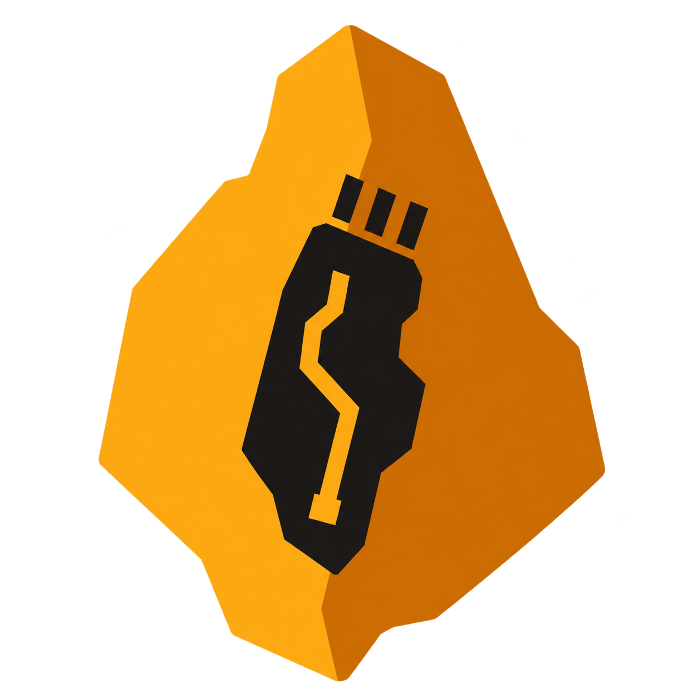

<p align="center"></p>

<h1 align="center">AMBER</h1>

<p align="center"><strong>Experience becomes identity.</strong></p>

<p align="center">Persistent memory and a continuing identity for your AI agents.</p>

<p align="center"><sub>Agent Memory Backend with Episodic Recall · AMBER is the distribution of Engram.</sub></p>

<p align="center"><a href="https://github.com/JJHbrams/Project-AMBER/releases/latest"><strong>Download for Windows</strong></a> · <a href="README.ko.md">한국어</a> · <a href="#quick-start">Quick start</a></p>

<p align="center"><sub>Windows · local storage · MCP connections · MIT</sub></p>

AMBER is the distribution of **Engram**, a local runtime that carries memory, persona, and knowledge across sessions and configured AI tools. The chip held in amber represents a digital identity shaped by accumulated experience.

## What carries forward

- **Identity** — A continuing narrative and persona, informed by saved experiences and reflection.
- **Memory** — Session summaries, decisions, and unfinished work that the next session can retrieve.
- **Knowledge** — Your Markdown notes and linked project documents, searchable through a local knowledge graph.

## Quick start

1. Download and run the [latest AMBER Windows installer](https://github.com/JJHbrams/Project-AMBER/releases/latest).
2. Open **AMBER (ENGRAM)** from the Start menu and complete local setup.
3. Start a project session with a configured coding tool. AMBER makes the same local project context available to each supported connection.

The Windows installer is the normal path. It provisions the runtime it needs, so a separate Python or Conda installation is not required for a frozen release.

## Continuity across coding tools

AMBER connects configured local clients to one project-memory service. Typical workflows include:

- **Claude Code** for implementation, then **Codex CLI** for review with the same saved project context.
- **GitHub Copilot CLI** for a focused task that can retrieve the decisions recorded in an earlier session.
- Another compatible MCP client where its available lifecycle signals support the integration.

Tool support and lifecycle details vary by client. AMBER keeps durable project context separate from a particular terminal, model, or UI.

## A companion on your desktop

The Windows overlay can show selected session activity and provide a compact conversation surface beside the character.

<p align="center"></p>

Native UI preview with synthetic QA text and custom character art. [Capture details](resource/asset/readme/trickcal-demo-v1.5.15.provenance.json).

<details>
<summary>See the character animation</summary>

<p align="center"></p>

Historical v1.5.15.736 capture with custom art and mapping, driven by synthetic events. [Capture details](resource/asset/readme/trickcal-demo-v1.5.15.provenance.json).

</details>

## Local storage and providers

AMBER stores its working memory and project knowledge locally and retrieves relevant saved context; recall is not exhaustive. That local storage is separate from an AI provider: the provider configured in your own client can receive context you choose to send through that client. External renderers receive display metadata through the Event API rather than raw prompts, tool payloads, or private memory bodies.

## Documentation

- [Korean user guide](docs/user-guide.ko.md): overlay, Obsidian knowledge, character mappings, and source setup
- [Architecture](docs/architecture.md): storage, service, and retrieval boundaries
- [Character packs](docs/character-packs.md) and [External Overlay Event API](docs/overlay-event-api-v2.md)
- [Issues and feedback](https://github.com/JJHbrams/Project-AMBER/issues/new/choose)

<details>
<summary>Developing AMBER from source</summary>

For development of AMBER itself, clone the repository and use the root installer entry point:

```powershell
git clone https://github.com/JJHbrams/Project-AMBER.git
cd Project-AMBER
powershell -ExecutionPolicy Bypass -File .\INSTALL.ps1
```

For source requirements and removal instructions, see the [user guide](docs/user-guide.ko.md). The Windows installer above remains the recommended way to use AMBER.

</details>

## License

AMBER is available under the [MIT License](LICENSE).
