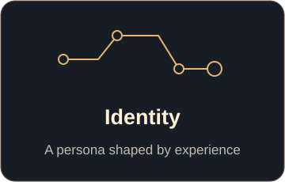
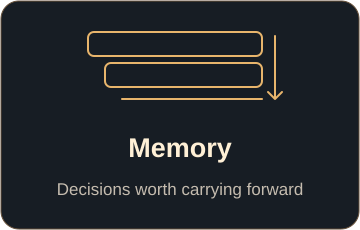

<p align="center"></p>

<p align="center"><strong>Persistent memory and a continuing identity for your AI agents.</strong></p>

<p align="center"><b>A</b>gent <b>M</b>emory <b>B</b>ackend with <b>E</b>pisodic <b>R</b>ecall<br /><sub>The distribution of Engram.</sub></p>

<p align="center">
  <a href="https://github.com/JJHbrams/Project-AMBER/releases/latest"></a>
  
  <a href="LICENSE"></a>
  <a href="docs/architecture.md"></a>
</p>

<p align="center"><a href="https://github.com/JJHbrams/Project-AMBER/releases/latest"><strong>↓ Download for Windows</strong></a> &nbsp; · &nbsp; <a href="#quick-start">Quick start</a> &nbsp; · &nbsp; <a href="README.ko.md">한국어</a></p>

---

AMBER is the distribution of **Engram**, a local runtime that carries memory, persona, and knowledge across sessions and configured AI tools. The chip held in amber represents a digital identity shaped by accumulated experience.

## A companion on your desktop

The Windows overlay can show selected session activity and provide a compact conversation surface beside the character.

<p align="center"></p>

Native UI preview with synthetic QA text and custom character art. [Capture details](resource/asset/readme/trickcal-demo-v1.5.15.provenance.json).

<details>
<summary>See the character animation</summary>

<p align="center"></p>

Historical v1.5.15.736 capture with custom art and mapping, driven by synthetic events. [Capture details](resource/asset/readme/trickcal-demo-v1.5.15.provenance.json).

</details>

## What carries forward

<p align="center">
  
  
  
</p>

## Quick start

1. Download and run the [latest AMBER Windows installer](https://github.com/JJHbrams/Project-AMBER/releases/latest).
2. Open **AMBER (ENGRAM)** from the Start menu and complete local setup.
3. Start a project session with a configured coding tool. AMBER makes the same local project context available to each supported connection.

The Windows installer is the normal path. It provisions the runtime it needs, so a separate Python or Conda installation is not required for a frozen release.

## Continuity across coding tools

**Claude Code · Codex CLI · GitHub Copilot CLI · compatible MCP clients**

Implement in one configured tool, review in another, and retrieve the same saved project decisions. Available context and lifecycle integration vary by client.

## Local storage and providers

AMBER stores its working memory and project knowledge locally and retrieves relevant saved context; recall is not exhaustive. That local storage is separate from an AI provider: the provider configured in your own client can receive context you choose to send through that client. External renderers receive display metadata through the Event API rather than raw prompts, tool payloads, or private memory bodies.

## Documentation

- [Korean user guide](docs/user-guide.ko.md): overlay, Obsidian knowledge, character mappings, and source setup
- [Architecture](docs/architecture.md): storage, service, and retrieval boundaries
- [Character packs](docs/character-packs.md) and [External Overlay Event API](docs/overlay-event-api-v2.md)
- [Issues and feedback](https://github.com/JJHbrams/Project-AMBER/issues/new/choose)

<details>
<summary>Developing AMBER from source</summary>

For development of AMBER itself, clone the repository and use the root installer entry point:

```powershell
git clone https://github.com/JJHbrams/Project-AMBER.git
cd Project-AMBER
powershell -ExecutionPolicy Bypass -File .\INSTALL.ps1
```

For source requirements and removal instructions, see the [user guide](docs/user-guide.ko.md). The Windows installer above remains the recommended way to use AMBER.

</details>

## License

AMBER is available under the [MIT License](LICENSE).
