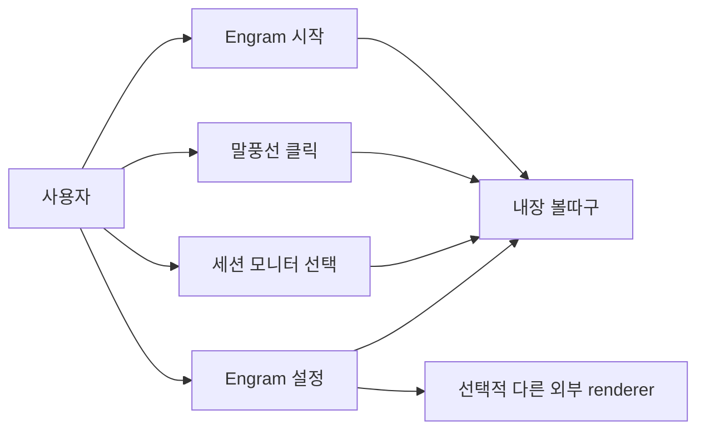
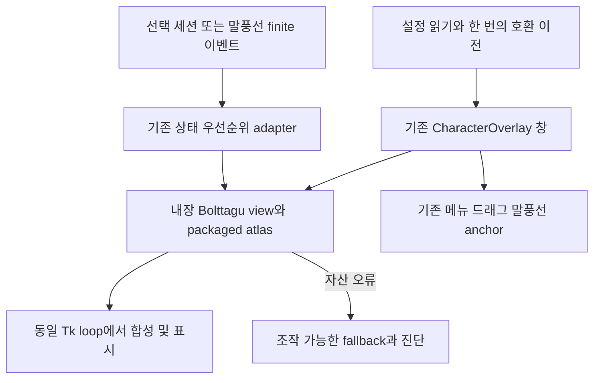
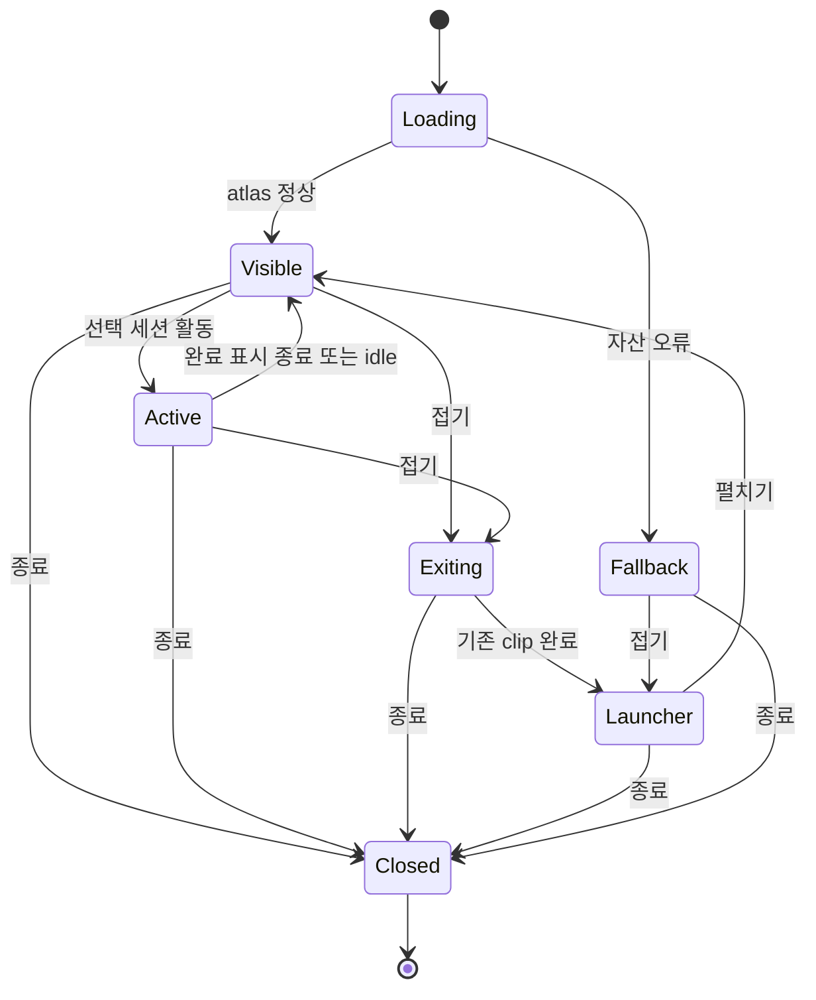

# 볼따구 Engram 기본 내장 오버레이 통합

사용자가 지속 구현을 승인했다. 2026-09-09 설계 승인 이후 구현 및 실제 실행 검증 중.

## 1. 의도 (Intent)

| 항목 | 내용 |
|---|---|
| 문제 | 외부 볼따구를 replace로 선택하는 것은 내장화가 아니다. 별도 설치·프로세스·카탈로그 연결에 의존한다. |
| 목표 | 볼따구가 Engram 프로세스 안에서 기존 기본 캐릭터를 대체한다. Engram 단독 설치로 바로 동작한다. |
| 주 사용자 | Engram 말풍선 및 다중 세션 모니터를 사용하는 Windows 사용자 |
| 불변식 | 기존 DB·페르소나·세션·사용자 파일 보존. 애니메이션에는 유한한 상태와 분류만 전달. 외부 renderer API 호환성 유지. |
| 비목표 | Orca 훅 승인 복구, Codex 하위 에이전트 탐지 개선, 타 외부 캐릭터 내장화, 공개 릴리즈 발행 |

## 2. 수용 기준 (Acceptance)

아래 기준은 전부 critical이다. 전체 수용은 아직 partial이며 아래 실행 기록과 독립 감사로 판정한다. 단위 테스트만으로 실행 기준을 PASS 처리하지 않는다.

| ID | 수용 기준 | 검증 방법 |
|---|---|---|
| AC-1 | 외부 provider·socket 연결·replace 설정 없이 기본 볼따구 표시 | 실제 Windows source 및 frozen 프로세스의 소유 HWND 캡처, 외부 provider 미실행 fixture, 설정과 프로세스 트리 증거 |
| AC-2 | 기존 볼따구의 눈깜박임·김·시선방향·크기·등장/퇴장·상태별 포즈 보존 | 기존 animator 시간 fixture와 native 시간 fixture 비교, owned-window 연속 캡처로 시각 비교 |
| AC-3 | 클릭 말풍선, 우클릭 메뉴, 드래그, 접기/펼치기, 트레이, 다중 모니터 위치 동작 | 실제 Windows 입력과 재시작 테스트, 소유 창 사각형 기록. 접기 후 원래 anchor 유지, 종료 후 잔여 Tk timer 없음 |
| AC-4 | 선택한 세션/말풍선 이벤트만 내장 애니메이션 구동, 완료 후 idle 복귀 | 실제 Engram host에서 선택 세션 변경과 상태 이벤트 시퀀스 검사 및 창 캡처. 검증된 provider 이벤트와 renderer fixture 증거를 구분 |
| AC-5 | 신규 설정은 내장 볼따구가 기본. 현재 외부 볼따구 선택과 유효한 mapping.json은 백업 후 내장 선택/소유 매핑으로 이전. 타 외부 renderer와 사용자 설정 보존. GUI에서 매핑 편집·가져오기·내보내기 제공 | 신규/기존/재설치/중복 이전 fixture, YAML 비대상 필드 동일성, 원본 매핑 hash 불변 및 resolved mapping 동등성, 실제 설정 GUI 편집·저장·재시작, 외부 등록 목록 보존 |
| AC-6 | dev-rebuild, INSTALL, exe installer 모두 외부 볼따구 설치 없이 내장 자산 로드 | source 재시작, INSTALL 후 frozen 실행, 깨끗한 Windows 사용자 profile에서 로컬 setup 설치·재실행·자동실행 대상 실행. artifact 자산 manifest/hash 비교 |
| AC-7 | 누락·손상 자산에서도 조작 가능한 fallback을 유지하고 데이터/권한을 건드리지 않음 | 격리 fixture에서 atlas 오류 주입, 중복 렌더 루프와 고아 창 없음 확인. 정상 설치에서는 fallback 진입 0건 |

## 3. 확정 사실 (Findings)

| 항목 | 확인된 사실 | 설계 반영 |
|---|---|---|
| Engram 기준 | 현재 dev 55e7110, 설치본 1.5.14.706 | 이 기준에서 기능 브랜치 구성 |
| 호스트 | overlay/main.py에서 Tk root 생성 후 CharacterOverlay에 입력/설정/종료 콜백 주입 | 기존 창 소유자를 유지하고 내부 view만 교체 |
| 기존 애니메이션 진입 | main.py가 character.set_sprite_state를 사용하고 character.py가 타이머·위치·메뉴 담당 | 내부 adapter로 상태를 전달하고 native bolttagu 활성 시 기존 sprite timer 중복 실행 방지 |
| 원본 | sibling engram-overlay의 src/engram_overlay/overlays/bolttagu_2d.py에 BolttaguAnimator/Bolttagu2dView 존재 | 합성·시간·시선 로직 이식, create_bolttagu_2d transport wrapper 제외 |
| 의존성 | 원본 view는 tkinter/Pillow, spritemap, OverlayState와 결합 | Engram 내부 finite 상태 타입으로 분리. 외부 package import 없이 실행 |
| 자산 | 원본 assets/bolttagu_2d 아래 PNG 30개와 atlas.json, 총 4,005,948 bytes (planner 파일 조사) | Engram resource/character에 자체 포함, sibling/user home 경로에 의존하지 않음 |
| 패키징 | engram-overlay.spec의 _collect_character_datas가 character 자산을 수집 | atlas JSON 포함 여부까지 명시 검사하여 frozen 누락 차단 |
| 외부 경계 | Event API v2는 별도 인증된 renderer connection과 ready/assignment를 관리 | 내장은 해당 경로를 사용하지 않음. 다른 외부 renderer 지원은 유지 |
| 출처 | 원본 repo 루트에서 LICENSE/COPYING/NOTICE 미발견 | 원본 revision/자산 hash 기록. 공개 배포 전 자산 권리 확인 필요; 이번에 공개 릴리즈하지 않음 |

## 4. 유스케이스 / 시나리오

주 시나리오: 설치 후 실행하면 native 볼따구가 표시되고, 말풍선과 세션 이벤트에 반응한다.
예외: 자산 오류는 내장 조작 가능 fallback으로 전환하고 진단한다. 외부 볼따구를 몰래 실행하지 않는다.

## 5. 파이프라인 (flowchart)

내장 adapter 입력은 display hint/category/lifecycle만이다. 외부 TCP/JSONL roundtrip이나 별도 root/mainloop는 추가하지 않는다.

## 6. 액션 · 상태 전이

| 상태 | 저장/이벤트 | UI 반응 |
|---|---|---|
| Loading | 설정 이전은 백업 및 원자적 저장; 반복 적용은 no-op | 별도 외부 창을 띄우지 않음 |
| Visible/Active | 기존 상태 우선순위 및 완료 타이머 재사용 | blink/steam과 대응 포즈. 설정 변경으로 view 재생성 시 이전 timer 취소 |
| Exiting | 원본 clip 길이를 기존 animation tick의 deadline으로 관리. 별도 loop를 만들지 않음 | 방향 고정, 마지막 퇴장 frame 뒤 launcher 표시 |
| Launcher | 기존 anchor 저장 정책 유지 | 캐릭터 tick 중지, 펼칠 때 native enter |
| Fallback | 오류만 기록, 설정/자산 삭제 금지 | 기존 안전 이미지와 메뉴 유지 |
| Closed | 모든 animation/exit callback 취소 및 canvas image 해제 | 추가 창·프로세스가 남지 않음 |

## 9. 변경 지점

| 경로 | 변경 |
|---|---|
| `overlay/native_bolttagu.py` | (신규) animator/view 및 finite native adapter; 외부 transport 의존 제거 |
| `overlay/bolttagu_mapping.py` | (신규) 내장 포즈 매핑 검증 및 기본값 |
| `resource/character/bolttagu/` | (신규) atlas/PNG, 원본 revision 및 hash 출처 기록 |
| `overlay/character.py` | 기존 입력·위치·메뉴를 유지한 native view 연결 및 timer 소유권 |
| `overlay/main.py` | native 상태 전달, 접기/펼치기 완료 연결, external 분기 비의존 |
| `overlay/config.py` | 내장 선택 기본값과 idempotent 이전 |
| `config/overlay.user.yaml` | 저장소의 배포 템플릿만 변경. 실제 사용자 YAML은 검증된 migration 함수만 갱신 |
| `overlay/settings_window.py` | 기본 볼따구 표시 및 내장 옵션; 외부 replace 옵션과 구분 |
| `engram-overlay.spec` | 내장 자산 패키징 |
| `core/install/overlay_manifest.py` | 새 자산 build input/hash 추적 |
| `installer/joint-startup.ps1` | native 선택 시 외부 볼따구 시작 요구 제거, 타 renderer 정책 유지 |
| `installer/modules/09_overlay.ps1` | 재설치 시 native 선택 보존 |
| `test/test_native_bolttagu.py` | (신규) animation/상태/매핑/자산/타이머 회귀 |
| `test/test_native_bolttagu_install.py` | (신규) 신규·기존·중복 이전 및 source/frozen 패키징 회귀 |
| `scripts/dev/verify_native_bolttagu.py` | (신규) 격리 Windows runtime, owned HWND 및 프로세스 증거 |
| `scripts/dev/verify_native_bolttagu_frozen.py` | (신규) 정상 frozen 실행의 black-box HWND/HTTP/종료 검사. 제품에 test backdoor를 추가하지 않음 |

## 10. 잠재 문제 / 결정 제안

- 기본값은 내장 볼따구로 변경한다. 기존 사용자 이미지·reaction 설정은 지우지 않고 legacy 모드로 보존하되 기본 표시에는 사용하지 않는다.
- 현재 외부 bolttagu 선택값만 native로 이전한다. 다른 renderer 선택값, 설치 폴더, 외부 카탈로그는 보존한다. 사용자가 나중에 외부 볼따구를 명시 선택하면 재이전하지 않는다.
- 이전 대상은 exact ID engram.bolttagu-2d와 지원되는 observer/replace 모드의 조합이다. 변형 설정은 덮어쓰지 않고 진단한다. 사용자 YAML의 native 선택과 durable migration version을 같은 원자적 교체에 기록한다. 별도 marker 파일과 설정 파일 사이의 불일치 구간은 만들지 않는다. 교체 직전 원본 fingerprint 재확인, 복구용 백업은 새 이름으로 만들고 덮어쓰지 않는다. 백업 후 중단 시 원본은 유지되며 재시도 가능하고, 교체 후 중단 시 version으로 no-op 한다. 테스트에서 두 중단 지점을 각각 검증한다.
- 사용자 추가 승인(2026-09-09): 현재 외부 볼따구의 `~/.engram/overlays/bolttagu-2d/mapping.json` 값을 존중한다. 이 정확한 기존 경로만 한 번의 이전 시 확인하고, 유효하면 원본을 바꾸지 않은 채 Engram 소유 매핑 파일로 원자적으로 복사하여 선택한다. 누락 항목은 원본과 같은 기본값으로 해석한다. 잘못된 값은 조용히 버리지 않고 진단하며 원본을 보존한다. 설정 GUI에 포즈 선택 편집·가져오기·내보내기를 제공한다. 원본 `lifecycle.hide=enter` 같은 의도적인 사용자 선택을 임의 교정하지 않는다.
- 자동실행이 native 기본일 때 외부 provider가 없어도 성공해야 한다. 외부 프로그램의 기존 startup 등록은 임의 삭제하지 않으며 native의 의존성으로 취급하지 않는다.
- 단순 PNG 교체는 blink/steam·합성·lifecycle을 잃으므로 채택하지 않는다. 구형 sprite 루프와 view 루프가 동시에 이미지/geometry를 쓰는 회귀를 차단한다.
- 실제 재부팅은 다른 작업을 중단하므로 자동실행 대상 명령의 cold-start를 먼저 검증한다. 재부팅 검증은 사용자와 시점 합의 후 실행하며 미실행이면 별도 UNVERIFIED로 남긴다.
- 현재 Codex 훅 승인 소실은 별도 미해결 항목이다. 이 내장화로 해당 provider 탐지 자체가 해결됐다고 주장하지 않는다.
- 자산 재배포 권리와 원본 출처는 공개 릴리즈 전에 확인해야 한다. 이번 사용자 로컬 통합과 공개 배포 승인을 혼동하지 않는다.

## 11. 착수 순서

- [x] 사용자에게 의도·수용기준·설정 이전 정책 승인받기. 원본 revision/hash와 자산 출처 기록 (AC-1, AC-5, AC-6).
- [x] packaged atlas와 native idle view를 기존 창에 연결하여 외부 provider 없이 실제 표시 (AC-1, AC-2, AC-7).
- [x] hint/category/one-shot, 등장/퇴장, pointer/scale와 선택 이벤트를 연결하고 회귀 검사 (AC-2, AC-3, AC-4).
- [x] 설정 GUI·기본값·정확히 한 번의 migration·명시 매핑 import 구현 및 기존 설정 비교 (AC-5).
- [ ] source/dev-rebuild, INSTALL, 로컬 exe installer를 검증하고 Windows owned-window 증거 확보 (AC-1, AC-3, AC-4, AC-6, AC-7).
- [ ] 구현자가 아닌 planner의 새 acceptance audit, 사용자 환경에 검증본 적용 후 재확인 (AC-1, AC-2, AC-3, AC-4, AC-5, AC-6, AC-7).

## 12. 추적성

구현 중이며 전체 수용 완료는 아직 아니다. 첫 격리 source 전체 OverlayApp 실행에서 host-owned native HWND, 외부 renderer 미연결, HTTP metadata 선택 변경, 완료→idle, collapse/tray/expand command handler가 통과했다. 증거: 임시 profile `engram-build-smoke-376cb60638564d308cfea0c720beb3df/native-evidence/report.json` 및 owned-window PNG. 이는 명시 native 설정의 source fixture이며 frozen/설치/실제 provider 검증으로 대체하지 않는다.

실제 외부 매핑 SHA256: `1D572406098F076F9BD63CF41B06AA2D582CF24EE6915CA2A45330B77B524DA6`; version 1, trickcal 계열 커스텀 hints 및 show=trickcal-enter/hide=enter. 원본은 그대로 보존했고, 운영 환경에는 `.engram/native-bolttagu/mappings/<sha>.json`을 선택하도록 이전했다. `dev-rebuild`와 `INSTALL -OverlayBuildMode skip -AutoStart preserve -ExternalOverlayMode none` 실행 후 source 및 frozen host-owned 창을 각각 확인했다. 설치 후에도 user.config.yaml/persona.user.yaml은 byte-identical이며 DB root는 D:/intel_engram이다. 백업은 임시 `engram-native-backup-60494b2e58e14a309e05e623350ec2bf`에 있다.

### 2026-09-10 실행 및 감사 기록

- 구현: `afc3231` native/설정/설치, `8160ce4` 자산 LF, `26a69f2` 원자적 매핑 게시와 편집기 초기화 실패 정리, `a088f24` 최초/이동 모니터 크기 기준 통일, `df471d7` native 자동실행 preflight의 외부 의존 제거.
- 독립 animator 비교: 기본 7,920회, 실제 사용자 매핑 1,872회 동일 recipe. 30 PNG pixel 동일. 원본 atlas는 JSON 의미 동일.
- root 재실행: native/native-install/character-effects 32 PASS + 11 subtests. startup PS5/PS7 6 PASS + 14 subtests(코더 실행).
- Source 전체 host: 임시 `engram-build-smoke-6620d7ea00bc40258b8180ca80a20428/native-evidence/report.json`: 실제 드래그·메뉴·말풍선 입력, 합성 세션 및 말풍선 이벤트 격리, 완료→idle, GUI import/export/편집 적용, 세 모니터 표시, 정상 종료 timer null/HWND 제거. 파일 선택 dialog만 경로를 주입했고 실제 GUI callback/file 경로는 실행했다. 유료 모델 대화 성공으로 해석하지 않는다.
- 같은 profile의 `mapping-restart-evidence/report.json`: 새 프로세스에서 편집된 idle 매핑 trickcal-listening 유지 확인. `restart-evidence`의 첫 위치 검증은 PASS였지만 반복 실행 `restart-final-evidence`에서 좌표 누적 적용이 발견되었다. `518240f`에서 Tk의 지연된 레이아웃과 geometry 적용 순서를 수정했다. root의 새 격리 profile `engram-build-smoke-5fd2e046638248e7a95f6ed753134eed/anchor-trace-{0,1,2}`에서 실제 launcher HWND rect [20,1836,72,1888]과 full rect [30,1584,266,1848]이 세 프로세스 모두 동일하여 AC-3 재검증 PASS. 최종 focused 회귀 33 PASS + 11 subtests.
- Frozen 정상 실행: 임시 `engram-build-smoke-84076c63780e40ab85b27c3a60ed1652/native-frozen-evidence/report.json`: 외부 provider 미실행, host-owned HWND 실제 클릭/표시/연속 animation, shutdown 종료 0. frozen state 캡처 자체는 포즈 assert가 아니므로 AC-4 근거는 source의 명시 state 검증이다.
- 오류 주입: 임시 `engram-build-smoke-341ef13c9949436ab6945227546d83f7/native-fault-missing/report.json`, `native-fault-corrupt/report.json`: 정상 조작 가능한 fallback, 접기/펼치기, 종료 timer null/HWND 제거. 제품/사용자 자산 파일은 바꾸지 않고 test loader 경로만 주입했다.
- 로컬 setup compile 성공. 아직 깨끗한 Windows profile에서 setup 자체를 설치하지 않았으며 실제 재부팅도 하지 않았다. 운영체제의 Known Folder/registry는 단순 환경변수 smoke profile만으로 격리된다고 주장하지 않는다.

각 슬라이스 완료 시 커밋과 시험 증거를 해당 AC에 기록한다. 공개 릴리즈·원격 푸시는 별도 요청 없이 수행하지 않는다.

독립 planner의 518240f 후 새 감사 및 최종 통합 추가 감사: AC-1/2/3/4/5/7 PASS, AC-6 UNVERIFIED, overall PARTIAL. 깨끗한 Windows 사용자 환경의 setup 설치는 기존 환경의 INSTALL 성공으로 대체하지 않는다.

최종 제품/검증 소스 `f673ce4`를 `1.5.14.713`으로 frozen 빌드했다. runtime contract와 embedding/MCP/watcher/overlay/dashboard 역할 검사가 PASS했다. 실제 frozen host 검증은 `engram-build-smoke-fc2ed006f9e540a0944abaec5c8b5b10/final-frozen-evidence/report.json`에 있으며 native HWND, 실제 클릭, 연속 animation, 정상 종료를 확인했다. 운영 host PID 58904와 자식 MCP 49380/watcher 60764/dashboard 64888이 동일 설치 경로에서 준비됐고, owned native HWND 캡처는 기존 백업 폴더의 `live-evidence/native-final-713.png`다. 기존 설정 두 파일과 원본 매핑 SHA 및 native 복사본 동일성도 재확인했다.

기존 ON startup shortcut을 백업한 뒤 provenance 확인 가능한 같은 저장소의 최종 exe로 갱신했다. `Set-EngramJointStartup -HostOnly`로 외부 startup은 보존했고, shortcut target 명령의 cold-start/서비스 준비를 확인했다. 실제 로그인/재부팅 테스트는 아니다. 현재 운영 exe·startup·설치 shim이 `native-bolttagu` feature worktree에 의존하므로 dev 통합 및 영구 설치 경로 이전 전에는 이 worktree를 제거하지 않는다.

로컬 개발용 installer `AMBER_1.5.14.713-dev_x64-setup.exe` compile 성공(315.4 MB); SHA256 `19545BE11019D39FD17A16F9B942CDEE85E48FF811A91E96C704DB8CBE4EF1D6`. 최종 exe와 setup은 동일한 제품 소스/버전으로 생성했으며, 이 기록만 담는 후속 문서 커밋은 패키지에 포함되지 않는다. 공개 배포하지 않았다.
