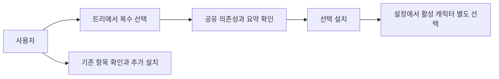
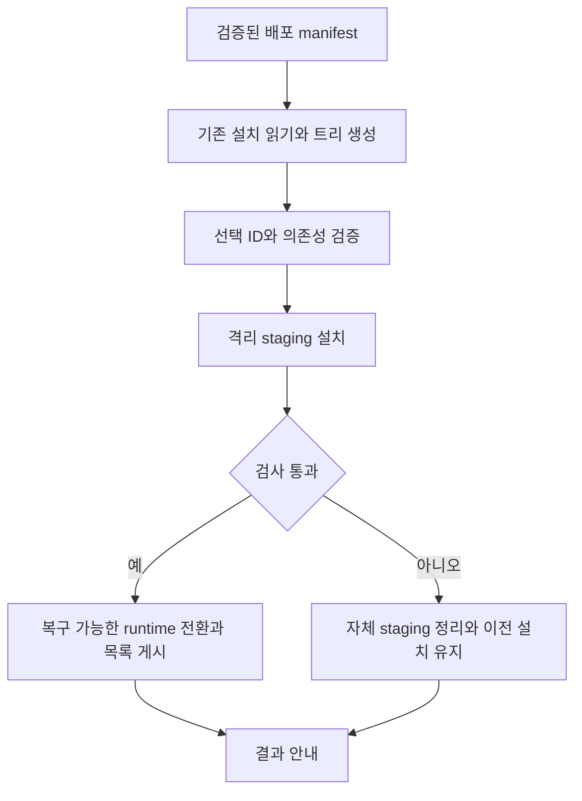
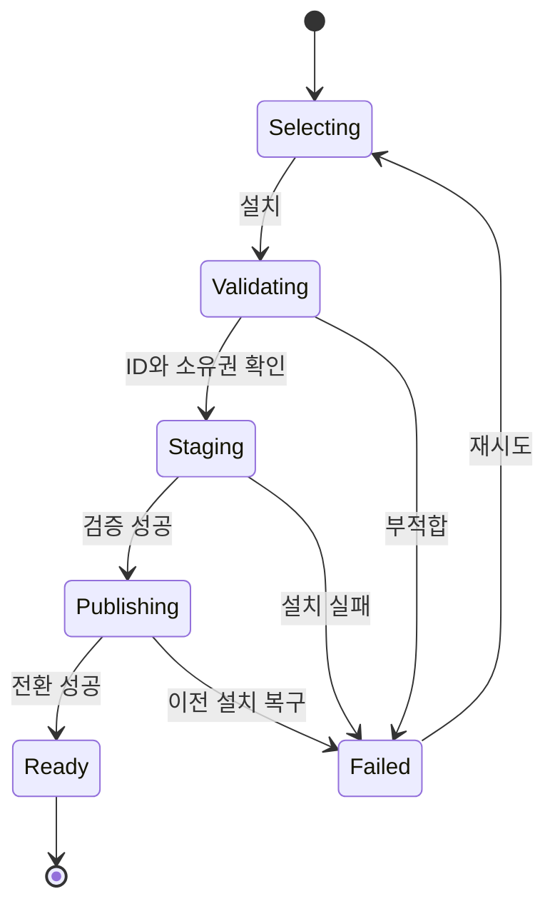

# 외장 오버레이 선택 설치

2026-09-10 사용자 승인: 구현과 빌드 진행, 실제 설치는 사용자가 수행한다. 운영 PC 설치/설정/자동실행/Engram 재시작은 이번 작업에서 수행하지 않는다. AC-7의 실제 setup 설치는 사용자 검증으로 이관하며 결과 수신 전 UNVERIFIED로 남긴다. 임시 구성요소 runtime 검증과 설치 버튼을 누르지 않는 실제 Inno UI 검증은 수행한다.

## 1. 의도 (Intent)

목표: SDK 설치기처럼 모든 제공 외장 오버레이를 계층형 체크박스로 복수 선택 설치한다.
불변식: 내장 볼따구 기본 제공 유지. 설치와 활성 선택 분리. 기존 DB·페르소나·매핑·사용자 소유 runtime 보존. 알려진 ID와 검증된 패키지만 처리.
비목표: 임의 외부 앱/URL 검색·실행, 공개 릴리즈, 체크 해제를 통한 기존 파일 삭제.
권고안: 공통 runtime과 프리셋 전용 payload를 분리하는 실제 선택 설치. 전체 wheel 설치 후 목록만 숨기는 축소안은 별도 승인 필요.
새 설치의 외장 항목은 미선택. 부모/부분 선택, 전체 선택/해제, 설명·기존 설치·공유 의존성 표시. 기존 항목은 미선택하더라도 삭제하지 않는다.

## 2. 수용 기준 (Acceptance)

모든 기준은 critical. 실제 Windows 실행 기준은 정적 검사로 대체하지 않는다.

| ID | 수용 기준 | 검증 방법 |
|---|---|---|
| AC-1 | 실제 Inno UI에 7종 전체가 2D/3D 트리로 표시되고 복수 선택·요약 가능 | 실제 setup 클릭·키보드·부분 선택·화면 캡처 |
| AC-2 | exe configure와 source INSTALL이 같은 선택에 같은 설치 계획 실행 | 양쪽 Windows 진입점의 ID·의존성·결과 비교 |
| AC-3 | 공통 runtime과 선택 프리셋 및 필수 의존성만 새로 설치하고 성공 항목만 등록·실행 | 격리 runtime 실제 파일 목록·해시·catalog·실행 가드 검사, 미선택 전용 자산 없음 |
| AC-4 | 설치만으로 활성 캐릭터가 바뀌지 않고 신규 기본은 내장 볼따구 | 실제 전후 config diff, host 재시작·수동 전환 |
| AC-5 | 기존 설치 목록·사용자 소유권·커스텀 매핑 보존 | 기존 전체 wheel/비소유 runtime fixture와 설정·파일 hash 비교 |
| AC-6 | 실패·업그레이드 중단 시 이전 runtime과 목록 보존, 오류 표시 | staging·검증·전환 오류 주입과 재시도, 잔여 프로세스 검사 |
| AC-7 | 실제 setup 설치 후 복수 프리셋 등록·전환·재시작 | disposable Windows 사용자/VM에서 설치, 두 종류 이상 owned-window 캡처 및 정상 종료. 환경 미확보 시 UNVERIFIED |

## 3. 확정 사실 (Findings)

| 항목 | 확인된 사실 | 설계 반영 |
|---|---|---|
| 기준 | dev ab3910b clean에서 시작 | 독립 feat/external-overlay-components |
| 배포 목록 | pin 1.1.1.158의 실제 번들 wheel registry.py AST로 7종 확인 | 배포 manifest가 목록의 단일 출처 |
| ID | bolttagu-2d, rabbit-2d, robot-arm, xeyes, robot-arm-3d, robot-arm-3d-v2, robot-arm-3d-v3(CCTV) | 호환 ID 보존 |
| 단일 선택 원인 | .iss 라디오와 ExternalOverlayModeCode, joint-startup 단일 볼따구 분기 | UI·source·configure 함께 변경 |
| 실제 설치 | external-overlay.ps1은 전체 wheel pip 설치. Overlay 값은 payload 분리가 아님 | 공통 code/runtime + 선택 payload 필요 |
| 등록 | external registry.provider_catalog는 7종 전체 반환 | 설치 성공 목록을 catalog/실행 가드에 적용 |
| 의존성 | pyproject에 전체 자산 포함. CCTV는 V2/3D/기본 Arm 모듈 import | 공유 코드·자산 의존성은 별도로 해결 |
| 진입점 | installer/configure.ps1와 source installer/install.ps1 | 공용 계획과 양쪽 실행 검증 |

## 4. 유스케이스 / 시나리오

Rabbit/CCTV 선택 시 해당 payload와 공통 의존성을 설치·등록하며 현재 내장 캐릭터는 유지한다.
사용자 소유 runtime은 임의 교체하지 않고 보존 사유와 수동 절차를 표시한다.

## 5. 파이프라인 (flowchart)

## 6. 액션 · 상태 전이

| 상태 | 저장/이벤트 | UI 반응 |
|---|---|---|
| Selecting | 읽기만 수행 | 기존 설치/선택/의존성 구분 |
| Staging | 임시 소유 폴더만 기록 | 구성요소별 진행 |
| Publishing | 검증된 runtime과 목록을 복구 가능한 순서로 전환 | 확정 전 성공 표시 금지 |
| Failed | 이전 설치·설정 유지, 자체 staging 정리 | 원인과 재시도 안내 |
| Ready | 성공한 설치 목록 게시 | 설치와 사용 중인 캐릭터 구분 |

## 9. 변경 지점

| 파일 | 변경 |
|---|---|
| `installer/engram-overlay.iss` | 트리·선택 요약 |
| `installer/configure.ps1` | 다중 구성요소 인자 |
| `INSTALL.ps1` | source 다중 선택 인자 |
| `installer/install.ps1` | 공용 계획 호출 |
| `installer/joint-startup.ps1` | 단일 볼따구 분기 제거 |
| `installer/external-overlay.ps1` | staged payload 설치/복구 |
| `installer/build-installer.ps1` | manifest/payload 패키징 |
| `installer/external-overlay.pin` | 호환 배포 pin |
| `installer/external-components.ps1` (신규) | manifest 검증/의존성 해결 |
| `test/test_external_components.py` (신규) | 선택·보존·실패 회귀 |

외부 engram-overlay 저장소의 package 빌드, registry, provider, 자산 해석도 변경 대상이다. 승인 후 외부 저장소의 독립 브랜치에서 작업한다.

### 승인 후 상세 인터페이스

- bundle manifest는 schema/package_version/registry_revision, 공통 wheel(file/hash), 표시용 components와 내부 payloads를 분리한다. 표시용 ID는 7종의 호환 ID이며 payload 의존성을 설치해도 다른 표시 항목을 등록하지 않는다.
- core wheel에서 프리셋 전용 코드·자산을 분리한다. 내부 ZIP의 경로·symlink·파일 크기·hash를 검증한 뒤 선택 payload와 필수 의존성만 설치한다.
- 실행 환경은 root/generations/고유이름/venv의 최종 경로에서 생성한다. pip가 만든 launcher에 경로가 내장되므로 venv를 만든 뒤 폴더 이름을 바꾸지 않는다.
- generation의 설치 목록 marker와 검증 가능한 provenance를 저장하고, root의 활성 generation 포인터를 원자적으로 게시한다. 이전 generation은 복구 가능하게 보존한다. 경로가 관리 루트를 벗어나거나 reparse point를 통과하면 거부한다.
- legacy 전체 wheel은 실제 설치 파일과 소유권을 확인해 보존한다. core-only 패키지의 marker 누락을 legacy 전체 설치로 오인하여 7종을 등록하지 않는다.
- 실행 중인 이전 관리 provider가 있으면 설치 담당 경로에서 소유권을 검증해 전환한다. Engram 이벤트 API에 외부 프로세스 실행 명령을 추가하지 않는다. 사용자 소유 프로세스는 건드리지 않는다.

## 10. 잠재 문제 & 대응

| 문제 | 대응 |
|---|---|
| 공통 wheel 전체 설치를 선택 설치로 오인 | 실제 전용 payload 분리, 목록만 숨기는 대안은 별도 승인 |
| CCTV 공유 자산 범위 미확정 | 실제 참조 검사 후 manifest dependency 확정 |
| 기존 전체 설치에서 데이터 손실 | 기존 목록을 설치됨으로 인식하고 미선택 파일·매핑 삭제 금지 |
| Python/Pillow 네트워크 실패 | 요구 조건 명시, 실패를 성공으로 숨기지 않음 |
| manifest와 실제 배포 불일치 | pin/hash/schema/ID 검증 실패 시 중단 |
| 깨끗한 Windows 검증 환경 없음 | UI-only 또는 환경변수 격리를 setup 설치 증거로 대체하지 않음 |

## 11. 착수 순서

- [ ] 1. 트리·실제 선택 설치·보존 정책 사용자 승인 완료, payload 의존성 확정 (AC-1, AC-3, AC-5).
- [ ] 2. 공통 runtime과 Rabbit/CCTV 선택 설치 수직 구현 (AC-2, AC-3, AC-4).
- [ ] 3. 전체 7종 manifest·실제 Inno UI·source parity (AC-1, AC-2).
- [ ] 4. 기존 설치 이전·실패 복구 검증 (AC-5, AC-6).
- [ ] 5. 실제 setup 설치·전환·재시작과 독립 acceptance audit (AC-1, AC-2, AC-3, AC-4, AC-5, AC-6, AC-7).
