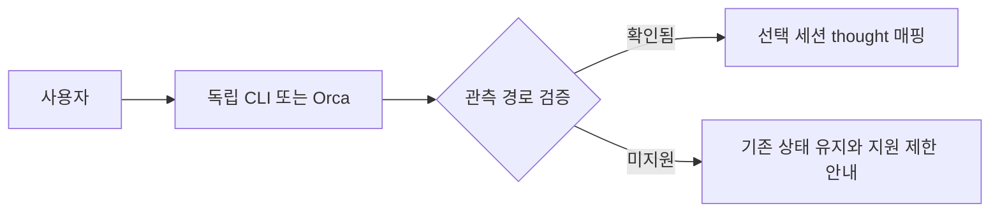
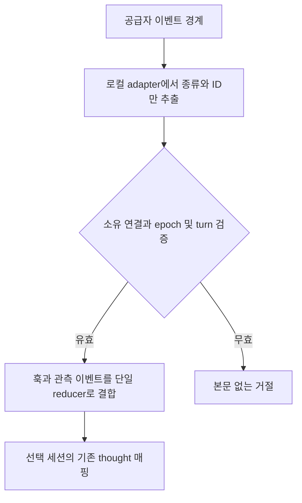
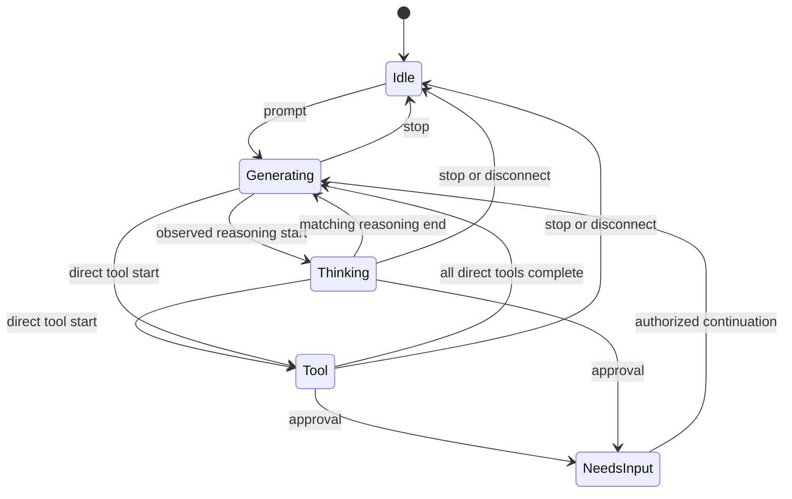
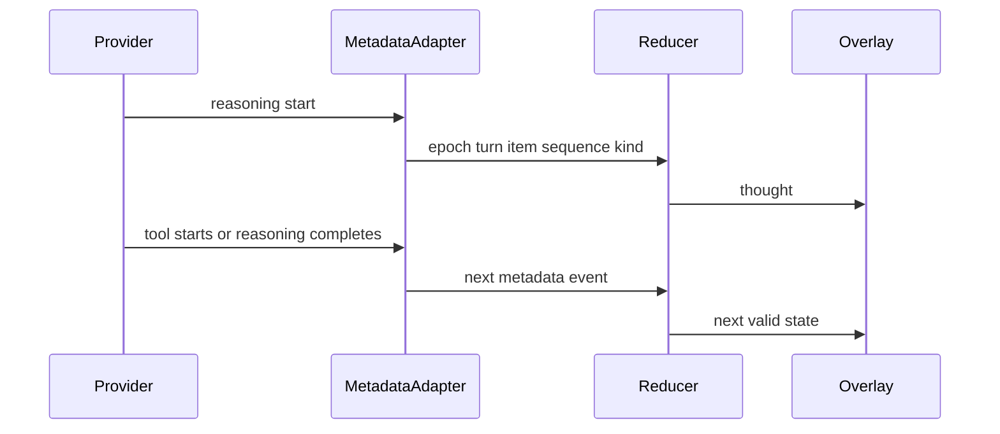
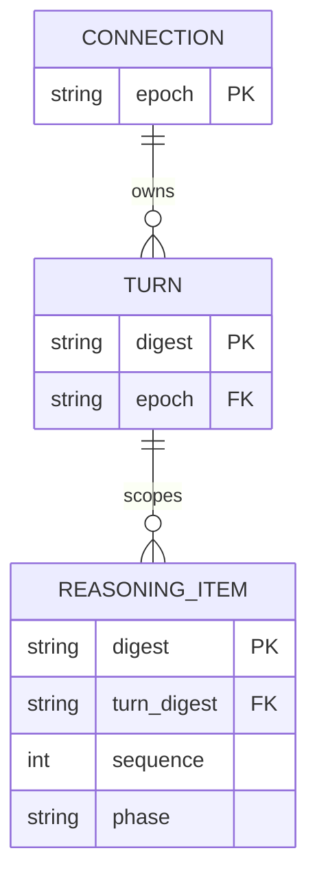

# Claude / Codex 사고 상태 이벤트

실제 사고 관측과 실행 경로 변경은 아직 미승인이다. 이후 사용자가 승인한
도구 밖 생성 구간의 thought **표시 정책**은 `0003-native-generation-pose.md`로
분리하여 구현한다. 그 정책은 본 문서의 실제 사고 관측 AC를 완료하지 않는다.

### 2026-09-10 재개 확인

- 제목 복구/목록 유지 시간 수정은 `dev`의 `d186c58`에 병합했다. 병합 후 88 tests + 14 subtests 통과.
- 본 작업은 그 커밋에서 분리한 `feat/session-thinking-events`에서 진행한다. 설치본/Orca/사용자 세션은 변경하지 않았다.
- 재확인 버전: Claude Code 2.1.267, Codex CLI 0.153.4, Orca 1.4.195.
- Claude `agents --json`의 필드/상태만 확인한 결과 상태는 미제공 또는 `idle`/`busy`였다. 대화 내용은 조사하지 않았다. 이것은 사고/출력 경계의 증거가 아니다.
- Codex 설치 바이너리가 생성한 실험적 프로토콜 스키마에 `thread/subscribe`는 없었다. 공식 `thread/read`도 이벤트 구독을 수행하지 않는다고 명시한다.
- `scripts/dev/probe_codex_observer.py`는 별도 임시 프로필의 실제 Codex App Server와 두 WebSocket 연결을 사용한다. 계정 정보/모델 호출/사용자 thread resume 없이 initialize, ephemeral thread/start, 다른 연결의 thread/read는 성공했다. `thread/subscribe`는 -32600으로 거절됐다.
- 두 번째 연결은 read 이전에도 `thread/started`를 받았다. 따라서 전역 알림 수신과 특정 턴의 사고 이벤트 구독을 구별해야 한다. 임시 thread의 이름 변경은 실패했으므로 그 이후 무이벤트를 구독 불가의 실험 증거로 사용하지 않는다.
- 실제 모델 사고 이벤트, 승인 요청 귀속, 기존 CLI/Orca 세션 소급 관측은 **UNVERIFIED**다. 위 무인증 시험을 해당 수용 기준의 통과로 대체하지 않는다.
- 사용자는 확인 후 실용적인 표시 정책에 “적용해봐”로 승인했다. `0003-native-generation-pose.md`가 해당 범위를 정의한다. 기존 AC-1~7은 별도 미완료이며 일반 생성을 실제 사고 이벤트로 재분류하지 않는다.

후속 결정: 표시 정책 변경을 선택하면 그 범위를 별도로 명세화한다. 실제 사고 관측을 유지하면 공급자 스트림을 소유하는 opt-in 실행 중계기 또는 Orca 연동 확장이 필요할 수 있으며, 실행 경로 변경 승인 전에 제품 구현을 진행하지 않는다.

## 1. 의도 (Intent)

- 목표: 외부 Claude/Codex 세션의 실제 사고 시작/종료를 관측하여 기존 thought 매핑을 재생한다.
- 사용자: 독립 CLI 및 Orca 세션을 Engram에서 모니터링하는 사용자.
- 불변식: 본문/요약/도구 입출력을 중계 로그·DB·오버레이에 보존·전달하지 않는다. 사용자 활성 세션을 재시작·복제·탈취하지 않는다.
- 비목표: AGY/GHC, 사고 내용 분석, 화면 스크래핑, 프로세스 주입, 설치기 변경/릴리즈.
- 승인 경계: 실행 중계기/Orca 수정이 필요하면 먼저 승인받는다. 기존 세션 지원을 SDK 단독 데모로 대체하지 않는다.

## 2. 수용 기준 (Acceptance)

모든 항목 critical=true, 현재 모두 UNVERIFIED.

| ID | 수용 기준 / 사용자 결과 | intended_runtime | 검증 방법 / evidence |
|---|---|---|---|
| AC-1 | 실제 Claude 사고 시작/종료에 선택 캐릭터 thought 시작/해제 | Windows 독립 Claude CLI 및 Orca Claude 각각 | 두 경로별 본문 없는 수신 이벤트 시각+화면 대조. SDK 데모 대체 불가 |
| AC-2 | Codex에서도 동일 동작 | Windows 독립 Codex CLI 및 Orca Codex 각각 | 실제 이벤트+화면 대조. app-server 단독 데모 대체 불가 |
| AC-3 | 일반 생성/대기/늦은 완료 기록을 실제 사고로 오인하지 않음 | 두 공급자 수집기/reducer | 생성-only 및 지연 완료 입력에서 thinking 발생 0건 |
| AC-4 | 도구·승인·자식 작업 우선순위 보존 | 두 공급자 병렬 작업과 overlay | 병렬 도구/자식+부모 사고/승인 진입·복귀; 자식 종료로 부모 완료되지 않음 |
| AC-5 | 완료·중단·단절·재연결·선택 변경 시 오래된 사고 제거 | 실제 overlay와 reducer | epoch/turn/sequence 역전 및 A→B→A에서 오래된 큐 재생 0건 |
| AC-6 | 사고 본문 미보존·미전달 | 수집기→Engram→native/external renderer | 합성 민감 문자열 포함 입력 후 패킷·로그·DB에 본문 미잔존 |
| AC-7 | 기존 실행 세션 지원 여부 명확화 | 현재 CLI/Orca 실행 방식 | 소급 관측은 실제 증거 필요. 미지원/재실행 필요 경로는 PASS 처리하지 않음 |

## 3. 확정 사실 (Findings)

| 항목 | 확인된 사실 / 근거 | 설계 반영 |
|---|---|---|
| 로컬 버전 | CLI --version 및 orca status: Claude 2.1.266 / Codex 0.153.4 / Orca 1.4.195 | 버전별 실제 검증 |
| 현재 훅 | core/integrations/tool_semantics.py는 generation.started와 도구 이벤트만 지원 | 입력 이벤트를 thinking으로 단순 치환 금지 |
| Claude 스트림 | CLI 도움말: partial-message/stream-json은 print 경로. 공식 SDK는 block 시작/종료 제공 | 대화형 CLI 플래그 추가만으로 해결했다고 주장하지 않음 |
| Claude 훅 | 공식 목록에 사고 시작/종료 없음. MessageDisplay는 assistant text 표시 이벤트 | 일반 훅만으로 사고 관측 근거 없음 |
| Claude 상태 조회 | claude agents --json을 필드명/status만 투영: 일부 status 없음, 존재 값 idle/busy | busy를 thinking으로 해석하지 않음 |
| Codex 이벤트 | App Server 문서: reasoning item과 item/started, item/completed | 접근 가능한 스트림에서 종류/ID만 활용 가능 |
| Codex 연결 | 설치 CLI에 daemon/proxy 있음. thread/read는 구독 아님, thread/resume는 로딩 등 동작 수반 | 사용자 활성 세션의 resume 금지. 격리 2-client 검증 선행 |
| 말풍선 | overlay/bubble/events.py가 thinking_delta 및 ThinkingBlock 본문 처리 | 외부 메타데이터 중계기로 그대로 재사용하지 않음 |
| 독립 검토 | planner 및 별도 CLI 조사에서 기존 외부 세션 관측 경로 미입증 | 경로 확정 전 production 구현 보류 |

공식 근거:
- https://learn.chatgpt.com/docs/app-server
- https://learn.chatgpt.com/docs/hooks
- https://code.claude.com/docs/en/hooks
- https://code.claude.com/docs/en/agent-sdk/streaming-output

## 4. 유스케이스 / 시나리오

정상: 실제 사고 시작 → 선택 캐릭터 thought → 도구/사고 종료 → 다음 유효 상태.
예외: 기존 stdio 연결에 접근할 수 없으면 사용자 세션을 복제하지 않고 미지원으로 남긴다.

## 5. 파이프라인 (flowchart)

원본 스트림에는 본문이 동반될 수 있다. 중계기는 즉시 버리고 보존/전달하지 않는다.
전체 원본을 Engram으로 보내는 설계는 제외한다. 안전한 실행 경로 확인 전 adapter 배치 위치를 구현하지 않는다.

## 6. 액션 · 상태 전이 (action diagram)

| 상태 | 저장/이벤트 | UI 반응 |
|---|---|---|
| Thinking | 메모리의 현 epoch/turn/item만, 본문 없음 | 기존 thought 커스텀 매핑 |
| Generating | 실제 사고를 추정하지 않음 | 일반 작업 표시 |
| Tool | 부모 직접 도구 우선, 병렬 종료는 해당 ID만 제거 | 기존 read/search/write/execute 분류 |
| NeedsInput/Idle | 사고 유효 상태와 오래된 큐 폐기 | 기존 승인/종료/대기 표시 |

우선순위안: 종료/승인 → 부모 직접 도구 → 부모 관측 사고 → 검증된 자식 활동 → 일반 생성.
동시 사고/도구와 자식 귀속의 상세 규칙은 실제 경로 확인 후 확정한다.

## 7. 타이밍 (sequence)

adapter 수신 후 500ms 이내 표시를 목표로 측정하며 달성값은 아직 없다.
현재 overlay refresh는 100ms, 도구 최소 표시는 180ms다.
provider 지연과 adapter 이후 지연은 별도 측정한다. 과거 완료 기록을 현재 사고 시작으로 소급 재생하지 않는다.
타임아웃을 관측된 사고 종료라고 기록하지 않는다.

## 8. 데이터 (ER)

메모리 모델이며 DB 추가/마이그레이션 없음. 연결/턴 종료 시 하위 기록 제거.
raw identity는 로컬 경계에 제한하고 외부에는 기존 opaque key만 전달한다.

## 9. 변경 지점

연결 경로 검증 이후 후보이며 현재는 명세만 변경한다.

| 파일 | 변경 |
|---|---|
| `core/integrations/tool_semantics.py` | 관측 사고와 일반 생성 분리 |
| `core/integrations/claude_lifecycle.py` | 연결/턴 소유권과 종료 가드 |
| `core/integrations/codex_lifecycle.py` | Codex 연결/턴 소유권 |
| `core/integrations/child_activity.py` | 자식 활동 우선순위 회귀 방지 |
| `overlay/state_api.py` | 메타데이터 유효성 검사 |
| `overlay/session_registry.py` | 선택/재연결 시 오래된 이벤트 폐기 |
| `overlay/main.py` | thought 적용/해제 |
| `core/integrations/reasoning_activity.py` (신규) | 관측 이벤트 reducer |
| `test/test_reasoning_activity.py` (신규) | 오표시/프라이버시/동시성 검사 |

## 10. 잠재 문제 & 대응

| 문제 | 대응 |
|---|---|
| 기존 Claude/Orca 스트림 관측 경로가 없을 수 있음 | opt-in 실행 중계 또는 Orca 연동 확장 승인 요청. 자동 변경 금지 |
| Codex daemon이 기존 CLI와 다른 서버일 수 있음 | 격리 2-client 실험으로 구독/소유권 부작용 먼저 확인 |
| 사고 기록이 끝난 후에 도착함 | 완료 기록을 현재 사고 시작으로 소급 재생하지 않음 |
| 원본 이벤트에 본문 포함 | bounded parsing, 즉시 버림, 원본 debug/stderr dump 금지 |
| hook/stream 중복 또는 역전 | 단일 reducer와 epoch/turn/sequence fence |
| 설치기와 충돌 | 별도 feat/session-thinking-events. 승인 없는 통합/설치/재시작 금지 |

## 11. 착수 순서

실행 경로와 검증 대상을 축소할 때는 SCOPE_DELTA를 먼저 승인받는다.

- [ ] 1. 선행 조사 결과를 승인된 실행 경로에 맞춰 확정 (현재 훅/공식 프로토콜/설치 CLI 조사 및 독립 계획 검토는 수행됨) (AC-1, AC-2, AC-7)
- [ ] 2. 실행 경로 변경 필요성과 설계 승인 (AC-1, AC-2, AC-7)
- [ ] 3. 격리 연결 실험으로 CLI/Orca 경로 각각 입증 (AC-1, AC-2, AC-7)
- [ ] 4. 검증된 경로 adapter→reducer→thought 구현과 민감 문자열 검사 (AC-1, AC-2, AC-3, AC-6)
- [ ] 5. 병렬/승인/자식/종료/재연결/선택 변경 검증 (AC-4, AC-5)
- [ ] 6. 별도 planner의 fresh acceptance audit (AC-1, AC-2, AC-3, AC-4, AC-5, AC-6, AC-7)

## 12. 추적성

| AC | 구현 커밋 | 테스트 | 위험 항목 |
|---|---|---|---|
| AC-1 / AC-2 / AC-7 | 미구현 | 공급자/실행 경로별 검증 예정 | 스트림 접근/소급 연결 미지원 |
| AC-3 / AC-6 | 미구현 | 합성 입력과 출력 검사 예정 | 오표시/본문 유출 |
| AC-4 / AC-5 | 미구현 | reducer 및 실제 선택/재연결 검증 예정 | 상태 고착/세션 오귀속 |
