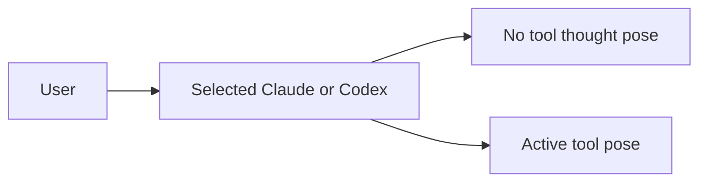
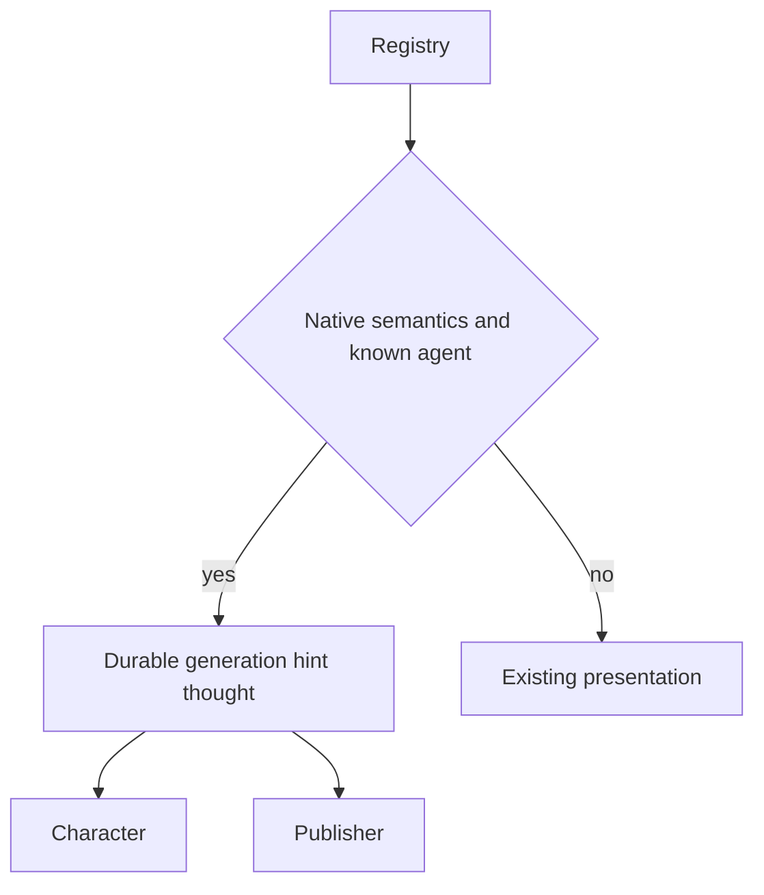
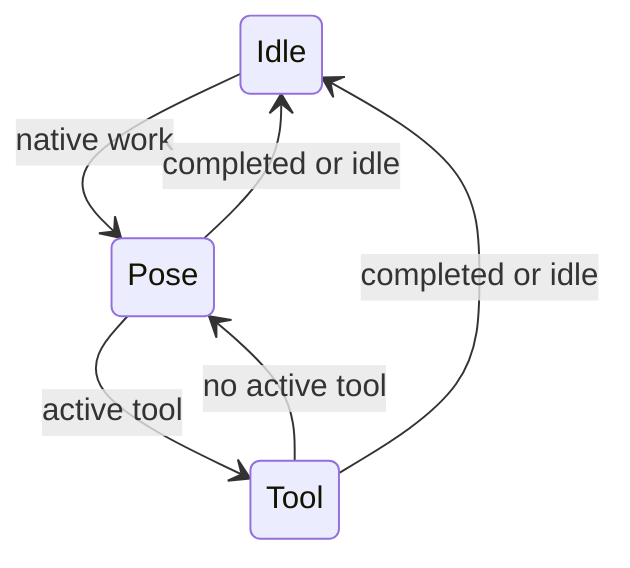

# Native generation thought pose

## 1. 의도

User approved the practical display policy with “적용해봐”: selected native
Claude/Codex work without an active tool uses the existing thought pose. This
does not assert actual reasoning. Lifecycle remains working. No transcript,
provider-launch, installer or hook-trust changes. Actual reasoning observation
in 0002 remains deferred, not implicitly completed by this policy.

## 2. 수용 기준

| ID | 결과 | 검증 방법 |
|---|---|---|
| AC-1 | Native no-tool work shows thought, lifecycle working | Real Tk/native and external mapping probe |
| AC-2 | Tools/children and approval/completion/idle keep priority | Existing focused tests and runtime probe |
| AC-3 | Reselection and error fallback preserve durable pose | Publisher and host regression; reconnect snapshot |
| AC-4 | No synthetic generation.thinking; unknown/bubble unchanged | Event capture and regression assertions |

## 3. 확정 사실

`overlay/main.py` consumes selected native semantic envelopes. The publisher
normalizes generation.started/tool.completed to generating, so changing only
the character would diverge from external renderers. Existing native semantic
envelopes identify observed tool categories without carrying tool contents.

## 4. 유스케이스

Unknown providers and bubble-owned work keep their existing presentation.

## 5. 파이프라인

## 6. 상태전이

| 상태 | 저장 | 이벤트 | UI |
|---|---|---|---|
| Pose | work hint only | existing generation.started/snapshot | thought |
| Tool | existing category | existing tool events | category mapping |
| Idle | generation false | existing snapshot/completion | existing idle/success |

## 9. 변경지점

| 경로 | 변경 |
|---|---|
| `overlay/main.py` | Selected native generation pose |
| `overlay/event_api.py` | Durable selected generation hint |
| `test/test_native_tool_semantics.py` | Host policy regressions |
| `test/test_overlay_event_api_v2.py` | Publisher and late-join socket regressions |
| `scripts/dev/session_tool_animation_probe.py` | Actual renderer scenarios |

## 10. 잠재 문제

Durable hint must reset on selection so bubble or unknown work does not inherit
the policy. Error transients must return to the durable generation pose.

## 11. 착수 순서

- [x] Implement scoped durable hint and host mapping (AC-1, AC-3, AC-4).
- [x] Exercise focused regressions and actual renderers (AC-1, AC-2, AC-3, AC-4).

Focused evidence: 35 tests passed in 4.57 seconds, including actual TCP late-join
snapshot thought hint. Actual Tk/native/external visual evidence is collected
separately before acceptance; unit results do not claim installed EXE deployment.

Final acceptance: 105 tests + 12 subtests passed. Isolated real Tk native host
and installed external Bolttagu observer passed 50 checks, including live
animation advancement, error recovery, selection, child tool priority and owned
bubble generating/thought behavior. Evidence: temporary directory
`engram-generation-pose-final-85582eefad0045e9be0d69551571442e/report.json` and
adjacent owned-window captures. Independent planner accepted P1–P6.

The first runtime failure was a fixture issue: calling `cancel_config_watch()`
also set `_closing` and stopped animation. The fixture now cancels only its
config-watch timer; production character lifecycle behavior was not changed.
No installed Engram EXE deployment, real provider invocation or live replace
layout validation is claimed. User mapping and live host/MCP processes stayed
unchanged.
