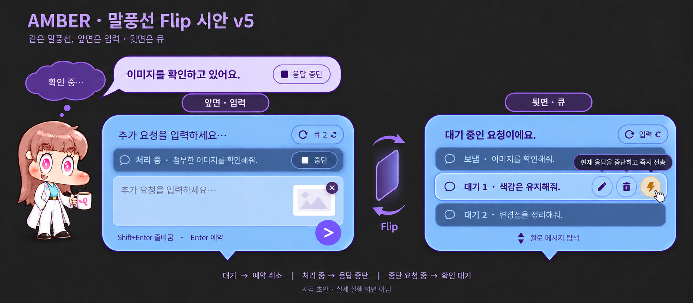
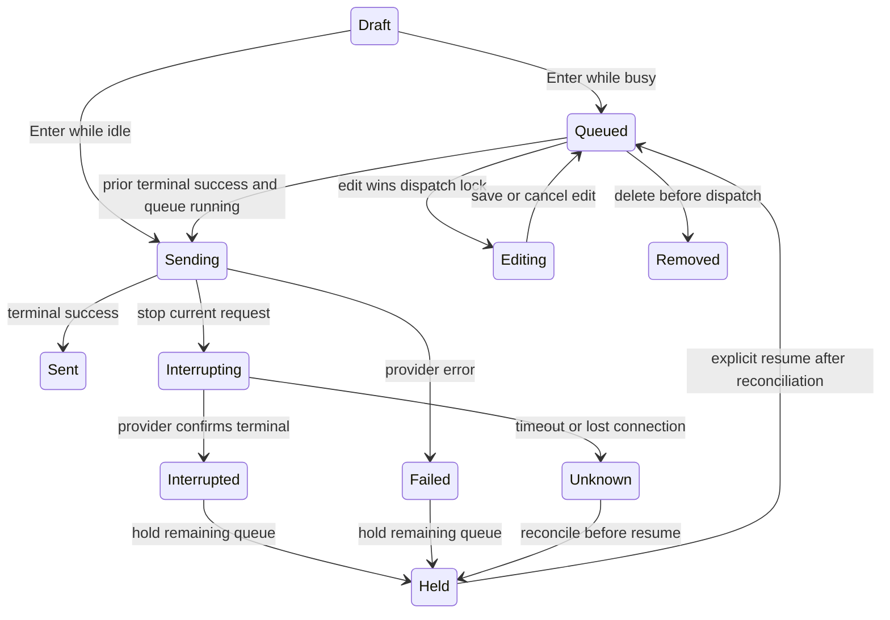
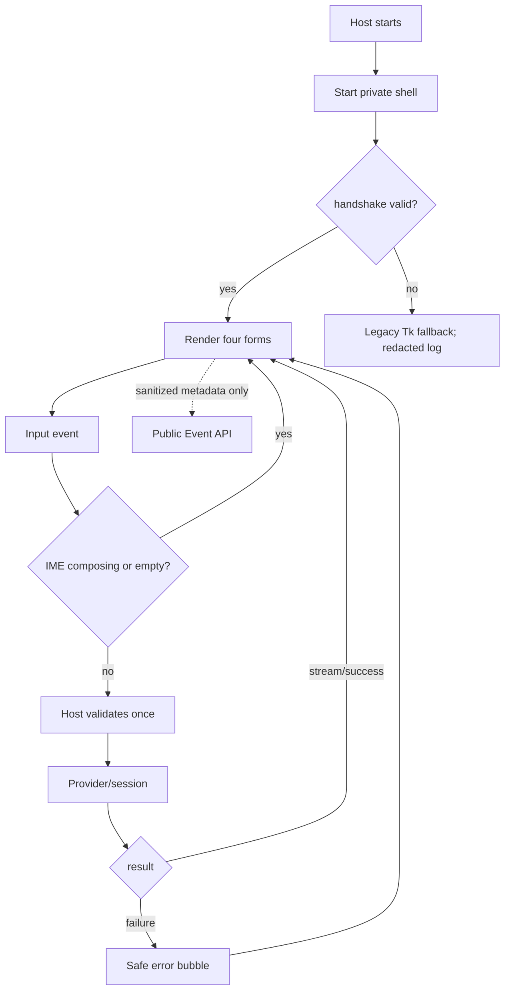
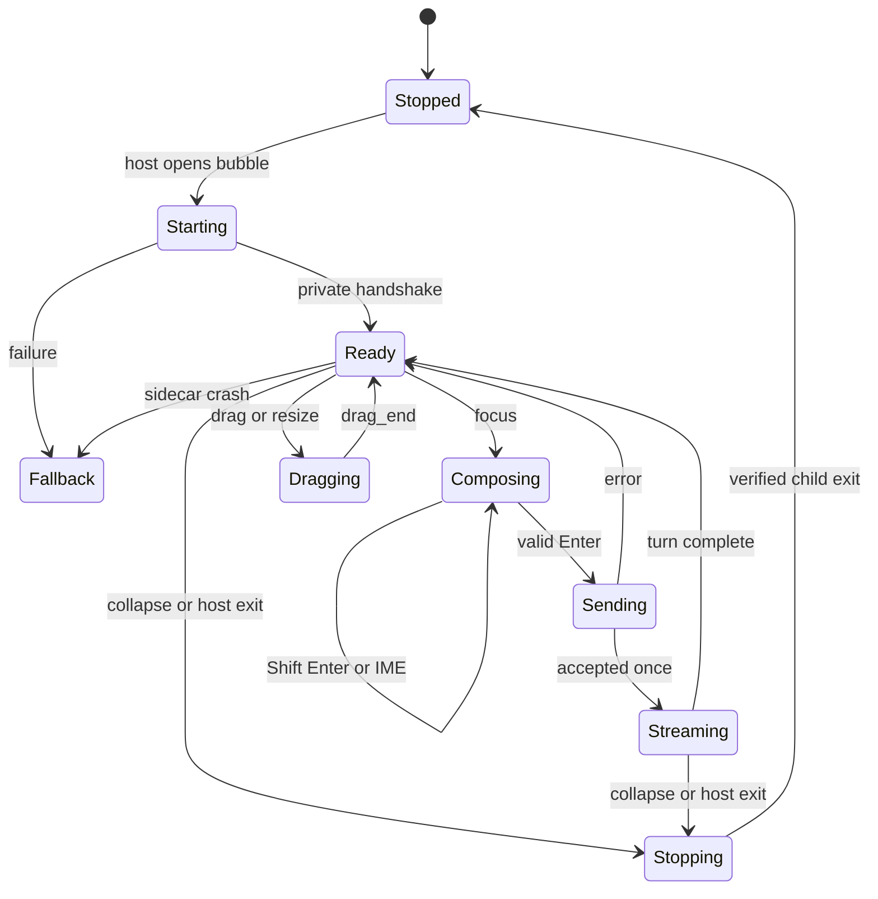
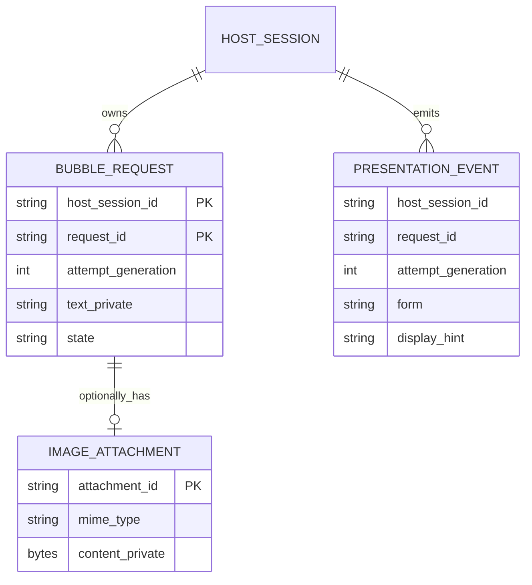
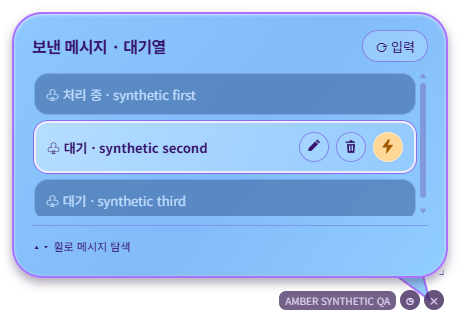
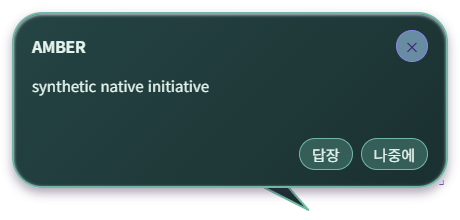

# Bubble renderer and rich input

> **설계 방향 승인 — 2026-09-11 사용자 ‘ㄱㄱ’.** 구현·격리 검증을 진행한다. 새 시안의 세부 시각 검수와 실제 source/frozen 검증은 별도이며, 릴리스 발행은 요청 범위가 아니다.

### 그래픽 기준 시안



### v5 확정 방향 — 큐 아이콘 액션

큐의 대기 항목은 텍스트 버튼 대신 **연필 / 휴지통 / 번개** 아이콘을 사용한다. hover와 키보드 focus 시 각각 ‘메시지 수정’, ‘예약 취소’, ‘현재 응답을 중단하고 즉시 전송’ 툴팁을 표시한다. 동일한 접근성 이름을 제공하며 강조색은 번개에만 적용한다. 처리 중에는 해당 액션을 비활성화하고 진행 상태를 표시해 중복 클릭을 막는다.

Claude/Codex 모두 번개는 **현재 요청의 terminal 중단/종료를 확인한 뒤 선택 항목 한 건을 우선 전송**한다. `/btw`나 steer로 대체하지 않는다. 나머지 큐는 보류하며 사용자가 재개한다. 실행 중인 요청이 없으면 선택 항목만 즉시 보낸다. 중단 확인 실패/상태 불명일 때는 새 요청을 보내지 않고 선택 항목을 보존한다. 선택/편집/삭제/dispatch와 우선 전송은 host에서 원자적으로 처리하고 동일 request_id를 중복 전송하지 않는다.

이 시안은 아이콘/툴팁의 시각 기준이며 실제 hover/Flip 실행 영상이 아니다. 기존 v4는 비교용으로 보존한다. 입력 크기는 짧은 초안에서 작게 시작해 여러 줄/첨부에 맞춰 늘리되 Flip 양면은 동일 크기를 유지한다. 런타임 구현과 검증은 별도다.

> 실제 실행 화면이 아닌 **Flip 수정 시안(v4)**이다. 왼쪽과 오른쪽은 동시에 열린 두 창이 아니라 **같은 위치·크기의 말풍선 앞면/뒷면을 비교한 그림**이다. 앞면은 입력과 작은 최근 제출 슬롯, 뒷면은 보낸/대기 큐다. 가운데 회전 도형은 전환 설명용이며 실제 애니메이션 검증 영상이 아니다. 색·윤곽·그라데이션은 기존 시안을 계승한다.

### v4 변경 기준 — 2026-09-11

- v3의 입력 위 상시 큐 스택 대신, 같은 풍선 몸통을 Flip 버튼으로 입력/큐 중 한 면만 표시한다. 작성 중인 text/image, 큐 선택과 스크롤 위치는 전환해도 보존한다. Flip 자체는 제출·취소·중단·세션 전환을 일으키지 않는다.
- 입력 상단의 음영 슬롯은 최근 제출 항목의 한 줄 요약·첨부 개수·실제 상태를 보여준다. 대기 항목에는 ‘예약 취소’, 실행 중인 항목에는 ‘응답 중단’, 중단 요청 중에는 비활성 ‘확인 중’을 표시한다. 완료 항목은 큐 보기로 연결한다. 활성 요청 중단과 아직 대기 중인 최근 제출 취소를 혼동하지 않게 request_id별로 처리한다.
- Flip 버튼에 대기 개수를 표시한다. 큐 뒷면은 기존 선택/이웃 카드 대비와 휠 탐색·대기 수정/취소를 유지한다. 숨겨진 면은 키보드/포인터 이벤트를 받지 않는다.
- 몸통만 짧게 회전하고 꼬리는 디스플레이 하단 중앙 방향을 유지한다. IME 조합 중에는 전환을 보류하고 완료 뒤 수행한다. 전환 연타는 하나로 합치고, 완료 후 해당 면으로 포커스를 복원한다. 모션 감소 설정에서는 회전 없이 전환한다.
- 본 절은 아래 v3의 ‘입력과 스택을 동시에 표시’ 배치 설명보다 우선한다. FIFO/예약/중단의 기존 안전 계약은 바꾸지 않는다. 이 변경은 시안/기획 갱신이며 런타임 구현은 아니다.

## 1. 의도 (Intent)

| 항목 | 내용 |
|---|---|
| 문제 | 현재 Tk `Entry` 입력과 text-only 전송 경로에는 멀티라인·이미지 전달이 없다. 렌더러를 바꾸되 캐릭터 주변 만화 말풍선은 유지해야 한다. |
| 왜 지금 | 실제 provider 이미지 payload와 실행 중 AMBER 버전 표시는 현재 버블 경로에 없으며, 기존 대화/세션을 깨지 않는 교체 경계가 필요하다. |
| 주 사용자 | Windows에서 캐릭터를 눌러 질문, 여러 줄 지시, 스크린샷을 보내고 같은 자리의 응답 말풍선을 읽는 Engram 사용자. |
| 불변식 | unified chat window로 바꾸지 않는다. host가 provider·세션 재개·승인·MCP·종료를 소유한다. 원문 text/image와 memory body는 public 외부 renderer event/log로 내보내지 않는다. collapse 뒤 MCP/터널과 `claude_session_id`는 유지한다. 테스트는 사용자 설정·대화 DB·이미지 파일을 변경하지 않는다. |
| 비목표 | public `metadata_only` Event API 변경, 임의 외부 명령, 1600×960 dashboard 재사용, 별도 installer external-component 실패 해결, release publish. |

## 2. 수용 기준 (Acceptance)

### 2026-09-11 시안 피드백 — 구현 전 확인할 시각 계약

- 입력·스택 구성 기준은 위의 수정 시안 `assets/bubble-native-renderer-draft-v3.png`다. 최초 시안과 v2는 색·윤곽·장식 비교용으로 보존한다. 이미지의 설명용 검정 배경·제목·범례는 앱 창으로 만들지 않는다. 실제 오버레이는 투명 배경의 독립 말풍선이다.
- **그래픽 보존**: 응답의 연보라색 면과 짙은 보라색 윤곽, 입력의 푸른 그라데이션과 연보라색 테두리/내측 하이라이트, 큰 라운드, 은은한 그림자, 진보라색 본문, 보라색 원형 전송 버튼과 흰 화살표, 흰 프레임 이미지 썸네일과 우상단 원형 삭제 버튼, 하단 구분선·키보드 안내, 짙은 보라색 구름형 생각 풍선과 점 두 개를 각각 구현 대상으로 삼는다. 사각 채팅 카드나 단색 기본 위젯으로 대체하지 않는다. 픽셀 색상 수치는 추정값을 확정 사실로 기록하지 않고 구현 시 원본과 비교해 정한다.
- **캐릭터**: 현재 매핑된 Trickcal 계열 이벤트 아트를 유지한다. 시안에 그려진 캐릭터를 이유로 실제 매핑을 기본 아트나 새 생성 이미지로 바꾸지 않는다.
- **꼬리**: 응답과 생각은 캐릭터 발화임을 나타낸다. 입력과 전송 후 내 메시지는 해당 풍선이 놓인 디스플레이의 전체 bounds 하단 중앙을 방향 목표로 삼는다. taskbar를 제외한 work area 하단이나 캐릭터 중심을 목표로 삼지 않는다. 짧은 꼬리의 방향만 목표를 향하며 시작 버튼까지 긴 선을 그리지 않는다. 시작 버튼의 정확한 픽셀 위치를 탐지하거나 작업표시줄 설정을 바꾸지는 않는다. 드래그·모니터 이동·DPI 변경 시 목표를 갱신한다.
- **echo의 의미**: 기존 코드의 `echo`는 전송한 사용자 메시지를 입력 자리에서 기본 8초간 보여주는 기능이다. 사용자 화면에 ECHO라는 명칭이나 독립 예시 패널을 추가하지 않는다. 보낸 내용을 고정 입력 풍선 바로 위의 세로 스택으로 연결하며 같은 푸른 계열과 첨부 썸네일을 유지한다. 새 입력과 보낸 메시지가 겹치지 않고 함께 읽히게 한다. 기존 `echo_fade`/`echo_dwell_ms` 내부 설정은 보낸 카드의 자동 표시 수명으로 호환 유지한다. 실제 사용자가 전송한 내용을 표시한다.
- **검수**: 동일한 기준 크기로 원본 시안과 실행 화면의 말풍선 영역을 나란히 비교한다. 구성 요소별 색·윤곽·여백·타이포·버튼·첨부·그림자의 일치 여부를 기록하고, 글자 넘침/클리핑과 100/150/200% DPI를 확인한다. 정적 웹 미리보기만으로 native Windows 구현 완료를 주장하지 않는다.

| ID | 수용 기준 | 검증 방법 |
|---|---|---|
| AC-1 | source와 frozen Windows 실행본에서 native shell은 기존 만화풍 **input·speech·echo·thought** 네 형태, tail, 캐릭터 기준 자동 배치와 독립 수동 위치를 보이며 unified chat window를 열지 않는다. | 각 runtime에서 캐릭터 클릭→입력→전송→응답/생각을 실제 화면으로 기록하고 실행 파일 경로·버전을 캡처한다. focused UI test는 보조 증거다. |
| AC-2 | Shift+Enter는 정확히 한 번 줄바꿈, Enter는 정확히 한 번 전송이며, 조합 중 IME Enter와 빈 입력은 전송하지 않는다. | source/frozen Windows에서 Korean IME, Shift+Enter, Enter를 실제 키보드로 수행해 provider 수신 횟수와 화면을 확인한다. key-event test는 중복 callback을 검증한다. |
| AC-3 | Ctrl+V 이미지 preview/remove를 제공하며 이미지 단독 또는 텍스트와 함께 실제 provider image payload가 전달된다. 텍스트-only `send(text)`도 유지한다. | source/frozen Windows에서 synthetic PNG/JPEG 붙여넣기→제거→재첨부→전송을 수행한다. 실제 configured provider가 이미지 내용에 대한 검증 가능한 응답을 반환해야 PASS다. test double의 payload 검사는 보조 증거이며 실제 실행은 현재 미검증이다. |
| AC-4 | speech/echo/thought의 theme·font·tail·hover hold·fade 및 drag/resize가 현재 설정 의미를 보존한다. speech 기본 20초, echo 8초, thought turn-end fade 정책도 유지한다. | source/frozen Windows에서 hover/non-hover·drag·resize를 확인하고 geometry/fade contract test를 수행한다. |
| AC-5 | History는 별도 panel 및 `/stm/messages` 조회를 유지한다. shell close/collapse은 history나 재개 session을 삭제하지 않고 sidecar crash/host exit 뒤 orphan을 남기지 않는다. | source/frozen Windows history·collapse·crash/exit 후 verified PID CommandLine을 확인하고 test 전후 config/DB hash를 비교한다. |
| AC-6 | 설정/앱 정보의 AMBER 버전 표시와 말풍선의 단독 질문 `버전 뭐야`, `AMBER 버전`, `engram 버전` 응답은 실행 중 host의 canonical resolver/snapshot과 같다. 단독 버전 조회는 host가 처리하며 Claude/이전 프로젝트 버전으로 답하지 않는다. 특정 모델·프로젝트 버전 질문은 가로채지 않는다. | source/frozen에서 실제 표시와 세 조회 응답을 `resolve_version()`에 대조한다. 이전 프로젝트 버전이 대화에 있는 경우, provider 연결 불가, snapshot 누락에서도 추측 버전을 내지 않는지 확인한다. |
| AC-7 | full content는 private IPC에만 존재하고 public external renderer Event API에는 계속 metadata_only만 전달되며 raw text/image를 log하지 않는다. | private IPC schema test와 public event capture, synthetic-image event/log redaction scan을 source/frozen에서 분리 실행한다. |
| AC-8 | native shell은 frozen package/installer에 포함되고 source/frozen Windows에서 launch·host 연결·종료를 실증한다. publish는 하지 않는다. | build-overlay/build-installer package smoke와 새 Windows install live run을 수행한다. external component failure는 별도 비목표다. |
| AC-9 | 위 시각 계약의 면·윤곽·그라데이션·하이라이트·그림자·구름/점·버튼·첨부 구성을 보존하며 현재 Trickcal 이벤트 매핑을 바꾸지 않는다. | source/frozen Windows 실제 화면을 원본 시안과 구성 요소별 비교하고 100/150/200% DPI 캡처 및 이벤트별 사용 아트 경로를 확인한다. 사용자 시각 확인 전에는 분위기 유사만으로 PASS 판정하지 않는다. |
| AC-10 | input 및 보낸 메시지 꼬리는 현재 디스플레이 전체 bounds 하단 중앙 방향을 가리킨다. speech/thought는 캐릭터 방향을 유지한다. | source/frozen Windows에서 좌/우/상/하 배치와 모니터 이동·DPI 변경을 실제 수행하고 꼬리 방향 캡처를 남긴다. 음수 모니터 좌표·경계·목표와 중심 일치 예외를 geometry test로 보조 검증한다. |
| AC-11 | echo는 별도 이름/패널이 아닌 입력의 보낸 메시지 상태이며 실제 사용자 text/image를 표시하고 새 입력과 겹치지 않는다. 기존 fade 설정과 history는 보존한다. | source/frozen Windows에서 전송→보낸 상태→기본 8초 페이드, fade OFF, hover, 새 입력 열기, 이미지 단독 전송을 확인한다. 사용자 입력이 응답 영역으로 이동하거나 attachment가 조기 해제되지 않는지 확인한다. |

AC-1/AC-4의 four forms는 내부 호환을 위한 input/speech/echo/thought 구분이다. 사용자 경험은 입력(편집/보냄), 응답, 생각의 세 종류이며 입력/echo tail의 ‘기존 의미 보존’보다 AC-10의 새 목표 규칙이 우선한다.

추가 피드백의 수용 기준(§3의 입력 흐름 기획 참조): AC-11의 ‘새 입력과 겹치지 않음’은 보낸 메시지를 삭제/숨기는 대신 별도 세로 카드로 배치해 충족한다.

| ID | 수용 기준 | 검증 방법 |
|---|---|---|
| AC-12 | 고정 입력 풍선과 보낸/대기 카드 스택이 자연스럽게 연결되고 선택 카드는 불투명하며 휠 탐색이 실제 세션이나 초안/IME를 변경하지 않는다. | source/frozen Windows에서 스택 선택·휠·입력 스크롤·IME·DPI·모니터 이동을 실행하고 시안 대비 사용자 시각 검수를 받는다. v2에 없는 스택 UI는 수정 시안으로 확인받는다. |
| AC-13 | 응답 중 제출은 host-owned FIFO에 예약되고 이전 terminal success 뒤 한 건만 dispatch한다. 대기 편집/삭제와 dispatch가 경합해도 중복·유실·추월이 없다. | source/frozen 실제 provider에서 긴 첫 요청 중 텍스트/이미지 3건을 예약하고 수정/삭제·승인 대기·오류·collapse/복원·다른 세션 전환을 실행한다. request_id별 provider 수신 순서와 횟수, 한도 거부 시 초안 보존을 확인한다. fake-provider race tests는 보조 증거다. |
| AC-14 | 중단은 현재 턴에만 적용하고 provider 확인 뒤 중단됨으로 표시한다. 대기열은 보류하며 명시 재개 전 실행하지 않는다. 세션/MCP/터널은 유지하고 같은 세션에서 후속 입력이 성공한다. | source/frozen 실제 provider에서 streaming/승인 대기 중 interrupt와 완료 경합·타임아웃을 검증한다. late event 격리, 확인 없는 중단 성공 금지, 기존 session ID 유지와 후속 요청 성공을 확인한다. 외부 도구 변경 rollback은 보장하지 않는다. |

### v5 구현 게이트 보강

| ID | 수용 기준 | 검증 방법 |
|---|---|---|
| AC-15 | v5의 동일 위치/크기 Flip 양면, IME 안전 전환, 초안/첨부/선택 보존, 아이콘 hover/focus 툴팁, 최근 제출 슬롯이 실제 native shell에서 동작한다. | source/frozen Windows에서 앞뒤 전환과 연타·조합 중 전환·키보드 포커스·첨부 제거를 직접 실행하고 화면/이벤트를 기록한다. 숨은 면의 입력/이중 submit이 없는지 검사한다. |
| AC-16 | 번개는 선택된 대기 요청을 원자적으로 예약하고 현재 요청의 terminal 확인 뒤 한 번만 우선 전송한다. 다른 대기는 보류하며 idle에서도 선택 항목만 전송한다. | source/frozen 실제 provider에서 완료와 클릭 경합, 중단 실패/timeout, 선택 항목 삭제·편집 경합, 중복 클릭을 확인한다. 현재 요청을 잘못 중단하거나 다른 항목이 끼어들지 않는지 request correlation으로 확인한다. |

## 3. 확정 사실 (Findings)

### 입력 흐름 추가 조사 — 2026-09-11

| 확인 위치 | 소스에서 확인한 사실 | 한계/설계 반영 |
|---|---|---|
| `overlay/bubble/bubble_manager.py`의 `show_echo()` 및 `overlay/main.py`의 `_on_bubble_submit()` | 기존 echo는 사용자 제출 내용을 입력 자리에서 기본 8초 유지하는 독립 풍선이다. | 기능 제거가 아니라 입력과 연결되는 보낸 메시지 카드로 재구성한다. |
| `overlay/bubble/session.py`의 `send()`/`_prompt_generator()` | asyncio.Queue에 넣고 prompt generator가 꺼내 provider로 yield한다. generator에 현재 응답 종료를 기다리는 명시적 gate는 없다. | 내부 운송 큐의 존재를 사용자가 제어하는 순차 예약 기능으로 간주하지 않는다. provider가 동시 입력을 어떻게 처리하는지는 실제 실행 미검증이다. |
| `overlay/bubble/input_bar.py`의 `_on_enter()` 및 `overlay/main.py`의 `_on_bubble_submit()` | 입력을 닫고 send로 전달하며 예약 목록/편집/취소·현재 턴 interrupt 액션이 연결되어 있지 않다. | host에 명시적 대기열과 current-turn 중단 경계를 추가한다. |
| `overlay/bubble/session.py`의 `stop()` | consume task를 cancel하고 상주 thread/queue/STM bridge를 종료한다. | 현재 턴만 중단하는 기능과 다르다. interrupt 구현으로 재사용하지 않는다. |
| `overlay/session_stack.py`의 `_wheel()`/`browse()` 및 alpha 설정 | 휠로 항목을 순회하고 선택/이웃 카드의 선명도를 구분한다. | 시각·탐색 패턴만 차용한다. 실제 세션 선택 registry와 사용자 메시지 큐는 분리한다. |

### 추가 기획: 입력 + 보낸 메시지 + 전송 대기 스택

이 절은 앞선 ‘새 입력을 열면 echo를 숨김’ 결정을 대체하며 2026-09-11 진행 승인을 받았다. echo의 기능은 보존하되 사용자 명칭은 ‘보낸 메시지’로 한다. 위 v3 이미지는 스택·예약·중단 UI를 표현하며 세부 시각 검수는 남아 있다.

- 입력 풍선은 고정된 편집 영역으로 유지한다. 그 위에 같은 푸른 계열의 보낸 메시지/전송 대기 카드를 세로로 쌓아 읽히게 한다. 하나의 사각 채팅창으로 합치지 않는다. 응답은 보라색 캐릭터 풍선으로 계속 분리한다.
- 선택 카드는 불투명하고 읽기 쉽게, 위아래 이웃은 흐린 요약으로 보인다. 이웃의 글자가 선택 카드 뒤로 비치지 않는다. 각 카드에 ‘대기 1’, ‘전송 중’, ‘보냄’, ‘중단됨’, ‘실패’를 명시해 내 메시지를 모델 답변으로 오인하지 않게 한다.
- 카드 영역의 휠은 메시지만 탐색한다. 입력 영역의 휠은 멀티라인 스크롤이며 포커스/IME/작성 초안을 잃지 않는다. 실제 세션 전환이나 메시지 재전송을 일으키지 않는다. 입력·내 메시지의 짧은 꼬리는 디스플레이 하단 중앙 방향을 유지한다.
- idle의 Enter/전송은 즉시 보낸다. 응답 중 Enter는 **현재 응답 뒤 보내기**로 대기열에 추가하고 버튼에도 ‘예약’이라고 표시한다. Shift+Enter는 항상 줄바꿈이다. 시각 지정 예약은 이번 범위가 아니다. 대기는 FIFO이고 host는 현재 턴의 terminal result를 확인한 뒤 다음 한 건만 전송한다.
- 예약 카드에서 전송 전 편집·삭제가 가능하다. 편집을 시작하면 해당 항목을 dispatch에서 제외하고, 저장/취소까지 뒤 항목도 추월하지 않는다. dispatch와 편집/삭제는 host에서 원자적으로 판정한다. 이미 전송됐다면 삭제 성공으로 위장하지 않고 ‘전송 중’을 알려준다. 연속 클릭/Enter는 request_id로 중복 전송을 방지한다.
- ‘응답 중단’은 예약/전송 버튼과 별도로 둔다. 현재 요청 ID에만 provider interrupt를 보내고 ‘중단 요청 중’→provider 종료 확인→‘중단됨’으로 표시한다. 버튼 클릭만으로 완료 처리하지 않는다. 세션, MCP, 터널, 대화 기록은 유지한다. 도구가 이미 실행한 외부 변경을 되돌리는 기능이 아님을 알린다.
- 중단·provider 오류·승인 대기 중에는 다음 예약을 자동 실행하지 않는다. 중단/오류 후에는 대기열을 보류하고 사용자가 ‘대기열 재개’를 눌러야 한다. 승인 허용 후 현재 턴이 정상 종료하면 기존 FIFO를 이어간다. 늦게 도착한 이전 턴 이벤트는 다음 턴 상태를 덮어쓰지 않는다.
- 초안 제한은 세션별 대기 최대 5건, 대기 이미지 원본 합계 40 MiB(개별 턴의 기존 한도도 적용)다. 한도 도달 시 초안은 유지하고 추가 예약을 거절한다. 편집 중 사본도 총량에 포함한다. 보낸 카드 캐시는 최근 10건/thumbnail 합계 10 MiB 이내로 제한하고 전체 기록은 기존 History를 사용한다.
- 대기열은 host 세션 ID와 request_id에 귀속되며 다른 세션으로 넘어가지 않는다. sidecar만 재시작하면 host snapshot으로 복원한다. collapse 시 큐를 보류하고 다시 열어 명시적으로 재개한다. host 종료 시 미전송 항목 수를 확인받으며 자동 재전송/영구 큐 저장은 하지 않는다. 카드 표시용 thumbnail과 전송용 원본은 소유권을 분리한다.
- 기존 echo fade 설정은 ‘보낸 메시지’의 자동 표시 수명에 적용한다. 대기/편집/전송/중단 요청 중 카드는 자동 fade로 숨기지 않는다. 보낸 카드가 자동으로 접혀도 제한된 최근 스택에서 다시 선택할 수 있고 History는 삭제하지 않는다.



provider interrupt 지원, terminal acknowledgement, 승인 대기와의 경합은 미검증이다. SDK/transport 조사와 실제 실행 검증을 구현 전제로 한다. 미지원이면 세션 강제 종료로 대체하지 않고 설계 변경 승인을 받는다.

설치된 SDK의 `query.py`는 query 경로에 interrupt가 없다고 명시하고, `client.py`의 `ClaudeSDKClient.interrupt()`는 streaming control request를 제공한다(2026-09-11 로컬 소스 확인). 현재 `BubbleSessionManager`는 전자를 사용한다. 따라서 SDK에 메서드가 존재한다는 사실만으로 현재 bubble에서 interrupt가 된다고 판단하지 않는다. client 전환 시 기존 custom transport·승인 broker·resume·event correlation 회귀 검증이 필요하다.

상관관계 키는 `(host_session_id, request_id, attempt_generation)`이다. private presentation, provider result, 승인 요청과 interrupt 응답까지 동일 키를 검증한다. 현재 mutable turn_seq만으로 새 카드에 결과를 귀속하지 않는다. dispatch 성공 gate는 현재 요청에 대응하는 `ResultMessage(subtype=success)`이며 일반 `turn_end` 표시 이벤트가 아니다. 실제 provider에서 안전한 대응 관계를 확립하지 못하면 다음 요청을 보내지 않는다. 대기 최대 5건은 실행 중인 한 건을 제외한다. host 자체가 확인 후 종료되면 미전송 큐는 소멸하며 재시작으로 복구되지 않는다.

설계 전에 **실제로 확인한 것만** 적는다. 추측은 §10 으로 보낸다.

| 항목 | 확인된 사실 | 설계 반영 |
|---|---|---|
| 입력 | `overlay/bubble/input_bar.py`는 `tk.Entry`와 `<Return>`의 `get().strip()` callback을 사용한다. | Tk input shell만 sidecar로 바꾸고 host submit 경계는 request-id로 명시한다. |
| 현재 bubble UX | `InputBar`, `BubbleWindow`, `BubbleManager`, `shapes.py`, `geometry.py`가 tail·position·resize/move·hover/fade를 담당한다. Wiki는 speech 위, input 아래, echo 입력 자리, thought 머리 위를 정의한다. | dedicated CSS/canvas shell이 네 form과 anchor/manual position을 재현한다. |
| history | `overlay/bubble/history_panel.py`가 독립 `Toplevel`과 `GET /stm/messages`를 사용한다. | history provider/API는 sidecar로 옮기지 않는다. |
| provider | `BubbleSessionManager.send(text)`와 `ClaudeCodeOptions` 경로는 text-only이며 installed `claude-code-sdk`는 0.0.25이다. current Claude docs는 content list의 text/image base64 form을 문서화한다. | image adapter는 SDK source/type와 synthetic provider test로 schema를 확정한 후 추가한다. |
| privacy/public renderer | `overlay/event_api.py` welcome은 `content_policy: metadata_only`를 선언한다. | sidecar는 public API에 register하지 않는 host-owned private IPC이며 raw content를 public payload/log에 넣지 않는다. |
| lifecycle | collapse는 popup만 닫고 host/MCP/tunnel 및 `claude_session_id`를 보존한다. outside click은 permanent topmost 없이 clicked app 아래 restack한다. | sidecar PID만 idempotent cleanup하고 host foreground policy를 따른다. |
| version | `core/install/versioning.py`는 source `VERSION`+git/CI와 frozen `engram-version.json` snapshot을 canonical version으로 해결한다. | shell은 version을 계산하지 않고 host deterministic query만 표시한다. |
| Tauri | `gui/src-tauri/tauri.conf.json`은 1600×960 decorated dashboard이며 Rust/Cargo가 존재한다. | dashboard 대신 dedicated internal bubble shell/bundle을 만든다. |

## 4. 유스케이스 / 시나리오

```mermaid
flowchart LR
  U[User] --> I[Character click input bubble]
  I --> N[Native bubble shell]
  N -->|private text/image IPC| H[Engram host]
  H --> P[Provider and resumed session]
  P --> H
  H -->|private presentation| N
  U --> R[Separate History panel]
  R --> S[/stm/messages]
  H -.metadata only.-> E[Public external renderer]
```

**주 시나리오**: 사용자가 input bubble에 multiline text 또는 image를 붙여 Enter로 한번 전송한다. shell은 입력 위치에 읽기 전용 보낸 메시지 상태(내부 echo)를 보이고 host가 기존 session에서 provider를 호출한다. thought/speech streaming은 캐릭터 주변 form으로 갱신되며 history는 별도 panel로 읽는다.

꼬리 목표의 모니터는 캐릭터 위치가 아닌 배치 완료된 입력/보낸 풍선의 몸통 사각형으로 선택한다. 몸통과 교차 면적이 가장 큰 모니터를 선택하고 동률이면 몸통 중심에 가장 가까운 모니터를 선택한다. 교차가 없으면 가장 가까운 모니터로 clamp한 뒤 재계산한다. Win32 `rcMonitor` 전체 영역의 하단 중앙을 사용하고 물리 좌표/DIP를 같은 좌표계로 변환한다.

**예외 시나리오**: IME Enter/텍스트와 이미지가 모두 빈 입력은 submit하지 않는다. provider/image validation failure는 자동 재전송하지 않고 safe error와 재시도 가능한 draft를 보인다. sidecar crash 시 host/session/MCP는 유지하며 명시적 오류를 표시한다. legacy Tk fallback이 필요하면 복구 모드로 표시하고 이미지·멀티라인 지원이 성공한 것으로 판정하지 않는다. host collapse/exit는 소유 sidecar와 기존 popup provider의 종료를 검증하고 handle을 비운다.

## 5. 파이프라인 (flowchart)



## 6. 액션 · 상태 전이 (action diagram)



| 상태 | 저장/이벤트 | UI 반응 |
|---|---|---|
| Starting | in-memory PID, nonce, protocol/version only | hidden until handshake; failure uses legacy fallback |
| Ready/Composing | draft/image preview remains shell-memory; public event is sanitized | four form layout; hover holds dismiss; IME never submits |
| Sending/Streaming | host owns one request id, session/provider; private IPC carries raw content | sent-input state at submitted position, thought/speech update; duplicate id ignored |
| Dragging | in-memory/manual geometry follows current settings semantics | tail/anchor and resize grip remain available |
| Fallback | reason code only, no text/image diagnostic | legacy Tk remains usable; host/session/MCP stay live |
| Stopping | terminate/wait only verified child PID, clear handle; no DB/history/session deletion | shell disappears with no orphan; resume session survives |

## 7. 타이밍 (sequence)

```mermaid
sequenceDiagram
  participant U as User
  participant S as Native shell
  participant H as Host
  participant P as Provider
  U->>S: Enter or Ctrl+V
  S->>S: IME and request-id guard
  S->>H: private submit(text, image?)
  H->>H: validate once/enqueue session-bound request
  H->>H: dispatch only when prior correlated result succeeds
  H->>P: resumed session request
  P-->>H: streaming thought/speech or error
  H-->>S: private presentation update
  U->>S: stop current response
  S->>H: interrupt current request id
  H->>P: provider interrupt
  P-->>H: correlated terminal acknowledgement
  H-->>S: interrupted; remaining queue held
  H->>H: sanitized public metadata only
  U->>H: collapse or exit
  H->>S: shutdown
  S-->>H: exited
  Note over H,S: handshake/shutdown timeout needs Windows measurement before implementation
```

## 8. 데이터 (ER)

보낸 메시지의 첨부 preview는 provider 전송 버퍼와 별도의 제한된 thumbnail 참조를 소유한다. provider terminal acknowledgement는 전송용 원본을 해제하되 표시 중 thumbnail을 깨뜨리지 않는다. 보낸 표시의 dismiss/교체/collapse 때 thumbnail/object URL을 해제한다. fade OFF에서도 마지막 표시 한 건만 유지하며 새 입력/전송 시 이전 참조를 해제한다.

No persistent schema migration is planned. Boundary data is ephemeral in host/sidecar memory. Attachments are bounded to 4 PNG/JPEG images, 5 MiB each and 20 MiB per turn after validation, with decoded pixel limits. These are initial product limits, not claims about provider limits; actual provider validation remains required. Remove/cancel/terminal acknowledgement releases owned buffers and object URLs. If staging files become necessary, use only session-owned temporary paths and remove them on cancel/terminal acknowledgement/crash recovery; never delete clipboard source files. Pending provider turns retain only their owned data until terminal acknowledgement or confirmed cancellation. Never attach images to public metadata events or raw logs.



## 9. 변경 지점

| 파일 | 변경 |
|---|---|
| `overlay/bubble/input_bar.py` | legacy fallback renderer contract을 유지하고 native-shell selection/fallback entry point로 정리한다. |
| `overlay/bubble/session.py` | request-id, rich input adapter, provider image schema validation과 one-submit boundary를 추가한다. |
| `overlay/bubble/bubble_manager.py` | four-form state와 existing position/fade semantics를 private shell event로 매핑한다. |
| `overlay/bubble/history_panel.py` | 독립 history panel 및 `/stm/messages` contract을 유지한다. |
| `overlay/main.py` | host-owned sidecar lifecycle, collapse/exit cleanup, foreground/restack, fallback을 연결한다. |
| `overlay/settings_window.py` | 실제 host AMBER 버전을 설정/앱 정보에 표시한다. |
| `overlay/event_api.py` | metadata_only contract regression test를 고정하며 raw schema를 추가하지 않는다. |
| `core/install/versioning.py` | canonical resolver를 host version query 유일 source로 사용한다. |
| `installer/build-overlay.ps1` | native shell bundle 포함과 frozen package smoke를 추가한다. |
| `installer/build-installer.ps1` | bundled shell install verification을 추가하되 publish는 하지 않는다. |
| `overlay/bubble/native_shell.py` (신규) | private IPC, nonce/handshake, child spawn/verified-PID shutdown, redacted diagnostics. |
| `overlay/bubble/rich_input.py` (신규) | multiline, IME, clipboard preview/remove, bounded attachment validation model. |
| `overlay/bubble/turn_queue.py` | host-owned FIFO 기반 모델 구현. session/provider 연결은 아직 하지 않았다. |
| `test/test_turn_queue.py` | dispatch/편집/삭제 경합, terminal correlation, late event, interrupt 확인, 보류/재개와 용량 제한 모델 테스트. |
| `native-bubble-shell/` (신규) | Tauri2/WebView2 bubble-only frontend/Rust host; dashboard와 독립 bundle. |
| `test/test_native_bubble_shell.py` (신규) | lifecycle, redaction, request-id, version query contract test. |
| `test/test_rich_input.py` (신규) | Enter/Shift+Enter/IME와 synthetic provider-image adapter test. |

## 10. 잠재 문제 & 대응

| 문제 | 대응 |
|---|---|
| installed `claude-code-sdk` 0.0.25의 image schema/CLI execution은 미확인이다. | installed SDK type/source와 real synthetic-image provider test로 확정한다. 불일치 시 text fallback으로 위장하지 않고 attachment unsupported를 표시한다. |
| Tauri2 WebView2 transparency, shaped hit-test, drag/resize, click-through가 Windows target에서 가능한지 미확인이다. | dedicated source-Windows spike로 실측한다. 불가하면 renderer 기술 선택을 재승인 받고 legacy Tk fallback을 유지한다. |
| WebView2/sidecar bundle 누락 또는 security software가 launch를 막을 수 있다. | handshake timeout 뒤 fallback, verified PID cleanup, frozen installer smoke와 clean install live run을 gate로 둔다. |
| Korean IME WebView event 순서가 다를 수 있다. | `compositionstart/end`+keydown guard를 Korean IME로 검증하고 fixture로 고정한다. |
| full-content IPC/log instrumentation이 privacy를 우회할 수 있다. | localhost authenticated pipe/nonce, redacted diagnostics, schema allowlist, synthetic event/log scan을 AC-7 gate로 둔다. |
| sidecar crash/collapse race가 orphan/session loss를 만들 수 있다. | single owner PID/idempotent stop/bounded wait; host/MCP/tunnel/`claude_session_id`는 stop target에서 제외한다. |

## 11. 착수 순서

각 항목에 담당 AC 를 적는다. `check` 가 고아 AC 를 잡아낸다.

- [ ] 1. existing four-form/fade/history/collapse contract을 focused tests와 source Windows baseline capture로 잠근다. (AC-1, AC-4, AC-5)
- [ ] 2. private IPC schema, handshake, lifecycle/fallback/redaction, host version query를 host-only slice로 구현한다. (AC-5, AC-6, AC-7)
- [ ] 3. dedicated bubble-only Tauri2 shell spike로 transparent shape, hit-test, drag/resize, foreground/restack를 source Windows에서 검증한다. (AC-1, AC-4)
- [ ] 4. four forms/theme/font/tail/hover/fade와 presentation bridge를 연결하고 source Windows live runtime을 확인한다. (AC-1, AC-4, AC-7)
- [ ] 5. multiline IME/Enter request-id guard와 preview/remove UI를 구현하고 source/frozen Windows keyboard tests를 수행한다. (AC-2, AC-3)
- [ ] 6. SDK image schema 조사 후 synthetic image provider test와 real payload delivery를 구현한다. (AC-3, AC-7)
- [ ] 7. history/collapse/crash cleanup과 no-user-data-mutation harness를 통합하고 source/frozen PID/runtime evidence를 취득한다. (AC-5)
- [ ] 8. frozen build/installer에 shell을 package하고 clean Windows installation live run을 확인하되 publish는 하지 않는다. (AC-8)
- [ ] 10. 시각 계약을 native shell에 구현하고 원본 시안 대비 구성 요소별 사용자 시각 검수를 수행한다. 입력/보낸 상태의 디스플레이 하단 중앙 꼬리와 첨부 표시 수명도 source/frozen에서 검증한다. 실제 착수는 3~5번 UI 슬라이스와 함께 진행한다. (AC-9, AC-10, AC-11)
- [ ] 11. 입력/보낸/대기 스택 수정 시안을 승인받고 provider interrupt 지원을 조사한다. host FIFO·편집/삭제·용량 제한·중단 확인·보류/재개와 shell UI를 수직 슬라이스로 구현하며 source/frozen 실제 provider 시나리오를 검증한다. (AC-12, AC-13, AC-14)
- [ ] 12. 모든 구현 슬라이스 뒤 independent audit에서 전체 source+frozen live evidence와 privacy logs를 재검증한다. (AC-1, AC-2, AC-3, AC-4, AC-5, AC-6, AC-7, AC-8, AC-9, AC-10, AC-11, AC-12, AC-13, AC-14)
- [ ] 13. v5 Flip/아이콘/preview와 명시적 선택 우선전송을 native UI/host/provider에 연결하고 마지막 독립 검토에 포함한다. (AC-15, AC-16)

## 12. 추적성

### 2026-09-11 후속 구현 — geometry, fade, initiative

실제 Windows source native 창의 **합성 QA 화면**이다. 모델 응답·사용자 데이터·캐릭터 아트 검증 화면이 아니다.





- native geometry에 `passive/dpi/user_drag/user_resize` 출처를 추가했다. Win32 이동/크기 조절 modal loop 반환 뒤 실제로 변한 성분만 수동 값으로 저장하고, 관측 rect와 수동 선호값을 분리했다. 크기는 논리 크기로 보존하며 음수 모니터 좌표를 0으로 강제하지 않는다. 기본 입력 높이와 수동 높이도 분리했다.
- speech/thought fade는 취소 가능한 dwell/final 타이머와 presentation revision을 쓴다. hover는 남은 시간을 보존하고, 이전 fade/dismiss가 새 응답·버전 답변·승인을 닫지 못한다. 최근 슬롯은 v5의 최신 제출 항목을 유지하며 완료 후 기본 8초/설정 OFF를 지원한다. 접힌 뒤에도 큐 카드는 남는다.
- 실제 캡처에서 큐 제목/카드 겹침을 발견해 자동 입력 높이·고정 header/footer·큐 overflow 처리를 보완했다. 소스 선택은 오래된 debug를 무조건 우선하지 않고 가장 최근에 빌드된 native 실행 파일을 선택한다.
- 자율 발화는 native speech만 먼저 표시하고 input은 숨긴다. 답장을 누르면 발화 버튼/풍선을 숨기고 composer를 연다. 불변 reply token을 사용해 실제 큐 수용 후에만 참여를 기록한다. 문맥은 private `Payload.context`에 유지하고 실제 provider dispatch에만 합성하며 카드/편집 초안은 사용자 입력을 유지한다. 거절·버전 조회는 token을 소모하지 않는다. 닫힘/ignored/late reply/collapse defer를 구분한다.
- 지원 검증: Python host/nudge/private shell **33 PASS**(실제 자식 stdio reply/defer 및 최신 source binary 선택 포함), JS 결정적 타이머 **6 PASS**(동일 revision의 승인 종료 후 fade 재개 포함), py_compile/node syntax/spec check PASS. 독립 검토에서 발견한 누락된 Python action whitelist와 답장 후 남는 stale nudge affordance를 수정했다. 기존 Event API 87건의 baseline 3 failures/2 errors는 그대로이며 새 legacy fixture 오류는 명시적 fallback 설정으로 해소했다.
- source Windows 실제 native 합성 smoke: **3 windows, dispatch 2, held true, nudge_reply action, owned child reaped**. 최근 슬롯 만료, 이전 fade→새 응답, native nudge→composer를 실제 WebView에서 실행했다. OS 키보드/마우스 및 모델 응답 증거로 승격하지 않는다. 캡처는 `.tmp/bubble-qa-v4/`의 합성 표면만 포함한다.
- 실제 모니터 3대에 owned native child를 이동: primary `(1000,1000)`, 음수 X `(-2200,1100)`, 음수 Y portrait `(4000,-800)`에서 좌표 일치, passive origin, finite tail points, 종료 0을 확인했다. 세 모니터의 관측 scale은 모두 1.0이며 150/200%는 미검증이다.
- 후속 frozen 후보 `.tmp/native-bubble-frozen-v2` 빌드와 source/frozen runtime/role smoke PASS. 해당 exe의 `--role bubble-smoke --exercise --capture-dir ...` 종료 0 및 실제 PNG 6개 생성을 확인하고 큐 화면을 육안 검수했다. `core.install.overlay_manifest` 검증은 `valid: true`이며 현재 소스·환경·모델 manifest와 일치한다. 기존 설치본 및 릴리스는 교체/발행하지 않았다.
- **남은 구현/검증**: native foreground/restack 경로는 기존 main foreground fan-out과 아직 연결되지 않았다. 기존 설정 theme/font 전달과 전체 lifecycle/fallback rich draft, 실제 provider 이미지·interrupt·승인, 한국어 IME/clipboard, 150/200% DPI, clean installer 및 사용자 시각 승인은 계속 미완료다. 전체 AC 완료나 배포 완료로 판정하지 않는다.

### 2026-09-11 native host 연결 구현 및 검증 현황

- `native-bubble-shell/`: 독립 input/speech/thought WebView 창, input 안의 Flip 양면, 아이콘·hover/focus 툴팁, 입력 ACK 뒤 초안 해제, IME 전환 보류, PNG/JPEG 붙여넣기/제거, native drag/resize, 현재 모니터 전체 bounds 기준 input tail. 실제 캐릭터 에셋/매핑은 변경하지 않았다.
- `native_host.py`: production main 연결, bounded host FIFO, 편집/삭제·선택 우선전송 예약·terminal 후 dispatch·나머지 hold, late event 거부, 중단 timeout의 UNKNOWN, verified provider-stop 뒤 대기 유지, host version 질의, 이미지 원본 해제와 작은 thumbnail 캐시.
- Claude: 기존 custom Windows transport를 사용하는 실제 SDK `Query` 연결로 교체했다. can_use_tool 설정을 transport 생성 전에 적용하고 control ACK와 ResultMessage terminal을 구분한다. `send(text)`도 같은 경로이며 rich payload의 host request key는 provider에 보내지 않는다.
- Codex: 별도 app-server 자식·thread/start/resume, provider별 저장 ID/registry, 독립 RPC 응답/notification routing, thread/turn 일치 검사, 실제 image input 구성, current-turn interrupt, 미확인 상태에서 자동 재전송 금지. 기존 Orca 대화에는 attach하지 않는다.
- source Windows 실제 native runtime: 3개 창 ready, 역할별 frontend/event listener, Flip과 hidden-side inert, submit request_id 확인. `scripts/dev/smoke_native_bubble.py --exercise`는 실제 native 창+Python host+**합성 provider**로 입력→2건 예약→선택 번개→terminal→선택 1건→나머지 hold를 통과했고 owned PID가 종료됐다. 실제 모델 응답 검증으로 해석하지 않는다.
- 지원 테스트: native host/shell 13 PASS, TurnQueue 13 PASS, Codex fake RPC/notification 8 PASS, Claude payload+실제 SDK Query/fake transport 4 PASS, 기존 title/resume recovery 10 PASS. 기존 heartbeat/expiry 1 failure는 동일하게 남아 있다.
- packaging: native release binary를 PyInstaller에 포함하고 source hash에 native 소스를 추가했다. 격리된 `.tmp/native-bubble-frozen` build와 기존 frozen runtime/role smoke가 통과했다. frozen `--role bubble-smoke --exercise`도 종료 코드 0이다. 기존 설치본·MCP·대화 DB는 교체하지 않았다. 이후 작은 창 geometry panic 방지와 thumbnail 생성의 큐 변경 전 사전 준비를 수정했으므로 이 두 보완은 해당 frozen 산출물에 아직 포함되지 않았다. host 회귀 테스트는 13 PASS다.
- 실제 Codex app-server는 비어 있는 임시 CODEX_HOME에서 initialize/thread-start 및 자체 자식 종료를 확인했다(모델 요청 0건). 임시 디렉터리 정리 시 Windows 파일 잠금 오류가 남아 전체 lifecycle PASS 증거로 승격하지 않았다.
- 마지막 geometry/thumbnail 보완 뒤 native release 재빌드와 source host 실제 native 합성 smoke를 다시 통과했다(3 windows, dispatch 2, held true, owned child reaped). 독립 검토도 두 수정의 타당성을 확인했다. DPI 변경을 manual 이동으로 오인하는 geometry origin 문제는 남아 있으며 별도 보완 대상이다.
- **미검증**: source/frozen 실제 Claude/Codex 이미지 이해·승인·중단 후속 턴, 실제 한국어 IME/OS clipboard, 다중 모니터·100/150/200% DPI, 전체 기존 fade/initiative/foreground 상호작용, clean installer, 사용자 시각 승인. 이 항목을 삭제하거나 MVP로 축소하지 않는다. 전체 AC는 해당 증거가 갖춰질 때까지 PASS로 표시하지 않는다.

아래 첫 슬라이스 기록은 이전 단계의 이력이며, 현재는 UI/session import와 production 연결까지 구현되어 있다.

### 2026-09-11 첫 구현 슬라이스 증거 — 전체 기능은 미완료

- v3 입력·보낸 메시지·예약 스택 시안을 저장하고 문서에 연결했다. 내장 imagegen 편집 지시는 원본 그래픽 보존, 고정 입력 위 세로 스택, 선택/이웃 대비, 예약 수정/삭제, 응답 중단, 하단 중앙 꼬리였다. 실제 UI 화면이 아니다.
- `turn_queue.py`와 `test_turn_queue.py`만 런타임 소스에 추가했다. 순수 모델이며 기존 session/UI에서 import하거나 호출하지 않는다. 한 세션/attempt의 FIFO, 원자적 편집/삭제/dispatch, terminal correlation, interrupt 요청/확인 분리, hold/resume, 크기 제한과 payload 해제를 구현했다. reconnect 시 새 attempt로 대기 항목을 안전하게 이전하는 통합은 남아 있다.
- base Miniconda `python -m pytest test/test_turn_queue.py -q -p no:cacheprovider`: **13 passed**. intel_engram 환경에는 pytest가 없어 의존성 설치 없이 기존 base 환경을 사용했다.
- 변경 전 기준 검사: `unittest discover -s test -p test_session_stack.py -q` **27 passed**; `test_bubble_state.py` 15건 중 **1 failure**(heartbeat/expiry); `test_overlay_event_api.py` 87건 중 **3 failures, 2 errors**(launcher anchor/fixture). 해당 기존 소스는 변경하지 않았다. 전체 baseline 통과로 주장하지 않는다.
- AC-1~14의 실제 source/frozen/provider/UI 검증은 아직 **UNVERIFIED**다. §11의 수직 슬라이스는 모델 테스트만으로 완료 체크하지 않는다.

규제 대응(SDD/RMF) 문서로 나갈 때만. 구현이 끝나면 채운다.

| AC | 구현 커밋 | 테스트 | 위험 항목 |
|---|---|---|---|
| AC-1 | 작업 트리 · 검증 중 | source/frozen Windows four-form live capture | Tauri transparency/hit-test |
| AC-2 | 작업 트리 · 검증 중 | IME/Enter automated plus Korean IME live | event ordering/duplicate send |
| AC-3 | 작업 트리 · 검증 중 | synthetic PNG/JPEG actual provider response plus source/frozen live; adapter test supplementary | SDK image schema unknown |
| AC-4 | 작업 트리 · 검증 중 | geometry/fade contract plus Windows interaction live | z-order/resize regression |
| AC-5 | 작업 트리 · 검증 중 | history/collapse/crash PID plus user-data hash | orphan/session loss |
| AC-6 | 작업 트리 · 검증 중 | resolver/snapshot plus displayed-version live | source/frozen drift |
| AC-7 | 작업 트리 · 검증 중 | IPC/public-event schema plus redaction scan | content disclosure |
| AC-8 | 작업 트리 · 검증 중 | frozen package/installer clean-Windows live smoke | bundle/WebView2 availability |
| AC-9 | 작업 트리 · 검증 중 | reference versus source/frozen screenshot and user visual review | visual simplification or wrong event art |
| AC-10 | 작업 트리 · 검증 중 | multi-monitor/DPI native capture plus geometry tests | wrong monitor bounds or tail clipping |
| AC-11 | 작업 트리 · 검증 중 | sent-state lifecycle and image-only live test | duplicate input panels or premature attachment release |
| AC-12 | 작업 트리 · 검증 중 | revised mockup review and source/frozen stack interaction | text bleed or draft/session selection interference |
| AC-13 | 작업 트리 · 검증 중 | actual provider ordered requests plus race tests | premature dispatch, lost edit, queue image memory |
| AC-14 | 작업 트리 · 검증 중 | actual provider interruption and same-session follow-up | false stop acknowledgement, late events, accidental session teardown |
