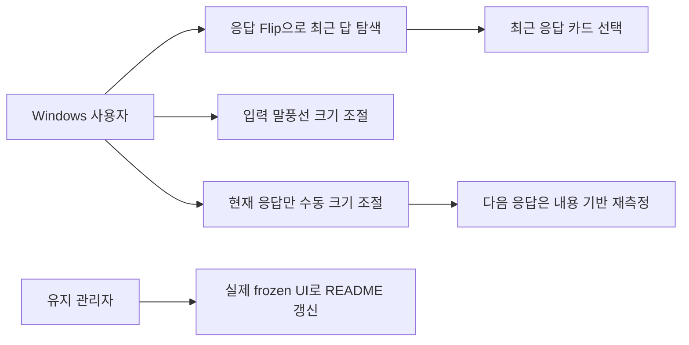
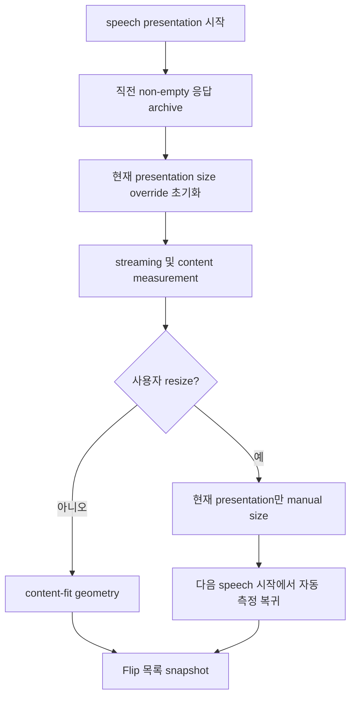
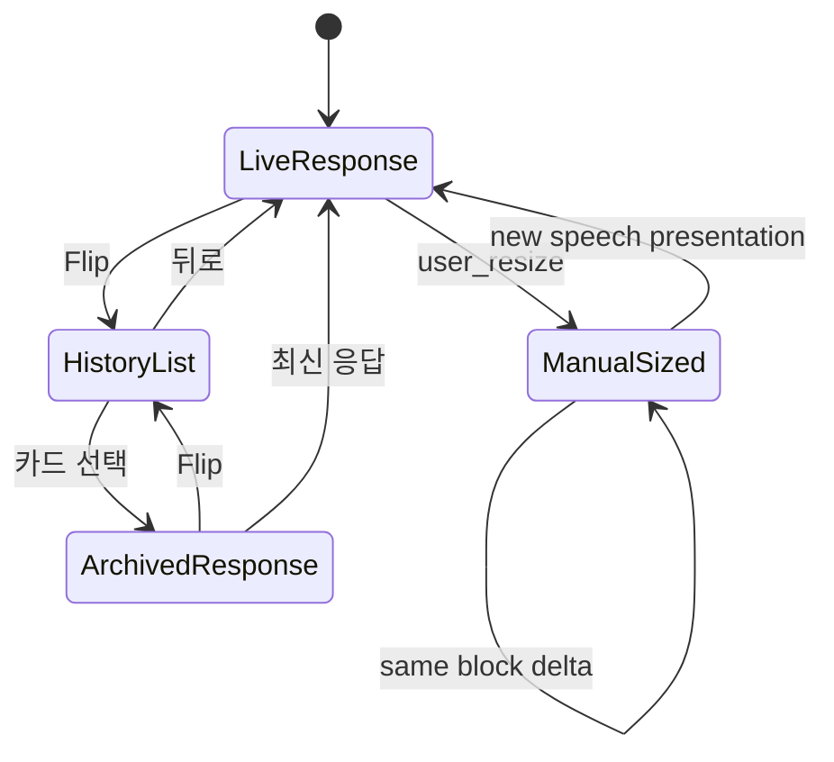

# 말풍선 응답 히스토리와 동적 크기

> tier **M** — 표준 — + 유스케이스·파이프라인·상태전이
> 채우는 순서: §1 의도 → §2 수용기준 → §3 확정사실(조사) → 다이어그램 → §9 변경지점 → §11 착수순서

## 1. 의도 (Intent)

| 항목 | 내용 |
|---|---|
| 문제 | 응답 말풍선은 마지막 답만 보여 과거 답을 바로 다시 볼 수 없고, 입력 리사이즈 조작성이 낮으며, 응답 수동 크기가 이후 답에도 고정되어 내용 기반 크기 조절이 사라진다. 배포 README의 첫 GIF와 말풍선 소개도 현재 동작을 정확히 보여주지 못한다. |
| 왜 지금 | native 말풍선이 기본 UX가 된 상태라 최근 답 탐색과 크기 제어 결함이 일상 사용에 직접 노출되고, 공개 README가 실제 배포 UI와 어긋난다. |
| 주 사용자 | 오버레이 옆 말풍선만으로 연속 요청을 보내고 직전 응답들을 다시 확인하는 Windows 사용자 |
| 불변식 | 입력 큐·수정·취소·중단 후 전송, IME·이미지 붙여넣기, 설정 글꼴, 캐릭터 상대 위치, 말풍선 꼬리, hidden tool window, private native-shell 경계를 보존한다. 응답 히스토리는 외부 renderer protocol이나 provider prompt로 보내지 않는다. |
| 비목표 | 기존 STM 전체 기록 패널을 대체하거나, 영구 DB 스키마를 추가하거나, 공개 Event API에 응답 본문을 노출하거나, 이번 변경만으로 새 설치 프로그램을 배포하지 않는다. |

## 2. 수용 기준 (Acceptance)

| ID | 수용 기준 | 검증 방법 |
|---|---|---|
| AC-1 | speech 말풍선의 Flip을 누르면 최근 완료 응답이 최신순 한 줄 요약 카드로 표시되고, 목록은 스크롤 가능하며 카드를 고르면 해당 전체 응답을 다시 보고 최신 응답으로 돌아올 수 있다. 최대 20개까지만 메모리에 보관한다. | `test/test_native_bubble_host.py`, `test/test_native_bubble_frontend.cjs`, Windows native shell에서 3개 이상 응답 후 Flip·스크롤·선택·최신 복귀 육안 확인 |
| AC-2 | input 말풍선의 우하단 크기 조절 affordance가 보이고 Windows native resize로 폭·높이를 바꾼 뒤에도 한글 입력, 이미지 붙여넣기, 전송, 큐 Flip이 잘리지 않고 동작한다. | frontend 구조 테스트와 Windows native shell 포인터 리사이즈·입력·전송 smoke |
| AC-3 | speech 수동 resize는 현재 응답에만 적용되고 다음 응답 시작 시 내용 길이와 글꼴·최대치에 따라 다시 측정된다. 수동 위치는 유지되며 같은 응답의 streaming delta는 사용자가 정한 크기를 초기화하지 않는다. | `test/test_native_bubble_host.py`, frontend 측정 테스트, Windows에서 짧은 응답 수동 확대 후 긴/짧은 새 응답 크기 비교 |
| AC-4 | AMBER README 첫 Trickcal GIF는 의도하지 않은 620/750/1250 ms 정지 프레임 없이 일정한 움직임과 짧은 장면 전환 hold로 재생되고 provenance의 프레임 수·총 길이·SHA가 실제 파일과 일치한다. | Pillow 프레임 duration 검사, provenance 검증, README 렌더에서 GIF 육안 재생 |
| AC-5 | 영문·한글 README의 말풍선 이미지와 설명이 최신 native UI의 input queue와 speech history Flip을 실제 source-Windows owned-window 캡처로 보여주며 사적 대화나 frozen 배포판이라는 거짓 주장을 포함하지 않는다. frozen 동작은 다음 release 검증에서 별도로 확인한다. | source commit과 각 capture SHA를 기록한 provenance, `README.md`·`README.ko.md` 링크/문구 검사, 이미지 육안 확인 |
| AC-6 | 기존 queue/interrupt, fade/approval revision, 설정 글꼴, 캐릭터 상대 위치, hidden tool window 동작에 회귀가 없다. | 관련 Python/Node 회귀 테스트, Cargo build, Windows native full smoke |

## 3. 확정 사실 (Findings)

설계 전에 **실제로 확인한 것만** 적는다. 추측은 §10 으로 보낸다.

| 항목 | 확인된 사실 | 설계 반영 |
|---|---|---|
| speech 상태 | `NativeBubbleHost`는 현재 `speech` 하나만 snapshot에 싣고 input queue card는 사용자 요청 요약이다. `native_host.py`와 `app.js`를 직접 확인했다. | 응답 기록을 queue와 분리한 bounded `speech_history`로 추가한다. |
| 입력 resize | Tauri 설정은 input `resizable: true`이고 모든 창에 `shell_resize` handle을 붙인다. host는 `user_resize`를 수동 크기로 저장한다. | 경로를 재작성하지 않고 affordance hit area·레이아웃과 실제 Windows 동작을 보강·검증한다. |
| speech 고정 크기 원인 | `user_resize`가 `manual_size`에 speech를 영구 추가하고, frontend/host 모두 이후 content measurement를 건너뛴다. | 새 speech presentation 시작에서만 size override를 제거하고, 같은 block delta에서는 유지한다. |
| 기존 durable history | `history_panel.py`가 STM 전체 기록을 별도 창으로 제공한다. | 새 Flip은 최근 화면 응답 전용이며 기존 history 버튼/API를 대체하지 않는다. |
| README GIF | 현재 첫 GIF는 42 frames/9.33 s이며 620/750/1250 ms hold가 섞여 있다. provenance와 Pillow metadata로 확인했다. | 승인된 캡처 프레임을 균일 cadence와 짧은 장면 hold로 재인코딩하고 provenance를 갱신한다. |
| README bubble 자산 | 영문·한글 README는 v1.5.15 input-only screenshot과 설명을 사용한다. | 최신 frozen UI에서 input queue와 speech history를 함께 보여주는 자산과 정직한 설명으로 교체한다. |

## 4. 유스케이스 / 시나리오

**주 시나리오**: 사용자가 여러 응답을 받은 뒤 speech Flip을 누르면 → 최신순 한 줄 카드 목록이 나오고 → 카드를 골라 전체 과거 답을 읽은 뒤 최신 응답으로 돌아온다. input과 현재 speech는 각각 필요할 때 수동 크기를 조절한다.

**예외 시나리오**: 기록이 비었으면 빈 상태만 보인다. streaming 중 resize는 같은 응답에 유지되지만 다음 응답이 시작되면 자동 측정으로 복귀한다. stale presentation/dismiss 이벤트는 최신 응답이나 선택한 히스토리를 덮지 않는다.

## 5. 파이프라인 (flowchart)

## 6. 액션 · 상태 전이 (action diagram)

| 상태 | 저장/이벤트 | UI 반응 |
|---|---|---|
| LiveResponse | current speech + content measurement | 최신 rich response, Flip 표시 |
| HistoryList | bounded summaries; provider/DB write 없음 | 고정 크기 scroll list |
| ArchivedResponse | frontend-local selected history id | 전체 과거 응답, 최신 복귀 버튼 |
| ManualSized | 현재 speech presentation에만 width/height override | 같은 응답 동안 사용자 크기 유지 |
| EmptyHistory | 빈 배열 | 응답 기록이 없다는 중립 문구, 현재 응답 보존 |

## 7. 타이밍 (sequence) *(선택 — 이 tier 에선 생략 가능)*

<!-- 이 tier 에선 필수가 아니다. 필요 없으면 섹션째로 지워라. -->

## 8. 데이터 (ER) *(선택 — 이 tier 에선 생략 가능)*

<!-- 이 tier 에선 필수가 아니다. 필요 없으면 섹션째로 지워라. -->

## 9. 변경 지점

경로는 백틱으로. 새로 만드는 파일은 `(신규)` 를 붙인다 — `check` 가 실존 여부를 본다.

| 파일 | 변경 |
|---|---|
| `overlay/bubble/native_host.py` | bounded speech history와 presentation별 size override lifecycle |
| `native-bubble-shell/frontend/index.html` | speech front/back 구조의 접근성 있는 기반 markup |
| `native-bubble-shell/frontend/app.js` | speech Flip·카드 선택·최신 복귀와 측정/fade 연동 |
| `native-bubble-shell/frontend/style.css` | speech history 카드/scroll 및 input resize affordance |
| `test/test_native_bubble_host.py` | history와 presentation-scoped resize 회귀 테스트 |
| `test/test_native_bubble_frontend.cjs` | speech Flip/render/selection과 input 회귀 테스트 |
| `../Project_AMBER/README.md` | 최신 bubble UX 영문 설명·자산 링크 |
| `../Project_AMBER/README.ko.md` | 최신 bubble UX 한글 설명·자산 링크 |
| `../Project_AMBER/resource/asset/readme/trickcal-demo-v1.5.15.provenance.json` | GIF와 새 bubble capture provenance |

## 10. 잠재 문제 & 대응

| 문제 | 대응 |
|---|---|
| 응답 전문 20개가 snapshot 크기를 키울 수 있다. | 각 응답을 32 KiB 이하로 이미 제한하고 history는 20개로 제한한다. IPC 한도와 실제 메모리를 테스트한다. |
| streaming 중 block 경계 판정이 잘못되면 resize가 매 delta 초기화될 수 있다. | `_present`와 새 block 감지를 분리 테스트하고 동일 block delta에 대한 수동 크기 유지 조건을 고정한다. |
| history browsing 중 fade가 창을 닫을 수 있다. | Flip/history 선택 동안 fade를 pause하고 최신 응답 복귀 시 남은 시간으로 resume한다. |
| input resize가 native region/작은 handle 때문에 포인터로 잡히지 않을 수 있다. | hit area를 몸통 내부 24px 이상으로 키우고 owned Windows HWND에서 실제 드래그한다. |
| 새 README frozen 캡처가 현재 설치본과 불일치할 수 있다. | executable path/version/hash를 provenance에 기록하고 이미지 안에는 합성 provider 대화를 넣지 않는다. |

## 11. 착수 순서

각 항목에 담당 AC 를 적는다. `check` 가 고아 AC 를 잡아낸다.

- [x] 1. host에 bounded response archive와 presentation-scoped speech resize lifecycle을 추가하고 단위 테스트한다. (AC-1, AC-3)
- [x] 2. speech front/back Flip, scroll card, 과거/최신 전환과 fade hold를 구현하고 frontend 테스트를 추가한다. (AC-1, AC-6)
- [x] 3. input resize handle과 레이아웃을 보강하고 IME·붙여넣기·queue 회귀를 검증한다. (AC-2, AC-6)
- [x] 4. Tauri build와 실제 Windows source UI에서 history·input resize·speech dynamic sizing·anchor/font를 검증한다. frozen 검증은 배포 시 별도 수행한다. (AC-1, AC-2, AC-3, AC-6)
- [x] 5. 승인된 실제 캡처로 GIF cadence/provenance와 영문·한글 README의 bubble 이미지·설명을 갱신한다. (AC-4, AC-5)

## 12. 추적성 *(선택 — 이 tier 에선 생략 가능)*

<!-- 이 tier 에선 필수가 아니다. 필요 없으면 섹션째로 지워라. -->
