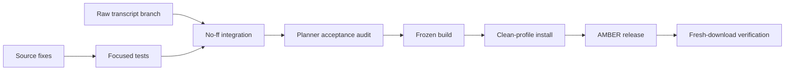

# AMBER clean install release completeness

## 1. Intent

The public installer must reproduce the product demonstrated by AMBER: the Trickcal-style native Bolttagu mapping, legible configuration controls, truthful product identity, and recoverable Codex integration. The same release also integrates the already-separated raw transcript archive without weakening its append-only or failure-isolation boundaries.

Invariants: preserve existing user mappings and provider configuration during upgrades; never auto-grant Codex hook trust; do not expose private transcripts in README media; do not substitute static checks for Windows installed-runtime evidence.

## 2. Acceptance contract

| ID | User-visible outcome | Intended runtime and acceptable evidence |
|---|---|---|
| AC-1 | The Bolttagu mapping editor opens tall enough to show its preview, footer, and actions at normal Windows scaling. Its action is named `적용`, and applying still returns the selected mapping to Settings before the Settings-level `저장`. | Actual Windows Tk editor screenshot/geometry check plus focused editor test. |
| AC-2 | With no user mapping file, the packaged native Bolttagu resolves to the exact mapping currently selected on this machine: the same hint/category/lifecycle choices, including its deliberate unprefixed `communication` and `hide` choices and the schema-default success one-shot. Existing explicit user mapping files remain authoritative. | Golden mapping-resolution test covering every row and actual source/frozen event animation smoke. |
| AC-3 | Settings visibly identifies `AMBER (ENGRAM)`, the exact four-part running version, and factual publisher watermark `DRTECH`; it makes no unsupported license claim. | Source and installed frozen Settings screenshots/text inspection, with version equal to the runtime manifest. |
| AC-4 | A clean install places `engram-connect` and `engram-hook-trust` (including helper scripts) in Codex's discoverable skill root and retains shared workflow skills for their existing providers. | Isolated clean-profile configure smoke and packaged-file inspection. |
| AC-5 | A compatible clean Codex profile receives the canonical Engram native hook definitions for all eight monitored events plus SessionStart, while trust remains an explicit Codex review/restore decision. Existing foreign or modified hooks are preserved. | Isolated Codex-home provisioning test and native hook metadata audit; no automatic approval. |
| AC-6 | AMBER's hero GIF changes at a relaxed, consistent cadence without stutter-like irregular pauses; provenance frame count, duration list, and SHA match the asset. | Pillow metadata check and rendered README visual review. |
| AC-7 | README bubble media is a truthful actual-runtime composition showing the session monitor, Trickcal Bolttagu, active response bubble, and input bubble together, using only sanitized synthetic fixture text. English and Korean copy describe the current behavior. | Actual owned-window capture, provenance with source/version/hash, and README render inspection. |
| AC-8 | `feat/raw-transcript-archive` merges without dropping its separate append-only DB, full-text search/scroll MCP surface, non-truncating tee, and fail-open isolation. | Branch tests before merge, integration diff audit, and archive-focused tests after merge. |
| AC-9 | The combined commit is merged into `dev` with no-ff, packaged into the next semver4 installer, installed in a fresh profile, and released through AMBER with matching local/remote/fresh-download SHA and release notes. | Full regression tests, frozen/installer smoke, Git history, tag/release API and downloaded asset digest. |

## 3. Confirmed findings

| Finding | Consequence |
|---|---|
| The editor hard-codes `820x760`, packs the action row last, and labels the action `적용 준비`. | Size to requested content with a safe minimum and use the direct label `적용`. |
| Packaged mapping defaults are the unprefixed art set; the local mapping selects Trickcal art for most visible states while explicitly keeping `communication: speaking` and `hide: enter`. | Make the exact resolved local mapping the product default, including those two deliberate mixed-set choices; preserve explicit mapping overrides. |
| Settings currently has no product/version/publisher footer. The installer factually declares publisher `DRTECH`, but the repository has no license file. | Add a product/version/DRTECH watermark only; do not invent a license. |
| The installer packages only a fixed subset of skill `SKILL.md` files, omits `engram-connect`, omits `engram-hook-trust` helper files, and does not copy shared skills to `~/.codex/skills`. | Package complete skill directories and install Codex-specific skills to Codex roots. |
| Codex hook provisioning scans only existing roots with `config.toml` and deliberately does not approve trust. | Verify root discovery and canonical definitions; retain explicit review messaging and hook-trust recovery. |
| The archive branch adds `archive.db`, an append-only tee, trigram/LIKE search, bounded scrolling, MCP methods, and focused tests. | Audit and merge as an independent feature, then rerun tests after integration. |

## 4. Flow

## 5. Change points

| Path | Change |
|---|---|
| `overlay/bolttagu_editor.py` | Content-safe initial/minimum geometry and direct apply wording. |
| `overlay/bolttagu_mapping.py` | Complete Trickcal product defaults. |
| `overlay/settings_window.py` | Product/version/publisher watermark. |
| `.github/skills/engram-connect/` | Installable bounded MCP recovery skill and helper. |
| `.github/skills/engram-hook-trust/` | Existing skill packaged with its helper/tests. |
| `installer/configure.ps1` | Complete provider-aware skill deployment and clean-profile diagnostics. |
| `installer/engram-overlay.iss` | Package complete required skill directories. |
| `installer/build-cache.ps1` | Hash every packaged skill input. |
| `test/` | Mapping, Settings identity, installer skill, hook, and archive regression coverage. |
| `../Project_AMBER/README.md` | Updated cadence, runtime composite, and English copy. |
| `../Project_AMBER/README.ko.md` | Updated cadence, runtime composite, and Korean copy. |
| `../Project_AMBER/resource/asset/readme/` | Updated media and truthful provenance. |

## 6. Implementation order

- [ ] Implement and test editor/default mapping/Settings identity. (AC-1, AC-2, AC-3)
- [ ] Add complete Codex recovery skills to source, package, cache, and clean-profile provisioning. (AC-4, AC-5)
- [ ] Refresh actual README media and provenance. (AC-6, AC-7)
- [ ] Independently test and merge the raw transcript branch, then rerun combined tests. (AC-8)
- [ ] Obtain fresh planner audit; build, install-smoke, publish AMBER, and verify the remote asset. (AC-9)
