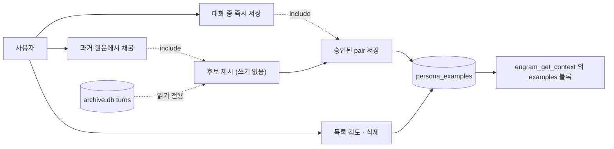
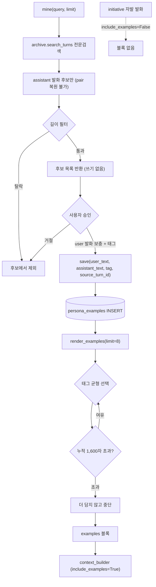
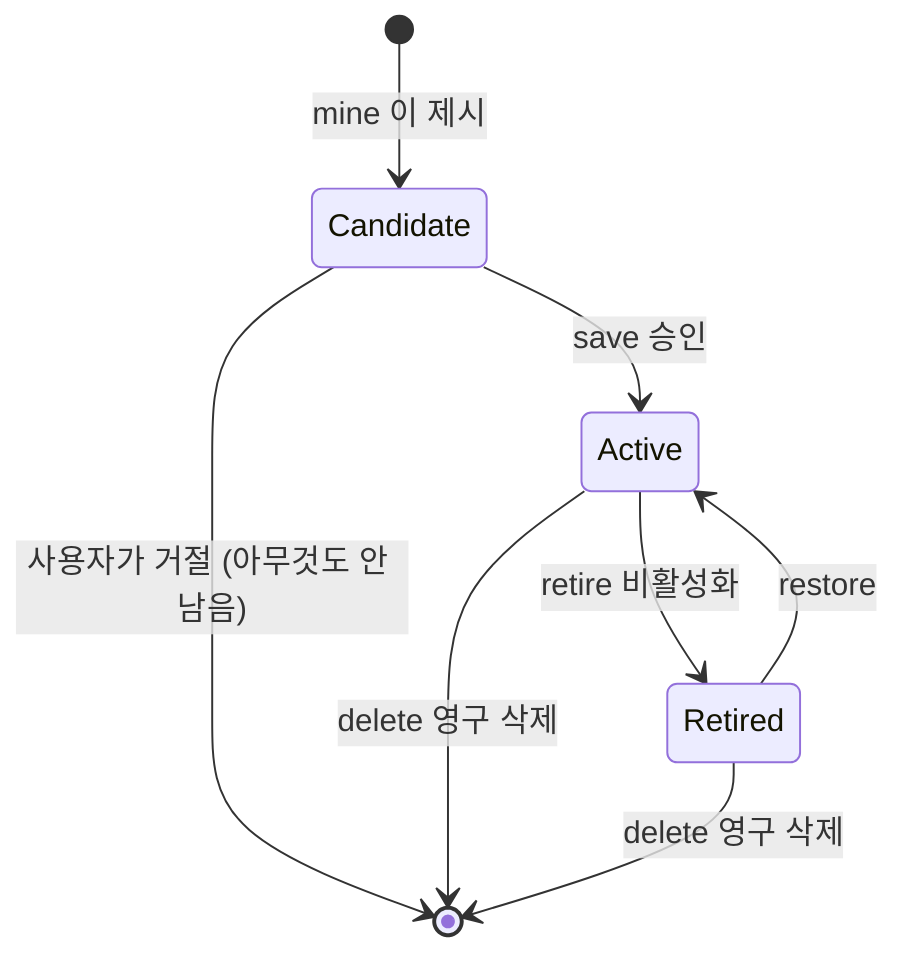
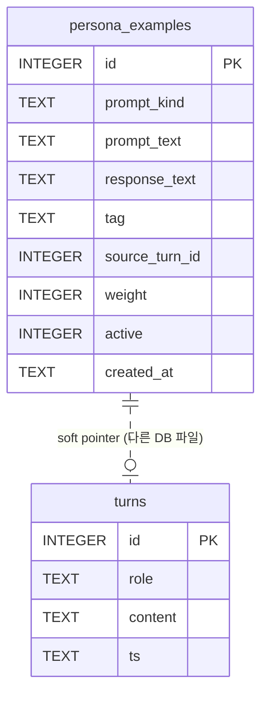

# persona examples

> tier **M** — 표준 — + 유스케이스·파이프라인·상태전이

## 1. 의도 (Intent)

| 항목 | 내용 |
|---|---|
| 문제 | 페르소나가 **형용사와 스칼라로만** 표현된다(`voice: 반말투의 시니컬한 말투`, `humor:0.73`). 같은 프롬프트를 어느 모델에 줘도 같은 결과가 나오므로 개성이 아니라 개성의 *서술*이다. 사용자 관찰: 2개월 넘게 누적했는데 "딱히 뭔가 개성이 느껴지지 않는다". |
| 왜 지금 | `fewshot` 슬롯은 스키마에 있었지만 도입 이래 계속 빈 문자열이다. 반성 루프(`persona_observations`)는 스칼라 관찰용이라 예시를 채울 채널 자체가 없다. 한편 EMA(α=0.3)는 스칼라를 반복적으로 중앙으로 끌어내려 `warmth 0.54`처럼 정보량 없는 값을 만든다. 예시를 넣지 않으면 페르소나는 계속 평균으로 수렴한다. |
| 주 사용자 | jhjang 1인. overlay 말풍선·CLI 세션에서 대화하다 "이건 저장" 한마디로 남기고, 쌓인 목록은 나중에 몰아서 검토한다. |
| 불변식 | ① `archive.db`는 **읽기 전용** — 채굴이 원문을 바꾸지 않는다. ② examples는 EMA·반성의 자동 진화 대상이 **아니다**. 명시적 추가·삭제만. ③ examples는 `~/.claude/CLAUDE.md`·`~/.codex/AGENTS.md`로 **절대 나가지 않는다**(기존 allowlist 계약 유지). ④ 예시는 **자동으로 쌓이되 관측 가능하고 되돌릴 수 있다.** (채굴은 여전히 쓰지 않는다 — 제안만 한다.) |
| 비목표 | 커뮤니티 코퍼스 주입, 파인튜닝, 스칼라 EMA 정책 변경, provider 파일 경로 확장, 예시 자동 생성·자동 승인, 다국어 예시. |

## 2. 수용 기준 (Acceptance)

| ID | 수용 기준 | 검증 방법 |
|---|---|---|
| AC-1 | `persona_examples` 테이블이 신규·기존 DB 모두에서 멱등하게 생성된다. 두 번 초기화해도 스키마·행 수가 변하지 않는다. | `test/test_persona_examples_store.py` — 빈 DB·기존 DB 각각 초기화 2회 후 `PRAGMA table_info` 와 `COUNT(*)` 비교 |
| AC-2 | 채굴은 후보만 반환하고 `persona_examples`에 0행을 쓴다. | 같은 파일 — 채굴 전후 `COUNT(*)` 동일, 반환 후보 1건 이상 |
| AC-11 | **종료 경로가 예시를 적재한다.** 스킬이 부르는 도구(`engram_close_session`)에 인자가 있고, 스킬이 빈 자리를 조회하도록 지시하며, 자리 없음·길이 초과는 사유와 함께 거절된다. | `test/test_persona_examples_loop.py` — 적재·거절 사유 2종·빈 입력 무해·두 도구의 시그니처·스킬 문구 |
| AC-10 | 반성이 예시를 **승인 없이** 적재하되 구조적 제약을 받는다: 빈 태그일 때만, 세션당 1건, 150자 이하. `origin`으로 구분되고 사람이 넣은 것이 렌더에서 먼저 뽑힌다. | `test/test_persona_examples_store.py` — origin 기록·필터, `tag_capacity`, manual이 auto를 이기는 렌더, origin 컬럼 마이그레이션 |
| AC-8 | 자극의 종류(`user`/`situation`/`source`)가 렌더에 라벨로 드러나고, 목록 밖 값은 저장이 거부된다. | 같은 파일 — 세 종류 렌더 후 `U:` · `상황:` · `자료:` 각각 존재, 미지정 시 기본 `user`, 잘못된 값은 `ValueError` |
| AC-9 | `persona.user.yaml` 의 `fewshot` 과 테이블 예시가 **둘 다** 렌더되고 앵커가 먼저 온다. `fewshot_only`가 켜지면 테이블이 빠진다. 스위치는 EMA 를 타지 않는다. | `test/test_persona_examples_render.py` — 가산 렌더·순서·스위치·예산 고갈·`_merge_persona` 불변 |
| AC-3 | `[examples]` 렌더는 활성 예시를 **태그 균형**으로 최대 8개 선택하고 블록이 1,600자를 넘지 않는다. 한 태그가 3개를 넘게 차지하지 않는다. | 같은 파일 — 태그 5종 × 5개 투입 후 렌더, 태그별 개수 3 이하 · 총 8 이하 · 길이 1,600 이하 |
| AC-4 | `render_persona(persona)` 기본 호출 결과에 `[examples]`가 없다. `include_examples=True`일 때만 붙는다. | `test/test_persona_examples_render.py` — 두 호출 비교. `overlay/bubble/initiative.py` 호출부가 기본값을 쓰는지 단언 |
| AC-5 | ~~`provider_persona.render()` 출력에 예시 본문 문자열이 포함되지 않는다.~~ **무효** — 2026-09-18 에 provider 파일 쓰기 경로 자체를 폐기했다. 정체성은 `engram_get_context` 응답으로만 나간다. | — |
| AC-6 | 채굴은 `archive.db`에 쓰기를 하지 않는다. | `test/test_persona_examples_mining.py` — 채굴 전후 `archive.db` 크기·`turns` 행 수 동일 |
| AC-7 | 예시를 삭제·비활성화하면 다음 렌더에 즉시 빠진다(캐시 없음). | `test/test_persona_examples_render.py` — 렌더 → 삭제 → 재렌더 비교 |

## 3. 확정 사실 (Findings)

| 항목 | 확인된 사실 | 설계 반영 |
|---|---|---|
| `fewshot` 슬롯 현황 | `core/identity/service.py:125`에 `"fewshot": ""` 기본값, `:176`에서 `[examples]`로 렌더. `overlay/settings_window.py:1251`에 UI 텍스트 박스까지 있다. 현재 세션에 주입된 컨텍스트에 `[examples]` 블록 없음 = 실사용 값이 빈 문자열. (직접 확인, 2026-09-17) | 슬롯을 재사용하지 않고 별도 테이블로 간다. 문자열 1개는 append·개별 삭제·출처 추적·예산 제어가 전부 불가능하다. `fewshot`은 수동 오버라이드로 남기고 테이블이 비었을 때의 폴백으로 쓴다. |
| 채굴 원본 규모 | `archive.db` `turns` 14,467행 (assistant 11,469 / user 2,998), 전량 `scope_key=overlay`, 기간 **2026-07-13 ~ 2026-09-17**. (직접 측정, 2026-09-17) | "반년치"가 아니라 **약 2개월치**다. 채굴 범위를 과대평가하지 않는다. |
| pair 추출 가능량 | `session_id`가 13,551/14,467행(93.7%)에서 NULL이라 세션 기준 페어링은 716건뿐. `id` 인접(LAG) 기준으로는 user→assistant 인접쌍 **2,960건**, 길이 필터(assistant 40~600자 · user 2~300자) 적용 시 **1,212건**. (직접 측정, 2026-09-17) | 페어링 키를 `session_id`가 아니라 **`id` 인접**으로 한다. session 기준으로 짰으면 후보의 76%를 잃었다. |
| 전문검색 인프라 | `turns_fts`가 fts5 trigram external-content로 이미 걸려 있고 `archive.search_turns()` / `scroll_turns()` 헬퍼가 있다. MCP `engram_search_transcript` / `engram_read_transcript`가 이를 노출한다. (직접 확인, 2026-09-17) | 검색 인프라를 새로 만들지 않는다. 채굴은 `search_turns` + 인접 조회의 조합. |
| DB 분리 | `archive.db`는 `engram.db`와 **별도 파일**(`get_archive_path()`). (직접 확인, 2026-09-17) | `source_turn_id`는 FK가 아니라 **soft pointer**. 원본이 사라져도 예시는 살아야 하므로 pair 원문을 복사해 저장한다. |
| `render_persona` 소비처 | `core/context/context_builder.py:229`(MCP 컨텍스트) 외에 `overlay/bubble/initiative.py:346,399`(자발 발화 프롬프트)에서도 호출된다. (직접 확인, 2026-09-17) | examples를 무조건 붙이면 1회성 격리 호출인 자발 발화 프롬프트까지 부풀린다. **`include_examples` 기본 False**, context_builder만 True. |
| provider 파일 경로 | **폐기됨(2026-09-18).** `~/.claude/CLAUDE.md`·`~/.codex/AGENTS.md` 블록은 `engram_get_context` 응답의 더 빈약한 중복 사본이었고, 빈 DB 를 읽으면 기본 시드값이 사람 소유 파일의 정체성을 덮었다(실제 2회). `provider_persona` 는 이제 제거 경로만 갖는다. | engram 이 안 붙은 세션에는 페르소나가 **없는 게 맞다**. 파일 사본은 연결이 끊긴 동안에도 정체성이 살아있는 척하게 만든다. |
| **인접 페어링이 성립하지 않는다** | 채굴 스모크에서 붙은 pair 가 서로 다른 대화였다. 연속된 turn id 17984~17989 를 직접 열어 보니 **여섯 개가 전부 다른 대화**였다. `session_id` 도 구분자가 못 된다 — 비어 있는 13,551행을 빼면 7개 값뿐이고, 한 값 안에 동시 대화가 섞여 있다. `source_uuid` 는 줄 단위 랜덤 UUID 라 묶을 수 없다. 즉 **archive 에는 대화를 가르는 키가 없다.** (직접 확인, 2026-09-17) | 채굴이 pair 를 복원하지 못한다. 채굴은 **assistant 발화 후보만** 돌려주고, 짝이 될 user 발화는 사람이 채운다. pair 를 온전히 얻는 경로는 대화 중 즉시 저장(모델이 자기 직전 턴을 컨텍스트로 안다)뿐이다 |
| 튜토리얼 결합 | `core/tutorial/progress.py:118`이 `fewshot` 키를 user persona override 판정에 사용한다. (직접 확인, 2026-09-17) | `fewshot` 키를 **삭제하지 않는다**. 테이블은 추가이지 대체가 아니다. |

## 4. 유스케이스 / 시나리오

**주 경로는 live 저장이다** — archive 는 대화를 가르지 못하므로(§3) 온전한 pair 는 대화 중에만 얻을 수 있다. 채굴은 assistant 발화를 되찾아 주는 보조 경로다.

**주 시나리오**: 대화 중 사용자가 "이거 저장" → 직전 user/assistant 턴을 pair로 제시 → 사용자가 태그를 정하고 승인 → `persona_examples`에 1행 → 다음 세션 렌더에 등장.

**예외 시나리오**: 채굴 도중 실패해도 `archive.db`와 `persona_examples` 양쪽에 아무것도 남지 않는다(채굴은 순수 읽기). 저장 도중 실패하면 트랜잭션이 롤백되어 부분 행이 남지 않는다. 렌더 시점에 테이블이 없거나 비어 있으면 블록을 아예 생략한다 — 빈 블록을 주입하지 않는다.

## 5. 파이프라인 (flowchart)

## 6. 액션 · 상태 전이 (action diagram)

| 상태 | 저장/이벤트 | 렌더 반응 |
|---|---|---|
| Candidate | **아무것도 저장하지 않는다.** 메모리상 후보 목록뿐 | 영향 없음 |
| Active | `persona_examples` 행 `active=1` | 태그 균형 선택 대상에 포함 |
| Retired | 같은 행 `active=0` — 행은 남는다(왜 뺐는지 추적 가능) | 다음 렌더에서 즉시 제외 (AC-7) |
| 실패 (save 중 예외) | 트랜잭션 롤백. 부분 행·임시 파일 없음. `archive.db`는 애초에 열지 않음 | 영향 없음 |

## 8. 데이터 (ER)

`prompt_kind` 는 자극의 종류다 — `user`(사용자 입력) · `situation`(상황 서술) · `source`(자료·근거).
개성이 드러나는 발화의 상당수는 앞에 사용자 턴이 없다(코드를 읽고 나온 발견, 자기 정정,
수치를 보고 판단을 뒤집는 순간). 그 자리를 가짜 user 턴으로 채우면 "사용자는 이런 말을
한다"를 가르치게 되므로, 종류를 기록하고 렌더에 라벨(`U:` / `상황:` / `자료:`)로 드러낸다.

`persona_examples`는 `engram.db`, `turns`는 `archive.db`에 있어 **FK를 걸 수 없다**. 원본이 사라져도 예시는 살아야 하므로 pair 원문을 복사 저장하고 `source_turn_id`는 되짚기용으로만 쓴다. 마이그레이션은 `CREATE TABLE IF NOT EXISTS` + `(active, tag)` 인덱스.

## 9. 변경 지점

| 파일 | 변경 |
|---|---|
| `core/storage/db.py` | `persona_examples` 테이블 + `(active, tag)` 인덱스 생성 |
| `core/identity/examples.py` (신규) | 저장·조회·retire·delete·태그 균형 선택·블록 렌더 |
| `core/identity/mining.py` (신규) | `archive.search_turns` + 인접 조회로 pair 후보 추출. 읽기 전용 |
| `core/identity/service.py` | `render_persona(persona, include_examples=False)` — True일 때만 블록을 붙인다. 테이블이 비면 기존 `fewshot` 폴백 |
| `core/identity/__init__.py` | 새로 추가한 모듈의 공개 함수 export |
| `core/context/context_builder.py` | `render_persona(persona, include_examples=True)` |
| `overlay/settings_window.py` | 페르소나 탭에 `fewshot_only` 체크박스 — 로드·저장·안내문 |
| `mcp_server.py` | `_store_reflection_example` 공용 헬퍼 + `engram_close_session`·`engram_apply_reflection` 양쪽에 `example_*` 인자 |
| `~/.claude/skills/engram-close-session/SKILL.md` | 종료 절차에 capacity 조회와 `example_*` 작성 단계 추가 |
| `test/test_persona_examples_loop.py` (신규) | AC-11 |
| `mcp_server.py` | 도구 3개 — 예시 추가 · 채굴 · 목록(삭제·retire 포함) |
| `test/test_persona_examples_store.py` (신규) | AC-1 · AC-2 · AC-3 |
| `test/test_persona_examples_render.py` (신규) | AC-4 · AC-7 |
| `test/test_persona_examples_mining.py` (신규) | AC-6 |
| `test/test_provider_persona_persistence.py` | AC-5 — 예시가 provider 파일로 새지 않는지 케이스 추가 |

## 10. 잠재 문제 & 대응

| 문제 | 대응 |
|---|---|
| 토큰 비용. `render_persona`는 주석상 40~60 토큰인데 예시 8쌍이면 800~1,500 토큰. 매 세션 주입이라 20배 증가 | 상한을 개수(8)와 문자수(1,600)로 **이중 제한**한다. 붙인 뒤 실제 증가폭을 재측정하고, 과하면 상한을 먼저 조인다 |
| 태그 균형이 오히려 편향을 만들 수 있다 — 특정 태그에 좋은 예시가 몰렸는데 3개로 잘리면 품질이 떨어진다 | 상한을 상수가 아니라 설정값으로 둔다. 초기 운용 후 태그별 실제 분포를 보고 조정. 근거가 생기기 전에 알고리즘을 복잡하게 만들지 않는다 |
| 채굴 후보의 품질. 길이 필터 1,212건은 "길이가 맞다"일 뿐 "나답다"가 아니다 | 채굴은 여전히 사람이 고른다 — 소급 탐색은 맥락이 없어 자동으로 판단할 근거가 없다. 반성 시점의 자동 적재는 그 세션의 맥락이 있으므로 다르다 |
| 인자를 붙여도 아무도 안 채운다 — `persona_observations` 가 75일 42세션 동안 그랬다. 원인은 게으름이 아니라 **빈 칸이 안 보이는 것**이다 | 세 겹으로 건다: ①스킬이 부르는 도구에 인자를 둔다 ②스킬이 `capacity` 를 먼저 조회하게 한다 ③반환값에 `example_skipped`·`example_capacity` 를 실어 결과가 보이게 한다. 셋 다 테스트로 고정(AC-11) |
| ~~매 건 사람이 승인한다~~ **기능의 존재 이유를 지운다.** 일일이 승인할 거면 설정창 fewshot 텍스트박스와 다를 게 없고, narrative·스칼라가 이미 승인 없이 진화하는 것과도 어긋난다 | 자동 적재 + 사후 정리. 안전장치를 승인이 아니라 **되돌리기 비용**에 둔다(retire 한 번) |
| 자기가 잘 보인 순간만 고를 수 있다 | **막지 않는다.** 무엇을 기억할 만하다고 여기는지가 곧 성격이라, 선택을 중립으로 만들면 담으려던 것이 깎인다. 대신 `origin='auto'` 로 좁혀 볼 수 있게 해 표류를 관측 가능하게 둔다 — 필요한 것은 승인이 아니라 관측자다 |
| 되먹임 — 고른 예시가 말투를 바꾸고 바뀐 말투에서 또 고른다 | 사람이 교정한다. `weight` 로 사람이 넣은 것이 자동보다 먼저 뽑히므로 교정이 한 번의 호출로 끝난다 |
| 예시에 개인정보·비밀이 섞여 들어갈 수 있다 | 저장 전 사람이 원문을 보고 승인한다. 저장 시 `sanitize()`를 통과시키되, 인젝션 패턴 변환이 예시를 훼손할 수 있으므로 **변환 결과를 승인 화면에 그대로 보여준다** |
| ~~시간 간격으로 세션 경계를 끊으면 pair 를 복원할 수 있다~~ **틀린 가정이었다.** 동시 대화가 같은 스코프에 interleave 되고 archive 에 구분 키가 없다 (§3) | 채굴을 assistant 단발 후보로 축소했다. pair 복원을 포기하는 대신 거짓 pair 를 만들지 않는다 |
| 소급 채굴로 얻는 예시의 질이 live 저장보다 낮다 — user 쪽을 사람이 다시 써야 한다 | live 저장을 주 경로로 삼는다. 채굴은 "그때 내가 뭐라고 했더라"를 찾는 보조 도구다 |
| 앞으로도 대화 구분이 안 되면 채굴은 계속 반쪽이다 | turns 에 대화 식별자를 남기는 것이 근본 해결이지만 이번 범위가 아니다. 별도 명세로 분리 |
| ~~테이블이 비었을 때만 `fewshot` 을 쓴다(테이블 우선)~~ **틀렸다.** `persona.user.yaml` 은 pin 계층이라 다른 모든 필드에서 DB 를 이기는데, `fewshot` 만 DB(테이블)가 사람 선언을 이기게 만들었다. 우선순위 계약에 예외를 하나 판 셈 | 두 출처는 경쟁이 아니라 **앵커와 성장**이다 — `fewshot` 은 사람이 박는 지향, 테이블은 대화에서 쌓인 실측. 앵커를 먼저 놓고 남은 예산만큼 성장을 덧붙인다. 지향만 쓰려면 `fewshot_only` 스위치(GUI 체크박스)로 성장을 끈다 |
| 앵커가 예산 1,600자를 다 먹으면 성장이 통째로 빠진다 | 앵커는 자르지 않는다 — 사람이 박은 값을 말없이 자르는 게 더 나쁘다. 성장만 빠지고, 그 경우를 테스트로 고정했다 |
| `fewshot_only` 가 EMA 를 타면 True/False 가 0.7 같은 값이 된다(bool 은 int 의 하위형) | `_NON_BLENDED` 로 제외하고 `_coerce_persona_field` 의 bool 분기를 숫자 분기보다 앞에 둔다 |

## 11. 착수 순서

- [x] 1. `persona_examples` 테이블 + 인덱스 + 멱등 마이그레이션 (AC-1)
- [x] 2. `examples.py` 저장·조회·retire·delete, 테이블이 비면 렌더 생략 (AC-7)
- [x] 3. 태그 균형 선택 + 개수·문자수 이중 상한 렌더 (AC-3)
- [x] 4. `render_persona(include_examples=)` 분기 + `context_builder`만 True, initiative 2곳은 기본값 유지 (AC-4)
- [x] 5. provider 파일 유출 방지 회귀 케이스 추가 (AC-5)
- [x] 6. `mining.py` — 검색 + 인접 pair 후보, 읽기 전용 (AC-2, AC-6)
- [x] 8. 자극 종류(`prompt_kind`) 도입 — 가짜 user 턴을 만들지 않는다 (AC-8)
- [x] 9. 앵커(`fewshot`) + 성장(테이블) 가산 렌더 및 `fewshot_only` GUI 스위치 (AC-9)
- [x] 10. `origin` 컬럼 + 반성 자동 적재 + 사람 우선 가중치 (AC-10)
- [x] 11. 종료 경로 연결 — close_session 인자 · 스킬 지시 · 회귀 테스트 (AC-11)
- [ ] 7. MCP 도구 3개 노출(완료) + **실제 대화에서 pair 1건 저장·주입 확인** — 예시는 사람이 고르는 것이므로 사용자가 첫 건을 승인해야 닫힌다 (AC-2)
