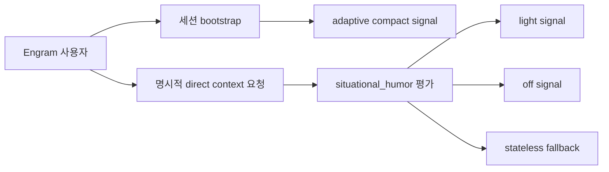
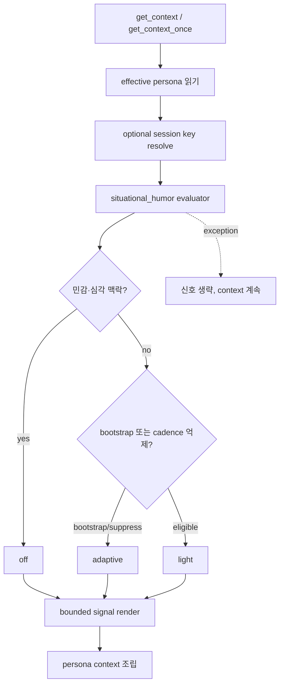
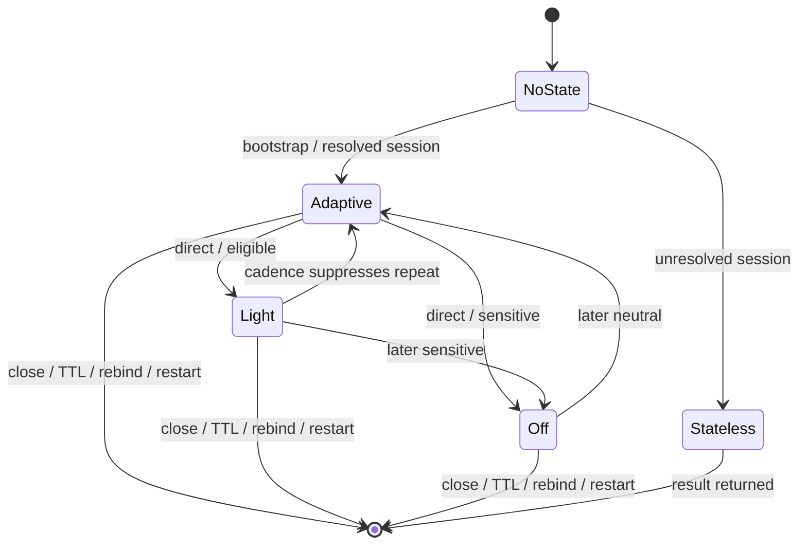

# Situational Humor Module

## 1. 의도 (Intent)

| 항목 | 내용 |
|---|---|
| 문제 | 현재 persona의 `humor` 값은 숫자로만 전달되어 발현·억제 조건과 표현 상한이 없고, 높은 값도 체감할 행동으로 이어지지 않는다. |
| 왜 지금 | 유머를 첫 성격 모듈로 확립해야 같은 계약으로 다른 성격을 확장할 수 있다. 전체 모듈 정의를 프롬프트에 넣는 방식은 피한다. |
| 주 사용자 | persona 슬라이더를 조정하고 실제 Claude/Codex 대화에서 차이를 기대하는 Engram 사용자. |
| 불변식 | 기존 `humor` 값과 user > DB > project > default 우선순위를 보존한다. persona는 `engram_get_context`로만 전달한다. provider 파일에 쓰지 않는다. 심각·안전 민감 상황에서는 유머를 권하지 않는다. 내부 정책·키워드·예시 묶음을 프롬프트에 노출하지 않는다. |
| 비목표 | 다른 성격 모듈, 밈 지식 저장소, 별도 분류 모델, 응답 후처리, DB schema, 모든 provider의 자동 매 턴 주입, frozen installer 배포. |

## 2. 수용 기준 (Acceptance)

| ID | 수용 기준 | 검증 방법 |
|---|---|---|
| AC-1 | effective `humor` 값은 읽기·병합·설정 저장 전후에 변하지 않고 기존 pin/adaptive 계약을 유지한다. | persona 우선순위 테스트와 격리 settings load/save에서 raw/effective 값을 전후 비교한다. |
| AC-2 | context는 raw `humor:<number>`에 의존하지 않고, 내부 규칙·키워드·예시 없이 고정 상한의 짧은 상황형 유머 신호 하나만 렌더한다. | `test/test_context_personality_modules.py`에서 fragment, 길이 상한, 금지 문자열 부재를 단언한다. |
| AC-3 | 심각·안전 민감 조건은 `off`, 적합한 저위험 맥락은 `light`, query 없는 bootstrap은 `adaptive`이며 어떤 모드도 농담을 의무화하지 않는다. | `test/test_situational_humor.py`의 경계값·민감/일상/빈 query 테이블 테스트로 검증한다. |
| AC-4 | cadence 상태는 Engram session별로 격리되고 close·TTL·rebind 시 제거되며 session을 확정할 수 없으면 상태를 보존하지 않는다. | evaluator 격리 테스트와 session invalidation/rebind 통합 테스트로 검증한다. |
| AC-5 | `engram_get_context_once` 최초 호출은 bootstrap 신호를 내고 같은 key의 두 번째 호출은 기존 dedupe 응답을 유지한다. 명시적 `engram_get_context(user_query=...)`만 상황을 재평가한다. | source MCP async 통합 테스트에서 최초/중복/direct 호출 순서와 결과를 검증한다. |
| AC-6 | `AGENTS.md`와 `CLAUDE.md`에 persona 사본을 쓰는 경로를 추가하지 않는다. | 기존 provider-persona 회귀 테스트와 diff에서 write API 부재를 확인한다. |
| AC-7 | persona examples와 initiative 렌더 계약을 유지하고 `situational_humor` 외 다른 성격 모듈을 등록하지 않는다. | 기존 examples/initiative 테스트와 registry 단일 모듈 단언을 실행한다. |
| AC-8 | Windows source Engram의 실제 MCP 경로에서 compact bootstrap 신호와 direct-context 상황 변화가 관찰된다. frozen installer는 별도 배포 전까지 범위 밖이다. | source runtime 재시작 후 실제 MCP client로 bootstrap, 중복, 저위험 direct, 민감 direct 호출의 sanitized 출력을 캡처한다. |

## 3. 확정 사실 (Findings)

| 항목 | 확인된 사실 | 설계 반영 |
|---|---|---|
| 현재 persona 렌더 | `core/identity/service.py::render_persona`가 네 숫자를 그대로 연결하고 `core/context/context_builder.py`가 `[persona]`에 넣는다. | 숫자를 해석하는 evaluator를 두고 context에는 결과만 추가한다. |
| 값 우선순위 | `get_persona()`는 user YAML > DB > project YAML > default 순서로 각 필드를 고른다. | 저장 구조나 설정 UI 계약을 바꾸지 않는다. |
| 단일 전달 경로 | Wiki `persona-delivery-single-channel`과 `provider_persona.py`는 persona가 MCP context로만 전달되고 provider 파일에는 제거 경로만 남는다고 명시한다. | provider 파일 동기화나 fallback 사본을 만들지 않는다. |
| once 동작 | `engram_get_context_once`는 session 생성 후 최초 1회 `engram_get_context`를 호출하고 같은 cache key 재호출은 짧은 문자열을 반환한다. | bootstrap은 query 없는 `adaptive`만 보장하고 매 턴 자동 적응을 주장하지 않는다. |
| direct context | `engram_get_context(user_query=...)`는 매 호출 context를 만들지만 현재 session ID를 builder로 전달하지 않는다. | 안전하게 resolve한 optional session key를 전달하며 실패 시 stateless 평가한다. |
| session cleanup | `_invalidate_session_bindings`가 close/rebind 시 once/fingerprint binding을 제거한다. | 같은 경계에서 evaluator state도 제거한다. |
| 작업 격리 | 기준 `dev`의 unrelated 미추적 runtime 산출물을 건드리지 않고 `feat/situational-humor` 격리 worktree를 만들었다. | 모든 변경은 격리 branch에서 수행한다. |

## 4. 유스케이스 / 시나리오

**주 시나리오**: 세션 시작 시 기존 humor 값에서 계산한 compact `adaptive` 신호를 받는다. client가 `engram_get_context(user_query=...)`를 명시적으로 요청하면 evaluator가 query 위험도와 session cadence를 평가해 `light` 또는 `off`를 반환한다.

**예외 시나리오**: session key를 확정하지 못하면 상태를 저장하지 않는다. evaluator 오류 시 context를 실패시키지 않고 신호를 생략한다. close·TTL·rebind에서는 ephemeral state를 폐기한다.

## 5. 파이프라인 (flowchart)

## 6. 액션 · 상태 전이 (action diagram)

| 상태 | 저장/이벤트 | UI 반응 |
|---|---|---|
| NoState | 저장 없음 | 별도 UI 없음 |
| Adaptive | session key에 last mode·cadence·expiry만 메모리 저장 | bootstrap에 짧은 비강제 신호 |
| Light | 최근 light 시점을 갱신 | 적합하면 짧은 dry aside 허용 |
| Off | 최근 mode 갱신 | 심각한 요청은 평이하게 응답 |
| Stateless | 저장 없이 반환 | 다른 대화에 상태가 누출되지 않음 |
| 종료 | 해당 session state 제거 | 잔여 cadence 없음 |

## 9. 변경 지점

| 파일 | 변경 |
|---|---|
| `docs/design/0008-situational-humor.md` | 본 명세. |
| `core/identity/personality.py` | registry, evaluator, bounded renderer, ephemeral session state. |
| `core/identity/__init__.py` | 최소 evaluator API export. |
| `core/identity/service.py` | 저장 계약을 보존하며 raw humor 숫자를 행동 지침에서 분리. |
| `core/context/context_builder.py` | optional session key로 모듈 평가·합성. |
| `core/memory/bus.py` | optional session을 builder까지 전달. |
| `mcp_server.py` | session resolve와 cleanup 배선. |
| `test/test_situational_humor.py` | mode·경계·cadence·격리·TTL 검증. |
| `test/test_context_personality_modules.py` | bounded 렌더와 정책 비노출 검증. |
| `test/test_context_once_cache_key.py` | bootstrap/dedupe/direct 계약 검증. |
| `test/test_provider_persona_persistence.py` | provider 파일 사본 회귀 검증. |
| `test/test_persona_examples_render.py` | examples 계약 검증. |
| `test/test_initiative.py` | initiative 비확장 검증. |

## 10. 잠재 문제 & 대응

| 문제 | 대응 |
|---|---|
| 단어 기반 위험 판정은 의미를 완전히 이해하지 못한다. | v1은 false-negative보다 억제를 선호하는 좁고 설명 가능한 규칙만 쓴다. 고급 분류는 후속 기능이다. |
| `get_context_once`만 쓰는 일반 세션은 매 턴 상황 전환을 볼 수 없다. | bootstrap을 `adaptive`로 제한하고 direct context에서만 재평가됨을 명시한다. 매 턴 hook 확대는 범위 밖이다. |
| compact signal도 모델이 무시할 수 있다. | 실제 provider-facing source runtime 증거를 필수 AC로 둔다. 농담 자체는 강제하지 않는다. |
| 확률 기반 구현은 불안정하다. | v1은 deterministic threshold/cadence로 구현한다. |
| 잘못된 session resolve는 상태를 섞는다. | 확정 binding만 stateful로 쓰고 ambiguous/unknown은 stateless로 폴백한다. |
| cleanup 경로가 누락될 수 있다. | `_invalidate_session_bindings`를 단일 cleanup 진입점으로 재사용하고 close/rebind 테스트를 추가한다. |

## 11. 착수 순서

- [x] 1. pure evaluator와 기존 humor 호환성 테스트를 구현한다. (AC-1, AC-3)
- [x] 2. bounded signal을 context에 연결하고 정책 비노출을 검증한다. (AC-2)
- [x] 3. MCP session threading, stateless fallback, cadence cleanup을 구현한다. (AC-4, AC-5)
- [x] 4. provider 단일 전달 경로와 examples/initiative 회귀를 검증한다. (AC-6, AC-7)
- [x] 5. Windows source runtime에서 bootstrap/dedupe/direct 상황 변화를 캡처한다. (AC-8)
- [x] 6. focused suite와 독립 audit를 통과시키고 명세를 `done`으로 전환한다. (AC-1, AC-2, AC-3, AC-4, AC-5, AC-6, AC-7, AC-8)
