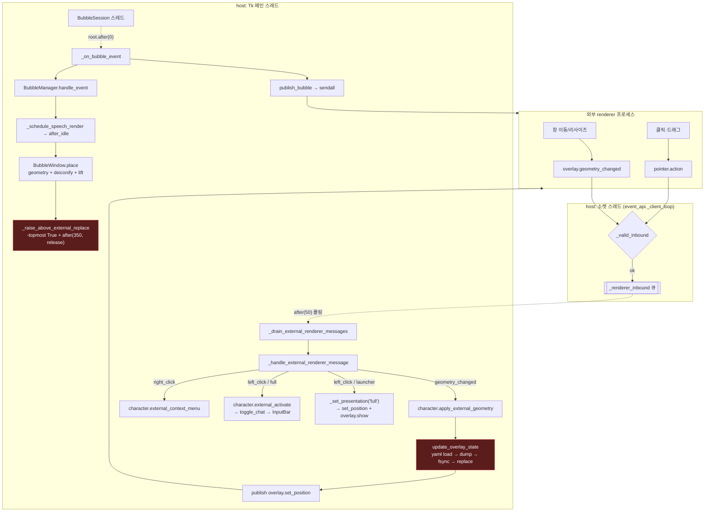
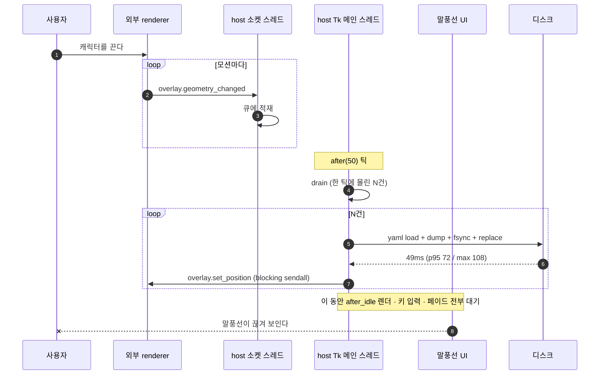
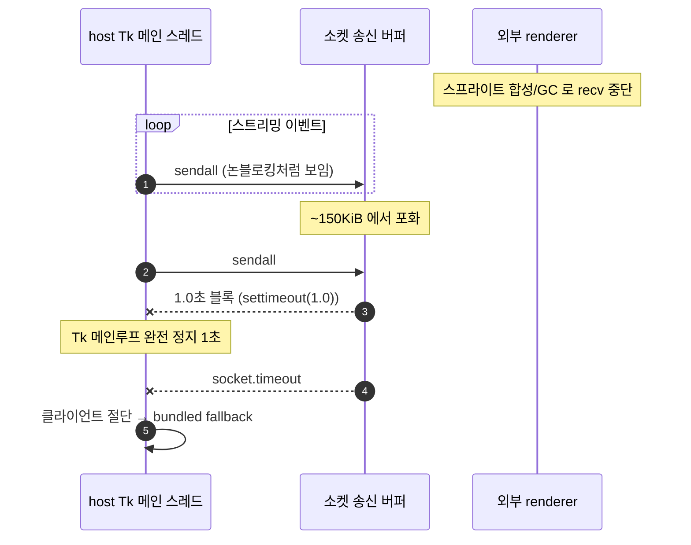
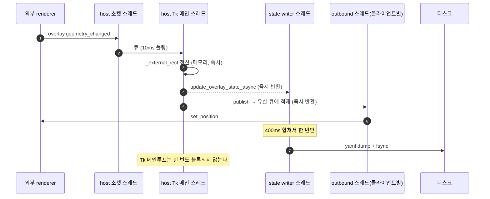

# 외장 오버레이 말풍선 채팅 — 흐름·동작·타이밍 설계

> `overlay.external_renderer.mode = replace` 로 외장 renderer 를 쓸 때, 말풍선 채팅
> 모드가 (1) 눈에 띄게 느리고 (2) 다른 창/팝업 뒤로 내려가야 할 때 내려가지 않는
> 문제의 설계 기준선. 원인은 추정이 아니라 이 문서의 "실측" 절 숫자에서 나왔다.

## 0. 무엇이 다른가 — bundled vs external

| | bundled | external(replace) |
| --- | --- | --- |
| 캐릭터 창 | host Tk `root` (topmost) | host `root` 는 `withdraw()`, 픽셀은 외부 프로세스 소유 |
| 말풍선 앵커 | `root.winfo_x/y` | `character._external_rect` — 렌더러가 보고한 좌표 |
| 포인터 입력 | Tk 바인딩(즉시) | 소켓 → 큐 → Tk 폴링 |
| z-order | 풍선은 host root 밑, root 는 topmost | **외부 창이 별도 topmost 프로세스 창** — host 는 그 z-order 를 알 방법이 없다 |
| 위치 저장 | 사용자가 드래그를 끝낼 때 | 렌더러가 `geometry_changed` 를 보낼 때마다 |

마지막 두 줄이 이 문서의 두 결함과 정확히 일치한다.

## 1. 흐름도 — replace 모드 말풍선 채팅



빨간 두 노드가 결함이다. **둘 다 Tk 메인 스레드 위에 있다.**

## 2. 동작(시퀀스) 다이어그램

### 2a. 지금 — 렌더러 이동 1회가 UI 전체를 세운다



### 2b. 지금 — 렌더러가 잠깐 멈추면 host 가 같이 멈춘다



### 2c. 목표



## 3. 타이밍 다이어그램

측정 환경: 이 PC, `intel_engram` Python, 격리 Tk/소켓/임시 state 파일.
스크립트는 `test/test_overlay_state_async.py` 의 회귀 테스트로 계약만 고정했고,
아래 절대값은 벤치 1회 실측이다.

```
Tk 메인 스레드 점유 (드래그 1초, 렌더러가 20건 geometry 보고)

지금
0ms                                                             1000ms
|===fsync===||===fsync===||===fsync===|...  (20 × 49ms ≈ 980ms)
^ 렌더 없음  ^ 키입력 없음  ^ 페이드 정지
말풍선 갱신: 사실상 0~2 프레임

수정 후 (실측)
0ms                                                             1000ms
|.|.|.|.|.|.|.|.|.|.|.|.|.|.|.|.|.|.|.|.|   (20건 합계 1.209ms)
                                    |=fsync=|  ← writer 스레드, 디스크 쓰기 1회
말풍선 갱신: 제한 없음
```

| 드래그 1회(geometry 20건) | 수정 전 | 수정 후 |
| --- | ---: | ---: |
| Tk 메인 스레드 점유 | 약 980ms | **1.209ms** |
| 디스크 쓰기 | 20회 | **1회** |
| flush 전 `get_overlay_state()` | — | 최신값 반환 (검증됨) |

```
클릭 → 반응 (입력창 열기)

지금   [renderer click]--(0~50ms 폴링 대기, 평균 25)-->[drain]-->[open]
목표   [renderer click]--(0~10ms, 평균 5)------------>[drain]-->[open]
```

```
z-order — 스트리밍 중 말풍선

지금   place() 마다 -topmost ON, 350ms 뒤 OFF 예약
       chunk 간격 < 350ms 이면 릴리스가 계속 취소된다
       ON ────────────────────────────────────  (사실상 영구 topmost)
       → 그 사이에 뜬 다른 앱 팝업을 덮는다
       스트리밍이 끝나면 350ms 뒤 갑자기 렌더러 뒤로 떨어진다

목표   포커스 상태에 종속
       ON  while (오버레이가 전경) ────┐
       OFF ───────────────────────────┴─── 다른 앱이 전경이 되는 즉시
```

## 4. 실측 (2026-09-06, 이 PC)

| 항목 | mean | p50 | p95 | max |
| --- | ---: | ---: | ---: | ---: |
| `-topmost` 토글 1회 (topmost 피어 있음) | 0.590ms | 0.501 | 1.134 | 2.939 |
| `lift()` 1회 | 0.011ms | 0.010 | 0.011 | 0.097 |
| `geometry()` 1회 | 0.980ms | 0.892 | 1.573 | 4.116 |
| **`update_overlay_state` 1회 (load+dump+fsync+replace)** | **49.391ms** | 46.321 | 71.654 | **108.493** |
| `sendall` 1건 (수신 정상) | 0.008ms | 0.009 | 0.011 | 0.071 |

`sendall`: 수신자가 recv 를 멈추면 **362건(약 150KiB)** 만에 포화, 이후 첫 호출이
`settimeout(1.0)` 만큼 블록한 뒤 `socket.timeout` 으로 클라이언트를 끊는다.

> **반증 기록.** 처음에는 `place()` 마다 도는 `-topmost` 토글을 지연의 주범으로
> 지목했다. 재보니 0.59ms 로, 초당 12프레임에서도 7ms 다. 지연 원인이 아니다.
> topmost 는 **z-order 결함**의 원인이지 **지연**의 원인이 아니며, 두 증상을 하나로
> 묶어 설명하려던 것이 오진이었다. 숫자가 그걸 갈라줬다.

## 5. 결함과 수정

### D1. 렌더러 geometry 1건 = fsync 1회, Tk 메인 스레드 (지연 주범)

`_handle_external_renderer_message` → `character.apply_external_geometry` →
`update_overlay_state` 는 yaml 을 다시 읽고, 덤프하고, **`os.fsync`** 하고,
`os.replace` 한다. 49ms/건. 렌더러가 자기 창 움직임을 보고하는 빈도만큼
Tk 메인루프가 그대로 선다.

bundled 모드에는 이 경로가 없다 — 그래서 외장에서만 느리다.

**수정.** `overlay/config.py` 에 `update_overlay_state_async(mutator)` 를 추가한다.

- 호출은 mutator 를 `_STATE_PENDING` 에 넣고 즉시 반환한다.
- 전용 daemon writer 스레드가 400ms 합침 창으로 깨어나, 대기 중인 mutator를
  **한 번의** load→apply→dump→fsync→replace 로 처리한다.
- `get_overlay_state()` 는 디스크를 읽은 뒤 아직 안 쓰인 pending mutator 를 순서대로
  덧씌워 반환한다 → **read-after-write 일관성이 유지된다.** 캐시를 따로 두지 않으므로
  "다른 쓰기 주체를 덮어쓰지 않는다"는 기존 성질도 그대로다.
- `flush_overlay_state(timeout)` 로 종료·테스트에서 강제 배출한다. `atexit` 등록.
- 기존 동기 `update_overlay_state` 는 남긴다. 종료 직전 저장처럼 내구성이 필요한
  자리는 계속 그걸 쓴다.

적용 대상은 "사용자 조작을 따라 자주 갱신되는" 위치 저장뿐이다:
`apply_external_geometry`, launcher 위치 저장, 말풍선 수동 위치 저장.

### D2. `publish` 가 Tk 메인 스레드에서 blocking `sendall` (정지·강제 절단)

`OverlayEventPublisher.publish` 는 호출 스레드에서 곧장 `connection.sendall` 한다.
렌더러가 애니메이션 합성 등으로 잠깐 recv 를 멈추면 host Tk 가 최대 1초 정지하고,
그 다음 렌더러가 끊겨 bundled 로 떨어진다. 사용자에겐 "갑자기 멈추더니 캐릭터가
원래 것으로 돌아감" 으로 보인다.

**수정.** 클라이언트마다 유한 outbound 큐 + 송신 스레드를 둔다.

- `publish` 는 큐에 넣고 즉시 반환한다. 메인 스레드는 절대 소켓을 만지지 않는다.
- 큐가 차면 **의미 이벤트(가장 오래된 것)부터 버린다.** `overlay.set_position` /
  `set_size` / `show` / `hide` 같은 제어 메시지와 `engram.welcome` /
  `state.snapshot` / `renderer.assignment` 는 절대 버리지 않는다 — 이것들을 버리면
  창 위치·표시 상태가 영구히 어긋난다.
- 송신 스레드에서 `sendall` 이 실패하면 지금과 동일하게 클라이언트를 정리한다.

### D3. 인바운드 50ms 폴링 (체감 반응 지연)

`root.after(50, _drain_external_renderer_messages)` 때문에 렌더러의 모든 입력이
평균 25ms, 최대 50ms 늦게 처리된다. 드래그 중에는 여러 모션이 한 틱에 몰려
같은 프레임에서 처리되어 끊겨 보인다.

**수정.** 폴링 간격을 10ms 로 줄인다. 빈 큐 확인은 마이크로초 단위라 비용이 없다.
Tk 는 스레드 안전하지 않으므로 소켓 스레드에서 `after` 를 부르는 방식은 쓰지 않는다.

### D4. z-order 를 350ms 타이머로 추측한다 (다른 창 뒤로 안 감)

`BubbleWindow.place()` → `_raise_above_external_replace()` 는 `-topmost` 를 켜고
`after(350, release)` 를 예약한다. `place()` 가 다시 불리면 릴리스가 취소되고
다시 예약된다.

- 스트리밍 중에는 텍스트 청크 간격이 350ms 보다 짧다 → **릴리스가 영원히 오지 않는다.**
  풍선이 사실상 영구 topmost 가 되어 그 사이 뜬 다른 앱 팝업을 덮는다.
- 스트리밍이 끝나면 350ms 뒤 갑자기 topmost 를 놓아 외부 렌더러 뒤로 떨어진다.
- 근본 원인: **Event API v2 에 z-order/활성화 개념이 없다.** host 는 자기 풍선이
  외부 렌더러보다 위인지 알 방법이 없어서, 시간으로 추측하고 있었다.

**수정.** 시간이 아니라 전경(foreground) 상태에 종속시킨다.

- host 가 250ms 주기로 `GetForegroundWindow()` 를 본다.
- 전경 창이 host 소유(HWND 집합)이거나, 최근 400ms 안에 렌더러가 pointer.action 을
  보냈다면 → **오버레이가 전경**. 풍선의 `-topmost` 를 유지한다.
- 그 외 → 사용자가 다른 앱으로 갔다. **모든 풍선의 `-topmost` 를 즉시 내린다.**
  풍선은 계속 보이지만 다른 창 뒤로 정상적으로 내려간다.
- 사용자가 렌더러나 풍선을 다시 클릭하면 그 즉시 복귀한다.
- `place()` 는 더 이상 topmost 를 만지지 않고 `lift()` 만 한다.

이 규칙은 InputBar 의 기존 정책(`keep_topmost=True` + 포커스 동안 유지)과 같은
의미다 — 그걸 speech/thought/echo 로 일반화하는 것이다.

## 6. 검증 기준과 결과

자동 검증은 `test/test_external_overlay_latency.py` 가 소유한다.

| | 기준 | 결과 |
| --- | --- | --- |
| D1 | geometry 100건 큐잉 < 50ms, 디스크 쓰기 ≤ 3, flush 전 읽기가 최신값 | PASS |
| D2 | 수신 멈춘 클라이언트에 `publish` 1000건이 각각 < 25ms, 제어 메시지 무손실 | PASS |
| D3 | 인바운드 드레인 간격이 `_RENDERER_DRAIN_MS`(10ms) | PASS |
| D4 | 렌더마다 타이머 예약 없음, 전경 상실 시 topmost 해제·복귀 시 재획득,<br/>InputBar 의 `keep_topmost` 정책은 전경 폴링의 영향을 받지 않음 | PASS |

기존 스위트: `test_overlay_event_api.py`, `test_overlay_event_api_v2.py`,
`test_overlay_position_and_manifest.py`, `test_bubble_bootstrap.py`,
`test_overlay_hot_reload.py`, `test_runtime_config.py`,
`test_overlay_config_legacy_character.py` 합계 **150 passed + 11 subtests**.

### 실행 중인 호스트 실측 (2026-09-06 21:3x, source PID 27092)

Bolttagu 가 replace owner 로 붙어 있는(pythonw 38220 → host 61870 Established) 상태에서
observer 를 붙여 잰 값. 사용자 선택은 건드리지 않았다.

| 항목 | 결과 |
| --- | --- |
| D3 — 렌더러 입력 → host 반응 왕복 | mean 10.89ms / **p50 10.76 / p95 15.41** / max 16.60 (n=29) |
| D2 — 수신을 멈춘 peer 에게 broadcast 1,049건을 밀어 넣는 동안 | p50 **10.50** / p95 12.80 / max 12.96, **유실 0** |
| D2 — 그 peer 가 끊긴 뒤 | p50 10.77 / p95 12.54 (변화 없음) |

수정 전이라면 D2 구간에서 소켓 버퍼가 차는 순간 Tk 가 1.0초 정지하고 그 peer 를
끊었을 것이다. 왕복 지연이 전혀 흔들리지 않았다.

### 실기 육안 검증 (2026-09-06 22:2x, source PID 53008, Bolttagu replace)

합성 입력으로 실제 UI 를 조작해 확인했다. 클릭 전 대상 창 확인, 타이핑 전
전경 소유 확인을 강제하는 가드를 통과한 조작만 반영했다.

| 단계 | 창 순서 (z, TOP=WS_EX_TOPMOST) | 판정 |
| --- | --- | --- |
| 응답 생성 중 | 답변 164x464 **TOP z=1**, echo **TOP z=2** | 앞 |
| 다른 앱(메모장) 활성화 | 메모장 z=4, 답변 `---` z=5, echo `---` z=7 | **뒤로 내려감** |
| 렌더러 재클릭 | 답변 **TOP z=1** 복귀 | 앞 |

스크린샷으로도 확인했다 — 메모장 활성화 시 답변 풍선이 메모장 위쪽 가장자리에서
잘려 보이고, 복귀하면 다시 온전히 덮는다.

지연 관련:

| 항목 | 실측 |
| --- | --- |
| 캐릭터 클릭 → 입력창 출현 | 265ms 이내 |
| 입력창 클릭 → topmost 획득 | 즉시 (`---` z=4 → `TOP` z=1) |
| 재시작 클릭 → 호스트 화면 사라짐 | **176ms** (수정 전에는 약 10초간 그려진 채 정지) |
| 재시작 복귀 상태 | Bolttagu 270x302 full — 펼침 복원 |

> **관측 함정 두 가지.** (1) `ImageGrab` 을 z-order 변경 직후에 찍으면 재합성 전
> 프레임을 잡아 "아직 앞에 있다"로 보인다. 1.5초 정착 뒤 찍어야 한다. (2) 화면
> 좌표를 캐시해두고 클릭하면 안 된다 — 오버레이가 접히거나 재시작으로 위치가
> 바뀐 뒤 그 좌표는 다른 앱을 가리키고, 그 상태로 타이핑하면 입력이 엉뚱한
> 창으로 들어간다. 실제로 한 번 그렇게 프롬프트가 사용자 터미널로 새어 들어갔다.
> 그래서 하네스가 클릭 전 `WindowFromPoint` 로 대상 창을, 타이핑 전 전경 소유를
> 확인하도록 고쳤다.

### 2차 수정 — 물러남은 태그 해제가 아니라 재적층이다 (2026-09-06 22:4x)

1차 수정은 `-topmost` 를 끄기만 했다. Windows 는 그때 창을 **non-topmost 밴드의
맨 위**로 옮긴다 — 방금 활성화된 앱보다 여전히 앞이다. 그래서 사용자에게는 전혀
고쳐지지 않은 것으로 보였고, 앞선 측정이 한 번 통과한 것은 클릭 재활성화 순서가
우연히 맞았기 때문이다.

- `place_behind(win, hwnd)` 로 `SetWindowPos(hwnd_of_win, activated_hwnd, NOMOVE|NOSIZE|NOACTIVATE)`
  를 호출해 **활성화된 창 바로 아래**에 끼워 넣는다. 상태 변화가 없어도 매 poll 마다
  적용한다 — "다시 앞으로 올린 뒤에는 두 번째부터 안 물러난다"가 정확히 이것이었다.
- InputBar 도 같은 규칙을 따른다. replace 모드에서는 host 가 OS 포커스를 못 얻으므로
  포커스 기반 hold 는 영원히 발동하지 않고, 입력창이 다른 창 밑에서 열려 "아예 안
  뜬다"로 보였다. `place()` 의 `keep_topmost` 예외를 없앴다(예외의 이유였던 350ms
  펄스가 사라졌으므로 더는 필요 없다).

실측 (host 55476):

| 단계 | 창 순서 |
| --- | --- |
| 오버레이 전경 | INPUT **TOP z=1**, 답변 **TOP z=2** |
| 메모장 활성화 | notepad z=1, INPUT `---` z=2, 답변 `---` z=3 |
| 렌더러 재클릭 | 답변 **TOP z=1** |
| 메모장 **다시** 활성화 | notepad z=1, 답변 `---` z=3 |

스크린샷 4장으로 확인했다 — 메모장 활성화 시 두 풍선이 완전히 가려지고,
재활성화에서도 동일하며, 복귀하면 입력창과 답변이 함께 앞에 선다.

### 3차 수정 — 앵커는 턴보다 오래 살면 안 된다 (2026-09-06 23:0x)

"완료된 응답 풍선을 한 번 클릭해야 다른 창 뒤로 간다"는 보고. 규칙이
"참여 시점에 앞에 있던 창과 *다른* 창이 활성화될 때만 물러난다"였기 때문이다.
사용자가 에디터에서 타이핑해 제출하면 앵커가 그 에디터가 되고, 응답이 끝난 뒤
같은 에디터를 다시 클릭해도 "다른 창"이 아니라 물러나지 않는다. 풍선을 한 번
클릭하면 앵커가 풍선으로 바뀌어 그때부터 동작한다 — 보고된 그대로다.

앵커는 **생성 중에만** 필요하다(그동안 전경은 사용자가 타이핑한 앱이고 바뀌지
않으므로). 턴이 끝나면 오버레이가 아닌 창이 앞이면 그냥 물러난다.

함께 고친 것: 렌더러 PID 를 "클릭이 왔을 때의 전경 프로세스"로 추측하던 것을
**인증된 replace 연결의 소켓 피어**에서 확정하도록 바꿨다
(`GetExtendedTcpTable`). 클릭 없이 대화를 연 세션에서는 학습이 아예 일어나지
않아, 렌더러가 앞인데도 풍선이 물러나는 결함이 있었다. host 는 여전히 렌더러의
경로·명령·manifest 를 알지 못한다 — 자기 소켓의 상대편만 본다.

실측 (host 24340):

| 단계 | 창 순서 |
| --- | --- |
| 응답 완료, 아무것도 클릭 안 함 | 전경(Bolttagu) z=2, 답변 **TOP z=1** |
| 메모장 활성화 | 전경(메모장) z=2, 답변 `---` z=3 |
| 같은 메모장 **재차** 활성화 | 전경 z=2, 답변 `---` z=3 |

### 4차 수정 — 신호는 상태가 아니라 클릭이다 (2026-09-06 23:2x)

사용자가 정리해준 기대: **응답이 끝난 뒤에도, 사용자가 어느 창에서 작업하든
응답창은 계속 맨 위에 있다. 사용자가 다른 창을 눌러서 작업하는 순간 그 창이
앞으로 온다.**

그래서 판정 대상이 "어느 창이 전경을 *쥐고 있나*"가 아니라 "사용자가 무엇을
*눌렀나*"다. 두 시도가 각각 다른 쪽으로 틀렸다.

| 시도 | 규칙 | 무엇이 틀렸나 |
| --- | --- | --- |
| 3차 | 오버레이가 아닌 창이 전경이면 물러난다 | 제출하면 입력 Entry 가 파괴되고 Windows 가 그 에디터로 전경을 되돌린다 — 사용자가 누른 게 아닌데 완료 즉시 뒤로 갔다 |
| 2차 | 전경이 *바뀌면* 물러난다 | 제출한 그 에디터는 이미 전경이라 다시 눌러도 변화가 없다 — 풍선을 한 번 클릭해야 동작했다 |
| 4차 | **마우스 버튼이 눌렸고 그 순간 전경이 오버레이가 아니면** 물러난다 | 두 경우를 모두 덮는다 |

키보드 제출은 클릭이 아니므로 완료 후에도 유지되고, 같은 창을 다시 누르는 것도
클릭이므로 잡힌다.

`GetAsyncKeyState` 의 "지난 호출 이후 눌림" 저비트는 문서상 부정확하다고 되어
있고 실제로 전혀 발동하지 않았다. 25ms 주기로 **고비트의 상승 엣지**를 잡아
래치하고, 250ms 전경 폴이 그것을 소비한다 — 이 저장소가 이미 자기 메뉴 바깥
클릭 감지에 쓰는 방식과 같다.

실측 (host 43924, 생성 중 전경은 Bolttagu):

| 단계 | 결과 |
| --- | --- |
| 응답 완료, 무조작 | 답변 **TOP z=1** |
| +4초, 여전히 무조작 | 답변 **TOP z=1** |
| 메모장 클릭 | 전경 z=2, 답변 `---` z=3 |
| 메모장 다시 클릭 | 전경 z=2, 답변 `---` z=3 |
| 캐릭터 클릭 | INPUT TOP z=1, 답변 TOP z=2 |

**알려진 한계.** 마우스 버튼만 본다. Alt+Tab 같은 키보드 창 전환으로는 물러나지
않는다. 클릭 없이 전경만 바꾸는 경로는 Windows 가 `SetForegroundWindow` 를
막아 합성 검증이 불가능했고, 유닛 테스트로만 고정했다.

### 아직 검증되지 않은 것

**D1 만 남았다.** 렌더러 창을 실제로 끌면서 `~/.engram/overlay.state.yaml` 의 수정
시각이 드래그 내내 초당 여러 번 뛰는지, 끝나고 한 번만 뛰는지를 봐야 한다. 합성
드래그는 렌더러 자신의 이동 처리와 뒤엉켜 신뢰할 수 없어서 재지 않았다.

D4 의 렌더러 식별은 실기에서 동작했다 — Bolttagu 창은 클릭을 받으면 전경이 되므로
`_renderer_pid` 학습이 성립한다. 전경이 되지 않는 창 스타일을 쓰는 다른 renderer
에서는 여전히 성립하지 않으며, 그 경우 풍선이 렌더러 뒤로 내려간다.

## 관련

[[external-overlay-api-design]], [[external-overlay-event-api-v2]], [[overlay-bubble-mode]]
