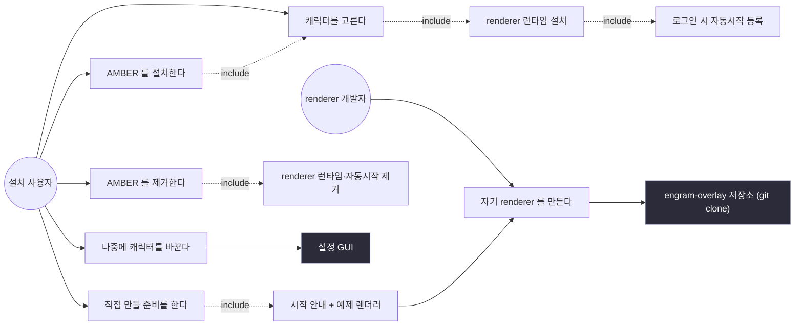
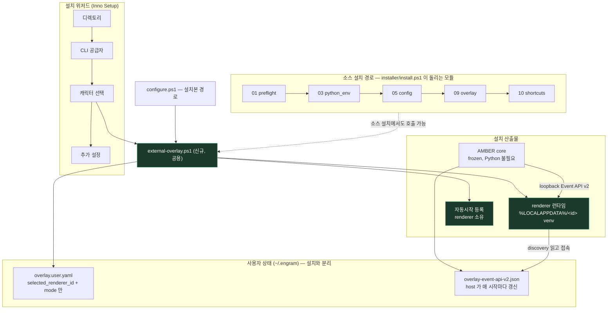
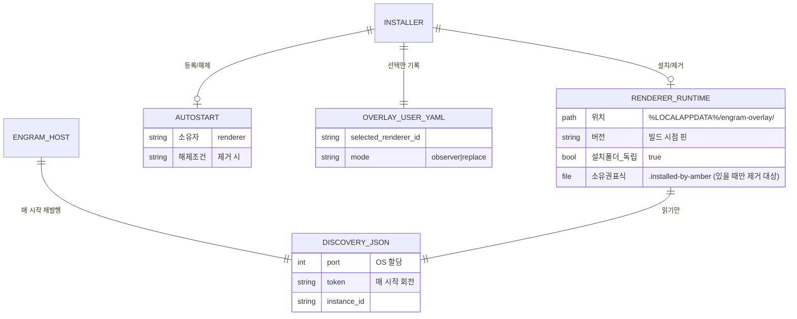
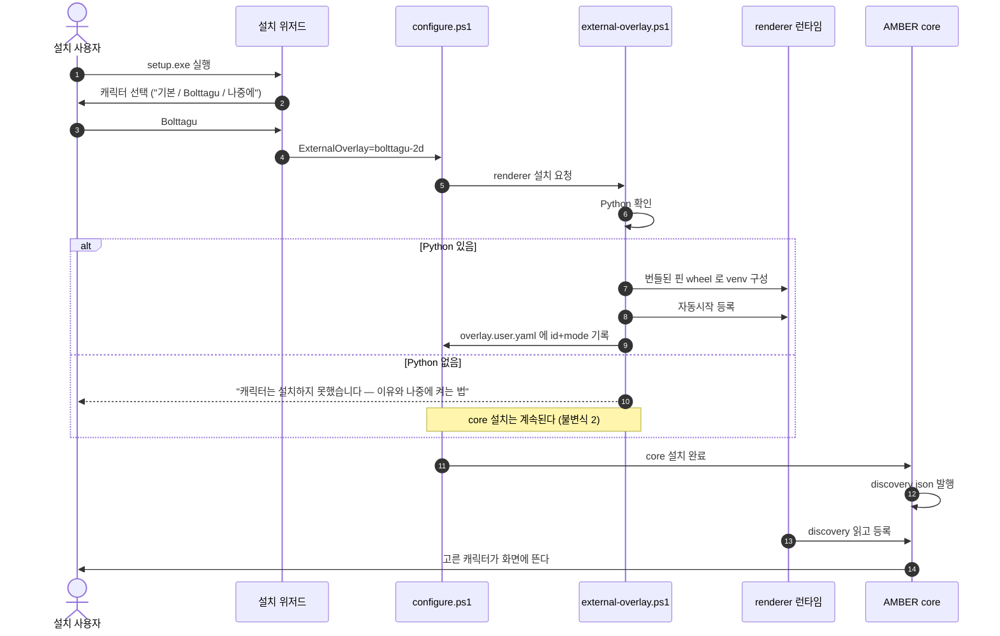

# 외부 오버레이 설치 — 설치 사용자 시점 기획

> AMBER installer 가 외부 renderer(캐릭터)를 함께 설치하도록 하는 건의 기획서.
> `.agents/skills/software-engineering`(gui-app-planning) 절차를 따른다.
> **§1 헌법과 §7 결정 사항은 2026-09-07 확정됐다.**
> 구현은 착수하지 않은 상태다.

## 0. 지금 무엇이 있고 무엇이 막혀 있나 (as-is, 사실)

| 구성요소 | 현재 상태 |
| --- | --- |
| Inno Setup 위저드 | 디렉토리 → CLI 공급자 → **외부 오버레이** → 추가설정(Ollama 모델/Identity) |
| 외부 오버레이 페이지 | 3지선다. 2개가 "현재 릴리스에서 사용 불가"로 **비활성** |
| 비활성 사유(코드에 박힌 문구) | `고정 공개 릴리스 v1.1.0.89에는 self-contained preset/SDK asset이 없습니다` |
| configure 모듈 | 01 preflight → 02 interactive → 03 python_env → 04 deps → 05 config → 06 db → 07 shims → 08 env → 09 overlay → 10 shortcuts |
| 사용자 데이터 | `~/.engram` (설정·상태·로그·discovery). 설치 폴더와 분리됨 |
| AMBER 런타임 | frozen. 시스템 Python 불필요 |
| renderer 런타임 | `engram-overlay`의 `scripts/install-runtime.ps1` — `%LOCALAPPDATA%` 아래 venv. **`python -m venv` 를 쓰며 폴백이 없다** |
| renderer 자동시작 | `install-runtime.ps1 -Autostart` (renderer 자신이 소유) |
| Engram ↔ renderer | Event API v2. Engram 은 renderer 를 **실행·종료하지 않는다** |
| renderer 런타임 경로 | `%LOCALAPPDATA%/engram-overlay/runtime` — **preset 별이 아니라 단일 디렉토리**. preset 은 launcher 인자로 고른다 |
| renderer 자동시작 | HKCU `...\CurrentVersion\Run` 의 값 **`EngramOverlay` 하나**. `runtime/Scripts/engram-custom-overlayw.exe`(콘솔 없는 gui-script)를 가리킨다 |
| renderer 의존성 | `Pillow>=10.0` |
| 설치 진입점 | **둘이다.** 설치본은 `configure.ps1`, 소스 설치는 `installer/install.ps1` 이 `modules/01..10` 을 돌린다 |

> **초안의 사실 오류 정정 (구현 중 코드에서 확인).**
> ① 신규 로직을 `configure.ps1` 의 모듈로 그렸는데, `configure.ps1` 은 모듈을 돌리지
> 않는다. 설치 사용자가 타는 경로가 `configure.ps1` 이므로 로직은 두 진입점이 공유하는
> 스크립트에 두어야 한다.
> ② 런타임을 `<id>` 별로 그렸는데 실제로는 `runtime` 단일 디렉토리다. 그래서 "사용자
> 소유 vs installer 소유"는 **같은 하나의 폴더**를 두고 갈린다 — §7.1 의 "이미 있으면
> 표식을 쓰지 않는다"가 예외가 아니라 핵심 규칙이 된다.
> ③ 자동시작 값 이름이 `EngramOverlay` 하나다. 네임스페이스로 나누면 두 renderer 가
> 동시에 떠서 화면에 캐릭터가 둘 생긴다(observer 는 자기 창을 그린다). §7.1 수정.
> ④ `Pillow` 의존성 때문에 **완전 오프라인 설치는 지금 범위 밖**이다. §7.4.

`v1.1.0.89` 는 4곳에 하드코딩돼 있고 이미 낡았다(현재 `v1.1.1.158`).

## 1. 기획 헌법 (확정 2026-09-07)

- **메인 기능 1개**: 설치를 마치면 **사용자가 고른 캐릭터가 화면에 떠 있다.** 나머지는 이걸 돕는다.
- **주 사용자 1명 (확정)**: **자기 캐릭터를 만들거나 고칠 개발자.** `engram-overlay` 는
  소스를 clone/fork 해 쓰는 source-first 툴킷이고, "Python 은 이미 있다"를 전제한 D1 도
  이쪽이다. 기본 캐릭터로 만족하는 사용자는 이 옵션을 건드리지 않고 지나간다.
- **불변식(절대 하지 않는 것)**
  1. Engram 런타임은 renderer 프로세스를 **실행·종료하지 않는다.** installer 가 설치·등록을 대신할 수는 있지만, 실행 소유권은 renderer 자신에게 있다.
  2. renderer 설치에 실패해도 **AMBER core 설치는 성공한다.** 캐릭터는 번들로 떨어진다.
  3. 설치 시점에 **네트워크로 "최신"을 끌어오지 않는다.** 빌드 때 검증한 버전만 배포한다.
  4. 사용자 데이터(`~/.engram`)는 재설치·업그레이드로 지워지지 않는다.
  5. renderer 는 사용자 폴더 안에서만 산다. 설치 폴더를 지워도 계속 돌고, 지우면 완전히 사라진다.
- **우선순위**: 캐릭터가 뜬다 > 실패해도 core 는 산다 > 되돌릴 수 있다 > 개발자 확장

## 2. 사용자 시점에서 지금 화면이 왜 틀렸나

현재 질문은 **배포 형태**를 묻는다.

```
( ) 설치 안 함 (권장)
( ) Preset provider — 현재 릴리스에서 사용 불가
( ) Renderer SDK — 현재 릴리스에서 사용 불가
```

- 설치하는 사람은 "preset provider"가 무엇인지 모른다. 그가 아는 건 *"기본 캐릭터 말고 다른 걸 쓰고 싶다"* 뿐이다.
- `Renderer SDK` 는 **자기 renderer 를 만들 개발자**용이다. 설치 사용자와 다른 청중이 라디오 하나에 섞여 있다.
- 선택지 두 개가 상시 비활성이면, 사실상 "선택지가 없는 선택 화면"이다.

**바꿀 질문**: *"캐릭터를 무엇으로 쓸까요?"*

```
(•) 기본 캐릭터            — 추가 설치 없음
( ) Bolttagu               — [미리보기]
( ) 나중에 고르기          — 설정에서 언제든 바꿀 수 있습니다
```

**초안의 진단은 반만 맞았다.** 문제는 SDK 가 이 화면에 있는 것이 아니라 **배타 선택
(라디오) 안에 있었던 것**이다. 캐릭터를 고르는 것과 개발환경을 준비하는 것은 배타적이지
않다 — 둘 다 원할 수 있다. 라디오에서 빼고 **체크박스로** 두면 청중 충돌이 사라진다.

```
캐릭터를 무엇으로 쓸까요?
 (•) 기본 캐릭터            — 추가 설치 없음
 ( ) Bolttagu               — [미리보기]
 ( ) 나중에 고르기          — 설정에서 언제든 바꿀 수 있습니다

 [ ] 직접 만들 준비도 함께 (개발자용)
     직접 만들 수도 있습니다. 체크하면 시작 안내와 예제 렌더러를 함께 준비합니다.
```

그리고 **README 로 옮기는 것은 답이 아니다** — 아무도 README 를 읽지 않으므로
"만들 수 있다"는 사실 자체가 사라진다. 인지 표면은 §2.1 에서 따로 세운다.

## 2.1 발견 가능성은 선택과 다른 문제다

라디오는 **결정** 표면이고, "만들 수 있다"는 사실은 **인지** 표면이 필요하다. 둘을 한
위젯에 밀어넣으면 결정이 흐려지고, 결정만 남기면 인지가 사라진다. 자리를 나눈다.

현재 설정 GUI 에 이미 있는 것과 그 한계:

| 현재 | 한계 |
| --- | --- |
| 회색 작은 라벨 `커스텀 오버레이 적용 방법` + `?` 버튼, 우측 정렬 | 각주처럼 보인다. 그리고 "**적용**"은 이미 가지고 있다고 전제한다 — 만들 수 있다는 말이 아니다 |
| `?` 가 Event API v2 명세를 연다 | "나도 만들 수 있나?" 하고 누른 사람이 JSONL 와이어 규격을 만난다 |
| 연결된 renderer 가 없으면 콤보박스는 빈 채, 상태줄은 "확인하는 중입니다" | **가장 가르치기 좋은 빈 화면이 죽은 공간**이다 |

바꿀 자리 — **네 곳 모두 채택(확정)**:

| 자리 | 무엇 | 왜 거기인가 |
| --- | --- | --- |
| 캐릭터 선택 페이지 하단 | 라디오가 아닌 **한 줄 힌트** — "직접 만들 수도 있습니다 (설치 후 설정에서 안내)" | 설치 중 사용자가 캐릭터를 생각하는 유일한 순간. 단계가 늘지 않는다 |
| 설치 완료 페이지 | 체크박스 **"나만의 캐릭터 만드는 법 보기"** (기본 꺼짐) | 지금 궁금한 사람의 경로. 설치 흐름을 길게 하지 않는다 |
| **설정 → 외부 오버레이의 빈 상태** | "연결된 오버레이 없음" 자리에 **[직접 만들기] [예제 받기]** 버튼 | 기본 캐릭터가 질렸을 때 실제로 가는 곳. 반복 노출된다 |
| `?` 목적지 | 프로토콜 명세 → **시작 안내**(clone → install-dev → skill → 등록). 명세는 그 안내 안의 링크 | 동기와 첫 화면이 맞아야 한다 |
| 라벨 문구 | `커스텀 오버레이 적용 방법` → **`직접 만들거나 가져오기`** | "적용"은 이미 가졌다고 전제한다 |

가장 값이 큰 곳은 **설정의 빈 상태**다. 설치 시점에는 아직 기본 캐릭터에 질리지 않았고,
질린 시점에 사용자가 가는 곳은 설정이다. 동기가 생기는 자리에 안내가 있어야 한다.


## 3. 유스케이스



개발자가 **주 사용자**로 확정됐으므로 `UC5` 는 installer 안이다. 다만 installer 가
할 수 있는 것은 §7 D8 의 제약을 받는다 — 개발환경의 본체는 git checkout 이고
그건 installer 가 만들어줄 수 없다.

## 4. 컴포넌트 / 레이어



신규는 **공용 스크립트 하나(`installer/external-overlay.ps1`)와 그 산출물뿐**이다.
설치본이 타는 `configure.ps1` 이 이걸 호출하고, 소스 설치 경로도 같은 함수를 쓴다.
core 경로는 건드리지 않는다.

## 5. 지속 상태의 소유권

누가 무엇을 쓰는지가 흐려지면 업그레이드·제거에서 반드시 깨진다.



**Engram 은 renderer 의 실행 파일·인자·설치 경로를 저장하지 않는다.** 선택 ID 와 mode 뿐이다.
이 불변식은 installer 가 renderer 를 깔아준 뒤에도 유지된다.

## 6. 메인 흐름 — 설치 시퀀스



실패 분기가 **사용자에게 보이는 문장으로 끝난다**는 점이 핵심이다. 조용히 넘어가면
"골랐는데 왜 기본 캐릭터지?"가 된다.

## 7. 결정 사항 (확정)

| # | 결정 | 근거 |
| --- | --- | --- |
| D1 | **쓸 수 있는** Python 이 없으면 **안내만 하고 core 는 설치한다.** renderer 는 설치하지 않는다. 적격성 판정은 §7.3 | `engram-overlay` 는 소스를 clone/fork 해 쓰는 개발 툴킷이라 대상 사용자는 이미 Python 이 있다. 자립 실행본은 일반 사용자로 청중이 넓어질 때의 후속 |
| D2 | renderer wheel 을 **빌드 시 번들**한다. 설치 시점에 받아오지 않는다 | 사내망·오프라인에서 설치가 깨지지 않는다. setup.exe 약 9MB 증가는 190MB 대비 무시할 수준 |
| D3 | 자동시작을 **기본으로 켠다** | 안 켜면 재부팅 후 캐릭터가 사라져 "설치했는데 없어졌다"가 된다 |
| D4 | 제거 시 **installer 가 만든 것만** 지운다. 지우기 전 **한 번 확인**한다 | 삭제는 되돌릴 수 없다(스킬: 되돌릴 수 있으면 묻지 말고, 없으면 확인) |
| D5 | 업그레이드는 **installer 소유 런타임만** 올린다 | 사용자 소유는 그의 것이다. §7.1 참조 |
| D6 | 위저드 미리보기는 **넣는다** (슬라이스 2) | 이름만으로는 무엇이 나올지 모른다 |
| D9 | renderer 런타임은 **base 인터프리터에 계속 묶인다.** 복구 경로를 함께 설치한다. §7.3 | venv 는 자립하지 않는다. base Python 이 사라지면 캐릭터가 이유 없이 사라진다 |
| D8 | SDK 체크박스는 **개발환경을 만들어주는 척하지 않는다.** §7.2 참조 | 개발환경의 본체는 git checkout 이고 installer 는 그걸 정직하게 만들 수 없다 |
| D7 | 핀 버전은 **빌드 define 하나**로 둔다 | 지금 4곳 하드코딩이라 이미 낡았다. 오늘 `runtime_contract` 의 `1.5.6` 리터럴과 같은 패턴 |

### 7.1 사용자가 SDK 로 직접 만든 오버레이와의 공존

D4·D5 의 실제 위험은 여기 있다. 사용자가 SDK 로 자기 renderer 를 만들었다면
**그건 그의 작업물이지 installer 의 산출물이 아니다.** 제거·업그레이드가 그걸 건드리면
사용자의 코드를 지우는 셈이 된다. `install-dev.ps1` 은 checkout 을 **링크**하므로
그 폴더를 지우면 그의 저장소 작업 흐름까지 깨진다.

경로 규칙으로 구분하면 이름이 겹치는 순간 깨진다. **소유권 표식을 런타임 폴더 안에 둔다.**

| | installer 소유 | 사용자 소유 |
| --- | --- | --- |
| 만든 주체 | `installer/external-overlay.ps1` (configure 가 호출) | `install-runtime.ps1` / `install-dev.ps1` 를 사용자가 직접 |
| 표식 | `runtime/.installed-by-amber` — AMBER 버전 · 쓴 인터프리터 · 자동시작 값 · 설치 시각 | 없음 |
| 자동시작 | 같은 값 `EngramOverlay` 를 쓰되 **써넣은 값을 표식에 기록**한다. 제거 시 현재 값이 기록과 같을 때만 지운다 | 사용자가 다시 설정했으면 값이 달라져 있으므로 건드리지 않는다 |
| AMBER 제거 시 | 확인 후 삭제 | **건드리지 않는다** |
| AMBER 업그레이드 시 | 핀 버전으로 갱신 | **건드리지 않는다** |

규칙은 한 문장이다 — **표식이 없으면 우리 것이 아니다.**

파생 규칙:

- 표식은 런타임 폴더 **안**에 둔다. 별도 목록으로 관리하면 사용자가 폴더를 옮겼을 때
  목록과 실물이 어긋나 엉뚱한 것을 지운다. 설명 대상 옆에 두면 항상 같이 움직인다.
- 사용자가 그 런타임을 자기 것으로 가져가고 싶으면 **표식 파일만 지우면 된다.**
  그 순간부터 AMBER 는 손대지 않는다. 되돌리는 방법이 파일 하나여야 한다.
- installer 는 **이미 존재하는 런타임 폴더에 표식을 새로 쓰지 않는다.** 사용자가 먼저
  같은 id 로 만들어 둔 것을 소유권 주장으로 빼앗으면 안 된다. 이 경우 설치를 건너뛰고
  "이미 설치된 renderer 를 사용합니다"라고 알린다.
- 자동시작은 **네임스페이스로 나누지 않는다.** 값 이름이 하나(`EngramOverlay`)인데 둘로
  쪼개면 renderer 가 둘 떠서 화면에 캐릭터가 둘 생긴다 — observer 는 자기 창을 그린다.
  대신 **써넣은 값 문자열을 표식에 기록**하고, 제거 시 현재 값이 기록과 같을 때만 지운다.
  사용자가 그 뒤에 다시 설정했으면 값이 달라져 있으므로 그건 그의 것이다.
- 제거 확인 문구는 **무엇을 지우는지 말한다**: "AMBER 가 설치한 캐릭터 런타임
  (`<경로>`)도 함께 지울까요? 직접 만드신 오버레이는 지우지 않습니다."

### 7.2 SDK 체크박스가 실제로 할 수 있는 일 (D8)

`install-dev.ps1` 의 첫 줄은 *"Set up **this checkout** as a runnable renderer"* 다.
개발환경은 **git checkout** 을 전제한다. installer 가 가진 것은 번들된 wheel/sdist 뿐이다.

sdist 를 풀어 checkout 처럼 쓰는 건 더 나쁜 출발점이다:

- `.git` 이 없어 `git pull` 로 갱신할 수 없다.
- `_version.py` 가 `git rev-list` 로 build 자리를 산출하므로 **버전이 `x.y.z.0` 이 된다.**
  (2026-09-07 릴리스 빌드에서 wheel 이 `1.1.1.0` 으로 나왔던 원인이 정확히 이것이다.)
- 저장소 로컬 `create-engram-overlay` skill 이 sdist 에 들어있다고 보장할 수 없다.

**그래서 체크박스가 하는 일은 이 셋뿐이다:**

1. 고른 preset 의 **renderer 런타임을 설치한다** — 번들 wheel 로 가능하다. 개발자가
   맨 처음 필요한 건 "돌아가는 참조 구현"이고 그건 즉시 준다.
2. **시작 안내 페이지 + 시작 메뉴 바로가기**를 놓는다. `git clone` 부터
   `install-dev.ps1`, `create-engram-overlay` skill 사용까지 실제 명령을 적는다.
3. 그 이상은 하지 않는다. **checkout 을 위조하지 않는다.**

오프라인·사내망에서 `git clone` 이 막힌 경우에만, 번들 sdist 를 사용자가 지정한 폴더로
풀어주는 경로를 **명시적 폴백**으로 둔다. 이때 화면에 한계를 그대로 적는다 —
"오프라인용 씨앗입니다. 갱신과 버전 표기는 정식 clone 에서만 정상 동작합니다."

### 7.3 "Python 이 있으면 venv" 의 실제 조건 (D1·D9)

`install-runtime.ps1` 은 `python -m venv <LOCALAPPDATA>/...` 를 쓴다. 즉 런타임은
**PATH 의 `python` 이 가리키는 인터프리터를 기반으로** 만들어진다. 여기에 세 가지가 붙는다.

**(1) venv 는 자립하지 않는다.** 실제 `pyvenv.cfg`:

```
home = C:/Users/<user>/miniconda3
executable = C:/Users/<user>/miniconda3/python.exe
include-system-site-packages = false
version = 3.13.9
```

Windows venv 는 자기 `Scripts/python.exe` 를 갖지만 **표준 라이브러리는 base 설치를
참조한다.** base Python 을 제거·이동·메이저 업그레이드하면 런타임이 깨진다.
`install-runtime.ps1` 이 말하는 "copied rather than linked" 는 *checkout* 에 묶이지
않는다는 뜻이고, **인터프리터에는 계속 묶여 있다.**

이 구성에서 특히 위험하다 — **AMBER core 는 frozen 이라 Python 이 필요 없다.** 사용자가
"AMBER 는 frozen 인데 Python 은 왜 있지" 하고 지울 동기가 실재하고, 그러면 캐릭터가
이유 없이 사라진다. 실패는 조용하다: 자동시작이 실패해도 배경 프로세스라 아무 말이 없고,
Engram 은 연결된 renderer 가 없으니 번들 캐릭터를 띄운다. **사용자에게는 "그냥 없어졌다"** 다.

**(2) 버전 가드가 없다.** `engram-overlay` 는 `requires-python = ">=3.11"` 인데
`install-runtime.ps1` 에는 버전 검사가 없다. 3.9 에서는 venv 가 만들어진 뒤
`pip install` 이 중간에 깨진다 — 반쯤 설치된 상태가 남는다.

**(3) `python` 이 인터프리터가 아닐 수 있다.** Windows Store 별칭 스텁이 PATH 에 잡히면
실행은 되지만 인터프리터가 아니다.

**그래서 installer 의 적격성 판정은 "존재"가 아니라 이 순서다:**

1. `python` 이 해석되는가 — 안 되면 D1 대로 안내하고 core 만 설치
2. 실제 인터프리터인가 (Store 스텁 배제) — `sys.executable` 이 실제 경로를 주는지
3. **3.11 이상인가** — 아니면 설치를 **시작하지 않는다.** 반쯤 설치된 상태를 만들지 않는다
4. 어느 인터프리터를 썼는지 **소유권 표식에 함께 기록한다** (§7.1). 나중에 그 경로가
   사라졌는지 판정하는 근거가 된다

**복구 경로 (D9).** "조용히 사라짐"을 막는 최소 장치:

- installer 가 **[AMBER 캐릭터 복구]** 바로가기를 함께 설치한다. 실행하면 표식에 적힌
  인터프리터가 아직 유효한지 보고, 아니면 현재 `python` 으로 런타임을 다시 만든다.
- 설정의 빈 상태(§2.1)에 그 경로를 노출한다 — "이전에 설치한 캐릭터가 보이지 않으면
  [캐릭터 복구]". **Engram 런타임이 renderer 경로를 읽는 것이 아니라**, installer 가
  설치해 둔 동작을 안내만 한다. 불변식 1 을 깨지 않는다.
- 복구 실패 시 화면에 이유를 적는다. 조용한 실패가 이 결함의 본질이다.

### 7.4 오프라인 설치는 지금 범위 밖이다 (D2 정련)

`engram-custom-overlay` 는 `Pillow>=10.0` 에 의존한다. 완전 오프라인으로 깔려면
**사용자 Python ABI 에 맞는 Pillow wheel** 이 필요하고(3.11/3.12/3.13 × 플랫폼 태그),
그 매트릭스를 번들에 담는 것은 현재 요구에 비해 과하다.

그래서 D2 를 이렇게 정련한다:

- **overlay wheel 만** 빌드 시 번들한다(약 9MB, 순수 Python).
- 설치 시 `pip install <번들 wheel>` 로 깔고, `Pillow` 는 pip 가 조달한다.
- 네트워크가 막혀 실패하면 **명확히 말하고 core 는 남긴다**(불변식 2). 화면에 수동
  명령을 그대로 적는다.
- 완전 오프라인 지원은 Pillow wheel 을 함께 번들할 이유가 생겼을 때의 후속이다.

불변식 3("설치 시점에 최신을 끌어오지 않는다")과 충돌하지 않는다 — 버전은 핀으로
고정되어 있고, pip 가 받는 것은 그 핀이 요구하는 의존성뿐이다.

## 8. 얇은 수직 슬라이스와 육안 컨펌 지점

1. **핀 버전을 빌드 define 으로** — 화면 변화 없음. 낡은 문구가 사라지는지 확인
2. **위저드 문구를 캐릭터 선택으로** — *육안 컨펌*: 위저드 스크린샷
3. **`11_renderer.ps1` (Python 있음 경로)** — *육안 컨펌*: 설치 후 고른 캐릭터가 뜨는지
4. **Python 없음 분기** — *육안 컨펌*: 안내 문구가 실제로 보이는지, core 는 살아있는지
5. **제거 경로** — *육안 컨펌*: 제거 후 캐릭터·자동시작이 사라지는지.
   **그리고 표식 없는(사용자 소유) 런타임이 그대로 남아있는지** — 이쪽이 더 중요하다
6. **업그레이드 경로** — *육안 컨펌*: 사용자 설정이 보존되는지, 사용자 소유 런타임이
   갱신되지 않고 그대로인지
7. **SDK 체크박스** — *육안 컨펌*: 체크하면 시작 안내가 실제로 열리고, 적힌 명령을
   그대로 따라 했을 때 renderer 가 만들어지는지. **문서에 적힌 명령을 사람이 한 번
   그대로 밟아본다** — 안내는 밟아보지 않으면 틀린 채로 남는다
8. **Python 적격성 판정과 복구** — *육안 컨펌*: 3.11 미만 환경에서 설치를 시작하지
   않는지(반쯤 설치가 남지 않는지), base Python 을 옮긴 뒤 [캐릭터 복구]가 실제로
   살려내는지
9. **인지 표면 네 곳** — *육안 컨펌*: 설정 빈 상태 버튼, `?` 목적지, 라벨 문구,
   완료 페이지 체크박스가 각각 눈에 보이고 동작하는지

각 슬라이스는 **원인을 세는 테스트**로 얼린다. 증상("캐릭터가 안 뜸")이 아니라 원인
("Python 미검출 시 core 설치가 중단됨", "제거 후 자동시작 항목이 남음")을 센다.

## 9. 함정 점검 (스킬 카탈로그에서 이 도메인에 해당하는 것)

- **설치 폴더와 데이터 분리** — 이미 `~/.engram` 으로 분리돼 있다. renderer 런타임도
  `%LOCALAPPDATA%` 로 같은 원칙을 따른다.
- **원자적 저장** — `overlay.user.yaml` 은 tmp+replace 를 쓴다. 유지할 것.
- **패키징 숨은 의존성** — renderer venv 는 AMBER frozen 번들과 별개다. 설치 후
  실제로 붙는지(= Settings 에 목록으로 뜨는지)까지 확인해야 "설치됐다"고 말할 수 있다.
- **콘솔 없는 프로세스** — 자동시작은 `pythonw` 계열이어야 한다. 콘솔창이 깜빡이면 안 된다.
  (오늘 hook 의 `CREATE_NO_WINDOW` 수정과 같은 함정)
- **되돌릴 수 있으면 묻지 말 것** — 캐릭터 선택은 설정에서 언제든 바뀐다. 위저드에서
  재확인 대화를 띄우지 않는다.
- **회사 네트워크 제약** — D2 가 여기 걸린다. 번들이면 무관하다.

## 관련

[[external-overlay-api-design]], [[external-overlay-event-api-v2]],
`docs/dev/external-overlay-bubble-flow.md`
