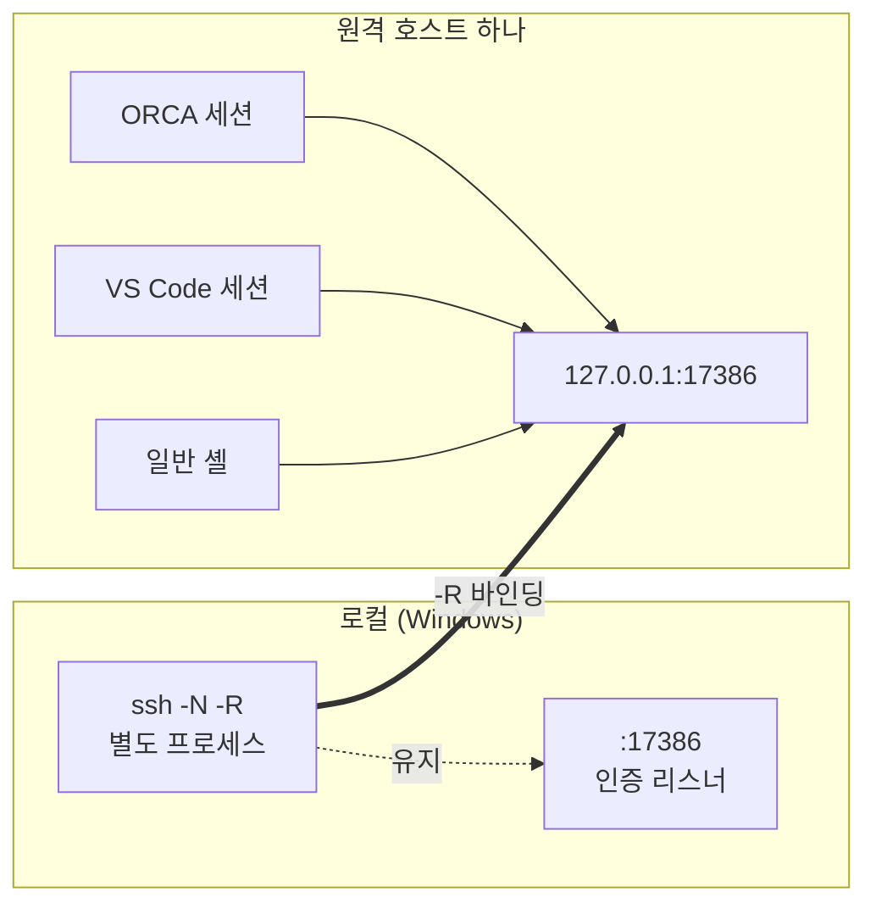

# 원격에서 engram 쓰기 — 사용 매뉴얼

> engram 은 **Windows 로컬 머신 한 대**에서만 돌아간다. 원격 서버에서 쓴다는 건
> 원격에 engram 을 설치하는 게 아니라, 원격의 에이전트가 **SSH 터널을 통해 로컬 engram 에
> 붙는다**는 뜻이다. 기억·위키는 언제나 로컬 한 곳에만 있다.

---

## 0. 개념 — 세 가지가 다 필요하다

| # | 요소 | 없으면 | 어디서 하나 |
|---|---|---|---|
| 1 | **배선** — SSH 리버스 터널 | 연결 자체가 안 됨 (`connection refused`) | 로컬에서 `ssh -R` |
| 2 | **등록** — MCP 서버 등록 | 클라이언트가 engram 의 존재를 모름 | **원격** 설정 파일 |
| 3 | **인증** — bearer 토큰 | 전부 `401` | 원격 등록에 헤더로 |

터널만 뚫고 끝내는 실수가 제일 흔하다. 터널은 배선일 뿐 클라이언트가 자동으로 알아채지 않는다.

### 왜 포트가 둘인가

engram MCP 의 원래 보안 모델은 통째로 이 한 줄이었다.

> **loopback 바인딩 = 인증**

인증 코드가 없는 게 아니라 필요가 없었다. `127.0.0.1:17385` 에 닿을 수 있는 프로세스는
이미 그 머신에서 코드를 실행 중이므로, 인증을 걸어도 새로 막히는 게 없다.

SSH 리버스 터널은 그 등식을 깬다. 터널 너머 머신은 로컬 권한이 없는데 포트에는 닿는다.
**도달 ≠ 권한.** 그래서 리스너를 둘로 나눴다.

| 포트 | 대상 | 인증 | 도구 제한 | scope 고정 | 감사 |
|---|---|---|---|---|---|
| **17385** | 로컬 전용 (overlay, VS Code 로컬, kg_watcher) | 없음 | 없음 | 없음 | 없음 |
| **17386** | 원격 (SSH 터널) | bearer | principal 별 deny | 토큰에 묶임 | 건별 기록 |

> ⚠️ **17385 는 절대 터널에 싣지 마라.** 무인증이라 그 서버에 셸을 가진 누구나
> 네 기억·위키를 읽고 쓸 수 있게 된다.

---

## 1. 로컬(Windows) 준비 — 최초 1회

### 1-1. 원격 리스너 켜기

`%USERPROFILE%\.engram\overlay.user.yaml`:

```yaml
mcp:
  remote_enabled: true
  remote_port: 17386
```

overlay 재시작 후 확인:

```powershell
netstat -ano | Select-String "1738[56]" | Select-String LISTENING
# 17385, 17386 둘 다 LISTENING 이어야 한다

Get-Content "$env:USERPROFILE\.engram\mcp-http.log" -Tail 40 |
  Select-String "remote listener"
# [engram] remote listener on :17386 (principals=1, tokens=...)
```

`principals=0` 이면 토큰이 없다는 뜻이고, 원격 요청은 전부 401 이 된다(fail closed).

### 1-2. 토큰 + scope 고정

`%USERPROFILE%\.engram\mcp-tokens.yaml` 은 첫 기동 때 자동 생성된다.

```yaml
tokens:
  - name: remote-dgx
    token: "..."                              # 비밀. 커밋·채팅 금지
    scope: "overlay"                          # ← 이 토큰의 모든 호출에 강제
    # deny: [...]                             # 생략 시 기본 목록 적용
```

**`scope` 를 꼭 채우되, 새 스코프를 만들지 마라.** 안 채우면 원격이 `global:main` 으로
떨어져 기존 기억을 못 보고, 새로 파도 똑같이 못 본다. 연속성이 이미 쌓여 있는 스코프를
그대로 쓴다
(→ [4장](#4-scope--안-박으면-기억이-섞인다)).

토큰을 스코프별로 나누는 건 **연속성을 일부러 끊고 싶을 때만** 한다
(예: 격리된 실험용). 평소 작업은 하나로 모으는 쪽이 연속체에 맞다.

### 1-3. 스코프 키 알아내기

로컬에서 쓰는 것과 같은 기억을 보려면 스코프 키가 정확히 같아야 한다.

```powershell
cd <프로젝트루트>
python -c "from core.context.project_scope import resolve_scope_key; print(resolve_scope_key(cwd=r'C:\path\to\project'))"
# project:<slug>-<8자리해시>
```

---

## 2. 배선 — SSH 리버스 터널

### 2-1. ssh_config 방식 (터미널·VS Code 용)

`~/.ssh/config` (Windows: `%USERPROFILE%\.ssh\config`):

```
Host <별칭>
  HostName <host>
  User <user>
  Port <port>
  RemoteForward 17386 127.0.0.1:17386
```

`RemoteForward <원격포트> <로컬호스트>:<로컬포트>` — "원격의 `127.0.0.1:17386` 으로 들어온
연결을 내 로컬 `127.0.0.1:17386` 으로 넘겨라". 원격 **loopback 에만** 바인딩되므로
그 서버의 LAN 에는 열리지 않는다.

### 2-0. 권장 — 오버레이 설정의 "원격" 탭

터미널을 띄워둘 필요가 없다. 오버레이가 터널을 자식 프로세스로 소유한다.
`시작·끊김 시 자동 재연결`을 켜면 오버레이 재시작 뒤에도 저장된 호스트에
자동으로 다시 붙는다.

```
설정 → 원격 탭
  인증 리스너   ☑ 사용   포트 17386   ● LISTENING
  터널          호스트                 상태
                my-container           ● 연결됨 (12분)
                [추가▾] [제거] [연결] [끊기] [키 등록]
                ☑ 시작·끊김 시 자동 재연결
```

- `[추가▾]` 는 `~/.ssh/config` 의 Host 별칭에서 고른다.
- `시작·끊김 시 자동 재연결`은 모든 저장 호스트에 적용되는 전역 체크박스다.
  켜두면 MCP 원격 리스너가 준비된 뒤 저장 호스트를 자동 연결하고, 연결이
  끊겼을 때도 백오프 후 다시 연결한다. 꺼두면 목록만 복원한다.
- 설정에 없어도 **실제로 열려 있는 터널은 항상 목록에 표시**된다 —
  열려 있는데 화면에 없는 상태를 만들지 않는 것이 이 탭의 요점이다.

**키 인증이 전제다.** 백그라운드 프로세스는 비밀번호 프롬프트를 받을 수 없으므로
`BatchMode=yes` 로 띄운다. 키가 없으면 `✖ 키 인증 필요` 로 서고 **재시도하지 않는다**
(무한 재시도로 원격 sshd 를 두드리면 `MaxStartups` 가 포화돼 다른 클라이언트까지
타임아웃한다).

`[키 등록]` 은 원격 OS 를 물은 뒤 동작이 갈린다.

- **Linux/macOS** — 콘솔이 열린다. 비밀번호를 한 번 넣으면 그 뒤로는 자동으로 붙는다.
- **Windows** — 자동 설치하지 않고 공개키를 클립보드에 복사한 뒤 절차를 안내한다.
  원격 SSH 의 기본 셸이 cmd 냐 PowerShell 이냐에 따라 같은 문자열이 전혀 다르게
  동작하기 때문이다. PowerShell 이면 `&` 는 호출 연산자, `2>nul` 은 `nul` 파일로의
  리다이렉트, `>>` 는 **UTF-16LE 쓰기**다. 그대로 실행하면 `authorized_keys` 에
  UTF-16 쓰레기가 덧붙어 **기존에 동작하던 키까지 깨진다.**

#### Windows 원격에서 키 인증이 안 될 때 — 거의 항상 관리자 계정 문제다

`authorized_keys` 를 올바르게 넣었는데도 `Permission denied (publickey,...)` 가 나면
먼저 계정 유형을 본다. **관리자면 Windows OpenSSH 는 `~/.ssh/authorized_keys` 를
아예 읽지 않는다.**

```cmd
whoami /groups | findstr S-1-5-32-544
```

이 줄이 나오면 관리자다. 그 경우 키는 여기 들어가야 한다.

```cmd
md C:\ProgramData\ssh 2>nul
echo <공개키 한 줄>>> C:\ProgramData\ssh\administrators_authorized_keys
icacls C:\ProgramData\ssh\administrators_authorized_keys ^
  /inheritance:r /grant *S-1-5-18:F /grant *S-1-5-32-544:F
```

- **ACL 을 좁히지 않으면 sshd 가 파일을 조용히 무시한다.** 에러도 안 나므로
  원인을 찾기 어렵다.
- SID 로 지정한 것은 한글 Windows 에서 그룹 표시명이 다르기 때문이다
  (`*S-1-5-18`=SYSTEM, `*S-1-5-32-544`=Administrators).
- 파일 인코딩은 UTF-8(BOM 없음) 또는 ASCII 여야 한다.
  PowerShell 의 `>>` 는 UTF-16LE 로 쓰므로 쓰지 않는다.

> 참고: 홈 디렉터리 이름이 계정명과 다를 수 있다(예: 계정 `svc-build`,
> 홈 `C:\Users\svc`). 경로를 가정하지 말고 원격에서 `cd` 로 확인한다.

터널 옵션은 다음과 같다. `ExitOnForwardFailure=yes` 가 핵심으로,
이게 없으면 ssh 는 살아 있는데 `-R` 바인딩만 실패한 좀비가 생겨
"프로세스 생존 ≠ 터널 생존"이 된다.

```
ssh -N -o BatchMode=yes -o ExitOnForwardFailure=yes
       -o ServerAliveInterval=30 -o ServerAliveCountMax=3
       -R 17386:127.0.0.1:17386 <host>
```

### 2-2. 상시 터널 방식 (ORCA 등 ssh_config 을 안 쓰는 클라이언트용)

```bash
ssh -N -R 17386:127.0.0.1:17386 <별칭>
```

`-N` = 명령 실행 없이 포워딩만. **이 창을 닫으면 터널도 닫힌다** — 노출 창을 직접
통제하게 되는 부수효과가 있다.

핵심: 터널은 *클라이언트 연결의 속성*이 아니라 *그 호스트의 속성*이다.
아무 프로세스나 `-R` 로 열어두면 그 호스트의 **모든** 프로세스가 `127.0.0.1:17386` 에 닿는다.



### 2-3. 터널의 경계 — 호스트/네임스페이스 단위

| 상황 | 통하나 |
|---|---|
| 같은 호스트의 다른 SSH 세션 | ✅ |
| 같은 호스트의 다른 사용자 | ✅ (그래서 인증이 필요하다) |
| 다른 서버 | ❌ 서버마다 따로 뚫어야 함 |
| **호스트 ↔ 그 위의 컨테이너** | ❌ **네트워크 네임스페이스가 다름** |

마지막 항목이 제일 자주 걸린다. `host:22`(호스트)와 `host:<매핑포트>`(컨테이너)가 IP 가 같아도
서로 다른 loopback 을 쓴다. **에이전트가 실제로 도는 그 대상**에 터널을 뚫어야 한다.

---

## 3. 등록 — 클라이언트별

> 모든 등록은 **원격 파일시스템**에서 한다. 로컬 `~/.claude.json` 은 원격에서 안 읽힌다.

### 3-0. 토큰을 원격에 옮기기 (등록 전 준비)

> **scope 는 원격에 안 간다.** 원격이 갖는 건 불투명한 문자열 하나뿐이고,
> 그 토큰이 어느 scope 에 묶여 있는지·어떤 도구가 막혀 있는지는 전부
> 로컬 `~/.engram/mcp-tokens.yaml` 에만 있다. 원격은 자기 scope 를 보지도
> 바꾸지도 못한다 — 그게 의도된 설계다.
>
> 즉 "원하는 scope 의 토큰을 심는다" = **그 scope 에 묶어둔 항목의 `token` 값**을
> 원격으로 옮긴다는 뜻이다.

**① 어느 토큰이 어느 scope 인지 확인** (토큰 값은 안 찍힘)

```bash
python -c "
import yaml, pathlib
d = yaml.safe_load(pathlib.Path.home().joinpath('.engram/mcp-tokens.yaml').read_text(encoding='utf-8'))
for t in d.get('tokens') or []:
    print(f\"{t.get('name','?'):<18} scope={t.get('scope') or '(미지정 — global 폴백)'}\")
"
# remote-default     scope=overlay
```

**② 이름으로 골라서 원격에 심기** (화면·셸 히스토리 어디에도 값이 안 남음)

```bash
NAME=remote-default        # ← ①에서 고른 이름
python -c "
import yaml, pathlib, sys
d = yaml.safe_load(pathlib.Path.home().joinpath('.engram/mcp-tokens.yaml').read_text(encoding='utf-8'))
print(next(t['token'] for t in d['tokens'] if t['name'] == sys.argv[1]), end='')
" "$NAME" | ssh <별칭> 'umask 077 && cat > ~/.engram-token'
```

`~/.engram-token` 은 engram 이 아는 규약이 아니라 **이 절차용 임시 파일**이다.
다음 단계에서 설정 파일로 옮겨 적고 나면 지워도 된다 (원격에 평문 비밀을
남겨두지 않는 편이 낫다):

```bash
shred -u ~/.engram-token 2>/dev/null || rm -f ~/.engram-token
```

### 3-1. SSH 터미널 — Claude Code CLI (원격이 Ubuntu)

토큰이 `ps` 에 노출되지 않게 설정 파일에 직접 쓰는 방식을 권장한다.

```bash
python3 - <<'EOF'
import json, pathlib
tok = (pathlib.Path.home() / '.engram-token').read_text().strip()
p = pathlib.Path.home() / '.claude.json'
cfg = json.loads(p.read_text()) if p.exists() else {}
cfg.setdefault('mcpServers', {})['engram'] = {
    "type": "http",
    "url": "http://127.0.0.1:17386/mcp",
    "headers": {"Authorization": f"Bearer {tok}"},
}
p.write_text(json.dumps(cfg, indent=2))
print("registered")
EOF
```

간편하게 갈 거면 (공용 서버에서는 argv 노출 주의):

```bash
claude mcp add --transport http --scope user engram http://127.0.0.1:17386/mcp \
  -H "Authorization: Bearer $(cat ~/.engram-token)"
```

### 3-2. SSH 터미널 — 원격이 Windows

`scripts/setup-remote.ps1` 이 Windows 원격도 자동 처리한다 (아래 3-5 참조).
수동으로 할 때는 같은 JSON 을 `%USERPROFILE%\.claude.json` 에 쓴다.

```powershell
$tok = (Get-Content "$env:USERPROFILE\.engram-token" -Raw).Trim()
$p   = "$env:USERPROFILE\.claude.json"
$cfg = if (Test-Path $p) { Get-Content $p -Raw | ConvertFrom-Json } else { [pscustomobject]@{} }
if (-not $cfg.mcpServers) { $cfg | Add-Member mcpServers ([pscustomobject]@{}) -Force }
$cfg.mcpServers | Add-Member engram ([pscustomobject]@{
  type    = "http"
  url     = "http://127.0.0.1:17386/mcp"
  headers = [pscustomobject]@{ Authorization = "Bearer $tok" }
}) -Force
$cfg | ConvertTo-Json -Depth 10 | Set-Content $p -Encoding utf8
```

### 3-3. VS Code Remote-SSH

VS Code 는 시스템 `ssh` 바이너리를 호스트 별칭으로 호출하므로 **`~/.ssh/config` 의
`RemoteForward` 가 자동 적용된다.** 배선은 따로 할 게 없다.

단 **등록은 원격에서** 해야 한다. 클라이언트(VS Code Server, 그 안의 claude CLI)가
원격에서 돌기 때문이다.

- 원격 터미널의 claude CLI 를 쓴다면 → [3-1](#3-1-ssh-터미널--claude-code-cli-원격이-ubuntu) 그대로
- VS Code 자체 MCP(Copilot agent) 를 쓴다면 → 원격 워크스페이스의 `.vscode/mcp.json`:

```json
{
  "servers": {
    "engram": {
      "type": "http",
      "url": "http://127.0.0.1:17386/mcp",
      "headers": { "Authorization": "Bearer ${input:engramToken}" }
    }
  },
  "inputs": [
    { "id": "engramToken", "type": "promptString",
      "description": "engram bearer token", "password": true }
  ]
}
```

`${input:...}` 를 쓰면 토큰이 파일에 안 박혀서 실수로 커밋될 일이 없다.

> ControlMaster 다중화가 켜져 있으면 **첫 마스터 연결**이 포워딩을 잡고
> 이후 세션은 그것을 공유한다.

### 3-4. ORCA

ORCA 는 시스템 `ssh` 를 쓰지 않는다. `node_modules/ssh2`(순수 JS 클라이언트)로 직접 붙고,
`~/.ssh/config` 는 **"Import hosts from ~/.ssh/config"** 일회성 임포트에만 쓴다.
임포트하는 필드는 host / port / user / Jump Host 뿐이고, **`RemoteForward` 는 무시된다.**

→ 배선은 [2-2 상시 터널](#2-2-상시-터널-방식-orca-등-ssh_config-을-안-쓰는-클라이언트용)로 별도 확보한다.

```bash
# 별도 터미널 하나. ORCA 는 평소대로 붙이면 됨.
ssh -N -R 17386:127.0.0.1:17386 <ORCA가_붙는_그_대상>
```

등록은 ORCA 세션이 쓰는 원격 계정의 설정 파일에 [3-1](#3-1-ssh-터미널--claude-code-cli-원격이-ubuntu) 방식 그대로.

### 3-5. 자동화 — `scripts/setup-remote.ps1`

위 3-0 ~ 3-2 를 한 번에 한다. engram 이 도는 로컬(Windows)에서 실행한다.

```powershell
.\scripts\setup-remote.ps1 -ListTokens          # 어떤 토큰이 어느 scope 인지 (값은 안 찍음)
.\scripts\setup-remote.ps1 -ListHosts           # ~/.ssh/config 의 Host 별칭
.\scripts\setup-remote.ps1 -Target <별칭>       # 전송 → 등록 → 실호출 검증
```

| 단계 | 하는 일 |
|---|---|
| 로컬 점검 | 토큰 선택·scope 확인, `:17386` LISTENING |
| 원격 점검 | SSH 접속, OS 판별, 파이썬 탐색, 터널 실측(`/health`) — **ssh 1회** |
| 등록 | `~/.claude.json` 기록 → 되읽기 → 실호출까지 **ssh 1회** |
| 검증 | 로컬 `remote-audit.jsonl` 에 방금 호출이 찍혔는지 |

원격 OS 는 **Linux / macOS / Windows 모두 지원**한다. 등록 내용은 셋 다 동일하고,
다른 것은 파이썬 탐색·터널 확인·셸 인용 방식뿐이다.

주의할 점 몇 가지:

- **괄호·공백이 든 별칭은 따옴표로 감쌀 것.** `-Target my-host(dev)` 처럼 그냥 넘기면
  PowerShell 이 `(dev)` 를 서브식으로 먹고 `my-host` 만 전달한다. 조용히 잘리므로
  스크립트가 `~/.ssh/config` 와 대조해 잡아내지만, 애초에 `-Target "my-host(dev)"` 로 쓴다.
- **conda 파이썬**은 비대화형 SSH 에서 PATH 에 없다 (`~/.bashrc` 를 안 읽는다).
  `/opt/conda` 등 알려진 위치까지 찾지만, 못 찾으면 `-RemotePython <경로>` 로 지정한다.
- **`ProxyJump` 이 걸려 있으면 비밀번호를 홉 수만큼 더 묻는다.** 최종 대상에 직접
  닿을 수 있으면 그 줄을 빼는 편이 낫다.
- 비밀번호를 아예 없애려면 키 인증을 한 번 심는다 — 암호 저장이 아니라 공개키 인증이다.
  ```bash
  ssh-copy-id <별칭>
  ```
- TTY 가 없는 환경(자동화·GUI 캡처)에서는 `-BatchMode` 를 붙인다. 안 붙이면
  비밀번호 프롬프트에서 무한 대기한다.

---

## 4. scope — 안 박으면 원격이 기억상실에 걸린다

`project_key` 는 프로젝트 루트 **절대경로의 sha1** 로 만들어진다
(`core/context/project_scope.py:_project_key_from_path`). 원격 클라이언트가 보내는
`cwd`(예: `/home/user/work/foo`)는 engram 서버(Windows)에 존재하지 않으므로
`detect_project_root` 가 `None` 을 반환하고 스코프가 `global:main` 으로 폴백한다.

문제는 "오염"이 아니라 **기억상실**이다. 연속체의 기억이 실제로 쌓여 있는 곳과
다른 스코프에 앉으면, 원격에서 붙어도 아무것도 기억하지 못한다.

> ⚠️ 그래서 **원격 전용 스코프를 새로 파는 것은 답이 아니다.** 격리는 되지만
> 같은 문제를 이름만 바꿔 반복하는 것이다. **연속성이 이미 쌓여 있는 스코프를
> 그대로 써야 한다.**

어디에 쌓여 있는지는 세션 수가 아니라 **메시지 수**로 판단한다:

```sql
SELECT s.scope_key, COUNT(DISTINCT s.id) AS 세션, COUNT(m.id) AS 메시지
FROM sessions s LEFT JOIN messages m ON m.session_id = s.id
GROUP BY s.scope_key ORDER BY 메시지 DESC;
```

이 설치본 기준으로는 `overlay` 가 압도적이다 — **137세션 / 11,294메시지**.
말풍선(`overlay/bubble/history_panel.py`, `initiative.py`, `stm_bridge.py`)과
`CLAUDE.md` 부트스트랩이 모두 `scope_key="overlay"` 를 쓰기 때문이다.
반면 `project:*` 스코프들은 세션만 있고 메시지는 한 자릿수다 —
거기 묶으면 원격이 빈 기억을 보게 된다.

### 권장 — 토큰에 묶기 (1-2 참조)

미들웨어가 `tools/call` 본문의 `arguments.scope_key` 를 **강제로 덮어쓴다**
(클라이언트가 다른 값을 보내도 무시). 대상은 `scope_key` 를 실제로 받는 6개 도구다:

```
engram_get_context       engram_start_session    engram_save_message
engram_get_context_once  engram_close_session    engram_peek_stm
```

나머지 도구는 이들이 연 세션에 붙어 스코프를 상속하므로, 입구 6개만 고정하면
하위 기록이 전부 따라간다. 주입 시 감사 로그에 `scope pinned to ...` 가 남는다.

### 대안 — 클라이언트에서 명시

원격 프로젝트의 `CLAUDE.md` 부트스트랩에:

```
세션 시작 시 1회:
mcp__engram__engram_get_context_once(caller='claude-code', scope_key='project:<고정키>')
```

클라이언트가 늘 때마다 빠뜨리기 쉬우므로 토큰 쪽이 낫다.

---

## 5. 검증

### 원격에서

```bash
# Ubuntu
ss -tlnp | grep 17386          # LISTEN 127.0.0.1:17386
# Windows
netstat -ano | findstr 17386

curl -s http://127.0.0.1:17386/health          # {"status":"ok"}  ← 배선 OK
claude mcp list                                 # engram ✓ connected
```

### 로컬에서 (진짜 증거는 여기)

```powershell
Get-Content "$env:USERPROFILE\.engram\logs\remote-audit.jsonl" -Tail 5
```

```json
{"ts":"...","principal":"remote-dgx","action":"allow","tool":"tools/list","path":"/mcp","detail":""}
{"ts":"...","principal":"remote-dgx","action":"allow","tool":"engram_get_context","detail":"scope pinned to project:..."}
```

여기 안 찍히면 원격이 engram 에 말을 건 적이 없는 것이다 — 배선이나 등록 문제.

---

## 6. 트러블슈팅

| 증상 | 원인 | 조치 |
|---|---|---|
| 원격에서 `/health` 실패 | 터널 미개통 | `ssh -v` 로 `Warning: remote port forwarding failed` 확인. 별도 `ssh -N -R` 로 우회 |
| 터널은 됐는데 클라이언트가 engram 을 모름 | **등록 안 함** | 3장. 감사 로그에 아무것도 없으면 이것 |
| 전부 `401` | 토큰 없음/불일치 | 헤더 `Authorization: Bearer ...` 확인. 로컬 `principals=N` 이 0 이면 토큰 파일 문제 |
| 특정 도구만 `403` | 원격 deny 목록 | 의도된 동작. 필요하면 토큰의 `deny` 조정 (7장 근거 먼저 읽을 것) |
| `remote port forwarding failed for listen port 17386` | 그 호스트에 이미 터널 있음 | 정상. 먼저 뚫은 세션이 이기고 공유된다 |
| 컨테이너에서 `/health` 실패 (호스트는 됨) | 네임스페이스 다름 | 컨테이너로 직접 터널 (2-3) |
| `-R` 자체가 거부됨 | 원격 sshd `AllowTcpForwarding no` | 서버 관리자에게 문의 |
| 기억이 `global:main` 에 쌓임 | scope 미고정 | 4장 |

---

## 7. 원격 기본 deny 목록의 근거

`core/config/remote_tokens.py: DEFAULT_REMOTE_DENY`

| 도구 | 왜 |
|---|---|
| `engram_consult_engram` | `ask_copilot` → Copilot CLI 를 `--allow-all-tools` 로 로컬 spawn. 원격 입력이 **로컬 코드 실행**이 된다 |
| `engram_add_directive` 계열 | 이후 **모든** 세션에 지침이 영구 주입된다 |
| `engram_discord_send` | 사용자 명의 외부 발신 |
| `kg_cypher` | `_is_dangerous_cypher` 는 `WHERE` 만 붙이면 통과한다 — 오조작 방지용이지 보안 경계가 아니다 |
| `engram_update_persona` / `engram_seed_persona` | 정체성 덮어쓰기 |

원격에서 **읽기(`kg_search`, `kg_read_note`, `engram_search_memories`)와
일반 쓰기(`kg_add_note`, `kg_update_node`, `kg_patch_section`, `engram_save_memory`)는 허용**된다.
그게 원격에서 일하는 목적이므로. 사고 시 복구는 `D:/intel_engram` 백업에 의존한다.

`kg_patch_section`은 `kg_update_node`가 못 건드리는 summary/Progress/open_intents 밖의
임의 본문 섹션(헤딩 단위)을 고치는 툴이다 — `kg_update_node`와 같은 기조로 기본 허용.

---

## 8. 하지 말 것

- ❌ `RemoteForward 17385` — 무인증 포트를 터널에 싣는 것
- ❌ 토큰을 리포에 커밋 / 채팅에 붙여넣기 / `claude mcp add` argv 로 공용 서버에서 사용
- ❌ `D:/intel_engram` 을 SMB·sshfs 로 공유 — `engram.db` 는 WAL 모드고 `semantic_graph` 는
  KuzuDB 임베디드다. 네트워크 파일시스템에서 열면 깨진다. 공유하려면 **서버를 공유**하지
  파일을 공유하지 않는다
- ❌ 원격에서 `scope_key` 없이 장기간 작업
