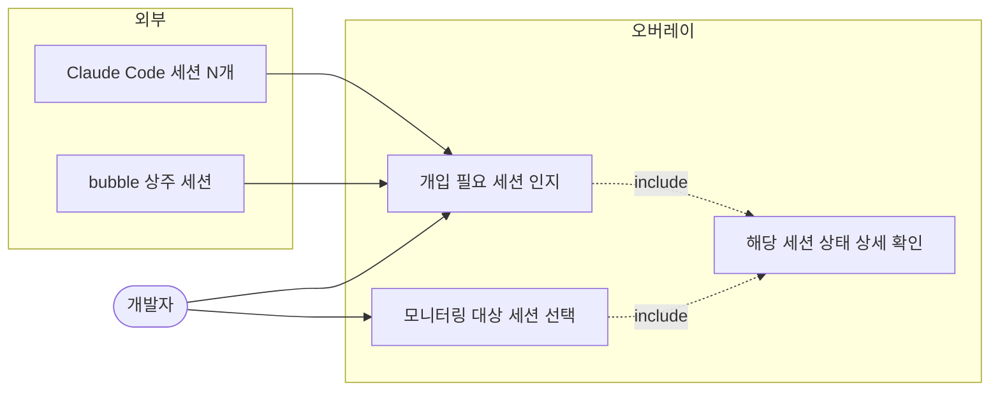
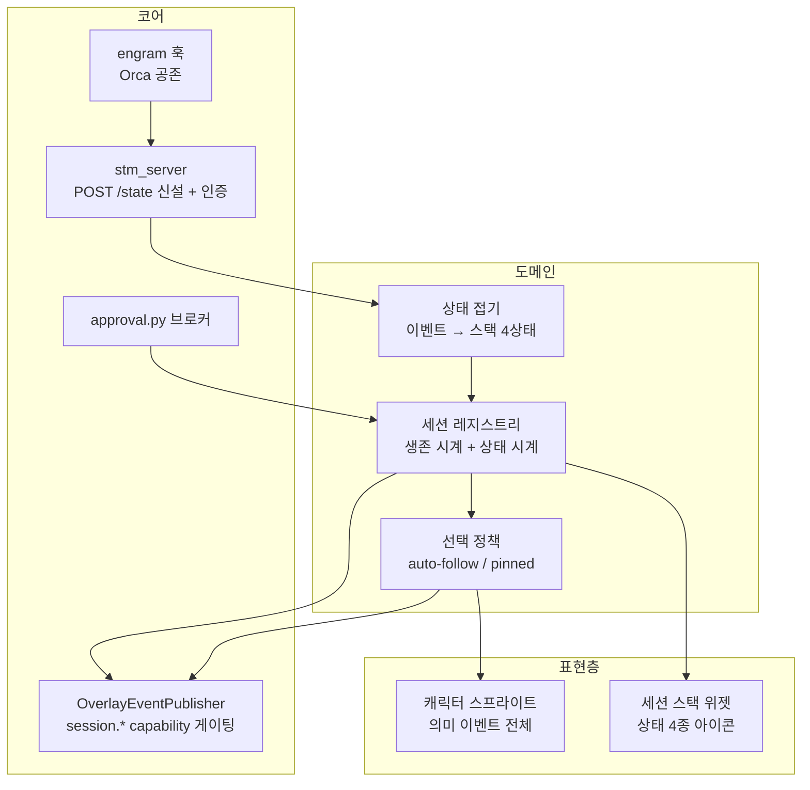
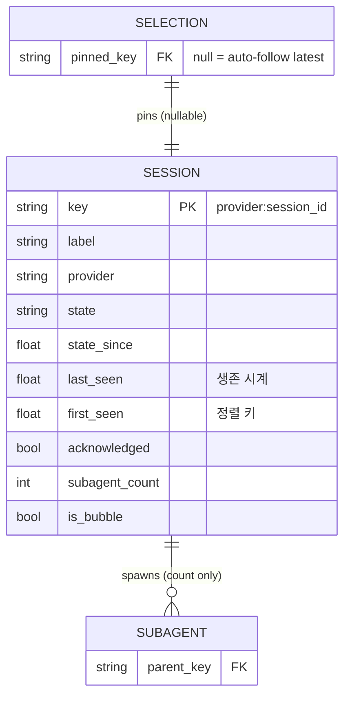
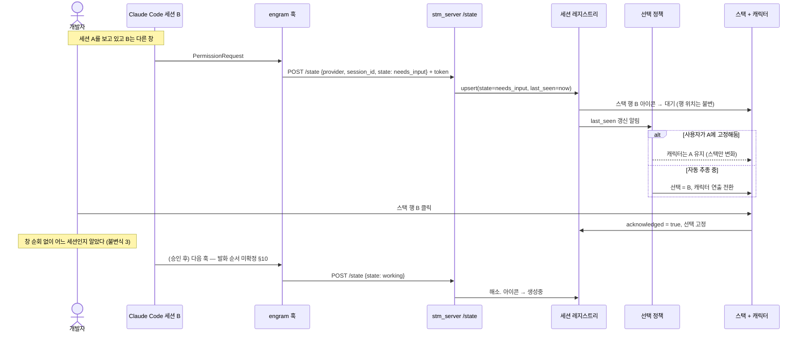

# 다세션 세션 스택 + 캐릭터 상태 설계

> 오버레이 캐릭터를 팝업 채팅 1개가 아니라 **연결된 모든 세션**의 상태로 구동한다.
> N개를 1개로 압축하지 않는다 — 스택이 집계·귀속을 맡고, 캐릭터는 선택된 세션 하나를 연출한다.

- 상태: 기획 확정, 슬라이스 1·2 구현 완료 (`feat/session-stack-bubble`, Windows source 검증)
- 후속 작업: `feat/session-stack-ui`에서 승인된 카드 롤링 디자인과 renderer 연동 구현.
  Windows source 검증 39개 통과. 실제 Claude 승인 훅 실측(AC6)은 미확인이다.
  [acceptance 계약과 검증 범위](session-stack-acceptance.md)를 기준으로 이어간다.
- 조사 근거: wiki `projects/000_Project_Engram/design/multi-session-pet-state.md`
  (codex 펫 실측 + 현행 이벤트 API 감사)
- 작성 2026-09-07 / 개정 2026-09-07 (축 분리, 시계 분리, 정렬 안정성)

---

## 승인된 UI 개정 (2026-09-07)

사용자 승인: 정적인 행 목록 대신 **캐릭터보다 화면 좌표상 위에 배치하는 컴팩트 카드 덱**.
이 절이 아래 초기 ASCII 목록과 클릭 선택 설명의 시각/입력 정책을 대체한다.

- 중앙 카드: 안전한 작업 제목, 작고 옅은 provider/세션 식별자, 상태 아이콘과 짧은 문구.
- 이전/다음 카드: 위아래에 작고 반투명하게 중첩. 중앙 카드가 가장 앞이며 글자가 겹쳐 읽히지 않게 한다.
- 카드 밖 배경은 투명. 큰 헤더/배경 패널/상시 휠 안내는 없다. 옆의 좁은 레일에
  승인 대기/오류 집계, 자동/고정과 이전/다음 이동을 모은다.
- 휠 한 단계는 인접 후보 카드로 이동. 마지막 휠 입력 뒤 400ms 조용해지면 모니터링 대상으로
  확정하고 고정/확인 처리한다. 이동 중 중간 후보를 실제 모니터링 대상으로 확정하지 않는다.
- 자동 버튼은 최신 `last_seen` 추종으로 복귀. 고정/후보 세션이 제거되면 안전하게 자동 복귀한다.
  사이드 레일의 승인/오류 집계로 화면 뒤에 숨은 개입 필요 세션도 찾아갈 수 있다.
- `first_seen` 순서는 유지한다. 일부 카드만 노출해도 모든 세션을 순회할 수 있다.
- 제목은 명시적인 안전한 label 또는 일반 식별자만 사용한다. 대화 본문 자동 요약이나
  디렉토리 경로 기반 이름 생성은 포함하지 않는다.
- 화면 상단 여유가 부족하면 작업영역 안의 인접 위치로 제한하며 캐릭터를 이동시키지 않는다.
- 기존 상태 API/레지스트리/승인 수명은 재사용한다. 기존 작업 공간 하나에서 연속 개발한다.

---

## 1. 기획 헌법

| 항목 | 확정 |
| --- | --- |
| **메인 기능** | 연결된 모든 세션 중 **사람의 개입이 필요한 것**을 알린다. 작업 중·완료 표현은 이걸 돕는 부수 표현. |
| **주 사용자** | 세션 2~5개를 동시에 돌리며 창을 순회하는 개발자 1명. 현재 비용은 "개입 필요 세션을 찾느라 창을 다 열어보는 것". |
| **우선순위** | 개입 필요 알림 > 귀속(어느 세션) > 완료 알림 > 작업 중 표현 > 이동·장난 애니메이션 |

### 불변식

1. 이벤트 페이로드에 **본문·thinking·tool 입출력·경로·토큰을 담지 않는다.**
   기존 Event API `metadata_only` 정책을 승계한다.
2. 상태 채널은 **STM 본문을 오염시키지 않는다.** 별도 경로·별도 저장.
   (`overlay/bubble/stm_bridge.py`가 thinking/tool_use/tool_result를 저장하지 않는 것과 같은 이유)
3. 캐릭터·스택은 **정보를 잃지 않게** 표현한다. 애니메이션만 튀고 어느 세션인지 모르면 실패다.
4. 오버레이는 세션 프로세스를 **띄우거나 죽이지 않는다.** 기존 계약 승계.
5. **거짓 상태를 표시하지 않는다.** 확신 없는 상태는 `unknown`으로 내려간다.
   거짓말하는 계기판은 없는 계기판보다 나쁘다.

불변식 3이 이 설계의 존재 이유다. codex는 이걸 포기해 펫(정서)과 `/subagents`(정보)를 다른
표면으로 갈랐다. 오버레이는 독립 창이라 본문을 침범하지 않으므로 한 표면에서 둘 다 할 수 있다.

### 범위

| 단계 | provider |
| --- | --- |
| 1차 | Claude Code만 |
| 2차 (1차 안정화·검증 후) | Codex, Antigravity |
| 계약 | 처음부터 provider 중립. 1차에서 Claude 전용 필드를 계약에 넣지 않는다. |

---

## 2. 핵심 구조 — 압축하지 않는다

```ascii
┌─ 세션 스택 (집계 + 귀속) ────────────────┐
│ ● ProjectIntelContunuum   ⏸ 대기    ▸   │ ← 선택됨
│ ○ mammo-issue-tracker     ● 생성중 (+2) │   (+2 = subagent 2개)
│ ○ dLPlatform              ✓ 완료        │
└──────────────────────────────────────────┘
        ┌──────────┐
        │ 캐릭터    │  ← 선택된 세션 1개만 연출
        └──────────┘
```

| 표면 | 책임 | 어휘 | 압축 |
| --- | --- | --- | --- |
| **세션 스택** | 활성 세션 전부를 행으로. 행마다 자기 상태 아이콘 | 스택 상태 4종 | 접는다 — 배지 한 칸에 들어가야 하고 세션 간 비교 가능해야 함 |
| **캐릭터** | 선택된 세션 1개를 애니메이션으로 | **기존 의미 이벤트 전체** | 접지 않는다 — 1개만 다루므로 압축할 이유가 없음 |

우선순위 기반 중재(Blocked > Needs-input > …)는 **채택하지 않는다.** N→1 압축을 전제하므로
정보가 반드시 죽고, last-write-wins든 우선순위든 굶는 세션이 생긴다. 선택 문제로 바꾸면 사라지는 문제다.

---

## 3. 두 개의 축

이벤트 개수와 상태 개수는 같은 단위가 아니다. 기존 의미 이벤트 11종을 세션 상태 축으로
접으면 실제로 **3종**(working / ready / blocked)이 나온다 — codex의 4종보다 하나 적다.
없는 하나가 `needs_input`이고, 그게 이 기획의 메인 기능이다.

즉 이 설계는 codex의 4상태를 베끼는 것이 아니라 **우리 3종에 하나를 채우는 것**이다.

### 3.1 캐릭터 축 — 접지 않는다

기존 `overlay/event_api.py`의 의미 이벤트와 `display_hint`를 그대로 쓴다.
`tool.started`의 `category`(search / memory / generic), `generation.thinking`과 `tool.started`의
구분은 **현재 말풍선 캐릭터가 이미 표현하고 있는 것**이므로 버리지 않는다.

여기에 `needs_input`에 해당하는 표현만 추가된다. 캐릭터는 선택된 세션 1개만 다루므로
접기 로직이 개입하지 않는다.

### 3.2 스택 축 — 4종으로 접는다

세션 5개 배지에 "메모리 검색 중"이 들어갈 자리가 없고, 들어가도 읽히지 않는다.

| 상태 | 아이콘 의미 | 유발 | 사용자에게 |
| --- | --- | --- | --- |
| `working` | 응답 생성중 | `generation.started`, `.thinking`, `tool.started`, `PreToolUse`/`PostToolUse` | 기다려라 |
| `needs_input` | 입력·승인 대기 | 승인 요청 (bubble 브로커 / 훅 `PermissionRequest`) | **네 시간을 지금 태우고 있다** |
| `ready` | 완료 | `generation.completed`, 훅 `Stop` | 끝났다. 급하지 않다 |
| `blocked` | 막힘 | `tool.failed`, `provider.failed`, 훅 `StopFailure` | 봐야 한다 |
| `unknown` | 미확정 | 상태 판정 불가 (불변식 5) | 표시하지 않거나 회색 |

`needs_input`과 `ready`를 합치지 않는다. 사용자 관점에선 둘 다 "너 차례다"라 묶고 싶어지지만,
**`needs_input`은 세션이 멈춰 서서 벽시계를 태우는 중이고 `ready`는 아무것도 태우지 않는다.**
무엇을 먼저 클릭할지가 갈리므로 모델에서는 구분한다.

> 시각적으로 4칸이 시끄러우면 아이콘 대신 색으로 갈라도 된다. 이는 렌더 결정이며
> 슬라이스 3의 육안 컨펌에서 확정한다. **모델은 4종을 유지한다** — 모델에서 합치면
> 나중에 갈라낼 근거가 사라진다.

---

## 4. 세션 레지스트리

오버레이 프로세스 인메모리. 영속화하지 않는다(재시작 시 세션들이 다시 보고한다).

| 필드 | 타입 | 비고 |
| --- | --- | --- |
| `key` | str | 레지스트리 키. §4.1 참조 |
| `label` | str | 표시용. **경로 아님** (불변식 1) |
| `provider` | str | `claude` \| `codex` \| `antigravity` \| `copilot` |
| `state` | enum | §3.2. 기본 `unknown` |
| `state_since` | monotonic | 상태 표시 나이 |
| `last_seen` | monotonic | **생존 판정용** |
| `first_seen` | monotonic | **정렬용** (§4.3) |
| `acknowledged` | bool | 사용자가 이 행을 봤나 (§4.2) |
| `subagent_count` | int | 스택에서 제외하되 부모 행에 개수만 표기 |
| `is_bubble` | bool | 오버레이 자신의 상주 세션 구분 |

### 4.1 세션 식별자 — namespace가 둘이다

**이것이 이 설계에서 가장 실수하기 쉬운 지점이다.**

| 출처 | 형태 | 예 |
| --- | --- | --- |
| `POST /stm/session/start` 발급 | engram DB의 정수 id | `469` |
| Claude Code 훅 payload의 `session_id` | Claude의 UUID | `74562f0b-...` |

둘은 다른 namespace다. 레지스트리 키를 하나로 정하고 나머지를 매핑해야 한다.

**결정: 레지스트리 키는 provider가 준 원본 세션 식별자(`provider:session_id`)로 한다.**
훅과 MCP 둘 다 이 값을 알 수 있고, engram DB id는 STM 저장에만 쓰이므로 레지스트리가
알 필요가 없다. `POST /state`는 `{provider, session_id}`를 필수로 받는다.

engram DB id ↔ provider session_id 매핑은 **1차 범위에서 하지 않는다.** 레지스트리는
STM 저장과 무관하게 독립적으로 동작한다(불변식 2와 같은 방향).

### 4.2 두 개의 시계 — 생존과 미확인은 다르다

초판의 오류: TTL 하나로 "스택 멤버십"과 "미확인 알림 수명"을 겸하게 했다.
그러면 `ready` 7일 = **끝난 세션이 일주일간 스택에 박제**되고, `working` 3분 =
**20분 걸리는 빌드 중에 세션이 스택에서 사라진다.** 하나로 겸하면 반드시 한쪽이 틀린다.

codex에서 7일이 맞았던 이유는 그것이 *단일 세션의 notification 수명*이었기 때문이고,
멤버십 판정이 아니었다. 역할을 바꿔 붙이면서 값을 그대로 가져온 것이 오류였다.

| 시계 | 판정 대상 | 기준 | 값 |
| --- | --- | --- | --- |
| **생존 시계** | 스택 멤버십 (행이 있나) | `last_seen` | 유휴 60분 + 훅 `SessionEnd` 명시 제거 |
| **상태 시계** | 아이콘이 뭘 보여주나 | `state_since` | **만료 없음 — 다음 전이까지 유지** |

- 상태는 원래 "다음 전이까지 유지"가 정상이고, TTL은 전이가 영영 안 오는 경우의 예외 처리다.
  전이가 안 오는 유일한 정상 경로는 세션 종료이고, 그건 생존 시계가 처리한다.
- `working`이 이벤트 없이 오래 지속되는 것은 **정상이다**(장시간 도구 실행, 장시간 사고).
  이걸 만료시키면 정확히 우리가 잡으려던 신호를 잃는다.
- `acknowledged`는 사용자가 행을 클릭했을 때 켜진다. 켜지면 강조(원샷 애니메이션·볼드)를
  거두되 상태 아이콘 자체는 유지한다.

### 4.3 정렬 — 최근순은 안정적이지 않다

초판의 자기모순: "심각도 정렬 안 함 — 행이 튀면 클릭 대상을 잃는다"고 쓰면서
정렬 키를 `last_seen`으로 잡았다. **`working` 세션은 이벤트를 뿜을 때마다 1위로 올라온다.**
최근순도 똑같이 튄다.

**결정: 정렬은 `first_seen` 오름차순(최초 등장 순)으로 고정한다.**
한번 자리를 잡은 행은 세션이 끝날 때까지 움직이지 않는다. 상태는 아이콘으로 표현되므로
정렬로 표현할 필요가 없다. `last_seen`은 **선택 정책에만** 쓴다.

subagent는 행을 만들지 않는다. 부모 세션 행에 `(+N)`으로만 표기한다.

### 4.4 bubble 세션 중복 방지

슬라이스 2 구현 계약 (`feat/session-stack-bubble`, 독립 acceptance AC1–AC9 PASS):

- 호스트가 생성한 `SessionStateRegistry`를 STM HTTP 서버와 bubble controller가 공유한다.
  이 프로세스가 HTTP listener를 소유하지 못하면 bubble 상태 편입을 비활성화한다.
- 매 bubble manager 수명에 UUID를 발급하고 `ENGRAM_BUBBLE_SESSION_ID`로 SDK 환경에 전달한다.
  SDK `SystemMessage(init)` 또는 `ResultMessage`의 실제 provider ID는 그 UUID 행의 alias로 합류한다.
  HTTP는 로컬 소유 행의 생존 시각만 갱신하며 상태와 `is_bubble`을 덮어쓰지 않는다.
- submit/생각/말/도구 실행은 `working`, 정상 턴 종료는 `ready`, 오류·실패 도구 결과·실패 턴 종료는
  `blocked`로 접는다. 모르는 이벤트는 현재 상태를 유지한다. 승인 요청 ID 집합이 비어 있지 않으면
  `needs_input`을 우선하며 마지막 해소 뒤에는 그동안 갱신된 기본 상태로 복귀한다.
- 승인 허용·거부·timeout·취소·UI 콜백 실패 모두 브로커 `finally`에서 해소된다.
  SDK 스레드의 30초 heartbeat는 생존만 갱신한다. 소유 행도 3600초 생존 만료를 적용한다.
- collapse/reset/모드 전환/설정 교체/종료/manager 사망에서 행을 제거한다.
  이전 manager의 지연 Tk 콜백은 세션 객체 동일성 검사로 무시한다.
- 이 슬라이스는 상태 편입과 승인 배선을 구현한다. 스택 위젯·선택 정책·캐릭터 연결·외부 훅·
  Event API 신규 이벤트는 후속 슬라이스 범위다.

검증: `python scripts/dev/smoke_bubble_state.py --output logs/slice2-runtime`은 임시 프로필에서
production session manager·승인 브로커·기존 Tk 승인 버튼·HTTP 서버를 실행한다.
SDK transport만 제어된 입력으로 대체한다. 허용/거부, 실패 상태, 실제 30초 heartbeat,
alias 합류, collapse/reset/모드 전환/설정 갱신/provider 종료와 교체/host 종료를 검증했다.
`logs/slice2-runtime/report.json`과 `approval.png`가 로컬 증거다. 관련 테스트 123개 통과.
실제 Claude CLI의 승인 콜백 발화 및 설치본 배포는 이 검증에 포함되지 않는다.

bubble 세션은 `_on_bubble_event`로 상태를 직접 보고한다. 동시에 그 SDK 세션이 engram MCP를
쓰면 `POST /state`로도 등록될 수 있어 **같은 세션이 두 행으로 보일 위험**이 있다.

**결정: bubble 세션의 레지스트리 키는 오버레이가 소유한다.** bubble SDK 세션 기동 시
오버레이가 키를 발급해 환경변수로 내려보내고, 그 세션에서 온 `POST /state`는 같은 키로
합류시킨다. 키를 못 맞추면 `is_bubble` 행이 우선하고 중복 행은 버린다.

---

## 5. 선택 정책

| 상황 | 동작 |
| --- | --- |
| 기본 (사용자 상호작용 없음) | **최신 세션 자동 추종** — `last_seen`이 가장 최근인 행 |
| 사용자가 행을 명시적 클릭 | 그 세션에 **고정**. 자동 추종 중단. `acknowledged = true` |
| 고정된 세션이 스택에서 사라짐 (생존 만료·`SessionEnd`) | **자동 추종으로 복귀** |
| 스택이 비었을 때 | 캐릭터는 `idle` |

자동 추종이 `last_seen`을 쓰므로 캐릭터는 활발한 세션을 따라간다. 정렬(§4.3)과 다른 키를
쓰는 것은 의도적이다 — **행은 안 움직여야 하고, 시선은 움직여야 한다.**

---

## 6. 인입 경로

```ascii
Claude Code 세션 A ─┐
Claude Code 세션 B ─┼─→ POST /state ──→ stm_server(:17384) ──→ 세션 레지스트리
Claude Code 세션 C ─┘   (신설, 인증 필요)        │                    │
                                                 │                    ↓
bubble 상주 세션 ─→ _on_bubble_event ────────────┤            선택 정책 → 캐릭터
                 └─→ approval.py 브로커 ─────────┘                 └→ 스택 UI
                      (요청·해소 직접 호출)                            │
                                                    OverlayEventPublisher → 외부 renderer
                                                        (session.* / capability 게이팅)
```

`stm_server`는 **주소만 재사용한다.** 이미 열려 있는 localhost 포트, `request_id` dedup,
overlay.exe 내 상주라는 사실을 재사용한다. STM 저장 경로는 타지 않는다(불변식 2).

| 신호 | 성격 |
| --- | --- |
| 훅 → `POST /state` | **주 신호.** 상태 전이의 firehose. `PermissionRequest`가 `needs_input`의 유일한 정확한 출처 |
| MCP 호출 부수 보고 | **보조 신호.** 모델이 도구를 부를 때만 발화 — 표본이 듬성듬성하고 권한 대기·장시간 사고 구간이 유실됨 |
| 기존 `POST /stm/message` | **무료 하트비트.** "살아 있고 방금 턴을 끝냈다". 주 신호로 쓰면 안 됨 — 본문 있는 턴에만 발생 |

### 6.1 `needs_input` 인입 — 이벤트 신설하지 않는다

| 세션 | 경로 | 비용 |
| --- | --- | --- |
| Claude Code (외부) | 훅 `PermissionRequest` → `POST /state` | inbound HTTP. Event API와 무관 |
| bubble (오버레이 자신) | `overlay/bubble/approval.py` 브로커 → 레지스트리 직접 호출 (`main.py:1548` 인접) | 같은 프로세스 함수 호출. 스키마 변경·capability 협상 없음 |

`approval.requested` 같은 **새 의미 이벤트를 Event API에 신설하지 않는다.** 외부 renderer에는
`session.state_changed`가 이미 `state: needs_input`을 실어 나르므로 같은 정보를 두 번 나르는
셈이 된다.

현행 확인(2026-09-07): 승인 요청은 `session.py:100` → `main.py:1548`
`_bubble_manager.show_approval_request(req)`로 **UI 직행**하며 `_overlay_events`를 거치지 않는다.
따라서 지금은 말풍선에서도 권한 대기가 캐릭터에 반영되지 않는다 — 다세션과 무관한 기존 공백이다.

### 6.2 해소(resolve) 없으면 아이콘이 거짓말한다

요청만 넣고 해소를 안 넣으면 승인을 누른 뒤에도 아이콘이 계속 "대기"다. 불변식 5 위반.

| 세션 | 해소 지점 |
| --- | --- |
| bubble | 브로커의 `Future` resolve 지점 — 명확 |
| Claude Code | **미확정.** `PermissionRequest` 다음 훅 발화 순서를 실측해야 한다 (§10) |

Claude Code 쪽은 승인 후 도구가 실행되며 `working`으로 자연 복귀할 것으로 보이지만
`PermissionRequest`와 `PreToolUse`의 발화 순서를 확인하지 않았다. 확인 전에는 추측으로 쓰지 않는다.
**해소 신호가 불확실하면 그 세션 상태를 `needs_input`으로 올리지 말고 `unknown`으로 둔다**(불변식 5).

### 6.3 훅 공존 제약

`~/.claude/settings.json`의 훅 12종이 **전부 Orca(`~/.orca/agent-hooks/claude-hook.cmd`)로
디스패치되고 있다** (확인 2026-09-07). engram 훅 추가 시 Orca 엔트리를 덮어쓰면 안 된다.

- `core/integrations/engram_bootstrap.py`가 이미 같은 이벤트 배열에 핸들러를 **추가/제거**하는
  로직을 갖고 있다(`event_entries.append({"hooks": [handler]})`) — 이 경로를 재사용한다.
  배열 통째 교체 금지.
- 훅 프로세스 기동 비용이 있으므로 필요한 이벤트만 태운다.
  1차: `PermissionRequest`, `Stop`, `StopFailure`, `SessionStart`, `SessionEnd`.
  `PreToolUse`/`PostToolUse`는 빈도가 높아 2차에서 비용 측정 후 판단.

### 6.4 인증

`POST /state`가 무인증이면 로컬 아무 프로세스나 가짜 세션을 스택에 꽂을 수 있다.
Event API v2는 토큰 회전까지 하는데 `stm_server`의 현행 인증 수준을 **확인하지 않았다**(§10).

- `stm_server`에 이미 인증이 있으면 그것을 따른다.
- 없으면 `POST /state`에만 별도 토큰을 요구한다. discovery 파일은 Event API v2의
  `~/.engram/overlay-event-api-v2.json` 방식(current-user ACL, mode 0600, 원자적 게시, 회전)을 준용한다.
- 토큰을 argv·URL·로그에 남기지 않는다.

### 6.5 이벤트 계약 변경

Event API v2는 **추가·중첩 field를 거부**한다. 상태를 외부 renderer에 내보내려면 필드를
몰래 얹을 수 없다.

| 방식 | 판단 |
| --- | --- |
| 기존 이벤트에 `session` 필드 추가 | 불가 — v2 검증에 걸린다 |
| **신규 이벤트 타입 + capability 플래그** | 채택. `session.state_changed`, `session.stack_changed`를 신설하고 `capabilities`에 `session_stack`을 광고한 renderer에게만 보낸다 |
| schema_version 3 bump | 과함 — 기존 renderer 호환을 깰 이유가 없다 |

페이로드는 `provider`, `session_id`, `label`, `state`, `subagent_count`, `selected`만 담는다.
경로·본문·토큰 금지(불변식 1).

### 6.6 스택은 누가 그리나 — replace 모드

replace owner가 캐릭터를 대체할 때 스택의 소유권이 갈린다.

| renderer | 스택 |
| --- | --- |
| `session_stack` capability 광고함 | renderer가 그린다. 오버레이는 자기 스택 위젯을 숨긴다 |
| capability 없음 (기존 v2 renderer) | **오버레이가 자기 스택 위젯을 계속 그린다.** 캐릭터만 대체되고 스택은 host 소유로 남는다 |
| observer 모드 | 스택 이벤트는 받되 그리지 않는다(관측만) |

capability 없는 replace owner에서 스택이 사라지면 불변식 3이 깨진다 — 그래서 host가 계속 그린다.

---

## 7. UML

### 7.1 유스케이스



### 7.2 컴포넌트



캐릭터는 접기(E)를 거치지 않고 선택 정책에서 원본 이벤트를 받는다 — §3.1.

### 7.3 ER (인메모리 관계)



`SELECTION → SESSION`은 논리 관계다. 세션이 사라지면 `pinned_key`는 SET NULL = 자동 추종 복귀.

### 7.4 시퀀스 — 개입 필요 세션 인지 (메인 흐름)



---

## 8. 수직 슬라이스 계획

각 슬라이스는 "버튼 하나가 실제로 되는" 단위이며, 큰 화면 변화는 헤드리스 렌더로 근거를
만들어 육안 컨펌 후 적용한다.

| # | 슬라이스 | 완료 판정 |
| --- | --- | --- |
| 1 | `POST /state`(인증 포함) + 레지스트리 + 두 시계 + `first_seen` 정렬 | **완료** — curl로 가짜 세션 3개 등록 → 3행, 인증·정렬·생존 만료 확인. `working` 상태 나이는 heartbeat로 `last_seen`이 살아 있는 동안 만료되지 않음 |
| 2 | 상태 접기 + bubble 세션 편입(중복 방지 포함) + approval 요청·해소 배선 | **완료** — 제어된 SDK 입력과 실제 Tk 승인 버튼으로 `/state`의 단일 행 `needs_input → working → ready` 검증. 스택 아이콘 UI는 슬라이스 3 |
| 3 | 세션 스택 위젯 (아이콘만, 클릭 없음) | 스크린샷 육안 컨펌. 다크/라이트 대비 본문 7:1. z-order 계약 준수 확인 |
| 4 | 선택 정책 (auto-follow) + 캐릭터 구동 (의미 이벤트 원본) | 세션 2개 교대로 이벤트 → 캐릭터가 최신 쪽을 따라감. **행 순서는 안 바뀜** |
| 5 | 명시적 선택(고정) + `acknowledged` + 고정 해제 복귀 | 행 클릭 → 고정·강조 해제, 그 세션 종료 → 자동 추종 복귀 |
| 6 | engram 훅 추가 (Orca 공존) + **훅 발화 순서 실측** | 실기: Claude Code에서 권한 프롬프트 → 대기 아이콘. 승인 → 생성중. Orca 훅 정상 동작 유지 |
| 7 | `session.*` 신규 이벤트 + capability 광고 + replace 모드 스택 소유권 | 기존 v2 renderer가 안 깨지는지 회귀. capability 없는 replace owner에서 host 스택이 계속 보임 |

슬라이스 1~5는 훅 없이 curl·수동 주입·말풍선만으로 검증 가능하다. 6에서만 Orca 공존 위험을 감수한다.

---

## 9. 함정 점검

| 함정 | 대응 |
| --- | --- |
| 귀속이 없으면 애니메이션은 정보가 아니라 예쁜 노이즈 | 스택이 1차 범위. 불변식 3 |
| 좀비 세션이 영원히 "작업 중" | 생존 시계(`last_seen` 유휴 60분) + `SessionEnd` 명시 제거 |
| 장시간 작업 세션이 스택에서 사라짐 | 상태 시계에 만료를 두지 않음. 생존 판정과 분리 (§4.2) |
| 끝난 세션이 며칠간 스택에 박제 | 같음 — codex의 `ready` 7일을 멤버십에 쓰지 않는다 |
| 해소 신호 없어 아이콘이 거짓말 | §6.2. 불확실하면 `unknown`으로 두고 올리지 않는다(불변식 5) |
| 행이 튀어 클릭 대상을 잃음 | 정렬은 `first_seen` 고정. `last_seen`은 선택에만 (§4.3) |
| 같은 세션이 두 행으로 | bubble 키를 오버레이가 발급·환경변수 전달 (§4.4) |
| 세션 식별자 namespace 혼동 | 레지스트리 키 = `provider:session_id`. engram DB id와 매핑하지 않음 (§4.1) |
| 무인증 `/state`로 가짜 세션 주입 | §6.4. 기존 인증 확인 후 없으면 토큰 도입 |
| **스택 위젯이 z-order를 다툼** | 스택은 캐릭터의 형제 창으로 캐릭터 z-order 정책을 그대로 상속한다. 새 앵커 창을 만들지 않는다. 과거 앵커 창 판정으로 재발한 결함 있음 |
| replace 모드에서 스택 실종 | capability 없으면 host가 계속 그린다 (§6.6) |
| 스택 위젯 하드코딩 색 | 기존 오버레이 테마 토큰 재사용. 다크에서 아이콘 대비 확인 |
| 부모 없는 위젯이 최상위 창으로 번쩍임 | 생성 시 parent 명시. 기존 오버레이 헬퍼 규약 준수 |
| 상태 갱신 read-modify-write 레이스 | 레지스트리 upsert를 락 안에서. `publish`는 기존 논블로킹 큐 경로 유지(Tk 스톨 금지) |
| 훅이 콘솔 창을 번쩍임 | 전례 있음(커밋 `d1a195b`). 훅 커맨드는 창 없는 실행으로 |
| Orca 훅 엔트리 덮어쓰기 | `engram_bootstrap` append/remove 경로만 사용. 배열 통째 교체 금지 |
| v2 계약의 추가 필드 거부 | 신규 이벤트 타입 + capability 게이팅. 기존 이벤트 스키마 불변 |
| initiative 유휴 판정 간섭 | 충돌 아님 — 유휴 정의가 오히려 정확해진다("연결된 세션 전부 조용함"). 레지스트리를 initiative 입력으로 제공 |

---

## 10. 미결 — 구현 전 실측 필요

| # | 항목 | 왜 지금 못 정하나 |
| --- | --- | --- |
| 1 | **훅 발화 순서** — `PermissionRequest` ↔ `PreToolUse` ↔ `PostToolUse` | 해소 신호를 여기서 뽑는다. 추측하면 아이콘이 거짓말한다(불변식 5). 슬라이스 6에서 실측 |
| 2 | **`stm_server` 현행 인증 수준** | 있으면 따르고 없으면 토큰 도입. 코드 확인 안 함 |
| 3 | `label`을 무엇으로 삼을지 | 프로젝트 디렉토리명은 경로 노출(불변식 1). 마지막 세그먼트만? 사용자 지정 별칭? |
| 4 | 스택 위젯 위치·크기 정책 | 캐릭터 launcher-relative offset 규약과의 관계 |
| 5 | 행 클릭이 "해당 창 포커스"까지 할지 | 세션↔창 핸들 매핑 필요. 과거 앵커 창 판정으로 데인 자리 |
| 6 | 스택 상태 4칸의 시각 표현 (아이콘 4개 vs 색 구분) | 슬라이스 3 육안 컨펌에서 확정. 모델은 4종 유지 |
| 7 | `PreToolUse`/`PostToolUse` 훅을 `working` 갱신에 쓸지 | 빈도 높음. 2차에서 프로세스 기동 비용 측정 후 |
