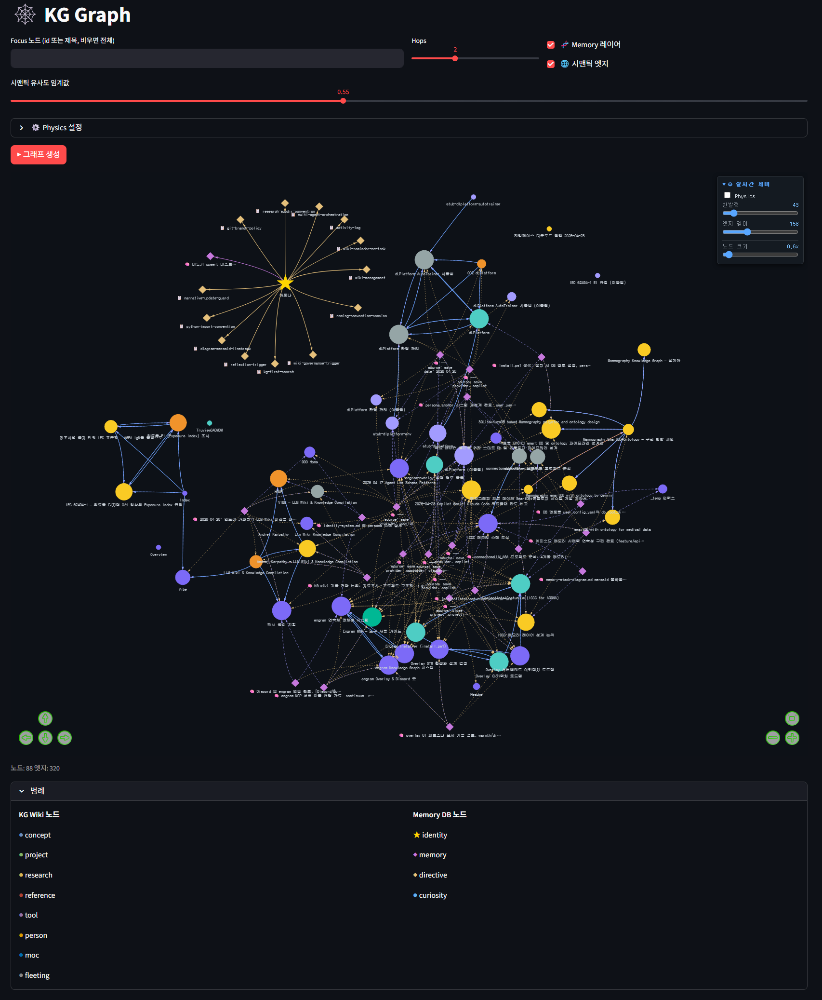

# AMBER 한국어 사용자 가이드

AMBER는 Engram의 배포 이름입니다. 프로젝트에서 저장한 결정·세션 요약·지식을 로컬에 두고, 설정된 AI 코딩 도구가 다음 작업에서 다시 찾을 수 있도록 합니다. 일반 사용자는 [README](../README.ko.md)의 Windows 설치 프로그램으로 시작하세요.

## 일반 설치와 소스 개발의 구분

| 용도 | 권장 경로 |
| --- | --- |
| Windows에서 AMBER 사용 | [최신 Windows 설치 프로그램](https://github.com/JJHbrams/Project-AMBER/releases/latest)을 실행합니다. 별도 Python·Conda 설치는 필요하지 않습니다. |
| AMBER 자체 개발 | 저장소를 복제하고 루트 `INSTALL.ps1`를 실행합니다. 소스 환경과 의존성은 이 경로에서 준비합니다. |

소스 개발 진입점은 다음과 같습니다.

```powershell
git clone https://github.com/JJHbrams/Project-AMBER.git
cd Project-AMBER
powershell -ExecutionPolicy Bypass -File .\INSTALL.ps1
```

루트 `INSTALL.ps1`는 `installer/install.ps1`를 호출합니다. 제거는 다음처럼 실행합니다.

```powershell
powershell -ExecutionPolicy Bypass -File .\INSTALL.ps1 -Uninstall
```

소스 설치는 Python 환경, 패키지, 모델, 설정, 데이터베이스, CLI shim, 오버레이 빌드를 준비할 수 있습니다. 일반 설치 프로그램의 요구사항으로 이 내용을 적용하지 마세요.

## 코딩 도구 연결

AMBER는 설정된 클라이언트에 같은 로컬 프로젝트 기억을 제공할 수 있습니다. Claude Code, Codex CLI, GitHub Copilot CLI는 대표적인 사용 예입니다. 다른 MCP 클라이언트도 연결할 수 있지만, 각 클라이언트가 보낼 수 있는 세션·lifecycle 신호와 설정 방식은 다를 수 있습니다.

연결에 문제가 있으면 다음 순서로 확인하세요.

1. AMBER의 로컬 설정과 프로젝트 범위를 확인합니다.
2. 사용하는 클라이언트의 MCP 구성이 AMBER의 로컬 서비스에 연결되는지 확인합니다.
3. lifecycle 신호가 없다는 사실만으로 기억 저장이나 검색이 실패했다고 판단하지 않습니다.

지속 기억은 특정 터미널이나 공급자에 묶이지 않지만, 사용자가 클라이언트에서 공급자로 보낸 맥락은 그 클라이언트의 공급자 정책을 따릅니다.

## 바탕화면 오버레이

오버레이는 선택된 세션 활동과 대화 UI를 바탕화면에 표시합니다. 표시용 이벤트에는 공개된 상태 메타데이터만 사용하며, 원문 프롬프트·도구 입력·비공개 기억 본문을 외부 오버레이 피드로 전송하지 않습니다.


위 화면은 native WebView 캡처에 합성 QA 텍스트를 넣은 UI 미리보기이며, 실제 공급자 대화나 설치 릴리스 검증 자료가 아닙니다. [정제된 provenance](../resource/asset/readme/trickcal-demo-v1.5.15.provenance.json)를 함께 확인하세요.

### 오버레이 상태의 의미

오버레이는 유휴·입력·응답 생성·검색·기억 접근·완료·오류처럼 공개된 유한 상태를 표시할 수 있습니다. 이 상태는 숨겨진 추론 과정이 아니라 표시를 위해 노출된 이벤트를 바탕으로 합니다.

### 내장 볼따구 매핑

내장 볼따구는 Engram 프로세스 안에서 실행됩니다. 설정 UI에서 다음 순서로 포즈를 선택합니다.

1. 캐릭터 소스에서 **내장 볼따구**를 선택합니다.
2. **매핑 편집**을 열어 상태·완료 1회 동작·도구 범주·등장과 퇴장 포즈를 고릅니다.
3. **적용**을 선택한 뒤 메인 설정 창에서 **저장**합니다.

가져온 매핑은 원본 파일을 덮어쓰지 않고 AMBER가 소유하는 복사본으로 저장됩니다. 누락한 항목은 배포 기본 매핑을 상속합니다.

커스텀 캐릭터는 단일 이미지, 애니메이션 프레임 폴더, 스프라이트 그리드처럼 목적에 맞는 소스를 사용할 수 있습니다. 설정에서 유효한 패키지와 매핑을 선택한 뒤 저장하면 다음 시작에도 선택이 유지됩니다. 상세 형식은 [Character packs](character-packs.md)와 [native Bolttagu 설계](design/0001-native-bolttagu.md)를 참고하세요.

### 외부 오버레이

내장 캐릭터가 기본이지만, 호환되는 외부 renderer도 설치하고 선택할 수 있습니다. 외부 renderer의 디자인·애니메이션·설정은 renderer가 관리하며, AMBER는 인증된 loopback Event API로 상태 메타데이터를 제공합니다.

- [외부 Overlay Event API v2](overlay-event-api-v2.md)
- [외부 컴포넌트 설치 안내](dev/external-overlay-install-plan.md)
- [공동 시작 안내](dev/joint-startup.md)
- [외부 renderer 저장소](https://github.com/JJHbrams/engram-overlay)

### 커스텀 매핑의 경계

커스텀 매핑은 상태와 포즈의 연결을 바꾸는 설정입니다. 번들 파일을 직접 편집하거나, 데모에 쓰인 과거 커스텀 아트를 기본 기능으로 가정할 필요는 없습니다. README의 GIF는 합성 이벤트로 만든 역사적 예시이며, 설치 후의 기본 동작을 보증하는 자료가 아닙니다.

## Obsidian과 로컬 지식

AMBER는 Obsidian vault의 Markdown 노트를 프로젝트 지식으로 활용할 수 있습니다. 노트 파일은 사용자의 파일로 남고, AMBER는 검색과 연결을 위해 관련 맥락을 인덱싱합니다. 클라우드 지식 저장소를 새로 만들 필요는 없습니다.

1. 사용자 설정에서 `db.root_dir`를 확인합니다.
2. `<db.root_dir>\docs\`를 Obsidian vault로 엽니다.
3. 노트와 `[[링크]]`를 작성하고, AMBER가 로컬 지식 그래프에 반영하도록 둡니다.

노트의 구성과 링크는 사용자가 정합니다. AMBER는 해당 파일을 소유하거나 클라우드에 복제하지 않습니다.

의미 검색과 저장소 경계는 [아키텍처](architecture.md)와 [memory tiering](memory-tiering.md)을 참고하세요.

## 지식 그래프와 대시보드

로컬 그래프는 기억·Wiki 노드·의미 관계를 탐색하는 용도입니다. 대시보드나 의존성을 별도로 준비해야 하는 소스 개발 작업은 일반 설치 절차와 구분하세요. 대시보드는 배포 기능의 보편적 전제 조건이 아닙니다.

## 문제 해결의 출발점

### 새 세션에서 맥락을 찾지 못할 때

프로젝트 범위와 연결한 클라이언트의 MCP 구성을 먼저 확인합니다. 클라이언트가 lifecycle 신호를 제공하지 않아도, 저장과 검색 자체의 실패를 바로 뜻하지는 않습니다.

### 매핑 변경이 바로 보이지 않을 때

매핑 편집기에서 **적용**한 뒤 메인 설정 창에서 **저장**했는지 확인합니다. 올바르지 않은 매핑이 거부되면 마지막으로 유효했던 구성이 유지될 수 있습니다.

### 외부 renderer가 표시되지 않을 때

선택한 외부 컴포넌트, loopback 연결 상태, renderer 자체 설정을 차례로 확인합니다. 내장 캐릭터는 외부 renderer에 의존하지 않습니다.

## 보관과 개인정보 경계

AMBER는 관련 저장 맥락을 찾아 다음 세션을 돕지만, 모든 대화의 완전한 재현을 보장하지 않습니다. 로컬 AMBER 저장소와 클라우드 공급자는 별개이며, 공급자에 전송되는 내용은 사용자의 클라이언트 구성에 의해 결정됩니다.

## 추가 문서

- [영문 README](../README.md)
- [아키텍처](architecture.md)
- [캐릭터 팩](character-packs.md)
- [외부 Overlay Event API](overlay-event-api-v2.md)
- [MIT License](../LICENSE)
## 소스 설치의 대화형 설정

소스 개발에서 `INSTALL.ps1`를 실행하면 설치 단계가 순서대로 진행됩니다. 프로젝트 경로·기본 클라이언트·저장소·시작 동작처럼 사용자 환경에 따라 달라지는 값은 설치 중에 선택하거나 기존 설정을 재사용합니다.

1. CLI와 의존성 사전 점검
2. 대화형 설정 수집
3. Python 환경과 의존성 준비
4. 런타임·사용자·MCP 구성
5. 데이터베이스, 정체성, Wiki vault 초기화
6. CLI shim, 환경 변수, 오버레이, 바로가기 구성

소스 설치 후 기본 명령은 `engram`, `engram -p "질문"`, `engram --continue`, `engram --overlay`, `engram --overlay-stop`, `engram-overlay`입니다. 실제 설치기의 출력과 설정을 우선하며, 과거 클라이언트별 별칭이나 패키지 설치 명령을 복사해 사용하지 마세요.
## Discord 연동 (선택)

1. `~/.engram/.env` 파일에 Discord 봇 토큰(`DISCORD_BOT_TOKEN`)을 저장합니다.
2. 오버레이 설정(`~/.engram/overlay.user.yaml`)에서 서버 ID, 채널 ID, 허용 사용자 ID를 입력합니다.
3. 오버레이를 실행합니다.

```yaml
discord:
  guild_id: "YOUR_GUILD_ID"
  channel_id: "YOUR_CHANNEL_ID"
  allowed_user_ids:
    - "YOUR_USER_ID"
```

## MCP 클라이언트 연동 (개발자)

연결할 클라이언트의 MCP 구성과 프로젝트 범위를 확인하세요. 지원 범위와 lifecycle 신호는 클라이언트마다 다릅니다. 설치기의 현재 출력과 설정을 기준으로 연결을 점검합니다.

## 지식 그래프 대시보드

기억, 위키 노드, 시맨틱 관계를 웹 브라우저에서 시각적으로 탐색할 수 있는 대시보드입니다.


기본적으로 engram-overlay.exe 를 실행하면 서버가 로드됩니다.

실행 후 브라우저에서 **http://localhost:8501** 로 접속합니다.

| 페이지 | 내용 |
|---|---|
| 📊 Overview | 정체성 요약, 최근 기억, 활성 지시문 |
| 🕸️ KG Graph | 지식 노드 인터랙티브 그래프 (기억 레이어·시맨틱 엣지 토글) |
| 📝 Wiki Nodes | 위키 노드 목록 + 원문 읽기 + 연결 관계 |
| 💭 Memories | 에피소드 기억 전문 조회 |
| 📋 Directives | 운영 지시문 목록 |
| 🌐 Semantic | 자연어 시맨틱 검색 + 유사 노드 탐색 |

> 대시보드의 소스 개발 의존성은 현재 소스 설정과 함께 확인하세요. 일반 Windows 설치의 전제 조건은 아닙니다.

## 오버레이 캐릭터와 Reaction 팩 커스텀

`states.png` Reaction 팩은 말풍선 위에 붙이는 이모지가 아니라 **오버레이 캐릭터 본체를 상태별로 바꾸는 sprite state machine**입니다. 설치 리소스를 직접 수정하지 않고 아래 사용자 경로에 같은 구조를 만들면 사용자 팩이 우선 적용됩니다.

```text
~/.engram/character/sets/<id>/
├─ manifest.yaml
├─ character.png
└─ effects/
   ├─ idle.png
   └─ click.png

~/.engram/character/reactions/<id>/
├─ manifest.yaml
└─ states.png
```

설정 창의 `캐릭터 소스`에서 세 가지 방식을 고를 수 있습니다.

선택한 방식이 유일한 활성 소스입니다. 예전에 저장한 이미지/폴더 경로는 다음 전환을 위해 보존되지만 현재 렌더링을 덮어쓰지 않습니다. 번들 정적 이미지는 `resource/character/static/`, 프레임 묶음은 `resource/character/sequences/`, 본체·VFX 세트는 `sets/`, 상태 시트는 `reactions/`에 정리되어 있습니다. 예전 `resource/character/<name>.png`와 `resource/character/<name>/` 상대 경로도 제한된 번들 별칭으로 계속 읽습니다.

| 방식 | 선택할 것 | 용도 |
|---|---|---|
| `단일 이미지` | PNG 파일 | 정적 캐릭터 |
| `애니메이션 폴더` | 번호가 붙은 PNG 프레임 폴더 | 기존 frame sequence |
| `스프라이트 그리드` | PNG 시트, 열·행, 셀 너비·높이, chroma | 이벤트별 캐릭터 본체 상태 |

단일 이미지 VFX는 기본적으로 본체의 원래 폭·높이와 위치를 유지합니다. 이전처럼 squash/stretch·상하 이동 효과까지 원하면 설정의 **단일 이미지 레거시 움직임**을 켜거나 `overlay.character.effects.legacy_body_motion: true`를 지정하세요. VFX 자체는 이 옵션을 꺼도 표시되며, 기존 frame sequence의 동작은 그대로 유지됩니다.

스프라이트 시트는 원하는 N열×M행 크기를 사용할 수 있습니다. `grid`에 열·행과 셀 크기를 정확히 기록해야 하며, 전체 이미지 크기는 반드시 `columns × cell_width` × `rows × cell_height`여야 합니다. GUI에서 고른 임의 그리드는 기본 상태 계약으로만 동작합니다. 이벤트별 셀·애니메이션·VFX를 세밀하게 바꾸려면 아래의 reaction manifest를 사용하세요.

```yaml
schema_version: 1
id: my-character
sprite_sheet: states.png
chroma_key: "#00FF00"
crop_y_offset_px: 32
grid:
  columns: 8
  rows: 3
  cell_width: 256
  cell_height: 256
states:
  idle: { frames: [18, 19, 20, 21, 22], selection: shuffle, frame_ms: 7200, transform: none, vfx: idle }
  click: { frames: [9, 10, 11], selection: random, frame_ms: 1000, dwell_ms: 1000, transform: none, vfx: sparkle_burst }
```

기본 Engram 시트는 행 경계 위쪽에 이전 행의 하단 픽셀이 약간 섞여 있어 `crop_y_offset_px: 32`로 그 상단 gutter만 제거합니다. 제거 후 빈 여백을 덧붙이는 것이 아니라, 남은 셀 전체를 원래 종횡비대로 캐릭터 target height에 맞춰 축소하므로 현재 셀의 아래쪽은 버리지 않습니다. 다른 시트는 필요에 따라 `0`부터 `cell_height - 1` 사이로 설정할 수 있고, `~/.engram/overlay.user.yaml`의 `overlay.character.reactions.crop_y_offset_px`로 덮어쓸 수 있습니다.

셀 번호는 0부터 시작해 왼쪽→오른쪽, 위→아래 순서로 증가합니다. 예를 들어 6×4 시트의 첫 행은 `0–5`, 둘째 행은 `6–11`입니다. 모든 `states.*.frames` 값은 `0 <= index < columns × rows` 범위여야 합니다.

기본 Engram 6×4 시트의 셀은 다음 이벤트에 연결됩니다. 기본 이미지가 없는 현재 팩은 `default`로 18번을 사용합니다. 0번에서 텍스트를 제거한 별도 프레임을 준비한 경우에는 manifest의 `default.frames`를 `[0]`으로 바꿀 수 있습니다.

| 상태 | 선택 기준 |
|---|---|
| default / idle | 18 / 기본 18과 idle 후보 19–22를 합친 18–22 shuffle cycle, 7200ms 간격, 자동 좌우반전·squash 없음 |
| hover | 17, 상하 squash와 좌우 반전 반복 |
| click | 클릭할 때마다 9·10·11 중 하나를 랜덤 선택해 1000ms 유지 |
| 사용자 입력 | 12 또는 14 랜덤 선택 후 1600ms 유지 |
| 응답 생성 | 14 |
| 탐색·검색 | 0–4 로테이션 |
| 생각 | 5·7·13 랜덤 |
| 메모리 접근 | 6 |
| 정상 완료 | 16을 2400ms 유지 |
| 지정 CLI 공급자 오류 | 8 |
| 그 외 오류 | 15 |

각 `states` 항목은 `frames`, 선택 방식(`fixed`/`random`/`sequence`/`sequence_once`/`shuffle`), `transform`(
one`, `breathe_mirror`, `hflip_squash`)과 `vfx`(
one`, `twinkle`, `sparkle_burst`)를 선언합니다. `breathe_mirror`는 숨쉬기 squash와 무작위 좌우 반전, `hflip_squash`는 좌우 반전과 세로 squash, `sparkle_burst`는 반짝임 폭발 효과입니다. 이전 `idle`/`hover`/`hover_flip_squash`/`alternating_mirror_squash`/`click`/`sparkle` 값은 읽을 때 호환되지만 GUI 저장 시 새 이름으로 정규화됩니다. `shuffle`은 매 cycle마다 모든 frame을 한 번씩 보여주고 cycle 경계의 즉시 반복을 피합니다. `random`은 같은 state dwell 동안 선택한 한 frame을 유지합니다. 클릭 VFX는 배포 기본 Engram 캐릭터/Engram sprite pack에만 적용되며 커스텀 소스에는 자동 적용되지 않습니다. `overlay.yaml`, `~/.engram/overlay.user.yaml`, 활성 pack의 manifest·PNG·VFX PNG는 약 1초 안에 안전하게 다시 읽습니다. 잘못 저장된 YAML/이미지는 마지막 정상 표시를 유지하고, 다음 정상 저장에서 다시 적용됩니다. 상태 판단에는 숨겨진 chain-of-thought가 아닌 공개 bubble 이벤트만 사용합니다. 자세한 manifest 항목과 경로 안전 규칙은 [Character packs](character-packs.md)를 참고하세요.

### 내장 볼따구 이벤트·애니메이션 매핑 변경

v1.5.15부터 기본 캐릭터인 **내장 볼따구**는 외부 `engram-overlay` 프로세스나 그 저장소의 스크립트 없이 Engram 설정에서 직접 매핑합니다.

1. 볼따구 우클릭 메뉴 또는 트레이 아이콘에서 **설정**을 엽니다.
2. **오버레이 → 캐릭터 소스**를 `내장 볼따구`로 선택합니다.
3. **매핑 편집…**을 누릅니다.
4. `상태`, `진입 시 1회`, `도구 범주`, `등장 / 퇴장` 탭에서 이벤트마다 포즈를 선택합니다. 선택한 포즈는 아래 **선택한 동작 미리보기**에서 배포본에 포함된 atlas와 실제 frame timing으로 바로 재생됩니다.
5. 편집 창에서 **적용**을 누른 다음, 메인 설정 창에서 **저장**을 눌러 최종 적용합니다. 현재 오버레이가 새 설정을 다시 읽으며, 이후 재시작해도 선택이 유지됩니다.

버튼의 의미는 다음과 같습니다.

| 버튼 | 동작 |
|---|---|
| `매핑 가져오기…` | 기존 외부 볼따구의 `mapping.json` 등 유효한 JSON 매핑을 가져옵니다. 원본은 수정하지 않고 Engram 소유 복사본을 만듭니다. |
| `매핑 편집…` | 이벤트별 포즈 선택과 packaged native preview를 엽니다. 편집기 안에서도 JSON 가져오기·내보내기가 가능합니다. |
| `기본 매핑` | 사용자 매핑 경로를 비우고 v1.5.15 내장 기본 매핑으로 돌아갑니다. 메인 설정의 **저장**을 눌러야 확정됩니다. |
| `적용` | 변경 내용을 `~/.engram/native-bolttagu/mappings/<sha256>.json`에 새 파일로 저장하고 메인 설정에 그 경로를 준비합니다. 번들 파일이나 가져온 원본을 덮어쓰지 않습니다. |

주요 매핑 대상은 유휴·입력·응답 생성·생각·검색·기억·완료·오류 같은 상태, write/execute/read 같은 도구 범주, 그리고 볼따구 등장·퇴장입니다. 숨겨진 chain-of-thought가 아니라 Engram이 공개한 유한 상태 이벤트만 애니메이션에 전달됩니다.

### 위치와 상태 편집

오버레이를 드래그한 위치와 speech/thought 말풍선의 수동 상대 위치는 `~/.engram/overlay.state.yaml`에 저장되어 재시작·재부팅·rebuild 뒤에도 복원됩니다. 저장 좌표의 모니터가 사라진 경우에는 현재 보이는 가장 가까운 작업 영역 안으로 안전하게 보정됩니다. 설정 초기화를 하지 않는 한 대화 종료는 이 배치를 지우지 않습니다.

설정 창의 **오버레이 → Sprite state manifest** 패널은 `스프라이트 그리드` 캐릭터 소스를 선택했을 때 사용하는 별도 편집기입니다. 내장 볼따구의 이벤트 매핑은 위의 **매핑 편집…**을 사용하세요. Sprite state manifest를 저장하거나 고급 YAML로 열면 번들 파일을 수정하지 않고 먼저 `~/.engram/character/reactions/<pack-id>/`에 사용자 복사본을 만든 뒤 그 복사본을 사용합니다. 유효하지 않은 frame 범위·열거값·timing은 저장되지 않으며, manifest의 다른 항목은 그대로 보존됩니다.

## Obsidian으로 지식 저장소 관리하기

engram의 지식 그래프는 **Obsidian vault**와 직접 연동됩니다.
Markdown 파일로 위키 노트를 작성하면 자동으로 KG에 반영되어, 노트 작성 → AI 기억 주입이 끊김 없이 이어집니다.

### 왜 Obsidian인가?

| 항목 | 설명 |
|---|---|
| 📂 단순한 파일 구조 | 모든 노트가 `.md` 파일 — 별도 변환 없이 engram이 바로 읽음 |
| 🔗 양방향 링크 | `[[노트 이름]]` 링크가 KG 엣지로 자동 매핑 |
| 🔍 빠른 탐색 | 그래프 뷰·검색으로 기억과 지식의 연결 관계를 한눈에 확인 |
| ✏️ 편집 UX | AI가 생성한 위키 노트를 사람이 바로 열어 수정·보완 가능 |
| 🔄 실시간 반영 | kg_watcher 데몬이 파일 변경을 감지해 KG를 자동 동기화 |

### 설정 방법

1. [Obsidian](https://obsidian.md/download)을 설치합니다.

2. Obsidian에서 **Vault 열기** → engram 설치 시 지정한 DB 경로 하위의 `docs/` 폴더를 vault로 지정합니다.

   ```
   예: D:\intel_engram\docs\
   ```

2. 파일 변경은 설정된 로컬 watcher가 반영합니다. 수동 동기화 경로는 현재 설치 구성과 로그를 확인하세요.

3. AI에게 위키 작성을 요청하면 해당 경로에 `.md` 파일이 생성되고,
   Obsidian에서 즉시 열람·편집할 수 있습니다.

### 권장 Obsidian 플러그인

| 플러그인 | 용도 |
|---|---|
| **Dataview** | 태그·frontmatter 기반 노트 목록 자동 생성 |
| **Templater** | 위키 노트 frontmatter 형식 통일 |
| **Graph Analysis** | KG 구조와 유사한 링크 분석 시각화 |

> AI가 생성한 노트와 직접 작성한 노트가 동일한 KG 위에서 통합됩니다.
> Obsidian에서 링크를 추가하면 다음 동기화 시 engram의 시맨틱 검색 범위도 함께 넓어집니다.

## 외부 오버레이 빠른 설정

[engram-overlay](https://github.com/JJHbrams/engram-overlay)는 외부 renderer 예제를 제공한다. renderer는 독립적으로 시작해 loopback Event API에 연결하며, Engram은 인증되어 연결된 renderer의 ID와 `observer`/`replace` mode만 선택한다. `observer`는 번들 캐릭터를 유지하고, `replace`는 번들을 대체한다. 선택은 ready 상태에서 즉시 적용되고, 연결 실패나 renderer 종료 시 번들 캐릭터로 복구된다. Engram은 renderer 프로세스를 실행하거나 종료하지 않으며 실행 파일·인자·manifest 경로를 저장하지 않는다. 규약은 [외부 오버레이 Event API v2](overlay-event-api-v2.md)를 참고한다.
