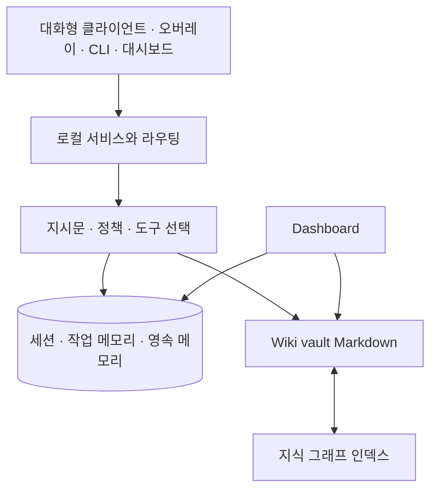

# 아키텍처

> 시스템은 하나의 화면이 아니라, 요청을 받는 클라이언트·행동을 정하는 정책과 서비스·영속 데이터를 담는 저장소·사람이 편집하는 Wiki 원문으로 구성된다. 같은 기능을 서로 다른 화면에서 보더라도 원문과 실행 환경을 구분해 판단한다.

## 목적과 사용 시점

데이터가 어디에 저장되는지, 어떤 화면을 재시작해야 하는지, 문서·검색·설정 중 무엇을 확인해야 하는지 판단할 때 사용한다. 특히 “대시보드에는 보이는데 검색이 안 됨”, “새 설정이 한 화면에만 반영되지 않음” 같은 문제에서 경계를 먼저 그린다.

## 구성 요소와 경계

텍스트 대체 설명: 모든 화면은 로컬 서비스 또는 저장소를 통해 정보를 읽는다. 정책과 도구 선택은 메모리 저장소와 Wiki vault를 사용할 수 있다. Wiki 원문은 그래프 인덱스로 동기화되어 검색에 쓰이며, 대시보드는 저장된 데이터와 원문을 보여 주는 화면이다.

## 정신 모델: 원문, 인덱스, 표시를 분리한다

- **원문**: Wiki vault의 Markdown이다. 사람이 읽고 편집하는 기준이다.
- **인덱스**: 원문에서 만든 지식 그래프와 검색용 정보다. 원문과 인덱스의 갱신 시점은 다를 수 있다.
- **상태 저장소**: 세션, 작업 메모리, 장기 메모리, 설정처럼 문서와 다른 수명 주기를 가진 데이터다.
- **표시 화면**: 오버레이·CLI·대시보드처럼 데이터를 표시하거나 요청을 전달한다. 화면을 재시작한다고 원문이나 영속 저장소가 자동으로 지워지지는 않는다.

이 구분은 문제를 한 곳에만 몰아넣지 않게 한다. 예를 들어 Wiki 파일이 존재하지만 검색 결과가 없으면 먼저 원문이 아니라 인덱스 동기화 상태를 의심한다. 반대로 검색 결과가 있지만 화면이 오래된 상태라면 해당 화면의 재시작 또는 설정 재적용이 필요할 수 있다.

## 시나리오: 새 Wiki 지식이 검색되도록 만들기

1. `<data-root>/docs` 아래에 `<page-id>.md`를 작성하거나 갱신한다.
2. 페이지에 안정적인 `id`, `title`, `note_type`, `tags`, `summary`와 관련 Wiki 링크(`[ [<page-id>] ]` 형식)가 있는지 확인한다.
3. [[wiki-kg|Wiki 동기화]]를 실행해 원문을 인덱스에 반영한다.
4. 검색 도구로 제목·키워드·의미 검색을 수행해 원문과 검색 결과를 비교한다.
5. 그래도 표시 화면에서 보이지 않으면, 그 화면이 같은 데이터 루트와 최신 상태를 읽는지 점검한다.

## 기대 동작

- 클라이언트 하나를 다시 열어도 Wiki 원문과 영속 데이터가 즉시 사라지지 않는다.
- 원문을 동기화한 뒤에는 해당 페이지의 ID·제목·태그를 기준으로 검색할 수 있다.
- 대시보드는 별도 매뉴얼 복사본이 아니라 vault에 있는 원문을 읽는 뷰어여야 한다.
- 정책·도구·저장소의 실패는 가능한 한 해당 경계에서 관찰하고 좁은 범위로 복구한다.

## 증상, 확인, 복구

| 관찰된 증상 | 경계 가설 | 읽기 전용 확인 | 복구 후 검증 |
| --- | --- | --- | --- |
| 파일은 있는데 검색되지 않는다 | 원문→인덱스 동기화 | 페이지 frontmatter, `kg_sync`, `kg_lint` 결과 | 같은 질의로 `kg_search` 또는 의미 검색 재실행 |
| 검색은 되는데 화면이 오래됐다 | 화면→저장소 연결 또는 캐시 | 화면의 데이터 루트·표시 시점·상태 | 영향받은 화면만 재시작하고 원래 동작 재현 |
| 세션 맥락과 Wiki가 다르다 | 수명 주기가 다른 데이터 | [[session-memory|메모리 계층]]과 Wiki 수정 시점 | 재사용할 결정은 Wiki에 정리하고 새 요청에서 확인 |
| 도구 호출이 기대와 다르다 | 정책→도구 라우팅 | [[mcp-tools|도구 설명과 schema]] | 변경 전 읽기 전용 호출로 범위를 확인한 뒤 재시도 |

## 안전과 한계

이 그림은 개념적 구조이며, 특정 클라이언트가 항상 모든 구성 요소를 사용한다는 뜻은 아니다. 검색 결과가 없다고 해서 데이터가 사라졌다고 결론내리지 말고, 원문·인덱스·표시를 순서대로 확인한다. `<data-root>`는 설치 환경마다 다르므로 문서에 실제 경로나 개인 식별값을 기록하지 않는다.

## 관련 페이지와 도구

- 맥락과 저장 수명: [[session-memory]]
- Markdown 원문과 인덱스: [[wiki-kg]]
- 화면 표시와 상태: [[dashboard]], [[overlay-settings]]
- 도구 호출 경계: [[mcp-tools]]
- 증거 기반 복구: [[self-diagnosis]]

함께 보기: [[manual-index]], [[getting-started]], [[wiki-kg]], [[self-diagnosis]].
