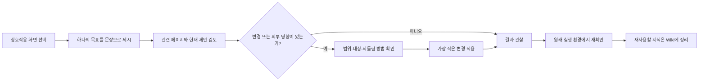

# 시작하기와 튜토리얼

> 튜토리얼은 실제 대화형 클라이언트를 대신하지 않는다. 이 페이지는 요청을 작게 만들고, 영향 있는 변경을 확인하며, 결과를 같은 실행 환경에서 검증하는 방법을 설명한다.

## 목적과 사용 시점

처음 기능을 만지거나, 설정·도구·자동화가 의도대로 연결되는지 확인할 때 사용한다. 한 번에 여러 설정을 바꾸기보다 하나의 목표와 하나의 관찰 지점을 정하는 것이 핵심이다. 화면별 조작은 [[overlay-settings|오버레이와 설정]], 상태 조회는 [[dashboard|대시보드]], 도구 호출은 [[mcp-tools|MCP 도구]]를 함께 참고한다.

## 정신 모델

클라이언트는 요청을 전달하는 입구이고, 시스템은 정책과 저장소를 통해 맥락·Wiki·도구를 연결한다. 따라서 “답변이 보였다”와 “변경이 실제로 반영됐다”는 다른 성공 기준이다. 설명을 받는 단계, 변경을 수행하는 단계, 원래 경로를 재실행해 확인하는 단계를 분리한다.

## 기본 흐름

텍스트 대체 설명: 먼저 화면과 목표를 고른다. 변경이 있으면 대상과 되돌림 방법을 확인하고 가장 작은 변경만 적용한다. 이후에는 설명 화면이 아니라 원래 사용하던 화면이나 명령에서 결과를 재확인하고, 재사용할 결론만 Wiki에 기록한다.

## 안전한 첫 실습

예시 목표: “`<scope>`에서 현재 사용 가능한 Wiki 페이지를 찾아, 변경 없이 요약해 줘.”

1. [[dashboard|대시보드]] 또는 현재 사용하는 대화형 화면에서 이 목표를 한 번 요청한다.
2. 결과에 포함된 페이지 ID·제목·근거가 실제 Wiki 원문과 맞는지 확인한다.
3. 다음에는 되돌릴 수 있는 설정 하나만 고른다. 예: 표시 옵션을 바꾼 뒤 같은 화면에서 반영 여부를 확인한다.
4. 관찰 결과와 문서의 기대 동작이 다르면 수정부터 하지 말고 [[self-diagnosis|자가진단]]으로 넘어간다.

이 예시는 실제 경로나 이름을 요구하지 않는다. `<scope>`는 현재 작업 범위를 뜻하는 중립적 값이며, 민감한 대화 내용이나 개인 설정값을 문서 예시에 넣지 않는다.

## 기대 동작

- 요청의 목표와 범위가 분명하면, 관련 맥락과 가능한 다음 행동을 구분해서 제시한다.
- 읽기 전용 요청은 상태를 바꾸지 않는다.
- 변경이 필요한 요청은 대상, 영향, 확인 방법을 먼저 알 수 있어야 한다.
- 완료라고 말하려면 실제로 사용하려는 UI·CLI·설치 경로에서 결과를 확인해야 한다.

## 증상, 확인, 복구

| 관찰된 증상 | 먼저 확인할 근거 | 복구와 재검증 |
| --- | --- | --- |
| 안내가 현재 기능과 맞지 않는다 | 관련 기능 페이지의 목적·한계와 현재 설치 상태 | 기능별 문서를 다시 열고, 가장 작은 읽기 전용 요청부터 반복 |
| 변경 전인데 결과가 달라졌다 | 요청 범위, 선택한 화면, 표시 중인 상태 | 영향을 받는 화면만 새로 열고 원래 요청을 재실행 |
| 완료처럼 보이나 실제 동작은 확인하지 못했다 | 어떤 런타임에서 무엇을 관찰했는지 | 완료 판단을 보류하고 원래 UI·CLI·installer 경로에서 확인 |
| 문서나 검색 결과가 없다 | [[wiki-kg|Wiki 원문과 인덱스 상태]] | frontmatter·링크를 확인하고 동기화 후 다시 검색 |

## 안전과 한계

튜토리얼은 권한을 부여하거나 자동 복구를 보장하지 않는다. 설정·파일·외부 시스템을 바꾸는 요청은 별도의 확인이 필요하며, 화면에 보이는 요약만으로 데이터가 보존됐다고 가정하지 않는다. 여러 문제를 동시에 재현하면 원인을 분리하기 어려우므로 한 번에 하나의 가설만 검증한다.

## 관련 페이지와 도구

- 화면과 상태: [[dashboard]], [[overlay-settings]]
- 지식 기록과 검색: [[wiki-kg]], `kg_read_note`, `kg_search`, `kg_semantic_search`
- 변경 전 도구 확인: [[mcp-tools]]
- 예상 밖 동작: [[self-diagnosis]]

함께 보기: [[manual-index]], [[architecture]], [[session-memory]], [[self-diagnosis]].
