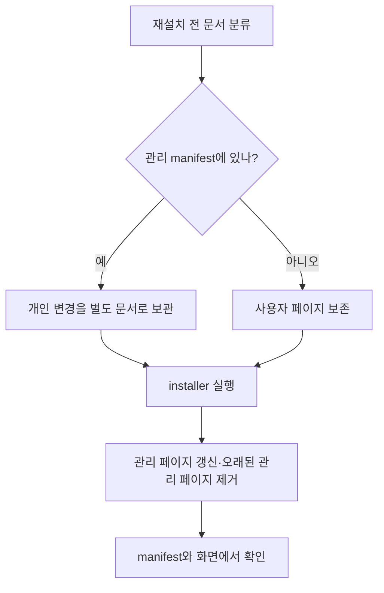

# 설치와 업데이트

> 일반 Wiki 템플릿은 없는 경우에만 복사한다. 매뉴얼 페이지는 버전 관리되어 재설치할 때마다 갱신한다.

## 무엇이 갱신되고 무엇이 보존되는가

installer는 서로 다른 두 정책을 사용한다. 일반 Wiki 템플릿은 사용자가 이미 작성한 내용을 보호하기 위해 대상 파일이 없을 때만 복사한다. 반면 매뉴얼은 배포본의 운영 문서이므로 관리 manifest에 적힌 페이지를 매 설치 때 갱신한다. 이 구분을 이해하면 재설치 전 문서 위치를 안전하게 선택할 수 있다.

| 대상 | 재설치 동작 | 사용자에게 권장되는 위치 |
| --- | --- | --- |
| 일반 Wiki 템플릿 | 없을 때만 생성 | 기존 템플릿 파일을 직접 발전 가능 |
| 관리형 매뉴얼 페이지 | 현재 패키지 원문으로 갱신 | 개인 문서는 별도 페이지·별도 이름 |
| 이전 manifest에만 있는 관리 페이지 | 현재 manifest에서 빠졌다면 제거 | 필요한 개인 변경은 제거 전 별도 문서로 이동 |
| manifest 밖 사용자 파일 | 보존 | 사용자 노트·프로젝트 문서 |
| 관리형 directive | 설치본 정의에 따라 갱신 | 개인 정책은 별도 사용자 출처로 관리 |

`.install-manifest.json`에는 설치가 관리하는 파일 목록과 콘텐츠 해시가 기록된다. 이 파일은 매뉴얼의 내용이 아니라 installer의 상태 기록이다. 해시는 설치본과 상태를 비교할 근거가 되며, 개인 변경을 자동 병합하거나 백업하는 기능은 아니다.

## 시나리오: 재설치 전과 후

1. 매뉴얼 폴더의 개인 초안이 정말 필요한지 확인한다.
2. 필요한 초안은 관리 manifest에 없는 사용자 페이지 또는 버전 관리 위치로 옮긴다.
3. 일반 installer를 실행하고, 출력의 생성·갱신·제거 개수를 확인한다.
4. `.install-manifest.json`의 `managed_files`와 패키지 manifest의 파일 목록을 비교한다.
5. 대시보드와 Obsidian에서 같은 매뉴얼 페이지가 열리는지 확인한다.

텍스트 대체 설명: 먼저 문서가 관리 대상인지 구분한다. 관리 대상의 개인 변경은 별도 문서에 보관한 후 설치를 실행하고, 설치 상태와 두 뷰어에서 결과를 확인한다.

## 일반 설치와 개발 변경 적용

| 상황 | 적절한 경로 | 확인 |
| --- | --- | --- |
| 새 환경 또는 배포본 갱신 | 일반 installer | 설정·템플릿·관리형 매뉴얼·실행 구성 요소 |
| 소스 코드의 빠른 개발 반영 | 개발용 rebuild 절차 | 변경된 실행 파일·스크립트와 대상 런타임 |
| 설정이나 Wiki 원문만 확인 | 해당 파일과 서비스 상태 점검 | 재빌드 없이도 원문·경로 확인 가능 |

개발 rebuild는 배포 설치의 모든 초기화·복구 단계를 대체하지 않는다. 의존성, installer 템플릿, 동결 실행 파일, 시작 등록이 바뀌면 일반 설치 또는 프로젝트가 정한 전체 경로가 필요할 수 있다. 실행 중인 오버레이나 대시보드를 바꾸기 전에는 영향받는 프로세스의 재시작 요구를 확인한다.

## 기대 동작

installer는 현재 매뉴얼 페이지를 `<db-root>/docs/guides/engram-manual/`에 쓰고, 관리 파일 목록과 콘텐츠 해시를 기록하며, 자신이 관리하는 directive 레코드를 갱신한다. 그 목록 밖의 사용자 파일은 건드리지 않는다.

## 이상 징후

- 업데이트 후 새 매뉴얼 페이지가 없다.
- 사용자 작성 페이지가 매뉴얼 폴더에서 사라졌다.

## 점검

매뉴얼 폴더의 `.install-manifest.json`을 읽고 `managed_files`를 패키지 manifest와 비교한다. installer 출력에서 생성, 갱신, 제거된 관리 파일을 확인한다. 예상과 다른 제거가 있으면 즉시 같은 installer를 반복하기보다 현재 manifest와 이전 상태 파일을 보존하고 대상 경로를 확인한다.

## 복구

의도한 `<db-root>`로 일반 installer를 실행한다. 사용자 페이지에 실수로 관리 이름을 썼다면 버전 관리나 백업에서 복원하고 다음 업데이트 전 다른 파일명으로 옮긴다. 설치가 중단되었으면 오류 출력과 상태 파일을 확인한 뒤, 같은 대상·같은 버전에서 다시 실행한다. 개인 Wiki 전체를 덮어쓰거나 넓은 삭제 명령으로 복구하지 않는다.

## 제한과 주의

- 관리형 매뉴얼 파일은 사용자 편집 보존 대상이 아니다. 장기 개인화는 별도 페이지·저장소·백업에 둔다.
- stale 제거는 이전 설치 상태가 관리 대상으로 기록한 파일에 한정된다. manifest 밖 파일을 정리 대상으로 가정하지 않는다.
- 실제 installer 검증은 임시 또는 명시한 대상 vault에서 먼저 수행하는 편이 안전하다. 파일 존재 검사만으로 UI·실행 파일 갱신을 단정하지 않는다.

## 관련 도구

installer bootstrap 명령, 설정 점검, 대시보드 상태, [[self-diagnosis]].

함께 보기: [[index]], [[dashboard]], [[wiki-kg]], [[self-diagnosis]].
