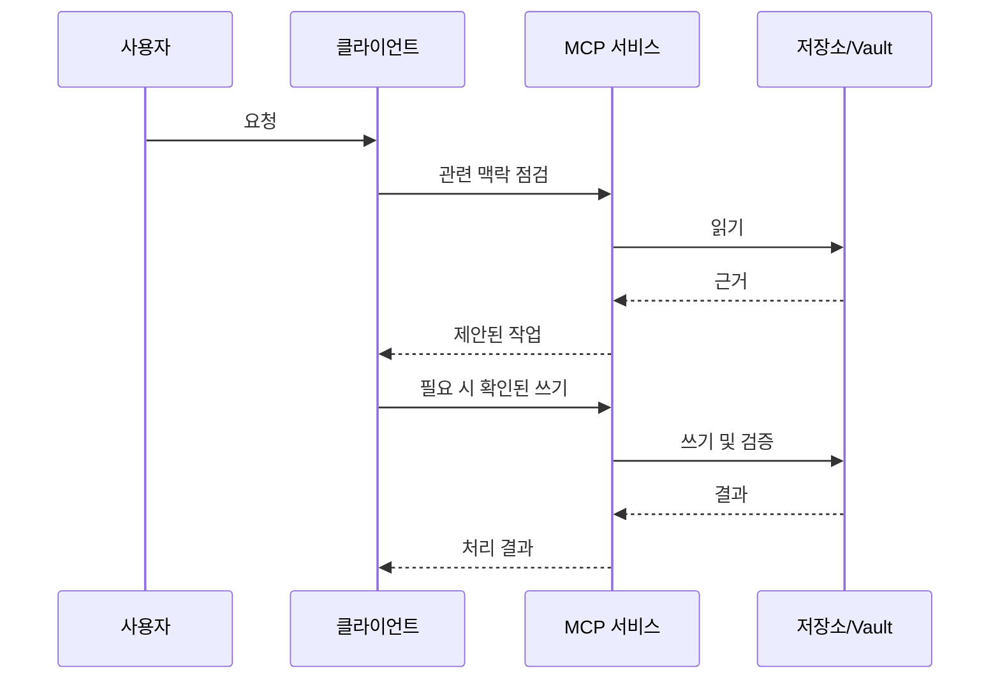
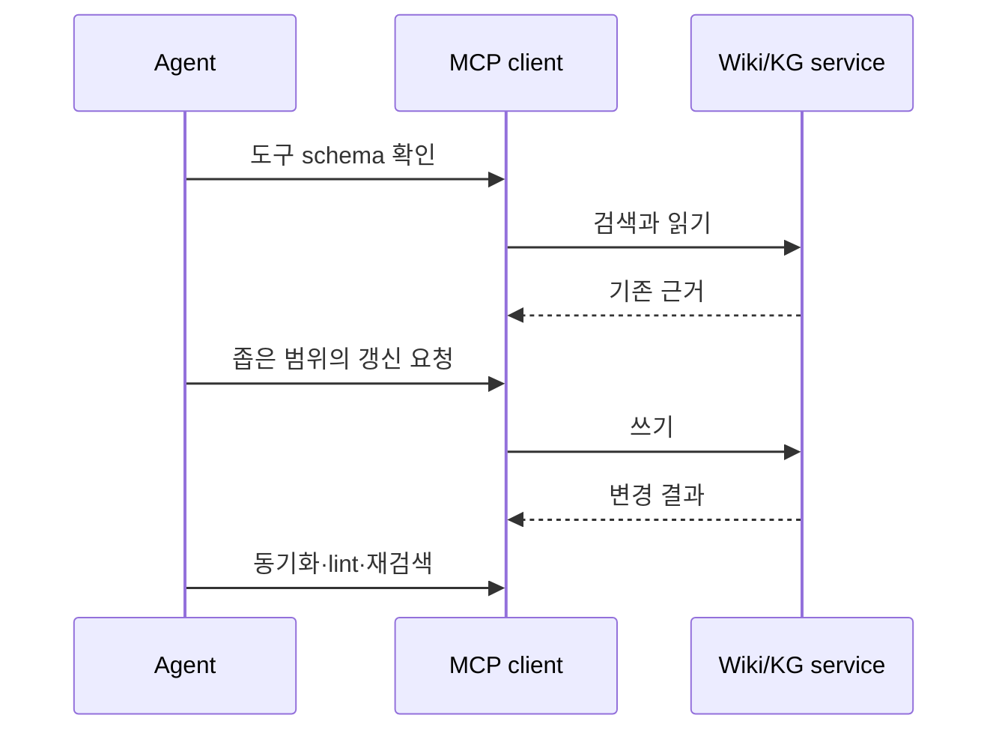

# MCP 도구

> 도구 제공 여부는 설치된 서버와 클라이언트에 따라 달라진다. 고정된 목록을 가정하지 말고 활성 schema를 점검한다.

텍스트 대체 설명: 사용자의 요청은 클라이언트를 거쳐 MCP 서비스로 전달된다. 서비스는 저장소나 vault의 근거를 읽고, 필요한 쓰기와 검증 뒤에 결과를 클라이언트로 돌려준다.

접근성 요약: 먼저 맥락과 도구 schema를 점검한다. 영향 있는 쓰기는 확인을 받고, 쓰기를 검증한 뒤 관찰한 결과를 보고한다.

## schema부터 확인하는 이유

MCP 서버와 클라이언트의 조합에 따라 도구 이름, 인수, 권한, 사용할 수 있는 기능이 다르다. 예전 대화나 문서에 있던 이름을 그대로 호출하는 대신, 먼저 연결된 도구 목록과 schema를 읽는다. schema는 필수 인수와 반환 형식을 보여 주며, 도구가 현재 세션에서 실제로 호출 가능한지도 알려 준다.

| 작업 종류 | 대표적 도구 계열 | 안전한 첫 단계 | 성공 확인 |
| --- | --- | --- | --- |
| 현재 맥락 읽기 | context, 상태 조회 | scope와 작업 경로 확인 | 반환된 범위가 현재 요청과 일치 |
| Wiki 탐색 | `kg_search`, `kg_read_note`, 의미 검색 | 키워드·기존 노트 읽기 | 대상 노트와 링크를 다시 읽음 |
| Wiki 변경 | `kg_add_note`, 갱신·부분 수정 | 중복 노트와 대상 경로 확인 | 동기화 뒤 lint와 재조회 |
| 정책·설정 점검 | directive, 상태·설정 조회 | 읽기 전용 schema 확인 | 적용 계층과 활성 값 비교 |
| 정체성·페르소나 변경 | 전용 갱신 도구 | 현재 값과 영향 범위 읽기 | 최소 변경 뒤 렌더링 확인 |

표의 이름은 대표 예시다. 실제 호출은 활성 schema가 제공하는 이름과 인수만 사용한다.

## 시나리오: Wiki에서 답을 찾고 갱신하기

1. 도구 목록에서 Wiki/KG 도구의 schema를 확인한다.
2. 의미 검색과 키워드 검색으로 기존 페이지를 찾는다.
3. 정확히 같은 주제면 대상 페이지를 읽고, 아니라면 적절한 분류를 정한다.
4. 변경 전 내용과 의도된 제목·요약·링크를 검토한다.
5. 최소 범위로 기록하거나 갱신한다.
6. 동기화와 lint 후, 같은 검색어로 새 내용이 검색되는지 확인한다.

텍스트 대체 설명: agent는 먼저 schema와 기존 Wiki 근거를 읽고, 좁은 갱신을 한 뒤 동기화·lint·재검색으로 결과를 확인한다.

## 기대 동작

읽기 전용 도구는 활성 Wiki, 그래프, 설정, 상태를 점검할 수 있다. 쓰기 도구는 대상을 식별하고 검증 결과를 보고한다.

## 이상 징후

- 도구 이름이나 매개변수를 사용할 수 없다.
- 쓰기는 성공했으나 기대한 페이지나 레코드가 보이지 않는다.

## 점검

연결된 도구를 나열하고 schema를 점검하며 활성 `<db-root>`를 확인한다. 쓰기 뒤에는 대상을 다시 읽고 Wiki 변경 뒤에는 `kg_lint`를 사용한다. 서비스 연결이 끊긴 경우에는 도구 이름을 추측해 재시도하지 말고, 서비스 상태·클라이언트 등록·네트워크 경계를 먼저 확인한다.

## 복구

넓은 범위의 쓰기를 무작정 재시도하지 않는다. 대상을 좁히고 읽기 전용 점검 도구를 사용한 뒤 영향받은 하위 시스템은 [[self-diagnosis]]를 확인한다. 구조화 저장소를 다른 프로세스가 독점하는 경우에는 서비스가 제공하는 동기화 경로를 사용하고, 동시 직접 쓰기를 피한다.

## 로컬·원격 경계

로컬 서비스는 같은 장치의 클라이언트를 위한 경계와, 원격 터널 또는 네트워크를 통한 접근 경계를 다르게 취급할 수 있다. 원격 기능은 명시적으로 활성화하고 인증 토큰과 감사 기록을 사용해야 한다. 로컬용 주소·포트를 외부에 공개하거나, 원격 연결을 로컬 연결과 같은 신뢰 수준으로 가정하지 않는다.

| 상황 | 안전한 선택 |
| --- | --- |
| 개인 장치의 로컬 클라이언트 | 활성 schema를 확인하고 필요한 최소 도구만 사용 |
| 원격 터널 또는 공유 장치 | 인증 토큰, 감사 로그, 허용 범위를 확인하고 쓰기는 추가 승인 |
| 알 수 없는 서버 또는 도구 | schema·소유자·권한이 확인될 때까지 읽기 전용 또는 중단 |

## 제한과 주의

- MCP는 권한 모델을 대신하지 않는다. 도구가 보인다고 모든 쓰기가 적절한 것은 아니다.
- 토큰, 비밀값, 개인 식별자는 도구 인수·Wiki 본문·진단 출력에 평문으로 넣지 않는다.
- 응답이 성공이라고 해도 대상의 재조회·실행·lint가 필요할 수 있다.

## 관련 도구

맥락 검색, `kg_*` Wiki/KG 도구, directive 점검, 상태 도구, 대시보드 진단.

함께 보기: [[index]], [[wiki-kg]], [[skills-agents]], [[self-diagnosis]].
