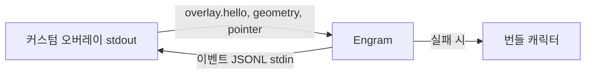

# 커스텀 오버레이 Event API v1

## 설치와 선택

렌더러 manifest 위치는 `%USERPROFILE%/.engram/overlays/<id>/manifest.yaml`이다. Settings > 오버레이에서 **기본 오버레이 사용** 또는 설치된 외부 오버레이를 선택하고 manifest가 지원하는 모드만 선택한다. 저장 후에는 **오버레이 재시작**이 필요하며, 임의 command 또는 renderer별 설정 실행 기능은 없다.

```yaml
schema_version: 1
id: vendor-demo
name: Vendor Demo
command: ["renderer.exe", "--engram-jsonl"]
supported_modes: [observer, replace] # 생략 시 observer
```

`id`는 디렉터리명과 같아야 하고 `command`는 빈 값 없는 argv 문자열 배열이다. 상대 실행 파일은 manifest 디렉터리 안에만 있어야 한다. schema/id/name/command/mode/실행 파일이 유효하지 않으면 선택 목록에서 제외되고 상태·로그에 원인이 표시된다.

## 커스텀 오버레이 → Engram — 보내야 하는 메시지

커스텀 오버레이의 **stdout은 Engram으로 가는 JSONL**이다. 시작 직후 첫 줄은 반드시 `overlay.hello`여야 한다. 디버그 로그는 stderr로 보낸다.

|구분|메시지·필드|시점·동작|
|---|---|---|
|필수|`{"schema_version":1,"type":"overlay.hello","payload":{"supported_schema_versions":[1]}}`|프로세스 시작 직후 stdout 첫 줄|
|replace 필수|`overlay.geometry_changed`, `payload: {x,y,width,height}`|창 생성·크기·위치 변경 때마다; 말풍선 앵커를 정확히 맞춘다|
|입력|`pointer.action`, `payload.action`|`left_click`, `pointer_enter`, `pointer_leave`는 좌표 불필요. `right_click`, `drag_move`, `drag_end`는 `screen_x`, `screen_y` 필요. `drag_begin`은 현재 예약/no-op|
|선택|`overlay.heartbeat`|현재는 수신만 하며 별도 timeout·상태 변경 없음|

```json
{"schema_version":1,"type":"overlay.geometry_changed","payload":{"x":120,"y":80,"width":320,"height":480}}
{"schema_version":1,"type":"pointer.action","payload":{"action":"left_click"}}
{"schema_version":1,"type":"pointer.action","payload":{"action":"drag_move","screen_x":240,"screen_y":160}}
```

`observer`에서는 geometry와 입력을 보내지 않아도 된다. 다만 geometry 뒤 `left_click`을 보내면 기존과 **같은 말풍선 세션**이 observer 창 위치에 열린다. observer geometry는 메모리에만 유지되고 번들 캐릭터의 저장 위치를 바꾸지 않으며, geometry 없는 observer 클릭은 무시된다. 번들을 클릭하면 앵커는 다시 번들로 돌아온다. `replace`에서는 geometry를 반드시 보내야 Engram이 말풍선·입력창·기록 창 위치를 맞춘다. `left_click`은 채팅을 열거나 닫고, `right_click`은 Engram 공통 메뉴를 연다. `drag_move`와 `drag_end`는 replace에서만 Engram이 소유하는 위치를 갱신한다. handshake/JSONL/자식 종료 실패 시에는 번들 렌더러로 복구되고 열린 풍선도 번들 기준으로 다시 배치되며, API는 metadata-only라 대화·thinking·도구 payload와 파일 경로를 노출하지 않는다.


텍스트 대체 설명: 커스텀 오버레이는 stdout JSONL로 hello·geometry·입력을 Engram에 보내고, Engram은 stdin JSONL로 이벤트를 보낸다. replace 연결이 실패하면 번들 캐릭터가 복구된다.

## Engram → 커스텀 오버레이 — 받는 메시지

Engram은 **커스텀 오버레이 프로세스의 stdin에 JSONL을 쓴다**. hello가 성공하면 먼저 `engram.welcome`과 `state.snapshot`을 받고, replace 모드에서는 현재 위치를 `overlay.set_position`으로 받는다. replace의 첫 `overlay.geometry_changed`는 renderer bootstrap 보고다. Engram에 저장된 x/y가 authoritative이므로 renderer는 받은 초기 `overlay.set_position`을 최종 위치로 적용해야 한다. 첫 geometry의 width/height만 채택할 수 있고, 이후 사용자 이동 geometry만 저장 위치를 갱신한다. 이후 의미 기반 이벤트 envelope을 계속 받는다.

|메시지|필드|시점·동작|
|---|---|---|
|`engram.welcome`|`payload.selected_schema_version`, `content_policy: metadata_only`|hello 성공 직후|
|`state.snapshot`|`display_hint: idle`, `payload: {generation_active: false, tool_category: null}`|현재 구현에서 hello 성공 직후|
|`overlay.set_position`|`payload.x`, `payload.y`|replace 모드 초기 위치와 Engram 위치 보정 뒤; 창의 최종 위치로 적용|
|의미 이벤트|`schema_version`, `id`, `sequence`, `timestamp`, `type`, `display_hint`, `payload`|입력·생성·도구·완료·오류가 발생할 때|

모든 의미 이벤트의 `display_hint`는 `idle`, `hover`, `click`, `input`, `generating`, `search`, `thought`, `memory`, `success`, `provider_error`, `error`, `default` 중 하나다. 알 수 없는 필드와 type은 무시해도 된다.

## 이벤트 매핑

|type|display_hint|공개 payload|시점|
|---|---|---|---|
|`conversation.input_submitted`|`input`|`{}`|사용자 입력 제출|
|`generation.started`|`generating`|`{}`|생성 시작|
|`generation.thinking`|`thought`|`{}`|생각 이벤트|
|`tool.started`|`search`/`memory`/`generating`|`{category}`|도구 시작|
|`tool.completed`|`generating`|`{}`|도구 성공|
|`tool.failed`|`error`|`{}`|도구 실패|
|`generation.completed`|`success`|`{outcome: success}`|턴 완료|
|`provider.failed`|`provider_error`|`{}`|공급자 오류|
|`pointer.entered` / `pointer.left`|`hover` / `idle`|입력 payload|포인터 진입/이탈|
|`pointer.left_clicked` / `pointer.right_clicked`|`click`|입력 payload 또는 `{}`|좌/우 클릭|
|`overlay.position_changed`|`idle`|위치 payload|번들 드래그 이동/종료|

## 최소 Python 자식 예제

아래는 복사해 실행할 수 있는 observer 예제다. stdout에는 protocol JSON만 출력한다.

```python
import json, sys

print(json.dumps({"schema_version": 1, "type": "overlay.hello",
                  "payload": {"supported_schema_versions": [1]}}), flush=True)
for line in sys.stdin:  # Engram -> 커스텀 오버레이
    try:
        event = json.loads(line)
    except json.JSONDecodeError:
        print("invalid input JSONL", file=sys.stderr)
        continue
    event_type = event.get("type")
    if event_type == "overlay.set_position":
        print("move window:", event["payload"], file=sys.stderr)
    elif "display_hint" in event:
        print("play animation:", event["display_hint"], file=sys.stderr)
    # 알 수 없는 type과 필드는 오류 없이 무시한다.

# 클릭을 Engram으로 보낼 때: print(json.dumps({"schema_version": 1,
#     "type": "pointer.action", "payload": {"action": "left_click"}}), flush=True)
```

replace 창은 시작 뒤 stdout에 `overlay.geometry_changed`를 출력하고, 사용자 입력 때 `pointer.action`을 출력한다. 설정은 문자열 하나가 아닌 명시적 배열이다.

```yaml
overlay:
  external_renderer:
    mode: "replace" # observer | replace
    command: ["C:/vendor/renderer.exe", "--engram-jsonl"]
```

## 개인정보, 실패 복구, 점검

v1은 `metadata_only`다. 사용자 입력·모델 응답·thinking 원문, 도구 입력과 출력, 파일 경로, 메모리 본문은 보내지 않는다. command가 비어 있으면 번들만 사용한다. hello가 2초 안에 오지 않거나 JSONL이 잘못되거나 자식이 종료하면 Engram은 번들 캐릭터와 마지막 번들 위치를 복구한다. 먼저 hello가 stdout 첫 줄인지, replace geometry가 네 숫자를 포함하는지, 로그가 stderr인지 점검한다. 일반 설정은 [[overlay-settings]], 구조는 [[architecture]], 진단은 [[self-diagnosis]]를 참고한다.

## 기대 동작

observer는 번들 캐릭터와 함께 이벤트를 받고, replace는 geometry 보고 뒤 같은 위치에 커스텀 창과 말풍선을 맞춘다.

## 증상: 연결 또는 위치가 이상함

hello가 첫 stdout 줄이 아니거나 geometry 필드가 빠지면 연결 또는 앵커가 기대와 다를 수 있다.

## 점검 절차

stdout 첫 줄, JSONL 형식, `screen_x`·`screen_y`, 그리고 replace geometry의 네 필드를 순서대로 확인한다.

## 복구

`command: []` 또는 observer로 되돌리면 번들 캐릭터만 사용하는 안전한 상태로 복구한다.

## 관련 문서

[[overlay-settings]], [[architecture]], [[self-diagnosis]]를 참고한다.
