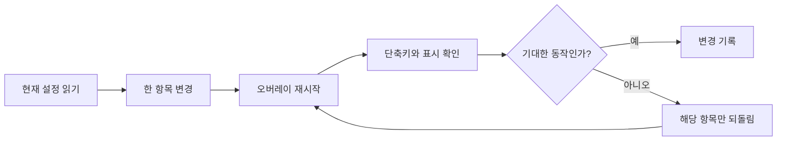

# 오버레이, 설정, 페르소나 사용자화

> 표현 방식은 저장된 지식과 작업 정책으로부터 독립적으로 사용자화한다.

## 무엇을 조정하는가

오버레이는 화면 위의 캐릭터와 대화 진입점을 담당한다. 대화는 말풍선 모드와 터미널(TUI) 모드 중 하나로 열 수 있고, 캐릭터는 정적 이미지·번호 프레임 시퀀스·스프라이트 격자 중 설치된 리소스 형식에 맞춰 표시된다. 설정 창은 주로 시각적 배치와 상호작용 방식을 조정하는 곳이며, Wiki 지식·작업 정책·대화 기록을 편집하는 곳은 아니다.

| 선택 항목 | 의미 | 확인 방법 |
| --- | --- | --- |
| 캐릭터 크기·여백 | 화면 작업 영역에 대한 크기와 배치 | 재시작 뒤 화면 가장자리와 다른 창 가림 여부 확인 |
| 말풍선 / TUI | 인접한 말풍선 대화 또는 터미널 창 | 단축키로 열어 입력과 응답 표시 확인 |
| 캐릭터 리소스 | 정적 이미지, 시퀀스, 스프라이트 격자, 반응 효과 | 기본 상태와 클릭·응답 중 상태 전환 확인 |
| 말풍선 글꼴·폭·높이 | 읽기 편한 대화 표시와 화면 점유 범위 | 긴 응답에서 잘림·겹침 확인 |
| 도구 승인 수준 | 자동, 위험 작업만 확인, 모든 작업 확인 | 쓰기·실행 요청 전에 승인 표시 여부 확인 |
| 능동 발화 | 유휴 시간, 조용한 시간대, 소스별 쿨다운 | 짧은 관찰로 결론 내리지 말고 조건과 로그 확인 |

## 설정 계층과 안전한 예시

기본 설정은 배포본의 설정 파일에 있고, 사용자 오버라이드는 사용자 설정 파일에서 필요한 키만 덮어쓴다. 따라서 기본 파일 전체를 복사해 수정하기보다 한 번에 한 가지 값만 사용자 파일에 둔다. 아래 값은 의도적으로 중립적인 예시다.

```yaml
overlay:
  char_height_ratio: <0보다 큰 화면 비율>
  chat_mode: bubble  # bubble 또는 tui
  character:
    source_mode: static  # static | sequence | sprite_grid
bubble:
  permission_level: confirm_risky
```

`<0보다 큰 화면 비율>`은 환경마다 다르다. 화면 밖으로 나간 경우에는 크기·여백을 먼저 보수적으로 낮추고, 그 다음에 한 항목씩 되돌린다. 캐릭터 이름·표현 문구 같은 개인화 값은 사용자 오버라이드에 둘 수 있으나, 비밀 값이나 다른 사용자의 식별 정보는 설정에 넣지 않는다.

## 시나리오: 말풍선으로 안전하게 전환

1. 설정 GUI에서 현재 대화 모드와 도구 승인 수준을 읽는다.
2. 대화 모드를 `bubble`로 바꾸고, 위험 작업 확인 모드를 선택한다.
3. 오버레이를 재시작한 뒤 단축키로 대화창을 연다.
4. 읽기 전용 질문 하나를 보내 표시·입력·응답이 정상인지 확인한다.
5. 별도 테스트에서만 영향이 작은 쓰기 요청을 보내 승인 풍선이 나오는지 확인한다.



텍스트 대체 설명: 설정을 하나만 바꾸고 재시작한 뒤 실제 화면에서 확인한다. 기대와 다르면 그 값만 되돌린 후 다시 확인한다.

## 기대 동작

위치, 크기, 투명도, 단축키, 반응 같은 시각 설정은 관련 클라이언트를 다시 불러온 뒤 적용된다. 말풍선 모드에서는 캐릭터 옆에 입력·응답·도구 상태가 표시되고, TUI 모드에서는 별도 터미널 창이 배치된다. 능동 발화는 활성화되어도 유휴 시간·조용한 시간·간격 조건을 모두 통과할 때만 후보가 된다.

## 이상 징후

- 설정은 저장됐지만 오버레이가 바뀌지 않는다.
- 오버레이가 숨겨졌거나 화면 밖에 있거나 입력을 막는다.

## 점검

설정 GUI를 열어 활성 프로필을 확인하고, 설정 파일 문법과 대시보드 실행 상태를 점검한다. 캐릭터가 보이지 않으면 선택한 리소스 형식과 리소스 탐색 순서를 확인한다. 반응이 없으면 반응 팩의 활성화 여부, 격자 행·열 값, 클릭 또는 공개 이벤트가 실제로 발생했는지를 분리해 점검한다.

## 복구

영향받은 시각 설정만 문서화된 기본값으로 되돌리고 오버레이 클라이언트를 재시작한다. 한 번에 하나의 변경만 검증한다. 큰 업데이트 전에는 사용자화 설정을 복사해 둔다. 원격 MCP를 사용할 때는 로컬 무인증 서비스와 별도의 인증 리스너를 혼동하지 말고, 원격 공개 전에는 토큰·감사 기록·터널 종단을 검토한다.

## 제한과 주의

- 설정 변경은 적용을 위해 재시작이 필요할 수 있다. 화면에 보이는 값만으로 파일 저장 성공을 단정하지 않는다.
- `auto` 도구 승인은 빠르지만 쓰기·실행 요청에도 승인 풍선을 보장하지 않는다. 공유 환경이나 낯선 요청에는 확인 수준을 높인다.
- 능동 발화는 보조 기능이다. 조용한 시간대나 최소 간격을 우회해 알림을 강제하는 용도로 사용하지 않는다.
- 원격 접근은 로컬 접근보다 신뢰 경계가 넓다. 공개 주소·토큰·허용 범위를 최소화하고 [[mcp-tools]]의 원격 제한을 함께 확인한다.

## 관련 도구

설정 GUI, 대시보드 상태, 설정 검증, [[installation-update]].

함께 보기: [[index]], [[dashboard]], [[self-diagnosis]].
