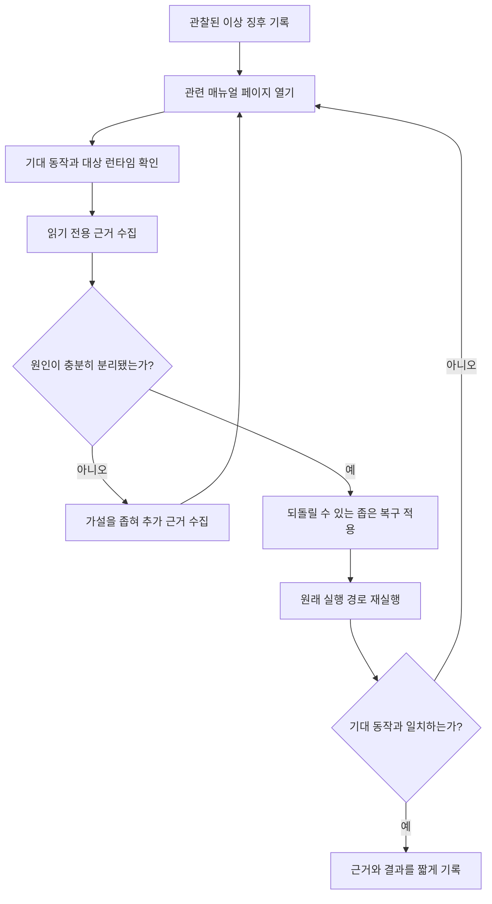

# 자가진단과 문제 해결

> 진단의 시작점은 “무엇이 이상한가”라는 관찰이다. 수정부터 시작하지 않는다. 관련 매뉴얼의 기대 동작을 기준으로 읽기 전용 근거를 모으고, 원인이 분리됐을 때만 좁은 범위의 복구를 적용한 뒤 원래 실행 환경에서 다시 확인한다.

## 목적과 사용 시점

UI·CLI·installer·검색·도구 호출이 문서와 다르게 보일 때 사용한다. 이 페이지는 만능 해결책이 아니라 기능별 문서로 가는 입구다. 예를 들어 Wiki 검색 문제는 [[wiki-kg]], 맥락 문제는 [[session-memory]], 화면 문제는 [[dashboard]] 또는 [[overlay-settings]], 도구 문제는 [[mcp-tools]]를 먼저 읽는다.

## 정신 모델: 증거와 가설을 분리한다

- **관찰**: “`<page-id>`가 대시보드에 보이지 않는다”처럼 재현 가능한 사실이다.
- **기대 동작**: 관련 문서가 말하는 성공 기준과 의도된 실행 환경이다.
- **가설**: 원문·인덱스·설정·화면·도구 중 어디가 원인일지에 대한 아직 검증되지 않은 설명이다.
- **근거**: 설정값, 원문, 로그, 읽기 전용 도구 결과, 실제 재실행 결과처럼 가설을 줄이는 정보다.
- **복구**: 가설 하나에만 대응하는 가장 작은 변경이다.

## 진단 순환

텍스트 대체 설명: 이상 징후를 재현 가능한 문장으로 적고 관련 기능 문서에서 기대 동작을 찾는다. 설정·원문·읽기 전용 도구로 근거를 모아 원인을 좁힌 다음, 되돌릴 수 있는 복구 하나만 적용한다. 마지막에는 처음 문제가 발생한 UI·CLI·installer 경로를 다시 실행해 결과를 확인한다.

## 공통 절차

1. **증상을 한 문장으로 고정한다.** 예: “`<scope>`에서 `<page-id>`는 원문에는 있으나 검색 결과에 없다.”
2. **실행 환경을 적는다.** 어느 화면·명령·설치 경로에서 관찰했는지와, 무엇을 기대했는지를 분리한다.
3. **관련 페이지를 읽는다.** 페이지의 목적, 기대 동작, 증상, 확인, 복구, 한계를 우선한다.
4. **읽기 전용 근거를 수집한다.** 상태 조회, 원문 확인, schema 확인, `kg_read_note`, `kg_search` 등을 사용한다.
5. **한 가지 가설만 바꾼다.** 설정·파일·프로세스·인덱스 중 하나만 좁게 복구하고 변경 대상을 기록한다.
6. **원래 런타임을 재실행한다.** 정적 검사나 파일 존재 확인은 보조 근거이며, UI·CLI·installer 통합을 대신하지 않는다.

## 기능별 빠른 분기

| 증상 범주 | 먼저 열 페이지 | 우선 근거 | 복구 후 확인 |
| --- | --- | --- | --- |
| Wiki 파일은 있으나 검색되지 않음 | [[wiki-kg]] | frontmatter, 링크 대상, 동기화·lint 결과 | 같은 제목·키워드로 실제 검색 |
| 이전 맥락이 누락되거나 섞임 | [[session-memory]] | 현재 `<scope>`, 원문 수정 시점, 검색 후보 출처 | 범위를 명시한 새 요청에서 재확인 |
| 화면 표시가 기대와 다름 | [[dashboard]], [[overlay-settings]] | 선택한 화면, 표시 상태, 설정 적용 여부 | 영향받은 화면을 다시 열어 원래 동작 재현 |
| 도구가 실패하거나 의도와 다름 | [[mcp-tools]] | 도구 schema, 입력 범위, 읽기/쓰기 구분 | 최소 입력으로 재호출 후 결과 확인 |
| 설치·업데이트 뒤 문서가 달라짐 | [[installation-update]] | 관리 대상과 사용자 파일의 구분, 설치 로그 | installer를 같은 조건으로 재실행 |

## 기대 동작

- 진단 보고는 관찰·가설·근거·변경·재검증 결과를 구분한다.
- 변경 전에는 가능한 한 읽기 전용 근거를 먼저 모은다.
- 복구는 원인을 확인할 수 있을 만큼 작고 되돌릴 수 있어야 한다.
- 성공 판단은 원래 사용자가 문제를 본 실행 환경에서 이뤄진다.

## 흔한 실패 패턴과 복구

| 실패 패턴 | 왜 부족한가 | 더 나은 다음 단계 |
| --- | --- | --- |
| 파일이 있으니 정상이라고 결론냄 | 인덱스·화면·권한·런타임 연결은 확인하지 못함 | 원래 화면 또는 호출 경로에서 동작을 재현 |
| 여러 설정과 프로세스를 한꺼번에 바꿈 | 어떤 변경이 효과를 냈는지 알 수 없음 | 하나의 가설·하나의 변경으로 되돌려 검증 |
| 검색 결과만 보고 원문을 믿음 | 검색 후보는 최신성·범위·정확성을 보장하지 않음 | 해당 Wiki 원문과 현재 상태를 직접 대조 |
| 복구 후 테스트를 생략 | 우연히 문제 화면이 바뀌었을 수 있음 | 최초 증상을 재현한 정확한 런타임을 다시 실행 |

## 안전과 한계

이 절차는 권한 부족, 외부 서비스 장애, 손상된 환경을 자동으로 해결하지 않는다. 데이터 삭제·대량 덮어쓰기·전역 설정 변경은 별도 승인과 백업·대상 확인이 필요하다. 근거가 충돌하거나 복구의 영향 범위를 알 수 없으면, 관찰한 증상·실행 환경·명령·출력을 묶어 상위 지원으로 넘긴다.

## 관련 페이지와 도구

- 구조를 좁힐 때: [[architecture]]
- Wiki와 검색: [[wiki-kg]], `kg_read_note`, `kg_search`, `kg_semantic_search`, `kg_sync`, `kg_lint`
- 상태와 표시: [[dashboard]], [[overlay-settings]]
- 도구 경계: [[mcp-tools]]
- 설치 상태: [[installation-update]]

함께 보기: [[manual-index]], [[getting-started]], [[architecture]], [[wiki-kg]], [[session-memory]].
