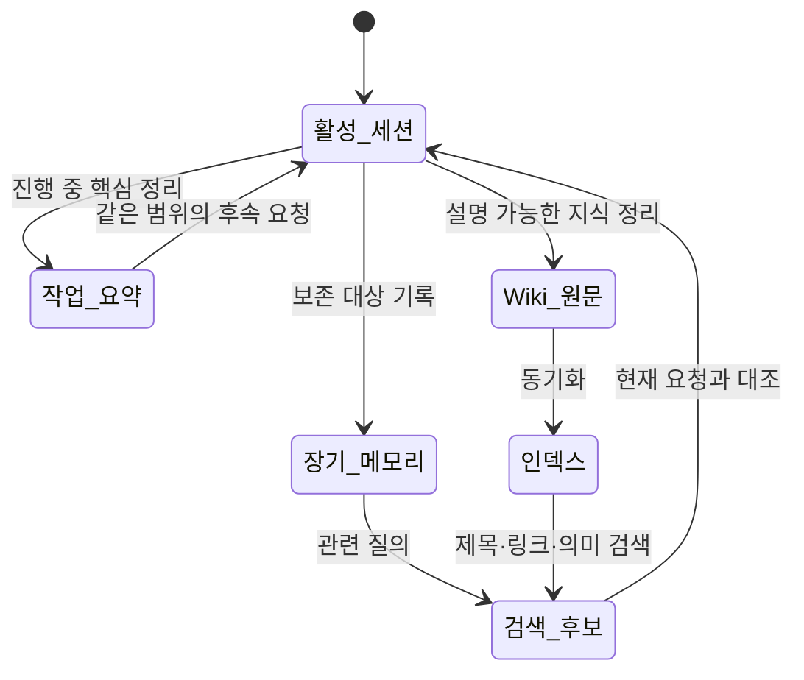

# 세션 연속성과 메모리

> 진행 중인 대화는 유용하지만 임시적이다. 다음 작업에도 설명 가능하게 남아야 하는 결정·절차·근거는 세션에만 기대지 말고 적절한 저장 계층, 특히 Wiki 원문에 기록한다.

## 목적과 사용 시점

이전 논의가 왜 보이지 않는지, 어떤 내용을 세션에 두고 어떤 내용을 Wiki에 정리할지, 새 세션에서 무엇을 다시 설명해야 하는지 판단할 때 사용한다. 개인적이거나 일시적인 대화 내용을 영속 지식으로 승격하기 전에 특히 중요하다.

## 정신 모델: 수명이 다른 네 계층

| 계층 | 용도 | 수명과 확인 방법 |
| --- | --- | --- |
| 현재 세션 | 지금 주고받는 대화와 즉시 맥락 | 세션이 끝나거나 교체되면 그대로 이어진다고 가정하지 않는다 |
| 작업 메모리 | 범위 안에서 반복되는 짧은 요약·진행 상태 | 현재 `<scope>`에 맞는지와 최신성을 확인한다 |
| 장기 메모리 | 관련 요청에서 검색할 수 있는 보존 정보 | 검색 결과는 후보이며, 원문·현재 상황과 대조한다 |
| Wiki 원문 | 사람이 검토·수정·연결하는 안정적 지식 | Markdown, frontmatter, 링크와 인덱스 상태를 직접 확인한다 |

텍스트 대체 설명: 활성 세션의 핵심은 작업 요약이나 장기 메모리로 남을 수 있다. 안정적이고 사람이 검토해야 하는 지식은 Wiki 원문으로 정리하고, 동기화된 인덱스를 통해 검색 후보가 된다. 검색된 내용은 현재 요청과 다시 대조해야 한다.

## 시나리오: 재사용할 결정을 남기기

예: `<scope>`에서 “문서 변경 뒤에는 동기화와 lint를 수행한다”는 팀 절차가 합의되었다고 가정한다.

1. 대화의 전체 로그를 복사하지 말고, 결정·이유·확인 방법·관련 페이지를 짧게 정리한다.
2. 재사용 가능한 절차라면 Wiki의 적절한 페이지에 `<page-id>`를 정하고 관련 페이지의 실제 ID로 연결한다.
3. 변경된 Markdown을 동기화하고, 검색으로 제목과 핵심 키워드가 다시 찾아지는지 확인한다.
4. 다음 요청에서 “`<scope>` 문서 변경 절차”처럼 주제를 명시해 검색 결과를 현재 상황과 비교한다.

## 기대 동작

- 짧은 최근 대화와 작업 요약은 현재 범위의 연속성을 돕는다.
- 장기 메모리와 Wiki 검색은 관련 후보를 제공하지만, 모든 과거 대화를 완전하게 재현하지는 않는다.
- Wiki 원문을 갱신하고 동기화하면 사람과 시스템이 같은 페이지를 다시 찾을 수 있다.
- 세션을 다시 열었다고 해서 이전의 임시 맥락, 미확인 가정, 개인적 내용이 자동으로 유지된다고 보장하지 않는다.

## 증상, 확인, 복구

| 관찰된 증상 | 먼저 확인할 근거 | 복구와 재검증 |
| --- | --- | --- |
| 이전 결정이 보이지 않는다 | 결정이 실제로 Wiki 또는 보존 계층에 기록됐는지 | 핵심만 Wiki에 정리하고 동기화 후 주제 질의 재실행 |
| 오래된 결정이 다시 나온다 | 원문 수정 시점, 검색 후보의 출처·범위 | 원문을 최신화하고 인덱스를 갱신한 뒤 같은 질의 재검증 |
| 다른 작업의 맥락이 섞인다 | `<scope>`와 현재 요청의 대상 | 범위를 명시해 새 요청을 시작하고 관련 후보만 채택 |
| 민감하거나 불필요한 내용이 남을까 걱정된다 | 기록 대상의 필요성·최소성 | 원문에는 일반화한 절차·결론만 남기고 보존 정책을 검토 |

## 안전과 한계

메모리 검색은 증거가 아니라 보조 맥락이다. 검색된 문장을 현재 사실로 취급하기 전에 원문·상태·실제 실행 결과와 비교한다. 개인 식별값, 비밀, 전체 대화 로그를 재사용 문서에 옮기지 않는다. 장기 보존이 필요한 내용도 목적과 최소 범위를 먼저 정한다.

## 관련 페이지와 도구

- 구조와 데이터 경계: [[architecture]]
- 영속 원문과 검색: [[wiki-kg]], `kg_read_note`, `kg_search`, `kg_semantic_search`
- 현재 상태 확인: [[dashboard]]
- 이상 동작의 증거 수집: [[self-diagnosis]]

함께 보기: [[manual-index]], [[wiki-kg]], [[getting-started]], [[self-diagnosis]].
