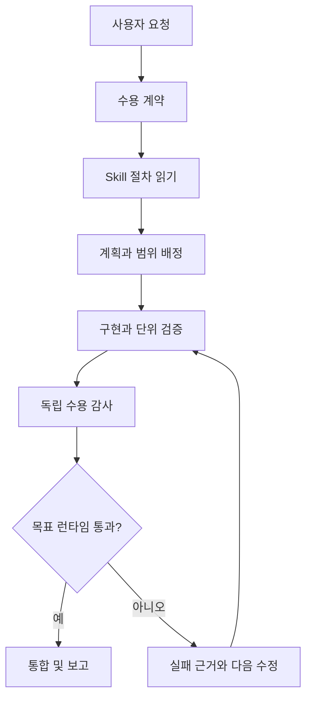

# Skills와 Agents

> skill은 절차를 제공하고 agent는 명시적 근거와 함께 범위가 정해진 역할을 수행한다.

## 역할과 사용 시점

skill은 반복되는 업무의 진입 조건, 순서, 안전 장치를 정의한 절차 문서다. agent는 그 절차 안에서 조사·계획·구현·검증을 맡는 역할이다. 사용자는 목표와 수용 기준을 제시하고, 시스템은 실제 변경 전에 어떤 범위와 실행 환경에서 확인할지 합의해야 한다.

| 역할 | 주 책임 | 산출물 | 완료로 보기 위한 근거 |
| --- | --- | --- | --- |
| Orchestrator | 의도 해석, 작업 분해, 통합 | 수용 계약, 위임, 최종 판정 | 모든 핵심 기준의 통합 결과 |
| Planner | 읽기 전용 설계와 독립 감사 | 단계, 위험, 검수 항목 | 구현자와 다른 관점의 수용 감사 |
| Coder | 범위가 정해진 구현 | 코드·문서·테스트 변경 | 지정된 테스트와 변경 근거 |
| Servant | 탐색, 명령 실행, 기계적 수집 | 경로·출력·사실 목록 | 원본 출력 또는 재현 가능한 명령 |

## 시나리오: 여러 단계 변경

1. 요청을 사용자가 실제로 볼 결과와 그 실행 환경으로 나눈다.
2. 관련 `SKILL.md`를 먼저 읽고 trigger·제한·필수 검증을 확인한다.
3. Planner가 구현 순서와 수용 기준을 제안한다.
4. Coder가 맡은 파일 범위만 바꾸고, 테스트·린트·빌드를 실행한다.
5. 다른 Planner가 원래 수용 계약으로 결과를 감사한다.
6. UI·CLI·installer·연동 항목은 목표 런타임에서 실제로 실행해 확인한다.

텍스트 대체 설명: 요청은 수용 기준으로 바뀐 뒤 절차를 읽고 구현한다. 구현자와 다른 검토자가 감사하며, 실제 런타임 검증이 통과해야 통합한다.

## 기대 동작

관련 skill은 절차를 사용하기 전에 읽는다. 여러 단계 작업에는 인수 기준 계약, 분리된 구현, 독립 검증 단계가 있다. 테스트 통과나 파일 존재는 보조 근거일 뿐, 실제 화면·명령·installer 동작이 필요한 항목의 대체 증거는 아니다.

## 이상 징후

- 필요한 점검 없이 workflow가 실행됐다.
- 실행 환경을 실제로 거치지 않았는데 완료라고 보고한다.

## 점검

선택한 skill의 `SKILL.md`를 읽고 요청과 trigger 규칙을 비교한다. agent 보고서에서 실제 명령 출력과 미검증 항목을 확인한다. 변경이 사용자 파일, 네트워크, 설치본, 실행 중 프로세스에 영향을 주는지 구분하고, 각 항목에 맞는 실행 환경을 확인한다.

## 복구

누락된 검증을 의도된 실행 환경에서 다시 수행한다. 여러 단계 작업은 구현자의 자기평가가 아니라 새 검토자에게 감사를 요청한다. 범위를 줄여야 한다면 완료라고 표현하지 않고, 누락되는 기준·영향·다음 검증을 명시한다.

## 흔한 실패와 안전 경계

| 증상 | 먼저 확인할 것 | 복구 |
| --- | --- | --- |
| 계획 없이 파일부터 변경됨 | 적용할 skill과 수용 계약 | 변경을 멈추고 기준·소유 파일을 작성 |
| 구현자가 스스로 완료 판정 | 독립 reviewer가 있었는지 | 별도 reviewer에게 원래 계약으로 감사 요청 |
| 단위 테스트만 통과 | UI·CLI·installer 실제 실행 여부 | 의도된 런타임을 실행하고 결과 기록 |
| 다른 작업의 변경이 섞임 | worktree 상태와 소유 범위 | 관련 없는 변경을 보존하고 분리된 작업 공간 사용 |

## 제한과 주의

- agent 역할은 권한을 자동으로 넓히지 않는다. 외부 전송·대량 변경·삭제는 사용자 요청 범위를 다시 확인한다.
- `SKILL.md`는 일반 설명보다 우선하는 작업 절차다. 읽지 못하면 그 사실을 밝히고 안전한 대안을 선택한다.
- 실제 런타임을 사용할 수 없으면 `UNVERIFIED`로 남긴다. 정적 점검을 성공으로 바꾸지 않는다.

## 관련 도구

skill 탐색, planner/coder/servant 역할, 작업 workflow, [[mcp-tools]].

함께 보기: [[index]], [[getting-started]], [[self-diagnosis]].
