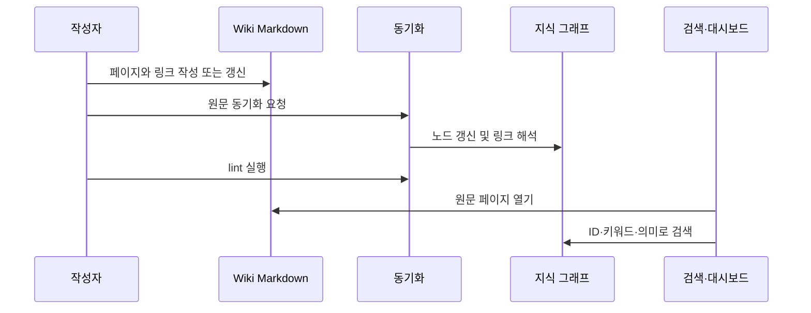

# Wiki와 지식 그래프

> vault의 Markdown은 사람이 편집하는 기준 원문이고, 지식 그래프는 그 원문을 찾고 연결하기 위한 인덱스다. 원문 작성, 동기화, 링크 검증은 서로 다른 단계다.

## 목적과 사용 시점

새로운 사용 절차·설계 결정·도구 설명을 재사용 가능한 페이지로 남길 때, 또는 파일은 있는데 검색되지 않는 문제를 진단할 때 사용한다. 매뉴얼뿐 아니라 일반 Wiki 문서도 같은 기본 원칙을 따른다. 설치 프로그램이 관리하는 매뉴얼 경로에 개인 문서를 섞지 않는다.

## 페이지의 최소 구조

```yaml
---
id: <page-id>
title: 사람이 읽는 제목
note_type: guide
tags: [topic, workflow]
summary: 검색 결과에 쓸 짧은 설명.
links: [related-page-id]
---
```

- `id`는 안정적인 ASCII 식별자이며, 파일 이동·표시 제목 변경과 분리한다.
- `title`, `note_type`, `tags`, `summary`는 탐색과 품질 점검에 쓰인다.
- 본문 링크는 `[ [<page-id>] ]` 또는 `[ [<page-id>|표시 이름] ]` 형식으로 작성한다(여기서는 설명용으로 공백을 넣었다).
- `links`는 관련 페이지의 명시적 연결이다. 본문 링크와 함께 그래프 연결에 반영된다.

## 동기화 흐름



텍스트 대체 설명: 작성자는 Markdown 원문과 링크를 먼저 갱신한다. 동기화는 원문을 노드로 반영하고 링크를 해석한다. lint로 형식과 연결을 점검한 뒤, 사람은 vault 원문을 열고 시스템은 그래프를 검색한다.

## 시나리오: 새 절차 페이지 추가

1. 일반 Wiki의 알맞은 폴더에 `<page-id>.md`를 만들고 최소 frontmatter를 작성한다.
2. 첫 문단에 “언제 쓰는가, 무엇을 확인하는가”를 적고 실제 관련 페이지 ID로 두 개 이상 연결한다.
3. `kg_sync`로 vault 원문을 인덱스에 반영한다.
4. `kg_lint`로 frontmatter, 본문 길이, 고립 링크 경고를 확인한다.
5. `kg_read_note` 또는 `kg_search`로 페이지가 원문과 같은 제목·요약으로 조회되는지 확인한다.

동기화가 성공했다는 출력만으로 검색 품질을 단정하지 말고, 실제 사용자가 넣을 제목 또는 핵심 용어로 한 번 찾아본다. 의미 검색은 표현이 달라도 후보를 찾는 보조 수단이며, 원문 검토를 대체하지 않는다.

## 기대 동작

- `<data-root>/docs` 아래의 유효한 Markdown은 Obsidian과 대시보드에서 같은 원문으로 열 수 있다.
- `kg_sync`는 Markdown에서 노드 정보를 반영하고 Wiki 링크를 연결한다.
- `kg_lint`는 필수 frontmatter·짧은 본문·고립 노드 같은 품질 문제를 알려 준다.
- 검색 도구는 인덱스의 후보를 반환하며, 사용자는 그 후보의 원문을 열어 확인할 수 있다.

## 증상, 확인, 복구

| 관찰된 증상 | 먼저 확인할 근거 | 복구와 재검증 |
| --- | --- | --- |
| 새 페이지가 검색되지 않는다 | 파일 위치, YAML 형식, `id`, 동기화 결과 | frontmatter를 고치고 `kg_sync` 후 제목·태그로 재검색 |
| 링크가 없는 페이지로 보인다 | 링크 대상의 ASCII ID와 실제 frontmatter | 대상 ID를 고치고 `kg_lint`와 링크 재해석 실행 |
| 대시보드와 Obsidian 표시가 다르다 | 같은 `<data-root>/docs` 원문을 열었는지 | 원문 경로를 맞추고 화면을 새로 열어 확인 |
| 검색 결과가 오래됐다 | 원문 수정 시점과 인덱스 갱신 여부 | 동기화 후 같은 질의와 원문을 비교 |

## 안전과 한계

Markdown 원문을 변경하면 그 내용은 공유되는 지식이 될 수 있다. 개인 정보·비밀·환경 고정값을 일반 매뉴얼에 기록하지 않는다. 설치가 관리하는 매뉴얼 페이지는 업데이트에서 교체될 수 있으므로, 개인 페이지는 관리 경로 밖에 둔다. 링크와 요약을 자동 생성했다고 가정하지 말고 실제 대상 페이지와 표현을 검토한다.

## 관련 페이지와 도구

- 데이터 경계: [[architecture]]
- 무엇을 영속화할지: [[session-memory]]
- 탐색 화면: [[dashboard]]
- Wiki 도구: `kg_add_note`, `kg_read_note`, `kg_search`, `kg_semantic_search`, `kg_sync`, `kg_lint`
- 실패 절차: [[self-diagnosis]]

함께 보기: [[manual-index]], [[architecture]], [[session-memory]], [[self-diagnosis]].
